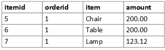

# Traditional relational database solutions

Relational data is data modeled using the relational model. In this model, data is expressed as tuples. A *tuple* is a set of attribute/value pairs. For example, a tuple might be (itemid = 5, orderid = 1, item = "Chair", amount = 200.00). A set of tuples that all share the same attributes is called a *relation*. 

Relations are naturally represented as tables, where each tuple is exposed as a row in the table. However, rows have an explicit ordering, unlike tuples. The database schema defines the columns (headings) of each table. Each column is defined with a name and a data type for all values stored in that column across all rows in the table.

A data store that organizes data using the relational model is referred to as a relational database. Primary keys uniquely identify rows within a table. Foreign key fields are used in one table to refer to a row in another table by referencing the primary key of the other table. Foreign keys are used to maintain referential integrity, ensuring that the referenced rows are not altered or deleted while the referencing row depends on them. 

Relational databases support various types of constraints that help to ensure data integrity:

- Unique constraints ensure that all values in a column are unique. 

- Foreign key constraints enforce a link between the data in two tables. A foreign key references the primary key or another unique key from another table. A foreign key constraint enforces referential integrity, disallowing changes that cause invalid foreign key values.

- Check constraints, also known as entity integrity constraints, limit the values that can be stored within a single column, or in relationship to values in other columns of the same row. 

Most relational databases use the Structured Query Language (SQL) language that enables a declarative approach to querying. The query describes the desired result, but not the steps to execute the query. The engine then decides the best way to execute the query. This differs from a procedural approach, where the query program specifies the processing steps explicitly. However, relational databases can store executable code routines in the form of stored procedures and functions, which enables a mixture of declarative and procedural approaches.

To improve query performance, relational databases use *indexes*. Primary indexes, which are used by the primary key, define the order of the data as it sits on disk. Secondary indexes provide an alternative combination of fields, so the desired rows can be queried efficiently, without having to re-sort the entire data on disk.

Because relational databases enforce referential integrity, scaling a relational database can become challenging. That's because any query or insert operation might touch any number of tables. You can scale out a relational database by *sharding* the data, but this requires careful design of the schema. For more information, see [Sharding pattern](../../patterns/sharding.md).

If data is non-relational or has requirements that are not suited to a relational database, consider a [Non-relational or NoSQL](../big-data/non-relational-data.md) data store.
