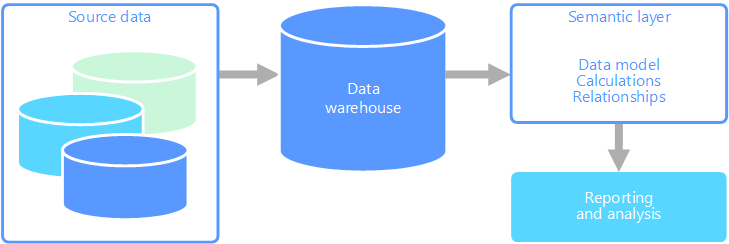

Online analytical processing (OLAP) is a technology that organizes large business databases and supports complex analysis. It can be used to perform complex analytical queries without negatively affecting transactional systems.

The databases that a business uses to store all its transactions and records are called [online transaction processing (OLTP)](./online-transaction-processing.md) databases. These databases usually have records that are entered one at a time. Often they contain a great deal of information that is valuable to the organization. The databases that are used for OLTP, however, were not designed for analysis. Therefore, retrieving answers from these databases is costly in terms of time and effort. OLAP systems were designed to help extract this business intelligence information from the data in a highly performant way. This is because OLAP databases are optimized for heavy read, low write workloads.

## Semantic modeling

A semantic data model is a conceptual model that describes the meaning of the data elements it contains. Organizations often have their own terms for things, sometimes with synonyms, or even different meanings for the same term. For example, an inventory database might track a piece of equipment with an asset ID and a serial number, but a sales database might refer to the serial number as the asset ID. There is no simple way to relate these values without a model that describes the relationship.

Semantic modeling provides a level of abstraction over the database schema, so that users don't need to know the underlying data structures. This makes it easier for end users to query data without performing aggregates and joins over the underlying schema. Also, usually columns are renamed to more user-friendly names, so that the context and meaning of the data are more obvious.

Semantic modeling is predominately used for read-heavy scenarios, such as analytics and business intelligence (OLAP), as opposed to more write-heavy transactional data processing (OLTP). This is mostly due to the nature of a typical semantic layer:

- Aggregation behaviors are set so that reporting tools display them properly.
- Business logic and calculations are defined.
- Time-oriented calculations are included.
- Data is often integrated from multiple sources.

Traditionally, the semantic layer is placed over a data warehouse for these reasons.

There are two primary types of semantic models:

- **Tabular**. Uses relational modeling constructs (model, tables, columns). Internally, metadata is inherited from OLAP modeling constructs (cubes, dimensions, measures). Code and script use OLAP metadata.
- **Multidimensional**. Uses traditional OLAP modeling constructs (cubes, dimensions, measures).

Relevant Azure service:

- [Azure Analysis Services](https://azure.microsoft.com/services/analysis-services/)

## Example use case

An organization has data stored in a large database. It wants to make this data available to business users and customers to create their own reports and do some analysis. One option is just to give those users direct access to the database. However, there are several drawbacks to doing this, including managing security and controlling access. Also, the design of the database, including the names of tables and columns, may be hard for a user to understand. Users would need to know which tables to query, how those tables should be joined, and other business logic that must be applied to get the correct results. Users would also need to know a query language like SQL even to get started. Typically this leads to multiple users reporting the same metrics but with different results.

Another option is to encapsulate all of the information that users need into a semantic model. The semantic model can be more easily queried by users with a reporting tool of their choice. The data provided by the semantic model is pulled from a data warehouse, ensuring that all users see a single version of the truth. The semantic model also provides friendly table and column names, relationships between tables, descriptions, calculations, and row-level security.

## Typical traits of semantic modeling

Semantic modeling and analytical processing tends to have the following traits:

| Requirement | Description |
| --- | --- |
| Schema | Schema on write, strongly enforced|
| Uses Transactions | No |
| Locking Strategy | None |
| Updateable | No (typically requires recomputing cube) |
| Appendable | No (typically requires recomputing cube) |
| Workload | Heavy reads, read-only |
| Indexing | Multidimensional indexing |
| Datum size | Small to medium sized |
| Model | Multidimensional |
| Data shape:| Cube or star/snowflake schema |
| Query flexibility | Highly flexible |
| Scale: | Large (10s-100s GBs) |

## When to use this solution

Consider OLAP in the following scenarios:

- You need to execute complex analytical and ad hoc queries rapidly, without negatively affecting your OLTP systems.
- You want to provide business users with a simple way to generate reports from your data
- You want to provide a number of aggregations that will allow users to get fast, consistent results.

OLAP is especially useful for applying aggregate calculations over large amounts of data. OLAP systems are optimized for read-heavy scenarios, such as analytics and business intelligence. OLAP allows users to segment multi-dimensional data into slices that can be viewed in two dimensions (such as a pivot table) or filter the data by specific values. This process is sometimes called "slicing and dicing" the data, and can be done regardless of whether the data is partitioned across several data sources. This helps users to find trends, spot patterns, and explore the data without having to know the details of traditional data analysis.

Semantic models can help business users abstract relationship complexities and make it easier to analyze data quickly.

## Challenges

For all the benefits OLAP systems provide, they do produce a few challenges:

- Whereas data in OLTP systems is constantly updated through transactions flowing in from various sources, OLAP data stores are typically refreshed at a much slower intervals, depending on business needs. This means OLAP systems are better suited for strategic business decisions, rather than immediate responses to changes. Also, some level of data cleansing and orchestration needs to be planned to keep the OLAP data stores up-to-date.
- Unlike traditional, normalized, relational tables found in OLTP systems, OLAP data models tend to be multidimensional. This makes it difficult or impossible to directly map to entity-relationship or object-oriented models, where each attribute is mapped to one column. Instead, OLAP systems typically use a star or snowflake schema in place of traditional normalization.

## OLAP in Azure

In Azure, data held in OLTP systems such as Azure SQL Database is copied into the OLAP system, such as [Azure Analysis Services](/azure/analysis-services/analysis-services-overview). Data exploration and visualization tools like [Power BI](https://powerbi.microsoft.com), Excel, and third-party options connect to Analysis Services servers and provide users with highly interactive and visually rich insights into the modeled data. The flow of data from OLTP data to OLAP is typically orchestrated using SQL Server Integration Services, which can be executed using [Azure Data Factory](/azure/data-factory/concepts-integration-runtime).

In Azure, all of the following data stores will meet the core requirements for OLAP:

- [SQL Server with Columnstore indexes](/sql/relational-databases/indexes/get-started-with-columnstore-for-real-time-operational-analytics)
- [Azure Analysis Services](/azure/analysis-services/analysis-services-overview)
- [SQL Server Analysis Services (SSAS)](/sql/analysis-services/analysis-services)

SQL Server Analysis Services (SSAS) offers OLAP and data mining functionality for business intelligence applications. You can either install SSAS on local servers, or host within a virtual machine in Azure. Azure Analysis Services is a fully managed service that provides the same major features as SSAS. Azure Analysis Services supports connecting to [various data sources](/azure/analysis-services/analysis-services-datasource) in the cloud and on-premises in your organization.

Clustered Columnstore indexes are available in SQL Server 2014 and above, as well as Azure SQL Database, and are ideal for OLAP workloads. However, beginning with SQL Server 2016 (including Azure SQL Database), you can take advantage of hybrid transactional/analytics processing (HTAP) through the use of updateable nonclustered columnstore indexes. HTAP enables you to perform OLTP and OLAP processing on the same platform, which removes the need to store multiple copies of your data, and eliminates the need for distinct OLTP and OLAP systems. For more information, see [Get started with Columnstore for real-time operational analytics](/sql/relational-databases/indexes/get-started-with-columnstore-for-real-time-operational-analytics).

## Key selection criteria

To narrow the choices, start by answering these questions:

- Do you want a managed service rather than managing your own servers?

- Do you require secure authentication using Azure Active Directory (Azure AD)?

- Do you want to conduct real-time analytics? If so, narrow your options to those that support real-time analytics.

    *Real-time analytics* in this context applies to a single data source, such as an enterprise resource planning (ERP) application, that will run both an operational and an analytics workload. If you need to integrate data from multiple sources, or require extreme analytics performance by using pre-aggregated data such as cubes, you might still require a separate data warehouse.

- Do you need to use pre-aggregated data, for example to provide semantic models that make analytics more business user friendly? If yes, choose an option that supports multidimensional cubes or tabular semantic models.

    Providing aggregates can help users consistently calculate data aggregates. Pre-aggregated data can also provide a large performance boost when dealing with several columns across many rows. Data can be pre-aggregated in multidimensional cubes or tabular semantic models.

- Do you need to integrate data from several sources, beyond your OLTP data store? If so, consider options that easily integrate multiple data sources.

## Capability matrix

The following tables summarize the key differences in capabilities.

### General capabilities

| Capability | Azure Analysis Services | SQL Server Analysis Services | SQL Server with Columnstore Indexes | Azure SQL Database with Columnstore Indexes |
| --- | --- | --- | --- | --- |
| Is managed service | Yes | No | No | Yes |
| Supports multidimensional cubes | No | Yes | No | No |
| Supports tabular semantic models | Yes | Yes | No | No |
| Easily integrate multiple data sources | Yes | Yes | No 1 | No 1 |
| Supports real-time analytics | No | No | Yes | Yes |
| Requires process to copy data from source(s) | Yes | Yes | No | No |
| Azure AD integration | Yes | No | No 2 | Yes |

[1] Although SQL Server and Azure SQL Database cannot be used to query from and integrate multiple external data sources, you can still build a pipeline that does this for you using [SSIS](/sql/integration-services/sql-server-integration-services) or [Azure Data Factory](/azure/data-factory/). SQL Server hosted in an Azure VM has additional options, such as linked servers and [PolyBase](/sql/relational-databases/polybase/polybase-guide). For more information, see [Pipeline orchestration, control flow, and data movement](../technology-choices/pipeline-orchestration-data-movement.md).

[2] Connecting to SQL Server running on an Azure Virtual Machine is not supported using an Azure AD account. Use a domain Active Directory account instead.

### Scalability Capabilities

| Capability | Azure Analysis Services | SQL Server Analysis Services | SQL Server with Columnstore Indexes | Azure SQL Database with Columnstore Indexes |
|--------------------------------------------------|-------------------------|------------------------------|-------------------------------------|---------------------------------------------|
| Redundant regional servers for high availability |           Yes           |              No              |                 Yes                 |                     Yes                     |
|             Supports query scale out             |           Yes           |              No              |                 Yes                 |                     Yes                      |
|          Dynamic scalability (scale up)          |           Yes           |              No              |                 Yes                 |                     Yes                      |

## Contributors

*This article is maintained by Microsoft. It was originally written by the following contributors.*

Principal author:

- [Zoiner Tejada](https://www.linkedin.com/in/zoinertejada) | CEO and Architect

## Next steps

- [Columnstore indexes: Overview](/sql/relational-databases/indexes/columnstore-indexes-overview)
- [Create an Analysis Services server](/azure/analysis-services/analysis-services-create-server)
- [What is Azure Data Factory?](/azure/data-factory/introduction)
- [What is Power BI?](/power-bi/fundamentals/power-bi-overview)

## Related resources

- [Big data architecture style](../../guide/architecture-styles/big-data.yml)
- [Data warehousing in Microsoft Azure](../../data-guide/relational-data/data-warehousing.yml)
- [Online analytical processing (OLAP)](../../data-guide/relational-data/online-analytical-processing.yml)
