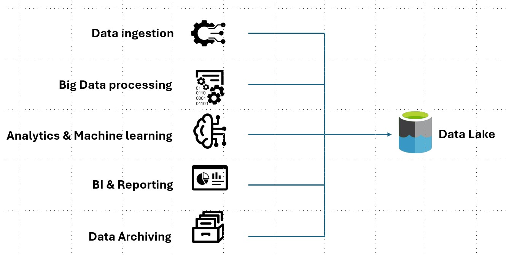

# What is a data lake?

A data lake is a centralized storage repository that holds vast amounts of data in its native, raw format. Unlike traditional databases, data lakes are designed to scale cost-effectively from terabytes to petabytes, making them suitable for handling massive and diverse datasets. These datasets may include structured data (like relational tables), semi-structured data (like JSON, XML, or logs), and unstructured data (like images, audio, or video). The key advantage of a data lake is that it preserves data in its original state, deferring transformation until the data is needed — a concept known as schema-on-read. This contrasts with a [data warehouse](../relational-data/data-warehousing.yml), which enforces structure and applies transformations as data is ingested (schema-on-write).

  

<em>Figure 1: Data Lake use cases</em>

**Key Use Cases of a Data Lake**

- **Data ingestion and movement**: Collect and consolidate data from cloud services, IoT devices, on-premises systems, and streaming sources into a single repository.
- **Big data processing**: Handle high-volume, high-velocity data at scale using distributed processing frameworks.
- **Analytics and machine learning**: Support exploratory analysis, advanced analytics, and AI model training on large, diverse datasets.
- **Business intelligence (BI) and reporting**: Enable dashboards and reports by integrating curated subsets of lake data into warehouses or BI tools.
- **Data archiving and compliance**: Store historical or raw datasets for long-term retention, auditability, and regulatory needs.

**Advantages of a Data Lake**

- **Retains raw data for future use**: By storing data in its original format, a data lake preserves information that may later prove valuable for unanticipated insights.
- **Self-service exploration**: Analysts and data scientists can query data directly, encouraging experimentation and discovery.
- **Flexible data support**: Unlike warehouses that require structured formats, lakes can natively handle structured, semi-structured, and unstructured data.
- **Scalable and performant**: With distributed architectures, data lakes support parallel ingestion and processing at scale, often outperforming traditional ETL pipelines in  large-volume scenarios.
- **Foundation for hybrid architectures**: Data lakes often coexist with warehouses in a lakehouse approach, combining raw storage with structured query performance.

A modern data lake solution comprises two core elements:

- **Storage**: Built for durability, fault tolerance, infinite scalability, and high-throughput ingestion of diverse data types.
- **Processing**: Powered by engines such as Apache Spark in Azure Databricks, Microsoft Fabric, enabling large-scale transformations, analytics, and machine learning.

Additionally, mature solutions incorporate metadata management, security, and governance to ensure data quality, discoverability, and compliance.

## When you should use a data lake

We recommend using a data lake for exploratory analytics, advanced data science, and machine learning workloads. Because lakes retain data in its raw state and support schema-on-read, they allow teams to experiment with diverse data types and uncover insights that traditional warehouses may not capture.

**Data Lake as a Source for Data Warehouses**

A data lake can also serve as the upstream source for a data warehouse. In this pattern, raw data is first ingested into the lake and then transformed into a structured, queryable format through an [extract, load, transform (ELT)](../relational-data/etl.yml#extract-load-and-transform-elt) pipeline. By contrast, certain relational sources may load directly into the warehouse via ETL, bypassing the lake when speed or simplicity is preferred. Choosing between the two approaches depends on factors like data complexity, governance needs, and downstream analytics requirements.

**Event Streaming and IoT Scenarios**

Data lakes are effective for event streaming and IoT use cases, where high-velocity data must be persisted at scale without upfront schema constraints. They can ingest and store both relational and non-relational event streams, handle high volumes of small writes with low latency, and support massive parallel throughput. This makes them well suited for applications such as real-time monitoring, predictive maintenance, and anomaly detection.

Together, these capabilities position the data lake as a flexible foundation for modern data architectures, capable of supporting both exploratory workloads and structured downstream analytics.

The following table compares data lakes and data warehouses.

| **Feature**                  | **Data Lake**                                                                 | **Data Warehouse**                                                             |
|-----------------------------|-------------------------------------------------------------------------------|--------------------------------------------------------------------------------|
| **Data type**               | Raw, unstructured, semi-structured, and structured                           | Structured and highly organized                                                |
| **Query performance**       | Slower, especially for complex queries; depends on data format and tools     | Fast and optimized for analytical queries                                      |
| **Latency**                 | Higher latency due to on-the-fly processing                                  | Low latency with pre-processed, structured data                                |
| **Data transformation stage**         | Transformation happens at query time, impacting overall processing time               | Transformation happens during the ETL or ELT process              |
| **Scalability**             | Highly scalable and cost-effective for large volumes of diverse data         | Scalable but more expensive, especially at large scale                         |
| **Cost**                    | Lower storage costs; compute costs vary based on usage                       | Higher storage and compute costs due to performance optimizations              |
| **Use case fit**            | Best for big data, machine learning, and exploratory analytics               | Ideal for business intelligence, reporting, and structured data analysis       |

## Challenges of Data Lakes

- **Scalability and complexity**: Managing petabytes of raw, unstructured, and semi-structured data requires robust infrastructure, distributed processing, and careful cost management.
- **Processing bottlenecks**: As data volume and diversity increase, transformation and query workloads can introduce latency, requiring careful pipeline design and workload orchestration.
- **Data integrity risks**: Without strong validation and monitoring, errors or incomplete ingestions can compromise the reliability of the lake’s contents.
- **Data quality and governance**: The variety of sources and formats makes it difficult to enforce consistent standards. Implementing metadata management, cataloging, and governance frameworks is critical.
- **Performance at scale**: Query performance and storage efficiency can degrade as the lake grows, requiring optimization strategies such as partitioning, indexing, and caching.
- **Security and access control**: Ensuring appropriate permissions, encryption, and auditing is essential to prevent misuse of sensitive data.
- **Discoverability**: Without proper cataloging, lakes can devolve into “data swamps” where valuable information is present but inaccessible or misunderstood.

By recognizing these challenges upfront, organizations can design a resilient data lake architecture that balances scalability with governance, performance, and cost efficiency.

## Technology choices

When you build a comprehensive data lake solution on Azure, consider the following technologies:

- [Azure Data Lake Storage](/azure/storage/blobs/data-lake-storage-introduction) is Microsoft Azure’s cloud storage service for big data analytics. It’s designed to handle massive amounts of structured, semi-structured, and unstructured data.

- [Azure Databricks](/azure/databricks/introduction/) is a cloud-based data analytics and machine learning platform that combines the best of Apache Spark with deep integration into the Microsoft Azure ecosystem. It provides a collaborative environment where data engineers, data scientists, and analysts can work together to ingest, process, analyze, and model large volumes of data.

- [Azure Data Factory](/azure/data-factory/introduction) is an Microsoft Azure's cloud-based data integration and ETL (Extract, Transform, Load) service. It’s designed to let you move, transform, and orchestrate data workflows across different sources, whether in the cloud or on-premises.

- [Microsoft Fabric](/fabric/get-started/microsoft-fabric-overview) is Microsoft’s all-in-one, end-to-end data analytics platform that unifies data movement, data science, real-time analytics, and business intelligence into a single software-as-a-service (SaaS) experience.

## Contributors

*This article is maintained by Microsoft. It was originally written by the following contributors.*

Principal author:

 - [Avijit Prasad](https://www.linkedin.com/in/avijit-prasad-96768a42/) | Cloud Consultant

Contributors:

 - [Raphael Sayegh](https://www.linkedin.com/in/raphael-sayegh/) | Cloud Solution Architect

*To see non-public LinkedIn profiles, sign in to LinkedIn.*

## Next steps
- [What is OneLake?](/fabric/onelake/onelake-overview)
- [Introduction to Data Lake Storage](/azure/storage/blobs/data-lake-storage-introduction)
- [Azure Data Lake Analytics documentation](/azure/data-lake-analytics)
- [Training: Introduction to Data Lake Storage](/training/modules/intro-to-azure-data-lake-storage)
- [Integration of Hadoop and Azure Data Lake Storage](/azure/hdinsight/hdinsight-hadoop-use-data-lake-storage-gen2)
- [Connect to Data Lake Storage and Blob Storage](/azure/databricks/connect/storage/azure-storage)
- [Load data into Data Lake Storage with Azure Data Factory](/azure/data-factory/load-azure-data-lake-storage-gen2)

## Related resources

- [Choose an analytical data store in Azure](../technology-choices/analytical-data-stores.md)
- [Modern data warehouse for small and medium businesses](../../example-scenario/data/small-medium-data-warehouse.yml)
