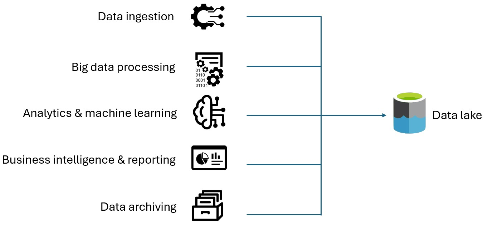

# What is a data lake?

A data lake is a storage repository that holds a large amount of data in its native, raw format. Data lake stores are optimized for scaling to terabytes and petabytes of data. The data typically comes from multiple heterogeneous sources, and may be structured, semi-structured, or unstructured. The idea with a data lake is to store everything in its original, untransformed state. This approach differs from a traditional [data warehouse](../relational-data/data-warehousing.yml), which transforms and processes the data at the time of ingestion.

The following are key data lake use cases:
- Cloud and IoT data movement
- Big data processing
- Analytics
- Reporting
- On-premises data movement

Advantages of a data lake:

- Data is never thrown away, because the data is stored in its raw format. This is especially useful in a big data environment, when you may not know in advance what insights are available from the data.
- Users can explore the data and create their own queries.
- May be faster than traditional ETL tools.
- More flexible than a data warehouse, because it can store unstructured and semi-structured data.

A complete data lake solution consists of both storage and processing. Data lake storage is designed for fault-tolerance, infinite scalability, and high-throughput ingestion of data with varying shapes and sizes. Data lake processing involves one or more processing engines built with these goals in mind, and can operate on data stored in a data lake at scale.

## When to use a data lake

Typical uses for a data lake include [data exploration](./interactive-data-exploration.md), data analytics, and machine learning.

A data lake can also act as the data source for a data warehouse. With this approach, the raw data is ingested into the data lake and then transformed into a structured queryable format. Typically this transformation uses an [ELT](../relational-data/etl.yml#extract-load-and-transform-elt) (extract-load-transform) pipeline, where the data is ingested and transformed in place. Source data that is already relational may go directly into the data warehouse, using an ETL process, skipping the data lake.

Data lake stores are often used in event streaming or IoT scenarios, because they can persist large amounts of relational and nonrelational data without transformation or schema definition. They are built to handle high volumes of small writes at low latency, and are optimized for massive throughput.

The following table compares data lakes and data warehouses:

## Challenges

- Lack of a schema or descriptive metadata can make the data hard to consume or query.
- Lack of semantic consistency across the data can make it challenging to perform analysis on the data, unless users are highly skilled at data analytics.
- It can be hard to guarantee the quality of the data going into the data lake.
- Without proper governance, access control and privacy issues can be problems. What information is going into the data lake, who can access that data, and for what uses?
- A data lake may not be the best way to integrate data that is already relational.
- By itself, a data lake does not provide integrated or holistic views across the organization.
- A data lake may become a dumping ground for data that is never actually analyzed or mined for insights.

## Technology choices

Build data lake solutions using the following services offered by Azure:

- [Azure HD Insight](https://azure.microsoft.com/products/hdinsight) is a managed, full-spectrum, open-source analytics service in the cloud for enterprises. 
- [Azure Data Lake Store](https://azure.microsoft.com/products/storage/data-lake-storage) is a hyperscale, Hadoop-compatible repository.
- [Azure Data Lake Analytics](https://azure.microsoft.com/products/data-lake-analytics) is an on-demand analytics job service to simplify big data analytics.

## Contributors

*This article is maintained by Microsoft. It was originally written by the following contributors.*

Principal author:

 - [Avijit Prasad](https://www.linkedin.com/in/avijit-prasad%F0%9F%8C%90-96768a42) | Cloud Consultant

## Next steps

- [What is Azure HDInsight?](/azure/hdinsight/hdinsight-overview)
- [Introduction to Azure Data Lake Storage](/azure/storage/blobs/data-lake-storage-introduction)
- [Azure Data Lake Analytics Documentation](/azure/data-lake-analytics)
- [Introduction to Azure Data Lake Storage (training module)](/training/modules/intro-to-azure-data-lake-storage)
- [What is a Data Lake?](https://azure.microsoft.com/resources/cloud-computing-dictionary/what-is-a-data-lake)

## Related resources

- [Choose an analytical data store in Azure](../technology-choices/analytical-data-stores.md)
- [Query a data lake or lakehouse by using Azure Synapse serverless](../../example-scenario/data/synapse-exploratory-data-analytics.yml)
- [Optimized storage – time based with Data Lake](../../solution-ideas/articles/optimized-storage-time-based-data-lake.yml)
- [Data management across Azure Data Lake with Microsoft Purview](../../solution-ideas/articles/azure-purview-data-lake-estate-architecture.yml)
- [Modern data warehouse for small and medium business](../../example-scenario/data/small-medium-data-warehouse.yml)
