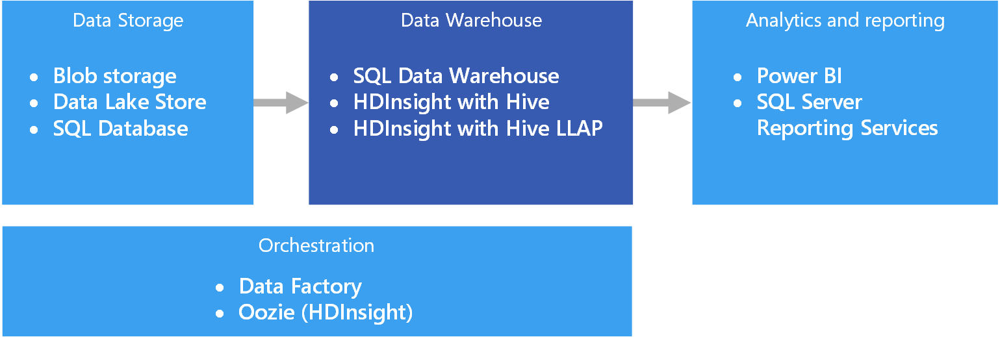

# Data warehousing and data marts

A data warehouse is a central, organizational, relational repository of integrated data from one or more disparate sources, across many or all subject areas. Data warehouses store current and historical data and are used for reporting and analysis of the data in different ways.

To move data into a data warehouse, it is extracted on a periodic basis from various sources that contain important business information. As the data is moved, it can be formatted, cleaned, validated, summarized, and reorganized. Alternately, the data can be stored in the lowest level of detail, with aggregated views provided in the warehouse for reporting. In either case, the data warehouse becomes a permanent storage space for data used for reporting, analysis, and forming important business decisions using business intelligence (BI) tools.

## Data marts and operational data stores

Managing data at scale is complex, and it is becoming less common to have a single data warehouse that represents all data across the entire enterprise. Instead, organizations create smaller, more focused data warehouses, called *data marts*, that expose the desired data for analytics purposes. An orchestration process populates the data marts from data maintained in an operational data store. The operational data store acts as an intermediary between the source transactional system and the data mart. Data managed by the operational data store is a cleaned version of the data present in the source transactional system, and is typically a subset of the historical data that is maintained by the data warehouse or data mart. 

## When to use this solution

Choose a data warehouse when you need to turn massive amounts of data from operational systems into a format that is easy to understand, current, and accurate. Data warehouses do not need to follow the same terse data structure you may be using in your operational/OLTP databases. You can use column names that make sense to business users and analysts, restructure the schema to simplify data relationships, and consolidate several tables into one. These steps help guide users who need to create ad hoc reports, or create reports and analyze the data in BI systems, without the help of a database administrator (DBA) or data developer.

Consider using a data warehouse when you need to keep historical data separate from the source transaction systems for performance reasons. Data warehouses make it easy to access historical data from multiple locations, by providing a centralized location using common formats, common keys, common data models, and common access methods.

Data warehouses are optimized for read access, resulting in faster report generation compared to running reports against the source transaction system. In addition, data warehouses provide the following benefits:

* All historical data from multiple sources can be stored and accessed from a data warehouse as the single source of truth.
* You can improve data quality by cleaning up data as it is imported into the data warehouse, providing more accurate data as well as providing consistent codes and descriptions.
* Reporting tools do not compete with the transactional source systems for query processing cycles. A data warehouse allows the transactional system to focus predominantly on handling writes, while the data warehouse satisfies the majority of read requests.
* A data warehouse can help consolidate data from different software.
* Data mining tools can help you find hidden patterns using automatic methodologies against data stored in your warehouse.
* Data warehouses make it easier to provide secure access to authorized users, while restricting access to others. There is no need to grant business users access to the source data, thereby removing a potential attack vector against one or more production transaction systems.
* Data warehouses make it easier to create business intelligence solutions on top of the data, such as [OLAP cubes](online-analytical-processing.md).

## Challenges

Properly configuring a data warehouse to fit the needs of your business can bring some of the following challenges:

* Committing the time required to properly model your business concepts. This is an important step, as data warehouses are information driven, where concept mapping drives the rest of the project. This involves standardizing business-related terms and common formats (such as currency and dates), and restructuring the schema in a way that makes sense to business users but still ensures accuracy of data aggregates and relationships.
* Planning and setting up your data orchestration. Consideration include how to copy data from the source transactional system to the data warehouse, and when to move historical data out of your operational data stores and into the warehouse.
* Maintaining or improving data quality by cleaning the data as it is imported into the warehouse.

## Data warehousing in Azure

In Azure, you may have one or more sources of data, whether from customer transactions, or from various business applications used by various departments. This data is traditionally stored in one or more [OLTP](online-transaction-processing.md) databases. The data could be persisted in other storage mediums such as network shares, Azure Storage Blobs, or a data lake. The data could also be stored by the data warehouse itself or in a relational database such as Azure SQL Database. The purpose of the analytical data store layer is to satisfy queries issued by analytics and reporting tools against the data warehouse or data mart. In Azure, this analytical store capability can be met with Azure SQL Data Warehouse, or with Azure HDInsight using Hive or Interactive Query. In addition, you will need some level of orchestration to periodically move or copy data from data storage to the data warehouse, which can be done using Azure Data Factory or Oozie on Azure HDInsight.

Related services:

* [Azure SQL Database](/azure/sql-database/)
* [SQL Server in a VM](/sql/sql-server/sql-server-technical-documentation)
* [Azure Data Warehouse](/azure/sql-data-warehouse/sql-data-warehouse-overview-what-is)
* [Apache Hive on HDInsight](/azure/hdinsight/hadoop/hdinsight-use-hive)
* [Interactive Query (Hive LLAP) on HDInsight](/azure/hdinsight/interactive-query/apache-interactive-query-get-started)

## Technology choices

- [Data warehouses](../technology-choices/data-warehouses.md)
- [Pipeline orchestration](../technology-choices/pipeline-orchestration-data-movement.md)

