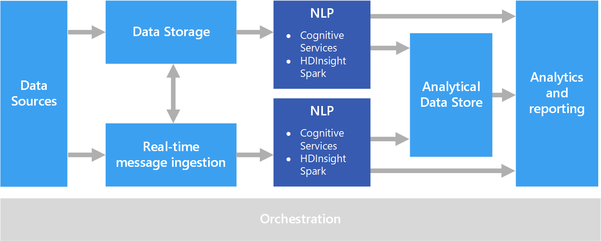

# Natural language processing

Natural language processing (NLP) is used for tasks such as sentiment analysis, topic detection, language detection, key phrase extraction, and document categorization.

## When to use this solution

NLP can be use to classify documents, such as labeling documents as sensitive or spam. The output of NLP can be used for subsequent processing or search. Another use for NLP is to summarize text by identifying the entities present in the document. These entities can also be used to tag documents with keywords, which enables search and retrieval based on content. Entities might be combined into topics, with summaries that describe the important topics present in each document. The detected topics may be used to categorize the documents for navigation, or to enumerate related documents given a selected topic. Another use for NLP is to score text for sentiment, to assess the positive or negative tone of a document. These approaches use many techniques from natural language processing, such as:

- **Tokenizer**. Splitting the text into words or phrases.
- **Stemming and lemmatization**. Normalizing words so that different forms map to the canonical word with the same meaning. For example, "running" and "ran" map to "run."
- **Entity extraction**. Identifying subjects in the text.
- **Part of speech detection**. Identifying text as a verb, noun, participle, verb phrase, and so on.
- **Sentence boundary detection**. Detecting complete sentences within paragraphs of text.

When using NLP to extract information and insight from free-form text, the starting point is typically the raw documents stored in object storage such as Azure Storage or Azure Data Lake Store.

## Challenges

- Processing a collection of free-form text documents is typically computationally resource intensive, as well as being time intensive.
- Without a standardized document format, it can be difficult to achieve consistently accurate results using free-form text processing to extract specific facts from a document. For example, think of a text representation of an invoice&mdash;it can be difficult to build a process that correctly extracts the invoice number and invoice date for invoices across any number of vendors.

## Architecture

In an NLP solution, free-form text processing is performed against documents containing paragraphs of text. The overall architecture can be a [batch processing](../big-data/batch-processing.md) or [real-time stream processing](../big-data/real-time-processing.md) architecture.

The actual processing varies based on the desired outcome, but in terms of the pipeline, NLP may be applied in a batch or real-time fashion. For example, sentiment analysis can be used against blocks of text to produce a sentiment score. This can could be done by running a batch process against data in storage, or in real time using smaller chunks of data flowing through a messaging service.

## Technology choices

- [Natural language processing](../technology-choices/natural-language-processing.md)
