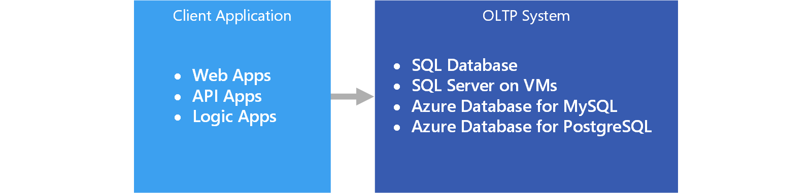

# Online transaction processing (OLTP)

The management of [transactional data](../concepts/transactional-data.md) using computer systems is referred to as Online Transaction Processing (OLTP). OLTP systems record business interactions as they occur in the day-to-day operation of the organization, and support querying of this data to make inferences.

## When to use this solution

Choose OLTP when you need to efficiently process and store business transactions and immediately make them available to client applications in a consistent way. Use this architecture when any tangible delay in processing would have a negative impact on the day-to-day operations of the business.

OLTP systems are designed to efficiently process and store transactions, as well as query transactional data. The goal of efficiently processing and storing individual transactions by an OLTP system is partly accomplished by data normalization &mdash; that is, breaking the data up into smaller chunks that are less redundant. This supports efficiency because it enables the OLTP system to process large numbers of transactions independently, and avoids extra processing needed to maintain data integrity in the presence of redundant data.

## Challenges
Implementing and using an OLTP system can create a few challenges:

- OLTP systems are not always good for handling aggregates over large amounts of data, although there are exceptions, such as a well-planned SQL Server-based solution. Analytics against the data, that rely on aggregate calculations over millions of individual transactions, are very resource intensive for an OLTP system. They can be slow to execute and can cause a slow-down by blocking other transactions in the database.
- When conducting analytics and reporting on data that is highly normalized, the queries tend to be complex, because most queries need to de-normalize the data by using joins. Also, naming conventions for database objects in OLTP systems tend to be terse and succinct. The increased normalization coupled with terse naming conventions makes OLTP systems difficult for business users to query, without the help of a DBA or data developer.
- Storing the history of transactions indefinitely and storing too much data in any one table can lead to slow query performance, depending on the number of transactions stored. The common solution is to maintain a relevant window of time (such as the current fiscal year) in the OLTP system and offload historical data to other systems, such as a data mart or [data warehouse](../technology-choices/data-warehouses.md).

## OLTP in Azure

Applications such as websites hosted in [App Service Web Apps](/azure/app-service/app-service-web-overview), REST APIs running in App Service, or mobile or desktop applications communicate with the OLTP system, typically via a REST API intermediary.

In practice, most workloads are not purely OLTP. There tends to be an [analytical component](../scenarios/online-analytical-processing.md) as well. In addition, there is an increasing demand for real-time reporting, such as running reports against the operational system. This is also referred to as HTAP (Hybrid Transactional and Analytical Processing). For more information, see [Online Analytical Processing (OLAP) data stores](../technology-choices/olap-data-stores.md).

## Technology choices

Data storage:

- [Azure SQL Database](/azure/sql-database/)
- [SQL Server in an Azure VM](/azure/virtual-machines/windows/sql/virtual-machines-windows-sql-server-iaas-overview?toc=%2Fazure%2Fvirtual-machines%2Fwindows%2Ftoc.json)
- [Azure Database for MySQL](/azure/mysql/)
- [Azure Database for PostgreSQL](/azure/postgresql/)

For more information, see [Choosing an OLTP data store](../technology-choices/oltp-data-stores.md)

Data sources:

- [App service](/azure/app-service/)
- [Mobile Apps](/azure/app-service-mobile/)

