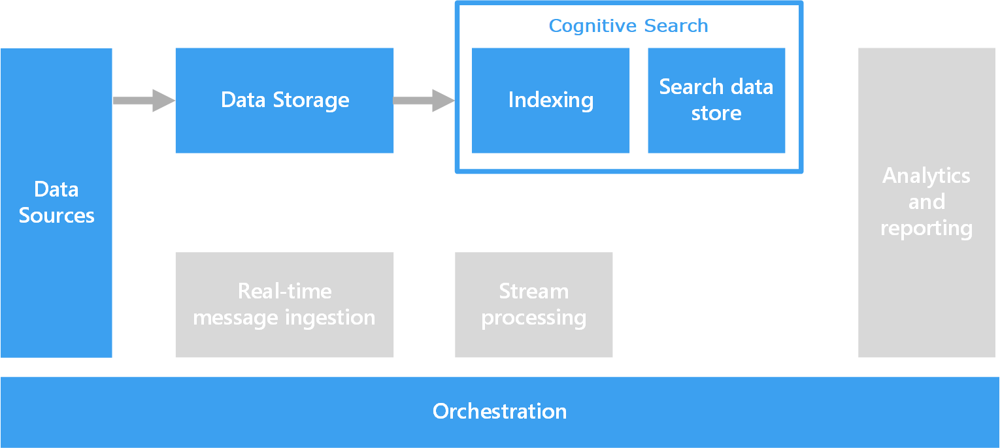

To support search, you can do free-form text processing against documents that contain paragraphs of text.

Text search works by constructing a specialized index that it precomputes against a collection of documents. A client application submits a query that contains search terms. The query returns a result set, which is a list of documents sorted by how well they match the search criteria. The result set can also include the context in which the document matches the criteria, so the application can highlight the matching phrase in the document.

Free-form text processing can produce useful, actionable data from large amounts of noisy text data. The results can give unstructured documents a well-defined and queryable structure.

## Architecture

In most scenarios, you load the source text documents into object storage, such as [Azure Storage](https://azure.microsoft.com/product-categories/storage) or [Azure Data Lake Storage](https://azure.microsoft.com/services/storage/data-lake-storage), and then index them using an external search service. The source text documents are physically distinct from the search index hosted on the search service.

An exception is using full text search within [SQL Server](https://www.microsoft.com/sql-server/sql-server-downloads) or [Azure SQL Database](https://azure.microsoft.com/products/azure-sql/database). In this case, the document data exists internally in tables the database manages. Once stored, the documents are batch processed to create the index.

## Technology choices

Options for creating an external search index include [Azure Cognitive Search](https://azure.microsoft.com/services/search), [Elasticsearch](https://www.elastic.co), and [Azure HDInsight](https://azure.microsoft.com/services/hdinsight) with [Apache Solr](https://solr.apache.org). Each of these technologies can populate a search index from a collection of documents.

- Cognitive Search provides indexers that can automatically populate the index for documents ranging from plain text to Excel and PDF formats. You can also attach machine learning models to an indexer to analyze images and unstructured text for searchable content.

- On HDInsight, Solr can index binary files of many types, including plain text, Word, and PDF. Once the index is constructed, clients can access the search interface with a REST API.

If you store your text data in SQL Server or Azure SQL Database, you can use the full-text search that's built into the database. The database populates the index from text, binary, or XML data stored within the same database. Clients search by using T-SQL queries.

## Considerations

- Processing a collection of free-form text documents is typically computationally intensive and time intensive.

- To search free-form text effectively, the search index should support fuzzy search for terms that have a similar construction. For example, search indexes built with *lemmatization* and *linguistic stemming* can match documents that contain "ran" and "running" with queries for "run".

## Contributors

*This article is maintained by Microsoft. It was originally written by the following contributors.*

Principal author:

- [Zoiner Tejada](https://www.linkedin.com/in/zoinertejada) | CEO and Architect

## Next steps

- [What is Azure Cognitive Search?](/azure/search/search-what-is-azure-search)
- [Full-Text Search in SQL Server and Azure SQL Database](/sql/relational-databases/search/full-text-search)

## Related resources

- [Choose a search data store in Azure](../technology-choices/search-options.md)
- [Natural language processing technology](../technology-choices/natural-language-processing.yml)
