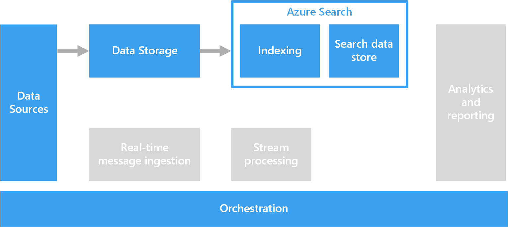

# Processing free-form text for search

To support search, free-form text processing can be performed against documents containing paragraphs of text.

Text search works by constructing a specialized index that is precomputed against a collection of documents. A client application submits a query that contains the search terms. The query returns a result set, consisting of a list of documents sorted by how well each document matches the search criteria. The result set may also include the context in which the document matches the criteria, which enables the application to highlight the matching phrase in the document.

Free-form text processing can produce useful, actionable data from large amounts of noisy text data. The results can give unstructured documents a well-defined and queryable structure.

## Challenges

- Processing a collection of free-form text documents is typically computationally intensive, as well as time intensive.
- In order to search free-form text effectively, the search index should support fuzzy search based on terms that have a similar construction. For example, search indexes are built with lemmatization and linguistic stemming, so that queries for "run" will match documents that contain "ran" and "running."

## Architecture

In most scenarios, the source text documents are loaded into object storage such as Azure Storage or Azure Data Lake Store. An exception is using full text search within SQL Server or Azure SQL Database. In this case, the document data is loaded into tables managed by the database. Once stored, the documents are processed in a batch to create the index.

## Technology choices

Options for creating a search index include Azure Search, Elasticsearch, and HDInsight with Solr. Each of these technologies can populate a search index from a collection of documents. Azure Search provides indexers that can automatically populate the index for documents ranging from plain text to Excel and PDF formats. On HDInsight, Apache Solr can index binary files of many types, including plain text, Word, and PDF. Once the index is constructed, clients can access the search interface by means of a REST API.

If your text data is stored in SQL Server or Azure SQL Database, you can use the full-text search that is built into the database. The database populates the index from text, binary, or XML data stored within the same database. Clients search by using T-SQL queries.

For more information, see [Search data stores](../technology-choices/search-options.md).
