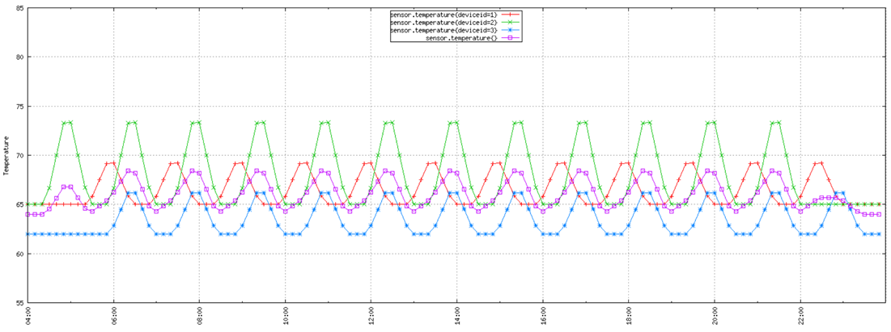

<!-- cSpell:ignore downsample TSDB -->
Time series data is a set of values organized by time. Temporal ordering, a key characteristic of time series data, organizes events in the order in which they occur and arrive for processing.

Choose a time series solution for data whose strategic value centers around changes in an asset or process over time. You can use time series data to look backward and measure change, or to look forward and predict future change.
Time series data typically arrives in chronological order, usually inserts into a data store, and rarely if ever updates. In contrast, standard online transaction processing (OLTP) data pipelines accept data in any order, and can be updated at any time.

Time series data has timestamps, and time is a meaningful axis for viewing or analyzing the data. Time series data is best visualized with a scatter or line chart.

## Architecture

### Dataflow

Many time series-based systems, such as [Internet of things (IoT)](../big-data/index.yml#internet-of-things-iot) scenarios, capture data in real time by using a [real-time processing](../big-data/real-time-processing.yml) architecture.

1. [Azure IoT Hub](/azure/iot-hub), [Azure Event Hubs](/azure/event-hubs), or [Kafka on HDInsight](/azure/hdinsight/kafka/apache-kafka-introduction) ingest data from one or more data sources into the stream processing layer.
1. The stream processing layer processes the data, and can hand off the processed data to a machine learning service for predictive analytics.
1. An analytical data store like [Azure Data Explorer](https://azure.microsoft.com/services/data-explorer), [HBase](/azure/hdinsight/hbase/apache-hbase-overview), [Azure Cosmos DB](/azure/cosmos-db), or [Azure Data Lake](https://azure.microsoft.com/services/storage/data-lake-storage) stores the processed data.
1. An analytics and reporting application or service like [Power BI](https://powerbi.microsoft.com) or OpenTSDB for HBase can display the time series data for analysis.

### Components

For more information about the components of a time series architecture, see the following articles:

- [Choose a big data storage technology in Azure](../technology-choices/data-storage.md).
- [Choose a data analytics and reporting technology in Azure](../technology-choices/analysis-visualizations-reporting.md).
- [Choose an analytical data store in Azure](../technology-choices/analytical-data-stores.md).
- [Choose a stream processing technology in Azure](../technology-choices/stream-processing.md).

### Alternatives

You can use [Azure Data Explorer](/azure/data-explorer/time-series-analysis) to develop a complete time series service. Azure Data Explorer includes native support for creating, manipulating, and analyzing multiple time series with near real-time monitoring.

Azure Data Explorer can ingest data from many services and platforms, in many formats. For more information, see [Data formats supported by Azure Data Explorer for ingestion](/azure/data-explorer/ingestion-supported-formats). Ingestion is scalable, and there are no limits.

The Azure Data Explorer [Web UI](/azure/data-explorer/web-query-data) lets you run queries and [build data visualization dashboards](/azure/data-explorer/azure-data-explorer-dashboards). Azure Data Explorer also integrates with dashboard services like Power BI, Grafana, and other data visualization tools that use ODBC and JDBC connectors. For more information, see [Data visualization with Azure Data Explorer](/azure/data-explorer/viz-overview).

## Use cases

- You can analyze time series information to compare current to historical data, detect anomalies and generate real-time alerts, or visualize historical trends.

- Time-series analysis is also well-suited to predictive modeling and results forecasting. You can apply historical change records to many forecasting models.

- IoT data is a natural fit for time series storage and analysis. Incoming IoT data is inserted, and rarely if ever updated. The data is timestamped, inserted in the order received, and typically displays in chronological order. You can look backward to spot anomalies and discover trends, or look forward and use the data for predictive analysis.

Specific examples of time series data include:

- Stock prices captured over time to detect trends.
- Server performance, such as CPU usage, I/O load, memory usage, and network bandwidth consumption over time.
- Telemetry from industrial equipment sensors, which can indicate pending equipment failure and trigger alert notifications.
- Real-time auto data like speed, braking, and acceleration collected over a time period, to produce an aggregate risk score for the driver.

In each of these cases, time is a meaningful axis.

## Considerations

Here are some of the benefits of time series solutions:

- Clearly represent how an asset or process changes over time.
- Help you quickly detect changes to several related sources, making anomalies and emerging trends easy to identify.
- Are well-suited for predictive modeling and forecasting.

Here are some of the challenges for time series solutions:

- Time series data is often time sensitive, and must be acted on quickly to spot real-time trends or generate alerts. Delays can cause downtime and business impact.
- There's often a need to correlate data from different sensors and other sources, increasing complexity.
- Time series data is often high volume, especially in IoT scenarios. Storing, indexing, querying, analyzing, and visualizing high data volumes can be challenging.
- It can be hard to find the right combination of high-speed storage and powerful compute for real-time analytics, while minimizing time to market and overall cost investment.
- A stream processing layer that can process all incoming data in real-time with high precision and high granularity isn't always possible. You might need to sacrifice some precision by reducing data.
  - You can reduce data by processing sliding time windows like several seconds, to allow the processing layer time to perform calculations.
  - You can also downsample and aggregate data when displaying longer time periods, such as zooming to display data captured over several months.

## Contributors

*This article is maintained by Microsoft. It was originally written by the following contributors.*

Principal author:

- [Zoiner Tejada](https://www.linkedin.com/in/zoinertejada) | CEO and Architect

## Next steps

- [Microsoft Time Series Algorithm](/analysis-services/data-mining/microsoft-time-series-algorithm)
- [Time series analysis in Azure Data Explorer](/azure/data-explorer/time-series-analysis)

## Related resources

- [Introduction to predictive maintenance in manufacturing](../../industries/manufacturing/predictive-maintenance-overview.yml)
- [Predictive maintenance for industrial IoT](../../solution-ideas/articles/iot-predictive-maintenance.yml)
- [Condition monitoring for industrial IoT](../../solution-ideas/articles/condition-monitoring.yml)
- [Choose an Internet of Things (IoT) solution in Azure](../../example-scenario/iot/iot-central-iot-hub-cheat-sheet.yml)
