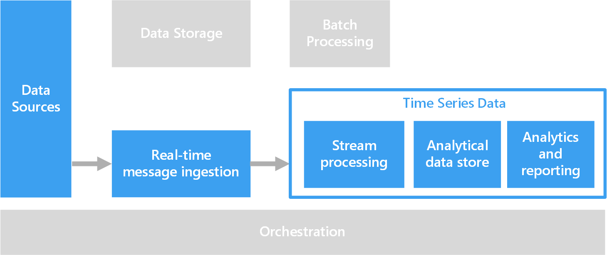

<!-- cSpell:ignore downsample TSDB -->
Time series data is a set of values organized by time. Temporal ordering is a key characteristic of time series data, as opposed to standard online transaction processing (OLTP) data. OLTP pipelines accept data in any order and can be updated at any time. Natural temporal ordering organizes events in the order in which they occur and arrive for processing. Time series data represents how an asset or process changes over time.

Choose a time series solution for data whose strategic value centers around changes over a time period. You can use time series data to look backward and measure change over time, or look forward and predict future change.

Time series data has a timestamp, and time is a meaningful axis for viewing or analyzing the data. Time series data typically arrives in chronological order, usually inserts into a data store and rarely updates, if at all. Time series data is best visualized with a scatter or line chart.

## Use cases

Analyze time series information to compare current to historical data. Use this information to detect anomalies and generate real-time alerts, or to visualize historical trends. Time-series architecture is also well-suited to predictive modeling and results forecasting. You can apply the historical record of changes over time to many forecasting models.

Data from [internet of things (IoT)](../big-data/index.yml#internet-of-things-iot) devices is a natural fit for time series storage and analysis. Incoming IoT data is inserted, and rarely if ever updated. The data is timestamped, and is inserted in the order received. This data typically displays in chronological order, letting you look backward to spot anomalies and discover trends, or forward to use the information for predictive analysis.

Other examples of time series data include:

- Stock prices captured over time to detect trends.
- Server performance, such as CPU usage, I/O load, memory usage, and network bandwidth consumption, over time.
- Telemetry from industrial equipment sensors, which can indicate pending equipment failure and trigger alert notifications.
- Real-time auto data like speed, braking, and acceleration collected over a time period, to produce an aggregate risk score for the driver.

In each of these cases, time is a meaningful axis.

## Architecture

Many scenarios that involve time series data, such as IoT, capture data in real time by using a [real-time processing](../big-data/real-time-processing.yml) architecture.

1. [Azure IoT Hub](/azure/iot-hub), [Azure Event Hubs](/azure/event-hubs), or [Kafka on HDInsight](/azure/hdinsight/kafka/apache-kafka-introduction) ingest data from one or more data sources into the stream processing layer.

1. The stream processing layer processes the data, and can hand off the processed data to a machine learning service for predictive analytics.

1. An analytical data store like [Azure Data Explorer](/azure/data-explorer/time-series-analysis), [HBase](/azure/hdinsight/hbase/apache-hbase-overview), [Azure Cosmos DB](/azure/cosmos-db), or [Azure Data Lake](https://azure.microsoft.com/services/storage/data-lake-storage) stores the processed data.

1. An analytics and reporting application or service like [Power BI](https://powerbi.microsoft.com) or OpenTSDB for HBase can display the time series data for analysis.

### Components

For more information about the components of a time series architecture, see the following articles:

- [Stream processing](../technology-choices/stream-processing.md)
- [Data storage](../technology-choices/data-storage.md)
- [Analytical data stores](../technology-choices/analytical-data-stores.md)
- [Analysis, visualizations, and reporting](../technology-choices/analysis-visualizations-reporting.md)

### Alternatives

You can use [Azure Data Explorer](https://azure.microsoft.com/services/data-explorer) to develop a complete time series service. Azure Data Explorer is a fast and highly scalable data exploration service for log and telemetry data. Azure Data Explorer includes native support for creating, manipulating, and analyzing multiple time series with near real-time monitoring.

Azure Data Explorer can ingest data from [Azure IoT Hub](https://azure.microsoft.com/services/iot-hub), [Azure Event Hubs](https://azure.microsoft.com/services/event-hubs), [Azure Stream Analytics](https://azure.microsoft.com/services/stream-analytics), [Power Automate](https://powerautomate.microsoft.com), [Azure Logic Apps](https://azure.microsoft.com/services/logic-apps), Kafka, Apache Spark, and many other services and platforms. Ingestion is scalable, and there are no limits. Supported Azure Data Explorer ingestion formats include JSON, CSV, Avro, Parquet, ORC, TXT, and other formats. For more information, see [Data formats supported by Azure Data Explorer for ingestion](/azure/data-explorer/ingestion-supported-formats).

The Azure Data Explorer [Web UI](/azure/data-explorer/web-query-data) lets you run queries and [build data visualization dashboards](/azure/data-explorer/azure-data-explorer-dashboards). Azure Data Explorer also integrates with dashboard services like Power BI, Grafana, and other data visualization tools that use ODBC and JDBC connectors. The optimized native [Azure Data Explorer connector for Power BI](/azure/data-explorer/power-bi-connector) supports direct query or import mode, including query parameters and filters. For more information, see [Data visualization with Azure Data Explorer](/azure/data-explorer/viz-overview).

> [!NOTE]
> Systems that use Azure Time Series Insights (TSI) for a time series service can migrate to Azure Data Explorer. The TSI service won't be supported after March 2025. For more information, see [Migrate to Azure Data Explorer](/azure/time-series-insights/migration-to-adx).

## Considerations

Here are some of the benefits of time series solutions:

- Clearly represent how an asset or process changes over time.
- Help you quickly detect changes to several related sources, making anomalies and emerging trends easy to identify.
- Are well-suited for predictive modeling and forecasting.

Here are some of the challenges for time series solutions:

- Time series data is often time sensitive, and must be acted on quickly to spot real-time trends or generate alerts. Delays can cause downtime and business impact.
- There's often a need to correlate data from a variety of different sensors and other sources, increasing complexity.
- Time series data is often very high volume, especially in IoT scenarios. Storing, indexing, querying, analyzing, and visualizing high data volumes can be challenging.
- Finding the right combination of high-speed storage and powerful compute for real-time analytics, while minimizing time to market and overall cost investment, can be difficult.
- A stream processing layer that can process all incoming data in real-time with high precision and high granularity isn't always possible. You might need to sacrifice some precision by reducing data.
  - You can reduce data by processing sliding time windows, for example several seconds, to allow the processing layer time to perform calculations.
  - You might also need to downsample and aggregate data when displaying longer time periods. For example, you can zoom to display data captured over several months.

## Next steps

- [Time series analysis in Azure Data Explorer](/azure/data-explorer/time-series-analysis)
- [Microsoft Time Series Algorithm](/analysis-services/data-mining/microsoft-time-series-algorithm)

## Related resources

- [Introduction to predictive maintenance in manufacturing](../../industries/manufacturing/predictive-maintenance-overview.yml)
- [Predictive maintenance for industrial IoT](../../solution-ideas/articles/iot-predictive-maintenance.md)
- [Condition monitoring for industrial IoT](../../solution-ideas/articles/condition-monitoring.md)
- [Choose an Internet of Things (IoT) solution in Azure](../../example-scenario/iot/iot-central-iot-hub-cheat-sheet.md)
- [Choose a big data storage technology in Azure](../technology-choices/data-storage.md)
- [Choose a data analytics and reporting technology in Azure](../technology-choices/analysis-visualizations-reporting.md)
- [Choose an analytical data store in Azure](../technology-choices/analytical-data-stores.md)
- [Choose a stream processing technology in Azure](../technology-choices/stream-processing.md)
