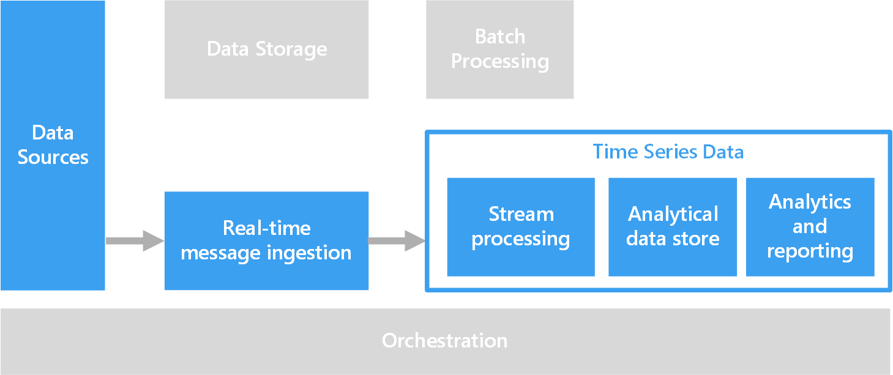
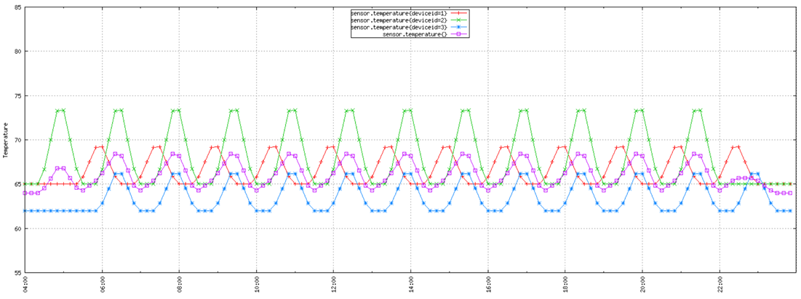

# Time series solutions

Time series data is a set of values organized by time. Examples of time series data include sensor data, stock prices, click stream data, and application telemetry. Time series data can be analyzed for historical trends, real-time alerts, or predictive modeling.

Time series data represents how an asset or process changes over time. The data has a timestamp, but more importantly, time is the most meaningful axis for viewing or analyzing the data. Time series data typically arrives in order of time and is usually treated as an insert rather than an update to your database. Because of this, change is measured over time, enabling you to look backward and to predict future change. As such, time series data is best visualized with scatter or line charts.

Some examples of time series data are:

- Stock prices captured over time to detect trends.
- Server performance, such as CPU usage, I/O load, memory usage, and network bandwidth consumption.
- Telemetry from sensors on industrial equipment, which can be used to detect pending equipment failure and trigger alert notifications.
- Real-time car telemetry data including speed, braking, and acceleration over a time window to produce an aggregate risk score for the driver.

In each of these cases, you can see how time is most meaningful as an axis. Displaying the events in the order in which they arrived is a key characteristic of time series data, as there is a natural temporal ordering. This differs from data captured for standard OLTP data pipelines where data can be entered in any order, and updated at any time.

## When to use this solution

Choose a time series solution when you need to ingest data whose strategic value is centered around changes over a period of time, and you are primarily inserting new data and rarely updating, if at all. You can use this information to detect anomalies, visualize trends, and compare current data to historical data, among other things. This type of architecture is also best suited for predictive modeling and forecasting results, because you have the historical record of changes over time, which can be applied to any number of forecasting models.

Using time series offers the following benefits:

- Clearly represents how an asset or process changes over time.
- Helps you quickly detect changes to a number of related sources, making anomalies and emerging trends clearly stand out.
- Best suited for predictive modeling and forecasting.

### Internet of Things (IoT)

Data collected by IoT devices is a natural fit for time series storage and analysis. The incoming data is inserted and rarely, if ever, updated. The data is timestamped and inserted in the order it was received, and this data is typically displayed in chronological order, enabling users to discover trends, spot anomalies, and use the information for predictive analysis.

For more information, see [Internet of Things](../big-data/index.md#internet-of-things-iot).

### Real-time analytics

Time series data is often time sensitive &mdash; that is, it must be acted on quickly, to spot trends in real time or generate alerts. In these scenarios, any delay in insights can cause downtime and business impact. In addition, there is often a need to correlate data from a variety of different sources, such as sensors.

Ideally, you would have a stream processing layer that can handle the incoming data in real time and process all of it with high precision and high granularity. This isn't always possible, depending on your streaming architecture and the components of your stream buffering and stream processing layers. You may need to sacrifice some precision of the time series data by reducing it. This is done by processing sliding time windows (several seconds, for example), allowing the processing layer to perform calculations in a timely manner. You may also need to downsample and aggregate your data when displaying longer periods of time, such as zooming to display data captured over several months.

## Challenges

- Time series data is often very high volume, especially in IoT scenarios. Storing, indexing, querying, analyzing, and visualizing time series data can be challenging.

- It can be challenging to find the right combination of high-speed storage and powerful compute operations for handling real-time analytics, while minimizing time to market and overall cost investment.

## Architecture

In many scenarios that involve time series data, such as IoT, the data is captured in real time. As such, a [real-time processing](../big-data/real-time-processing.md) architecture is appropriate.

Data from one or more data sources is ingested into the stream buffering layer by [IoT Hub](/azure/iot-hub/), [Event Hubs](/azure/event-hubs/), or [Kafka on HDInsight](/azure/hdinsight/kafka/apache-kafka-introduction). Next, the data is processed in the stream processing layer that can optionally hand off the processed data to a machine learning service for predictive analytics. The processed data is stored in an analytical data store, such as [HBase](/azure/hdinsight/hbase/apache-hbase-overview), [Azure Cosmos DB](/azure/cosmos-db/), Azure Data Lake, or Blob Storage. An analytics and reporting application or service, like Power BI or OpenTSDB (if stored in HBase) can be used to display the time series data for analysis.

Another option is to use [Azure Time Series Insights](/azure/time-series-insights/). Time Series Insights is a fully managed service for time series data. In this architecture, Time Series Insights performs the roles of stream processing, data store, and analytics and reporting. It accepts streaming data from either IoT Hub or Event Hubs and stores, processes, analyzes, and displays the data in near real time. It does not pre-aggregate the data, but stores the raw events.

Time Series Insights is schema adaptive, which means that you do not have to do any data preparation to start deriving insights. This enables you to explore, compare, and correlate a variety of data sources seamlessly. It also provides SQL-like filters and aggregates, ability to construct, visualize, compare, and overlay various time series patterns, heat maps, and the ability to save and share queries.

## Technology choices

- [Data Storage](../technology-choices/data-storage.md)
- [Analysis, visualizations, and reporting](../technology-choices/analysis-visualizations-reporting.md)
- [Analytical Data Stores](../technology-choices/analytical-data-stores.md)
- [Stream processing](../technology-choices/stream-processing.md)