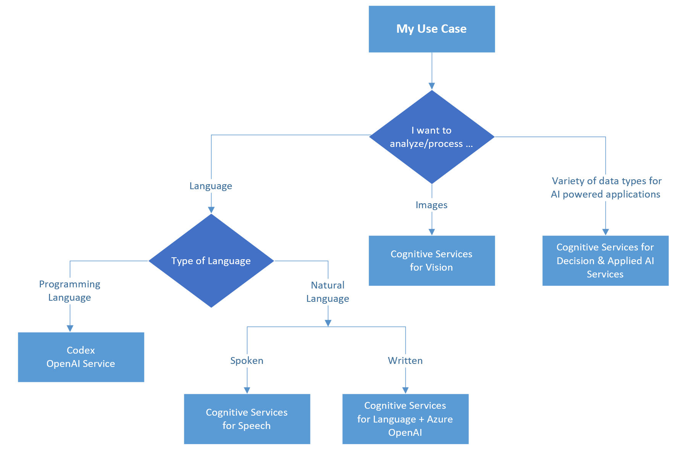

# Choose an Azure AI services technology

[Azure AI services](/azure/ai-services/what-are-ai-services) you create intelligent, market-ready, and responsible AI applications with prebuilt and customizable APIs and models. Example applications include natural language processing for conversations, search, documents, translation, speech, and vision. Most of the services require very little training to get started, and can be customized to meet your specific needs.

## Key Benefits

- **Client libraries and REST APIs**. Azure AI services client libraries and REST APIs provide direct access to your service. These tools provide programmatic access to the Azure AI services, their baseline models, and in many cases allow you to programmatically customize your models and solutions.
- **Continuous integration and deployment.** You can use Azure DevOps and GitHub Actions to manage your deployments. Use CI/CD integrations to train and deploy custom models for Speech and the Language Understanding (LUIS) service.
- **On-premises containers**. Many of the Azure AI services can be deployed in containers for on-premises access and use. Using these containers gives you the flexibility to bring Azure AI services closer to your data for compliance, security, or other operational reasons. 
- **Training models**. Some services allow you to bring your own data, then train a model. Trained custom models allow you to extend the model using the service's data and algorithm with your own data. The output matches your needs. 
- **Azure AI services in the ecosystem.** With Azure and Azure AI services, you have access to a broad ecosystem, such as:
    - Automation and integration tools like Logic Apps and Power Automate.
    - Deployment options such as Azure Functions and the App Service.
    - Azure AI services Docker containers for secure access.
    - Tools like Apache Spark, Azure Databricks, Azure Synapse Analytics, and Azure Kubernetes Service for big data scenarios.

### Considerations

- Because Azure AI services are only available over the web, internet connectivity is required. The only exception to this is the Custom Vision service, whose trained model you can export for prediction on devices and at the IoT Edge.
- Although considerable customization is supported, the available services might not suit all predictive analytics requirements.

## Categories of Azure AI services

Azure offers a number of AI services that can be grouped into categories based on their capabilities:

| Category | Guide | Service descriptions |
| --- | --- | --- |
| [Targeted language processing](https://azure.microsoft.com/products/ai-services/language-service/) | [Targeted language processing guide ](../ai-services/language-service-capabilities.md) |[Azure AI Language](../ai-services/language-service-capabilities.md#azure-ai-language-service) &bullet; [Azure AI Translator](../ai-services/language-service-capabilities.md#azure-ai-translator) &bullet; [Azure AI Document Intelligence](../ai-services/language-service-capabilities.md#azure-ai-document-intelligence-service) |
| [Speech recognition and generation](https://azure.microsoft.com/products/ai-services/speech-services/) | [Speech recognition and generation guide ](../ai-services/speech-service-capabilities.md) | [Azure AI Speech](../ai-services/speech-service-capabilities.md#azure-ai-speech-service) &bullet; [Immersive Reader](../ai-services/speech-service-capabilities.md#immersive-reader) |
| [Image and video processing](https://azure.microsoft.com/products/ai-services/vision-services/) | [Image and video processing guide](../ai-services/vision-service-capabilities.md) | [Azure AI Vision](../ai-services/vision-service-capabilities.md#vision-service) &bullet; [Azure AI Custom Vision](../ai-services/vision-service-capabilities.md#custom-vision-service) &bullet; [Azure AI Video Indexer](/azure/azure-video-indexer/) &bullet; [Azure AI Face](../ai-services/vision-service-capabilities.md#face-service)|
| [Azure AI Content Safety](https://azure.microsoft.com/products/ai-services/ai-content-safety/) | N/A|Azure AI Content Safety is an AI service that detects harmful user-generated and AI-generated content in applications and sprocesses images and text to flag content that's potentially offensive or unwanted. It's able to automatically detect and scan content regardless of its source language. |
|[Azure AI Search](https://azure.microsoft.com/products/ai-services/ai-search/) |N/A|With Azure AI Search, you can use your own content for generative AI search applications. It turns your data into a chat searchable index that you can use to add conversational search to your applications. |
|[Azure OpenAI](https://azure.microsoft.com/products/ai-services/openai-service/) | N/A| Azure OpenAI Service provides REST API access to OpenAI's powerful language models including GPT-4o, GPT-4 Turbo with Vision, GPT-4, GPT-3.5-Turbo, and Embeddings model series. These models can be easily adapted to your specific task including but not limited to content generation, summarization, image understanding, semantic search, and natural language to code translation. Users can access the service through REST APIs, Python SDK, or our web-based interface in the Azure OpenAI Studio. |
|[Custom Machine Learning](https://azure.microsoft.com/products/ai-services/openai-service/) | N/A|  Azure Machine Learning service procures and exposes many proprietary and open source models that you can use directly or customize further with more training. It also supports the creation of brand new models of any type using your own data. |

## Common use cases

The following are some common use cases for Azure AI services.

| Use case | Category |
| --- | --- |
| Transcribe audible speech into readable, searchable text. | Speech |
| Convert text to lifelike speech for more natural interfaces. | Speech |
| Integrate real-time speech translation into your apps. | Speech |
| Identify and verify the person speaking by using voice characteristics. | Speech |
| Identify commonly used and domain-specific terms. | Language |
| Automatically detect sentiments and opinions in text. | Language |
| Distill information into easy-to-navigate questions and answers. | Language |
| Enable your apps to interact with users through natural language. | Language  |
| Translate more than 100 languages and dialects. | Language |
| Identify and analyze content in images and video. | Vision |
| Customize image recognition to fit your business needs. | Vision |
| Detect potentially offensive or unwanted content. | Azure AI Content Safety  |
| Apply advanced coding and language models to various use cases. | Azure OpenAI  |

## Key selection criteria

To narrow down the choices, start by answering these questions:

- Are you processing something related to spoken language, or are you processing text, images, or documents?

- Do you have the data to train a model? If yes, consider using the custom services that enable you to train their underlying models with data that you provide. Doing so can improve accuracy and performance.

This flow chart can help you choose the best API service for your use case.

- If your use case requires speech-to-text, text-to-speech, or speech-to-speech, use a [Speech service](../ai-services/speech-service-capabilities.md).
- If your use case requires language or document analysis, text assessment, or  text-to-text, use a [Language service](../ai-services/language-service-capabilities.md).
- If you need to analyze images, video, or text, use a [Vision service](../ai-services/vision-service-capabilities.md).

## Deploying Azure AI service resources

When you [create an Azure AI services resource](/azure/ai-services/multi-service-resource?pivots=azportal#types-of-cognitive-services-resources), you can either deploy services independently or use the Azure AI services multi-service resource. To see which services are supported by multi-service resource, see [Supported services with a multi-service resource](/azure/ai-services/multi-service-resource?pivots=azportal#supported-services-with-a-multi-service-resource).

- Deploy an individual service if you don't need other services or if you want to manage access and billing on a per-service basis.
- Deploy the multi-service resource if you're using multiple services and want to manage access and billing for all services together.

> [!NOTE]
> The resource categories in these services change frequently. Be sure to check the latest documentation for new categories.

## Contributors

*This article is maintained by Microsoft. It was originally written by the following contributors.*

Principal authors:

- [Ashish Chahuan](https://www.linkedin.com/in/a69171115/) | Senior Cloud Solution Architect
- [Kruti Mehta](https://www.linkedin.com/in/thekrutimehta) | Azure Senior Fast-Track Engineer
- [Zoiner Tejada](https://www.linkedin.com/in/zoinertejada) | CEO and Architect

Other contributors:

- [Mick Alberts](https://www.linkedin.com/in/mick-alberts-a24a1414/) | Technical Writer
- [Brandon Cowen](https://www.linkedin.com/in/brandon-cowen-1658211b/) | Senior Cloud Solution Architect
- [Oscar Shimabukuro](https://www.linkedin.com/in/oscarshk/) | Senior Cloud Solution Architect
- [Manjit Singh](https://www.linkedin.com/in/manjit-singh-0b922332) | Software Engineer
- [Christina Skarpathiotaki](https://www.linkedin.com/in/christinaskarpathiotaki/) | Senior Cloud Solution Architect
- [Nathan Widdup](https://www.linkedin.com/in/nwiddup) | Azure Senior Fast-Track Engineer

*To see non-public LinkedIn profiles, sign in to LinkedIn.*

## Next steps

- [Learning path: Get started with Azure AI Services](/training/paths/get-started-azure-ai/)
- [Azure AI Services documentation](/azure/ai-services/)
- [What are Azure AI Services?](/azure/ai-services/what-are-ai-services)

## Related resources

- [End-to-end computer vision at the edge for manufacturing](../../reference-architectures/ai/end-to-end-smart-factory.yml)
- [Image classification on Azure](../../example-scenario/ai/intelligent-apps-image-processing.yml)
