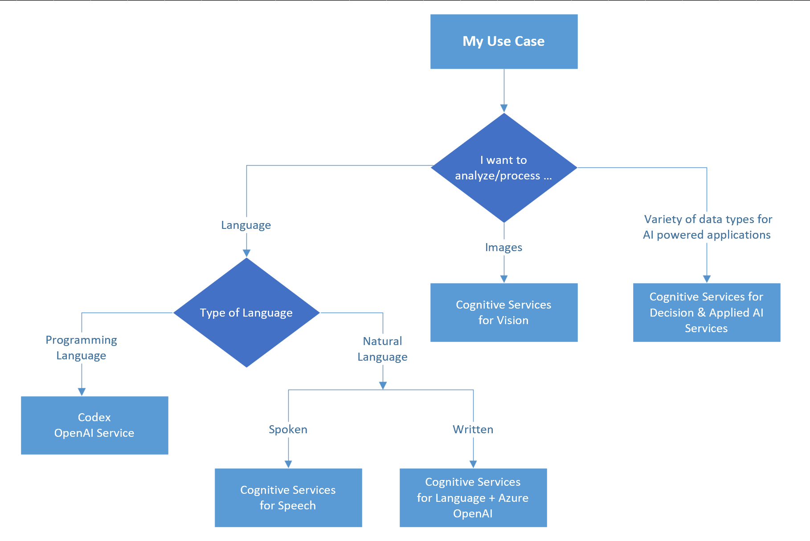

# Choose a Microsoft cognitive services technology

Microsoft cognitive services are cloud-based APIs that you can use in artificial intelligence (AI) applications and data flows. They provide you with pretrained models that are ready to use in your application, requiring no data and no model training on your part. The cognitive services are developed by Microsoft's AI and Research team and expose the latest deep learning algorithms. They are consumed over HTTP REST interfaces. In addition, SDKs are available for many common application development frameworks.

**Key benefits**:

- Minimal development effort for state-of-the-art AI services. (Using pre-defined algorithms or by creating custom algorithms on top of the pre-built libraries)
- Easy integration into apps via HTTP REST interfaces.
- Enable developers and data scientists of all skill levels to easily add AI capabilities to their apps

**Considerations**:

- Only available over the web. Internet connectivity is generally required. An exception is the Custom Vision Service, whose trained model you can export for prediction on devices and at the IoT edge.
- Although considerable customization is supported, the available services may not suit all predictive analytics requirements.

## Common Use Cases

- Transcribe audible speech into readable, searchable text.
- Convert text to lifelike speech for more natural interfaces.
- Integrate real-time speech translation into your apps.
- Identify and verify the people speaking based on audio.
- Identify commonly-used and domain-specific terms.
- Automatically detect sentiments and opinions from text.
- Distill information into easy-to-navigate questions and answers.
- Enable your apps to interact with users through natural language.
- Translate more than 100 languages and dialects.
- Identify and analyze content within images and videos.
- Customize image recognition to fit your business needs.
- Identify potential problems early on.
- Detect potentially offensive or unwanted content.
- Create rich, personalized experiences for every user.
- Apply advanced coding and language models to a variety of use cases.

## Categories of Azure cognitive services?

In Azure, there are dozens of Cognitive Services available. The current listing of these is available in a directory categorized by the functional area they support:

- [Language](https://azure.microsoft.com/services/cognitive-services/directory/lang/)
- [Speech](https://azure.microsoft.com/services/cognitive-services/directory/speech/)
- [Vision](https://azure.microsoft.com/services/cognitive-services/directory/vision/)
- [Decision](https://azure.microsoft.com/services/cognitive-services/directory/decision/)
- [Open AI](https://azure.microsoft.com/products/cognitive-services/openai-service)
- [Search](https://azure.microsoft.com/services/cognitive-services/directory/search/)

## Key selection criteria

To narrow the choices, start by answering these questions:

- Are you processing something related to spoken Language or Are you processing Text/Images/Documents ?

- Do you have the data to train a model? If yes, consider the custom services that enable you to train their underlying models with data that you provide, for improved accuracy and performance.

The diagram below provides a basic flow chart on how you would go about selecting the API service based on your use case
To narrow the choices, start by answering these questions:

Once the first decision is made you go deeper into your requirements.

- In case your decision had something to do with spoken Languages was it anything to do with Speech-To-Text, Text-To-Speech, Speech-To-Speech [**Speech API's**](../cognitive-services/SpeechAPI.md)
- Or perform some kind of language analysis/Text Assessment/ Text-To-Text [**Language API's**](../cognitive-services/LanguageAPI.md)
- Are you trying to observe & assess docs/text/documents [**Vision API's**](../cognitive-services/VisionAPI.md)
- Or do you want to observe and take some decision on the display [**Decision API's &/or Applied AI**](../cognitive-services/DecisionAndAppliedAI.md)

### Contributors

*This article is maintained by Microsoft. It was originally written by the following contributors.*

Principal authors:

- [Zoiner Tejada](https://www.linkedin.com/in/zoinertejada) | CEO and Architect
- [Kruti Mehta](https://www.linkedin.com/in/thekrutimehta) | Azure Senior Fast-track Engineer
- [Ashish Chahuan](https://www.linkedin.com/in/a69171115/) | Senior Cloud Solution Architect

Co-authors:

- [Manjit Singh](https://www.linkedin.com/in/manjit-singh-0b922332) | Software Engineer
- [Oscar Shimabukuro](https://www.linkedin.com/in/oscarshk/) | Senior Cloud Solution Architect
- [Christina Skarpathiotaki](https://www.linkedin.com/in/christinaskarpathiotaki/) | Senior Cloud Solution Architect
- [Brandon Cowen](https://www.linkedin.com/in/brandon-cowen-1658211b/) | Senior Cloud Solution Architect
- [Nathan Widdup](https://www.linkedin.com/in/nwiddup) | Azure Senior Fast-track Engineer

### Next steps

- [Learning path: Provision and manage Azure Cognitive Services](/training/paths/provision-manage-azure-cognitive-services)
- [Azure Cognitive Services documentation](/azure/cognitive-services)
- [What are Azure Cognitive Services?](/azure/cognitive-services/what-are-cognitive-services)
- [Which AI Am I?](https://techcommunity.microsoft.com/t5/fasttrack-for-azure/which-ai-am-i-azure-ai-applied-services-part-1/ba-p/3506572)

### Related resources

- [Automate document processing through Form Recognizer](../../example-scenario/ai/automate-document-processing-azure-form-recognizer.yml)
- [Build Chatbot for Hotel booking](../../example-scenario/ai/commerce-chatbot.yml)
- [End-to-end computer vision at the edge for manufacturing](../../reference-architectures/ai/end-to-end-smart-factory.yml)
- [Image classification on Azure](../../example-scenario/ai/intelligent-apps-image-processing.yml)
- [Use a speech-to-text transcription pipeline to analyze recorded conversations](../../example-scenario/ai/speech-to-text-transcription-analytics.yml)
