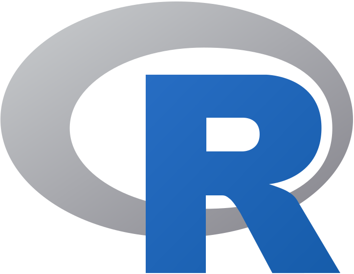

<!-- cSpell:ignore devlang jepeach Jupyter DSVM RevoScaleR sparklyr AZTK -->

# R developer's guide to Azure

Many data scientists dealing with ever-increasing volumes of data are looking for ways to harness the power of cloud computing for their analyses.  This article provides an overview of the various ways that data scientists can use their existing skills with the [R programming language](https://www.r-project.org) in Azure.

Microsoft has fully embraced the R programming language as a first-class tool for data scientists.  By providing many different options for R developers to run their code in Azure, the company is enabling data scientists to extend their data science workloads into the cloud when tackling large-scale projects.

Let's examine the various options and the most compelling scenarios for each one.

## Azure services with R language support

This article covers the following Azure services that support the R language:

|Service                                                          |Description                                                                       |
|-----------------------------------------------------------------|----------------------------------------------------------------------------------|
|[Data Science Virtual Machine](#data-science-virtual-machine)    |a customized VM to use as a data science workstation or as a custom compute target|
|[ML Services on HDInsight](#ml-services-on-hdinsight)            |cluster-based system for running R analyses on large datasets across many nodes   |
|[Azure Databricks](#azure-databricks)                            |collaborative Spark environment that supports R and other languages               |
|[Azure Machine Learning](#azure-machine-learning)                | cloud service that you use to train, deploy, automate, and manage machine learning models
|[Azure Batch](#azure-batch)                                      |offers a variety options for economically running R code across many nodes in a cluster|
|[Azure SQL Managed Instance](#azure-sql-managed-instance)        |run R and Python scripts inside of the SQL Server database engine                  |

## Data Science Virtual Machine

The [Data Science Virtual Machine](/azure/machine-learning/data-science-virtual-machine/overview) (DSVM) is a customized VM image on Microsoft&apos;s Azure cloud platform built specifically for doing data science. It has many popular data science tools, including:

- [Microsoft R Open](https://mran.microsoft.com/open/)
- [RStudio Desktop](https://www.rstudio.com/products/rstudio/#Desktop)
- [RStudio Server](https://www.rstudio.com/products/rstudio/#Server)

The DSVM can be provisioned with either Windows or Linux as the operating system.  You can use the DSVM in two different ways: as an interactive workstation or as a compute platform for a custom cluster.

### As a workstation

If you want to get started with R in the cloud quickly and easily, this is your best bet.  The environment will be familiar to anyone who has worked with R on a local workstation.  However, instead of using local resources, the R environment runs on a VM in the cloud.  If your data is already stored in Azure, this has the added benefit of allowing your R scripts to run "closer to the data." Instead of transferring the data across the Internet, the data can be accessed over Azure's internal network, which provides much faster access times.

The DSVM can be particularly useful to small teams of R developers.  Instead of investing in powerful workstations for each developer and requiring team members to synchronize on which versions of the various software packages they will use, each developer can spin up an instance of the DSVM whenever needed.

### As a compute platform

In addition to being used as a workstation, the DSVM is also used as an elastically scalable compute platform for R projects. Using the [`AzureDSVM`](https://github.com/Azure/AzureDSVM) R package, you can programmatically control the creation and deletion of DSVM instances.  You can form the instances into a cluster and deploy a distributed analysis to be performed in the cloud.  This entire process can be controlled by R code running on your local workstation.

To learn more about the DSVM, see [Introduction to Azure Data Science Virtual Machine for Linux and Windows](/azure/machine-learning/data-science-virtual-machine/overview).

## ML Services on HDInsight

[Microsoft ML Services](https://azure.microsoft.com/services/hdinsight/r-server/#overview) provide data scientists, statisticians, and R programmers with on-demand access to scalable, distributed methods of analytics on HDInsight.  This solution provides the latest capabilities for R-based analytics on datasets of virtually any size, loaded to either Azure Blob or Data Lake storage.

This is an enterprise-grade solution that allows you to scale your R code across a cluster.  By using functions in Microsoft's [`RevoScaleR`](/machine-learning-server/r-reference/revoscaler/revoscaler) package, your R scripts on HDInsight can run data processing functions in parallel across many nodes in a cluster.  This allows R to crunch data on a much larger scale than is possible with single-threaded R running on a workstation.

This ability to scale makes ML Services on HDInsight a great option for R developers with massive data sets.  It provides a flexible and scalable platform for running your R scripts in the cloud.
For a walkthrough on creating an ML Services cluster, see [Get started with ML Services on Azure HDInsight](https://azure.microsoft.com/services/hdinsight/r-server/#getting-started).

## Azure Databricks

[Azure Databricks](https://azure.microsoft.com/services/databricks/) is an Apache Spark-based analytics platform optimized for the Microsoft Azure cloud services platform.  Designed with the founders of Apache Spark, Databricks is integrated with Azure to provide one-click setup, streamlined workflows, and an interactive workspace that enables collaboration between data scientists, data engineers, and business analysts.

The collaboration in Databricks is enabled by the platform's notebook system.  Users can create, share, and edit notebooks with other users of the systems.  These notebooks allow users to write code that executes against Spark clusters managed in the Databricks environment.  These notebooks fully support R and give users access to Spark through both the `SparkR` and `sparklyr` packages.

Since Databricks is built on Spark and has a strong focus on collaboration, the platform is often used by teams of data scientists that work together on complex analyses of large data sets.  Because the notebooks in Databricks support other languages in addition to R, it is especially useful for teams where analysts use different languages for their primary work.

The article [What is Azure Databricks?](/azure/azure-databricks/what-is-azure-databricks) can provide more details about the platform and help you get started.

## Azure Machine Learning

[Azure Machine Learning](/azure/machine-learning/) can be used for any kind of machine learning, from classical machine learning to deep learning, supervised and unsupervised learning. Whether you prefer to write Python or R code or zero-code/low-code options such as the designer, you can build, train and track highly accurate machine learning and deep-learning models in an Azure Machine Learning Workspace.

Start training on your local machine and then scale out to the cloud. [Train your first model in R](/azure/machine-learning/service/tutorial-1st-r-experiment) with Azure Machine Learning today.

## Azure Batch

For large-scale R jobs, you can use [Azure Batch](https://azure.microsoft.com/services/batch/).  This service provides cloud-scale job scheduling and compute management so you can scale your R workload across tens, hundreds, or thousands of virtual machines.  Since it is a generalized computing platform, there a few options for running R jobs on Azure Batch.

One option for running an R script in Azure Batch is to bundle your code with "RScript.exe" as a Batch App in the Azure portal. For a detailed walkthrough, see [R Workloads on Azure Batch](https://azure.microsoft.com/blog/r-workloads-on-azure-batch/).

Another option is to use the [Azure Distributed Data Engineering Toolkit](https://github.com/Azure/aztk) (AZTK), which allows you to provision on-demand Spark clusters using Docker containers in Azure Batch.  This provides an economical way to run Spark jobs in Azure.  By using [SparklyR with AZTK](https://github.com/Azure/aztk/wiki/SparklyR-on-Azure-with-AZTK), your R scripts can be scaled out in the cloud easily and economically.

## Azure SQL Managed Instance

[Azure SQL Managed Instance](https://azure.microsoft.com/services/azure-sql/sql-managed-instance/) is Microsoft's intelligent, scalable, cloud database service.  It allows you to use the full power of SQL Server without any hassle of setting up the infrastructure.  This includes [Machine Learning Services](/azure/azure-sql/managed-instance/machine-learning-services-overview) which contains Microsoft R and Python packages for high-performance predictive analytics and machine learning.

Machine Learning Services offers an embedded, predictive analytics and data science engine that can execute R/Python code within a SQL Server database. Instead of extracting data from the database and loading it into the R/Python environment, you load your R/Python code directly into the database and let it run right alongside the data. The relational data can be used in stored procedures, as T-SQL scripts containing R/Python statements, or as R/Python code containing T-SQL.

While Machine Learning Services has been part of on-premises SQL Server since 2016, it is relatively new to Azure SQL Managed Instance.

## Contributors

*This article is maintained by Microsoft. It was originally written by the following contributors.* 

Principal author:

 - [Jeremy Peach](https://www.linkedin.com/in/jeremypeach/) | Senior Cloud Solution Architect
 
*To see non-public LinkedIn profiles, sign in to LinkedIn.*

## Next steps

- [Running your R code on Azure with mrsdeploy](https://blog.revolutionanalytics.com/2017/03/running-your-r-code-azure.html)
- [R on Azure](https://github.com/yueguoguo/r-on-azure): an overview of packages, tools, and case studies for using R with Azure

## Related resources

- [Data science and machine learning with Azure Databricks](../../solution-ideas/articles/azure-databricks-data-science-machine-learning.yml)
- [Batch scoring with R models to forecast sales](../../reference-architectures/ai/batch-scoring-R-models.yml)
- [What is the Team Data Science Process?](../../data-science-process/overview.yml)

---

The R logo is &copy; 2016 The R Foundation and is used under the terms of the [Creative Commons Attribution-ShareAlike 4.0 International license](https://creativecommons.org/licenses/by-sa/4.0/).
