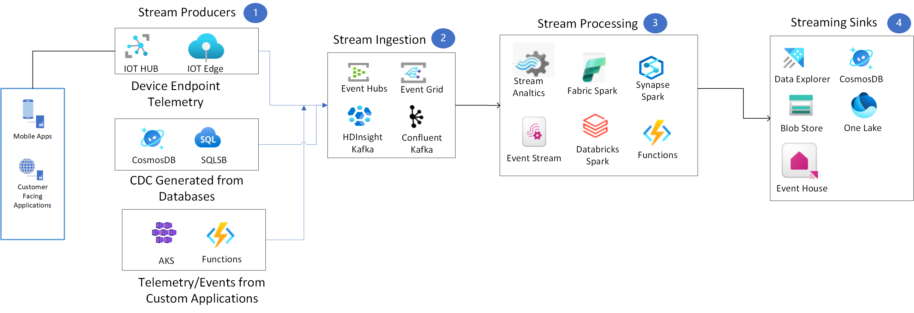

<!-- cSpell:ignore HDFS -->
# Choose a stream processing technology in Azure

This article compares technology choices for real-time stream processing in Azure.

## What is streaming data

Organizations often have a variety of data sources simultaneously emitting messages, records, or data ranging from a few bytes to several megabytes (MB). Streaming data is emitted at high volume in a continuous, incremental manner that can be processed in near real-time. This type of data includes changes coming from applications, locations, events, and sensor information that companies use for real-time analytics and visibility into various aspects of their business.

## Streaming Data Characteristics

- *Imperfect Data Integrity* - Temporary errors at the source may result in missing data elements. Guaranteeing data consistency is challenging due to the continuous nature of the stream, so stream processing and analytics systems typically include logic for data validation to mitigate these errors.

- *Continuous data flow* - A data stream has no beginning or end, collecting data constantly is required. For example, server activity logs accumulate as long as the server runs.

- *Nonhomogeneous Data Formats* - Data may be streamed in multiple formats, such as JSON, Avro, and CSV, with various data types including strings, numbers, dates, and binary types. Stream processing systems must handle these data variations.

- *Data Order* - Individual elements in a data stream contain timestamps, and the data stream itself may be time-sensitive with diminished significance after a specific interval. In certain cases, there would be a need to preserve the order in which data gets processed.

## What are your options when choosing a technology for real-time processing?

Inorder to choose the right technology lets start exploring te different options we have across the stack from ingestion to consumption. Below, we have provided options segmented by using a highlevel stream processing flow.

## Highlevel Stream processing flow

 ### Stream Producers

  Streaming producers are responsible for generating and pushing data into Azure's ingestion services. They continuously produce data from external sources like IoT devices, application logs, or databases.

- Key Considerations:

  - Capturing Real-time Data: Producers continuously collect data from sources such as IoT devices, user interactions, and application logs, streaming it into Azure services like Event Hubs or IoT Hub.
  - Optimize throughput with batching and compression - Producers can enhance efficiency by batching messages and applying compression to minimize data size during transmission.
  - Ensure reliable transmission with error handling and retries - Producers can manage network disruptions or broker failures through automatic retries to ensure dependable data delivery.
  - Guarantee data integrity with idempotence - Producers can be configured to support exactly-once delivery, preventing duplicate messages and ensuring consistent data flow.

#### Services

- *[Azure IoT Hub](/azure/azure/iot-hub/iot-concepts-and-iot-hub)* is focused on IoT data ingestion, IoT Hub provides features like bi-directional communication, device authentication, and offline message buffering, making it ideal for managing IoT devices and their data streams

- *[CDC Producers](/sql/relational-databases/track-changes/about-change-data-capture-sql-server?view=sql-server-ver16)* - Azure databases such as 
  [SQLDB](/azure/azure-sql/database/change-data-capture-overview?view=azuresql
) and 
  [CosmosDB](/azure/cosmos-db/change-feed) support Change data capture. This data has to be read using connectors such as debezium  or change feed for CosmosDB hosted on functions or App service environments. If you are using Fabric event Streams (discussed in the next section) there is no need to have a separate applications such as Debezium to connect producers with downstream consumers

- *[Custom Applications](/azure/well-architected/service-guides/app-service-web-apps)* - Debezium can be hosted as stand alone applications on managed services such as (AKS, Azure App service environments).

#### General capabilities

| Capability | Azure IOT Hub  | CDC Producers |Custom Applications|
| --- | --- | --- | --- | 
| Device Telemetry | Yes | No | No | 
| Managed Service | Yes | No* | No* | 
| Scalability | Yes | Yes** | Yes** | 

### Stream Ingestion
  
  Data that is continuously generated from producers like web and mobile applications, IoT devices, and sensors must be ingested efficiently into the stream processing pipeline for real-time and batch analysis.

- Key Considerations:
  
    - Data Velocity: High-frequency data arrival from multiple sources, format compatibility and size
    - Scalability: Ability to scale ingestion buffer as data volume, variety and velocity grows.
    - Data Integrity & Reliability: Ensuring data is not lost or duplicated during transmission.

#### Services

- *[Event Hubs](/azure/well-architected/service-guides/event-hubs)* - 
Azure Event Hubs is a real-time data ingestion service designed to handle millions of events per second, making it ideal for high-throughput scenarios. 
It can scale dynamically and process massive volumes of data with low latency.
Event Hubs supports features like partitioning for parallel processing, data retention policies, 
and integration with Azure services like Stream Analytics, Fabric, Databricks and Azure Functions.
Event Hubs is compatible with Apache Kafka and allows you to run existing Kafka workloads without any code changes.

- *[Event Grid](/azure/well-architected/service-guides/event-grid/operational-excellence)* - 
Azure Event Grid is a fully managed event routing service that enables real-time event-driven architectures by ingesting, distributing, and reacting to events from various sources. It plays a critical role in stream ingestion by efficiently handling event notifications and integrating with Azure services, custom applications, and third-party systems.

- *[Kafka on HdInsight](/azure/hdinsight/kafka/apache-kafka-introduction)* - 
Azure HDInsight Kafka is a managed Apache Kafka service optimized for real-time data ingestion and p
rocessing at scale. It enables the capture and storage of streaming data from various sources, such as IoT devices, application logs, and social media feeds. 
Use this option if you would like to have more control on Kakfa configuration on a managed infrastructure

- *[Confluent Kafka](/azure/partner-solutions/apache-kafka-confluent-cloud/overview)* - 
Confluent Kafka on partner solution Azure and is a fully managed Apache Kafka service 
designed for real-time data ingestion. It's integration
with Azure simplifies deployment and scaling, and includes features like schema registry, 
ksqlDB for stream queries, and enterprise-grade security. Use this option if you
leverage Confluent's extended ecosystem of connectors and stream processing tools. 

#### General capabilities

| Capability | Azure Event Hubs  | Kafka on HdInsight | Confluent Kafka|
| --- | --- | --- | --- | 
| Message retention | Yes | Yes | Yes | 
| Message size limit| 1MB | Configurable | Configurable |
| Managed Service | Yes | Managed Iaas | Yes | 
| Auto Scale | Yes | Yes | Yes | 
| Partner Offering | No | No | Yes |
| Pricing model | [Based on Tier](https://azure.microsoft.com/pricing/details/event-hubs/) | [Per Cluster Hour]() | [Consumption models](https://azuremarketplace.microsoft.com/marketplace/apps/confluentinc.confluent-cloud-azure-prod?tab=PlansAndPrice) |

### Stream Processing

  This step involves real-time transformation, filtering, aggregating, enriching, or analytics on the ingested data.

- Key Considerations:

  - Stateful vs Stateless Processing: Deciding between processing that depends on previously seen data (stateful) versus independent events (stateless).
  - Event time Handling: When there is a need to handle streams from different sources that will have to be processed together as in the case of late arriving records.
  - Windowing: Managing time-based aggregations and analytics using sliding or tumbling windows.
  - Fault Tolerance: Ensuring the system can recover from failures without losing data or processing steps.

#### Services

- *[Azure Stream Analytics](/azure/stream-analytics/stream-analytics-introduction)* - It is a managed service for real-time analytics using a SQL-based query language. It is designed for simple processing tasks like filtering, aggregating, and joining data streams. Integrates seamlessly with Event Hubs, IoT Hub, and Azure Blob Storage for input and output. Use Stream Analytics for low-complexity, real-time tasks where a simple, managed solution with SQL-based queries would suffice.

- *[Spark structured streaming](https://spark.apache.org/streaming/)* - Azure Services such as [Fabric](/azure/well-architected/service-guides/iot-hub/reliability) ,  [Databricks](/azure/well-architected/service-guides/azure-databricks-security) and [Synapse](/azure/well-architected/service-guides/iot-hub/reliability) support processing data using spark structured streaming. Use these options for a unified analytics platform built on Apache Spark, capable of handling complex data transformations, machine learning pipelines, and big data workloads. Spark streaming apis support deep integration with Delta Lake for data versioning and consistency.

- *[Fabric Event Streams](/fabric/real-time-intelligence/event-streams/overview?tabs=enhancedcapabilities/)* -Microsoft Fabric Event Streams is a real-time data streaming capability within Microsoft Fabric, a unified analytics platform. Event Streams is designed to enable seamless ingestion, processing, and integration of streaming data for real-time analytics and applications.Event Streams is designed to be accessible to users with minimal technical expertise, offering drag-and-drop interfaces for setting up data pipelines.

- *[Azure Functions](/azure/well-architected/service-guides/azure-functions)* - Azure functions is a  serverless compute service for event-driven processing, useful for lightweight tasks like transforming data or triggering workflows based on real-time events. Azure Functions are stateless by design. Durable Functions extends its capabilities to support stateful workflows for complex event coordination.

#### General capabilities

| Capability |Stream Analytics | * Spark Structured Streaming (Fabric, Databricks, Synapse) | Fabric Event Streams| Azure Functions|
| --- | --- | --- | --- | --- | 
| Micro batch processing| Yes | Yes | Yes| No | 
| Event based processing| No | No | Yes| Yes | 
| Stateful Processing | Yes | Yes | Yes| No | 
| Support for Check Pointing | Yes | Yes | Yes| No |
| Low code Interface | Yes| No | Yes | No | 
| Pricing model | [Streaming Units](/azure/stream-analytics/stream-analytics-streaming-unit-consumption) | Yes** | [Fabric SKU](https://azure.microsoft.com/pricing/details/microsoft-fabric/)| Yes** |

### Streaming Sinks

  After data has been processed, it needs to be directed to appropriate destinations (sinks) where it can be stored, analyzed further, or used in real-time applications. These destinations can include databases, data lakes, analytics tools, or dashboards for visualization.

- Key Considerations:

  - Data Consumption and Usage: For real-time analytics or reporting dashboards, Power BI is highly integrated and allows live visualizations of data streams.
  - Low-Latency Requirements: Many systems will need to efficiently provide analytics over real-time data streams such as device telemetry, application logs. There may be other applications that need ultra-low latency reads and writes, suitable for operational analytics or real-time applications.
  - Scalability & Volume: Requirements for ingesting large volume of data, providing compatibility for various formats and need to scale cost-effectively.

#### Services

- *[Azure Datalake Storage](/azure/well-architected/service-guides/azure-blob-storage)* 
is a scalable, distributed and a cost-effective storage for unstructured and semi-structured data.
It supports  petabyte-scale storage and high-throughput workloads for storing large volumes of
streaming data. It also is ideal for analytics over streaming data, ensuring fast read/write operations for data pipelines.

- *[Fabric Eventhouse](/fabric/real-time-intelligence/eventhouse)* is a KQL database that is ideal for 
real-time analytics and exploration on vent-based data, for example, telemetry and log data, time series and IoT data.
It supports ingestion of millions of events per second with low latency, 
enabling near-instantaneous access to streaming data. It is deeply integrated with the Microsoft Fabric ecosystem and enables immediate querying 
and analysis of streaming data using tools like Power BI.

- *[CosmosDB](/azure/well-architected/service-guides/cosmos-db)* is a NoSQL database designed for low-latency, globally distributed, and highly scalable data storage.
It is compatible with multiple APIs—such as SQL, MongoDB, Cassandra, Table, and Gremlin
providing flexibility for diverse applications.  It delivers high throughput and is capable of 
handling large volumes of streaming data with consistent performance.

- *[Azure SQLDB](/azure/well-architected/service-guides/azure-sql-database-well-architected-framework)* - 
is a fully managed, cloud-based relational database service provided by Microsoft Azure. 
It is built on the SQL Server engine, offering the capabilities of a traditional 
SQL Server database 
with the benefits of cloud-based scalability, reliability, and reduced management overhead. 

#### General capabilities

| Capability |Azure Datalake Storage | Fabric Event Store | CosmosDB|SQLDB|
| --- | --- | --- | --- | --| 
| General purpose object store | Yes | No | No | No|
| Streaming data aggregations | No | Yes | No | No|
| Low latency reads and writes for Json documents | No | Yes | Yes | No|
| Structured data aggregations for PowerBI | No | Yes | No | Yes|
| Pricing model | Per GB/TB | [Fabric SKU](https://azure.microsoft.com/pricing/details/microsoft-fabric/) | [Request Units](https://learn.microsoft.com/azure/cosmos-db/request-units) |[DTU/Vcpus](https://azure.microsoft.com/pricing/details/azure-sql-database/single/)|

## Contributors

*This article is maintained by Microsoft. It was originally written by the following contributors.*

Principal author:

- [Pratima Valavala](https://www.linkedin.com/in/pratimavalavala) | Principal Solution Architect

## Next steps

- [Fabric Eventhouse](/fabric/real-time-intelligence/eventhouse)
- [Fabric](/azure/well-architected/service-guides/iot-hub/reliability)
- [Explore Azure Functions](/training/modules/explore-azure-functions)
- [Get started with Azure Stream Analytics](/training/modules/introduction-to-data-streaming)
- [Perform advanced streaming data transformations](/training/modules/perform-advanced-streaming-data-transformations-with-spark-kafka)
- [Azure Datalake Storage](/azure/well-architected/service-guides/azure-blob-storage)
- [Use Apache Spark in Azure Databricks](/training/modules/use-apache-spark-azure-databricks)

## Related resources

- [Real time processing](../big-data/real-time-processing.yml)
- [Stream processing with Azure Stream Analytics](../../reference-architectures/data/stream-processing-stream-analytics.yml)
