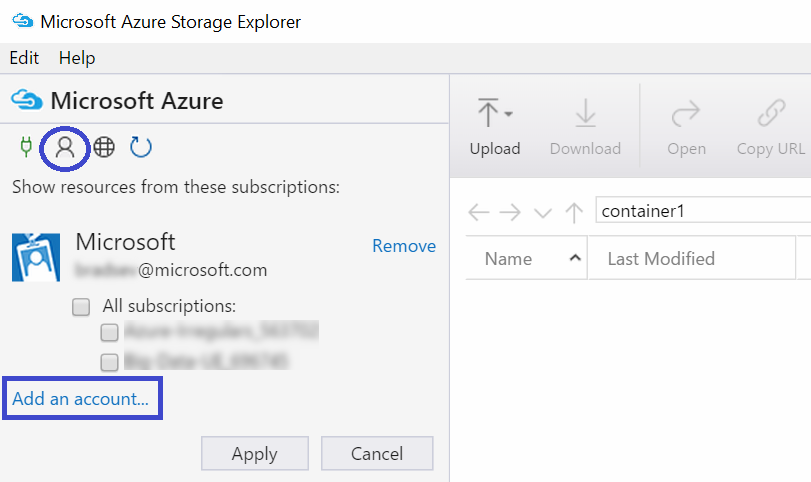

# Move data to and from Azure Blob Storage using Azure Storage Explorer
Azure Storage Explorer is a free tool from Microsoft that allows you to work with Azure Storage data on Windows, macOS, and Linux. This topic describes how to use it to upload and download data from Azure Blob Storage. The tool can be downloaded from [Microsoft Azure Storage Explorer](https://azure.microsoft.com/features/storage-explorer/).

[!INCLUDE [blob-storage-tool-selector](../../includes/machine-learning-blob-storage-tool-selector.md)]

> [!NOTE]
> If you are using VM that was set up with the scripts provided by [Data Science Virtual machines in Azure](/azure/machine-learning/data-science-virtual-machine/overview), then Azure Storage Explorer is already installed on the VM.
>
> [!NOTE]
> For a complete introduction to Azure Blob Storage, refer to [Azure Blob Basics](/azure/storage/blobs/storage-quickstart-blobs-dotnet) and [Azure Blob Service REST API](/rest/api/storageservices/blob-service-rest-api).
>
>

## Prerequisites
This document assumes that you have an Azure subscription, a storage account, and the corresponding storage key for that account. Before uploading/downloading data, you must know your Azure Storage account name and account key.

* To set up an Azure subscription, see [Free one-month trial](https://azure.microsoft.com/free/).
* For instructions on creating a storage account and for getting account and key information, see [About Azure Storage accounts](/azure/storage/common/storage-account-create). Make a note the access key for your storage account as you need this key to connect to the account with the Azure Storage Explorer tool.
* The Azure Storage Explorer tool can be downloaded from [Microsoft Azure Storage Explorer](https://azure.microsoft.com/features/storage-explorer/). Accept the defaults during install.

## Use Azure Storage Explorer
The following steps document how to upload/download data using Azure Storage Explorer.

1. Launch Microsoft Azure Storage Explorer.
2. To bring up the **Sign in to your account...** wizard, select **Azure account settings** icon, then **Add an account** and enter your credentials. 

3. To bring up the **Connect to Azure Storage** wizard, select the **Connect to Azure Storage** icon. 
4. Enter the access key from your Azure Storage account on the **Connect to Azure Storage** wizard and then **Next**. 
5. Enter storage account name in the **Account name** box and then select **Next**. 
6. The storage account added should now be displayed. To create a blob container in a storage account, right-click the **Blob Containers** node in that account, select **Create Blob Container**, and enter a name.
7. To upload data to a container, select the target container and click the **Upload** button.

8. Click on the **...** to the right of the **Files** box, select one or multiple files to upload from the file system and click **Upload** to begin uploading the files.
9. To download data, selecting the blob in the corresponding container to download and click **Download**. 

## Contributors

*This article is maintained by Microsoft. It was originally written by the following contributors.* 

Principal author:

- [Mark Tabladillo](https://www.linkedin.com/in/marktab/) | Senior Cloud Solution Architect

*To see non-public LinkedIn profiles, sign in to LinkedIn.*

## Next steps

- [Introduction to Azure Blob Storage](/azure/storage/blobs/storage-blobs-introduction)
- [Upload, download, and manage data with Azure Storage Explorer](/training/modules/upload-download-and-manage-data-with-azure-storage-explorer/)
- [What is the Team Data Science Process (TDSP)?](overview.yml)

## Related resources

- [Explore data in Azure Blob storage](explore-data-blob.md)
- [Process Azure Blob Storage data with advanced analytics](data-blob.md)
- [Set up data science environments for use in the Team Data Science Process](environment-setup.md)
- [Load data into storage environments for analytics](ingest-data.md)
