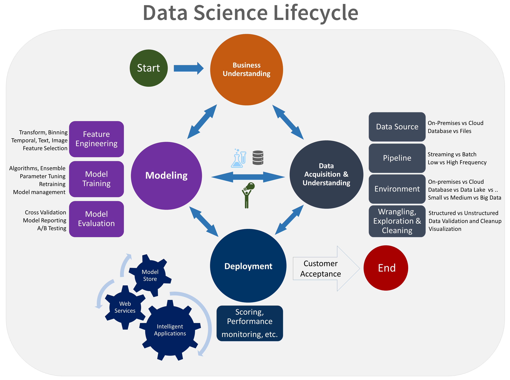

The Team Data Science Process (TDSP) is an agile, iterative data science methodology to deliver predictive analytics solutions and AI applications efficiently. TDSP helps improve team collaboration and learning by suggesting how team roles work best together. TDSP includes best practices and structures from Microsoft and other industry leaders to help toward successful implementation of data science initiatives. The goal is to help companies fully realize the benefits of their analytics program.

This article provides an overview of TDSP and its main components. We provide a generic description of the process here that can be implemented with different kinds of tools. A more detailed description of the project tasks and roles involved in the lifecycle of the process is provided in other linked articles. Guidance on how to implement the TDSP using a specific set of Microsoft tools and infrastructure that we use to implement the TDSP in our teams is also provided.

## Key components of the TDSP

TDSP has the following key components:

- A **data science lifecycle** definition
- A **standardized project structure**
- **Infrastructure and resources** recommended for data science projects
- **Tools and utilities** recommended for project execution

### Data science lifecycle

The Team Data Science Process (TDSP) provides a lifecycle to structure the development of your data science projects. The lifecycle outlines the full steps that successful projects follow.

If your team is using another data science lifecycle, such as [CRISP-DM](https://wikipedia.org/wiki/Cross_Industry_Standard_Process_for_Data_Mining), [KDD](https://wikipedia.org/wiki/Data_mining#Process), or another custom process, your team can still use the task-based TDSP in the context of those development lifecycles. At a high level, these different methodologies have much in common.

This lifecycle addresses data science projects that ship as part of intelligent applications. These applications deploy machine learning or artificial intelligence models for predictive analytics. Exploratory data science projects or improvised analytics projects can also benefit from using this process. The lifecycle outlines the major stages that projects typically execute, often iteratively:

* **Business Understanding**
* **Data Acquisition and Understanding**
* **Modeling**
* **Deployment**

Here's a visual representation of the **Team Data Science Process lifecycle**.

The goals, tasks, and documentation artifacts for each stage of the lifecycle in TDSP are described in the [Team Data Science Process lifecycle](lifecycle.md) article. These tasks and artifacts are associated with project roles:

- Solution architect
- Project manager
- Data engineer
- Data scientist
- Application developer
- Project lead

The following diagram provides a grid view of the tasks (in blue) and artifacts (in green) associated with each stage of the lifecycle (on the horizontal axis) for these roles (on the vertical axis).

### Standardized project structure

Teams can use the Azure infrastructure to organize their data science assets.

Azure Machine Learning now supports the open-source [MLflow](/azure/machine-learning/concept-mlflow?view=azureml-api-2). MLflow is the recommended framework to use for data science and AI project management. MLflow is designed to manage the complete machine learning lifecycle. Its ability to train and serve models on different platforms allows you to use a consistent set of tools regardless of where your experiments are running: whether locally on your computer, on a remote compute target, on a virtual machine, or on an Azure Machine Learning compute instance.

MLflow consists of several key functionalities:
It encompasses several key functionalities:

- Tracking Experiments: MLflow allows you to keep track of experiments, including parameters, code versions, metrics, and output files. This feature helps in comparing different runs and managing the experimentation process efficiently.
- Project Packaging: It offers a standardized format for packaging ML code, which includes dependencies and configurations. This packaging makes it easier to reproduce runs and share code with others.
- Model Management: MLflow provides functionalities for managing and versioning models. It supports various ML frameworks and enables you to store, version, and serve models.
- Model Serving and Deployment: MLflow integrates model serving and deployment capabilities, allowing you to easily deploy models in diverse environments.
- Model Registry: This feature helps in managing the lifecycle of a model, including versioning, stage transitions, and annotations. It's useful for maintaining a centralized model store in a collaborative environment.
- API and UI: Inside Azure, MLflow is bundled within the Microsoft Azure Machine Learning API v.2, making it accessible for users to interact with the system programmatically.  Users can use the Azure portal to interact with a UI.

Overall, MLflow aims to simplify and standardize the process of ML development, from experimentation to deployment, making it a valuable tool for ML practitioners and teams.

Azure Machine Learning [integrates with Git repositories](/azure/machine-learning/concept-train-model-git-integration?view=azureml-api-2&tabs=python) allowing for using any number of git-compatible services:  GitHub, GitLab, Bitbucket, Azure DevOps, or any other git-compatible service.  In addition to the assets already tracked in Azure Machine Learning, teams can develop their own taxonomy within their git-compatible service to store other project information:

- Documentation
    - Project (for example, Project, Final Project Report)
    - Data Report (for example, Data Dictionary, Data Quality Reports)
    - Model (for example, Model Reports)
- Code
    - Data Preparation
    - Model Development
    - Operationalization (including Security and Compliance)

### Infrastructure and resources

TDSP provides recommendations for managing shared analytics and storage infrastructure such as:

- cloud file systems for storing datasets
- databases
- big data (SQL or Spark) clusters
- machine learning service

The analytics and storage infrastructure, where raw and processed datasets are stored, can be in the cloud or on-premises. This infrastructure enables reproducible analysis. It also avoids duplication, which can lead to inconsistencies and unnecessary infrastructure costs. Tools are provided to provision the shared resources, track them, and allow each team member to connect to those resources securely. It's also a good practice to have project members create a consistent compute environment. Different team members can then replicate and validate experiments.

Here's an example of a team working on multiple projects and sharing various cloud analytics infrastructure components.

### Tools and utilities

Introducing processes in most organizations is challenging. Tools provided to implement the data science process and lifecycle help lower the barriers to and increase the consistency of their adoption.

With Azure Machine Learning, data scientists can apply open-source tooling as part of the data science pipeline or workflow.  In addition, within Azure Machine Learning, Microsoft promotes [Responsible AI tools](/azure/machine-learning/concept-responsible-ai?view=azureml-api-2), which helps achieve Microsoft's [Responsible AI Standard](https://blogs.microsoft.com/wp-content/uploads/prod/sites/5/2022/06/Microsoft-Responsible-AI-Standard-v2-General-Requirements-3.pdf).  

## Peer-Reviewed Citations

TDSP is a well-established methodology used across Microsoft engagements, and therefore has been documented and studied in peer-reviewed literature.  These citations provide an opportunity to investigate TDSP features and applications.  See the [lifecycle overview page](/azure/architecture/data-science-process/lifecycle) for a list of citations.

## Next steps

[Team Data Science Process: Roles and tasks](https://github.com/Azure/Microsoft-TDSP/blob/master/Docs/roles-tasks.md) Outlines the key personnel roles and their associated tasks for a data science team that standardizes on this process. 
