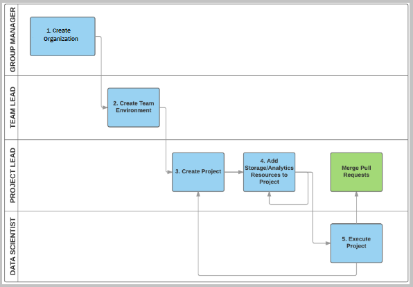
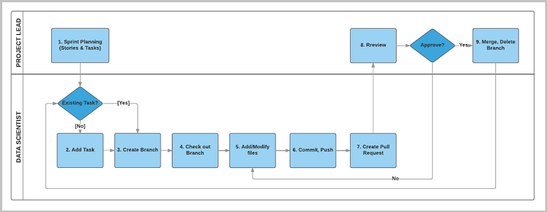

# Roles and tasks in the Team Data Science Process

The Team Data Science Process (TDSP) is a framework developed by Microsoft that provides a structured methodology to efficiently build predictive analytics solutions and intelligent applications. This article outlines the key personnel roles and associated tasks for a data science team standardizing on this process.

A Git-compatible environment is suggested to supplement the MLflow artifacts stored in Azure Machine Learning. Azure Machine Learning [integrates with Git repositories](/azure/machine-learning/concept-train-model-git-integration?tabs=python), so you can use many git-compatible services, such as  GitHub, GitLab, Bitbucket, Azure DevOps, or any other Git-compatible service.

## Structure of data science groups and teams

Data science functions in enterprises are often organized in the following hierarchy:

- Data science group
- Data science teams within the group

In such a structure, there are group leads and team leads. Typically, a data science team carries out a data science project. Data science teams have project leads for project management and governance tasks, and individual data scientists and engineers to perform the data science and data engineering parts of the project. The group, team, or project leads perform the initial project setup and governance.

## Definition and tasks for the four TDSP roles

With the assumption that the data science unit consists of teams within a group, there are four distinct roles for TDSP personnel:

- **Group manager**: Manages the entire data science unit in an enterprise. A data science unit might have multiple teams, each of which works on multiple data science projects in distinct business areas. A group manager might delegate their tasks to a surrogate, but the tasks associated with the role don't change.

- **Team lead**: Manages a team in the data science unit of an enterprise. A team consists of data scientists. For a small data science unit, the group manager and the team lead might be the same person.

- **Project lead**: Manages the daily activities of individual data scientists on a specific data science project.

- **Project individual contributors**: Data scientists, business analysts, data engineers, architects, and others who execute a data science project.

> [!NOTE]
> Depending on the structure and size of an enterprise, a single person might have more than one role, or more than one person might fill a role.

### Tasks for the four roles

The following diagram shows the top-level tasks for each TDSP role. This overview and the following detailed outline of tasks for each TDSP role can help you choose the tutorial you need based on your responsibilities.

## Group manager tasks

The group manager or a designated TDSP system administrator completes the following tasks to adopt the TDSP:

- Creates an Azure DevOps **organization** and a group project within the organization.

- Creates a **project template repository** in the Azure DevOps group project, and seeds it from the project template repository developed by the Microsoft TDSP team. The Microsoft TDSP project template repository provides:
  - A **standardized directory structure**, including directories for data, code, and documents.
  - A set of **standardized document templates** to guide an efficient data science process.
- Creates a **utility repository**, and seeds it from the utility repository developed by the Microsoft TDSP team. The TDSP utility repository from Microsoft provides a set of useful utilities to make the work of a data scientist more efficient. The Microsoft utility repository includes utilities for interactive data exploration, analysis, reporting, and baseline modeling and reporting.
- Sets up the **security control policy** for the organization account.

For more information, see [Group manager tasks for a data science team](group-manager-tasks.md).

## Team lead tasks

The team lead or a designated project administrator completes the following tasks to adopt the TDSP:

- Creates a team **project** in the group's Azure DevOps organization.

- Creates the **project template repository** in the project, and seeds it from the group project template repository set up by the group manager or delegate.
- Creates the **team utility repository**, seeds it from the group utility repository, and adds team-specific utilities to the repository.
- Optionally creates [Azure file storage](https://azure.microsoft.com/services/storage/files/) to store useful data assets for the team. Other team members can mount this shared cloud file store on their analytics desktops.
- Optionally mounts the Azure file storage on the team's **data science virtual machine** and adds team data assets to it.
- Sets up **security control** by adding team members and configuring their permissions.

For more information, see [Team lead tasks for a data science team](team-lead-tasks.md).

## Project lead tasks

The project lead completes the following tasks to adopt the TDSP:

- Creates a **project repository** in the team project, and seeds it from the project template repository.

- Optionally creates **Azure file storage** to store the project's data assets.
- Optionally mounts the Azure file storage to the **data science virtual machine** and adds project data assets to it.
- Sets up **security control** by adding project members and configuring their permissions.

For more information, see [Project lead tasks for a data science team](project-lead-tasks.md).

## Project individual contributor tasks

The project individual contributor, usually a data scientist, conducts the following tasks using the TDSP:

- Clones the **project repository** set up by the project lead.

- Optionally mounts the shared team and project **Azure file storage** on their **data science virtual machine**.
- Executes the project.

For more information, see [Project individual contributor tasks for a data science team](project-ic-tasks.md).

## Data science project execution workflow

Data scientists, project leads, and team leads can create work items to track all tasks and stages for project from beginning to end. The following figure outlines the TDSP workflow for project execution:

The workflow steps can be grouped into three activities:

- Project leads conduct sprint planning.

- Data scientists develop artifacts on `git` branches to address work items.
- Project leads or other team members do code reviews and merge working branches to the primary branch.

## Contributors

*This article is maintained by Microsoft. It was originally written by the following contributors.* 

Principal author:

 - [Mark Tabladillo](https://www.linkedin.com/in/marktab/) | Senior Cloud Solution Architect

*To see non-public LinkedIn profiles, sign in to LinkedIn.*

## Related resources 

- [Group manager tasks](group-manager-tasks.md)
- [Team lead tasks](team-lead-tasks.md)
- [Project lead tasks](project-lead-tasks.md)
- [Individual contributor tasks](project-ic-tasks.md)
