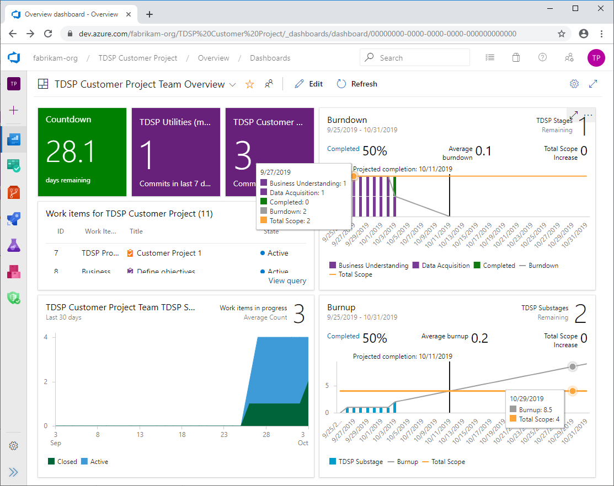

# Track the progress of data science projects

Data science group managers, team leads, and project leads can track the progress of their projects.  Managers want to know what work has been done, who did the work, and what work remains.   Managing expectations is an important element of success.

## Azure DevOps dashboards

If you're using Azure DevOps, you can build dashboards to track the activities and work items associated with a given Agile project. For more information about dashboards, see [Dashboards, reports, and widgets](/azure/devops/report/dashboards/overview).

For instructions on how to create and customize dashboards and widgets in Azure DevOps, see the following quickstarts:

- [Add and manage dashboards](/azure/devops/report/dashboards/dashboards)
- [Add widgets to a dashboard](/azure/devops/report/dashboards/add-widget-to-dashboard)

## Example dashboard

Here is a simple example dashboard that tracks the sprint activities of an Agile data science project, including the number of commits to associated repositories.

- The **countdown** tile shows the number of days that remain in the current sprint.

- The two **code tiles** show the number of commits in the two project repositories for the past seven days.

- **Work items for TDSP Customer Project** shows the results of a query for all work items and their status.

- A **cumulative flow diagram** (CFD) shows the number of Closed and Active work items.

- The **burndown chart** shows work still to complete against remaining time in the sprint.

- The **burnup chart** shows completed work compared to total amount of work in the sprint.

## Contributors

*This article is maintained by Microsoft. It was originally written by the following contributors.* 

Principal author:

 - [Mark Tabladillo](https://www.linkedin.com/in/marktab/) | Senior Cloud Solution Architect

*To see non-public LinkedIn profiles, sign in to LinkedIn.*

## Next steps

- [What is the Team Data Science Process?](/azure/architecture/data-science-process/overview)
- [Compare the machine learning products and technologies from Microsoft](/azure/architecture/data-guide/technology-choices/data-science-and-machine-learning)
- [Machine learning at scale](/azure/architecture/data-guide/big-data/machine-learning-at-scale)
