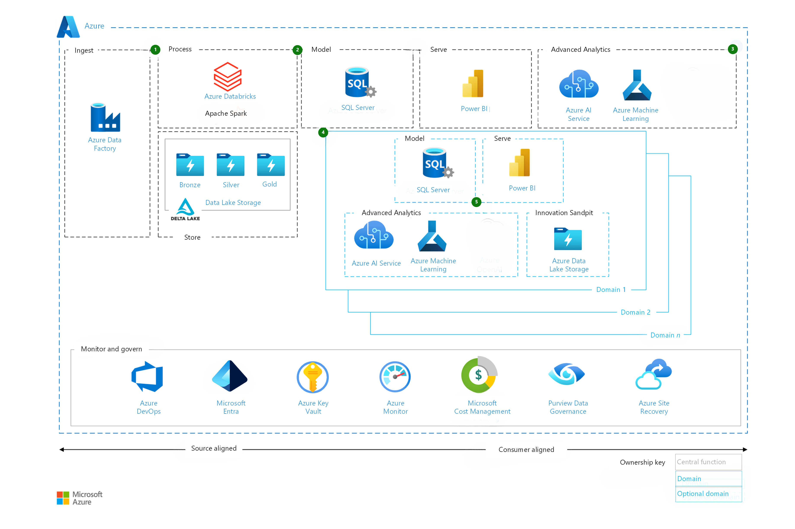

This reference architecture describes how to modify and harden a [medallion lakehouse](/azure/databricks/lakehouse/medallion) as the system is adopted across an enterprise.

Following a typical adoption pattern, as shown in the [baseline architecture](azure-data-factory-on-azure-landing-zones-baseline.yml), the architecture provided in this article is hardened to meet extra nonfunctional requirements (NFRs), provide extra capabilities, and shift user and operator responsibilities to a domain-based federated model.  

This architecture reflects [Microsoft's Cloud Adoption Framework for Azure](/azure/cloud-adoption-framework/) for best practice and guidance, specifically for the implementation of [data domains](/azure/cloud-adoption-framework/scenarios/cloud-scale-analytics/architectures/data-domains) and the adoption of [data products](/azure/cloud-adoption-framework/scenarios/cloud-scale-analytics/architectures/data-landing-zone-data-products).

> [!NOTE]
> The guidance provided in this article is limited to key differences from the [baseline architecture](azure-data-factory-on-azure-landing-zones-baseline.yml).

## Context and key design decisions

As described in the [baseline architecture](azure-data-factory-on-azure-landing-zones-baseline.yml), Contoso operates a medallion lakehouse that supports their first data workloads for the financial department. Contoso has hardened this system and extends it to support the enterprise analytical data needs, which provides a data science capability and self-service functionality.

### Key requirements

- The solution *must* be hardened to operate as an enterprise data and analytics platform and extended to support other corporate functions, while adhering to Contoso's data access policy requirements.  

- The platform MUST be able to ingest, store, process, and serve data in near-real time. The performance target is defined as a sub-one minute processing time from ingestion to being available in the reporting layer.

- The platform MUST deliver economy of scale savings and efficiency, while driving reuse.

- The platform MUST provide the ability for business areas to determine the level of self-service and control they need over their data solutions and products.

- The platform MUST support an enterprise data science capability, including the enablement of data citizens.

- The platform MUST support higher target service-level agreements (SLAs):

  - 99.9% target uptime (or ~8.5 hours downtime per year).
  
  - Recovery Point Objective (RPO) of 1.5 days.
  
  - Recovery Time Objective (RTO) of less than one day.
  
- The platform MUST support the forecast usage of 1,000 users across the various domains with an estimated growth of 5% annually.

    - While only Contoso employees can directly access the platform, there SHOULD be the capability to share data with third parties.

### The key design decisions (KDDs)

- The [baseline architecture](azure-data-factory-on-azure-landing-zones-baseline.yml) can be modified to meet these requirements without rearchitecting.

- Given the requirements for extending the platform across the enterprise and self-service functionality, and the business strategic objective, a [domain design](/azure/cloud-adoption-framework/scenarios/cloud-scale-analytics/architectures/data-domains#domain-modeling-recommendations) supported by an enterprise managed foundation is a good fit for the scenario. The foundation is defined as:

  - Identity and access controls.
  
  - The underlying networking, boundary controls, and security baseline.
  
  - The governance, audit, and monitoring functionality.
  
  - The ingestion and initial processing of data into the platform.
  
- The domain design is anchored around a given business departments' ownership of their data and the originating source system.

- A new [operating model](/azure/cloud-adoption-framework/scenarios/cloud-scale-analytics/organize-roles-teams) allows business groups to optionally build their own stack of model-and-serve components, which they control and maintain going forward.

  - Domains operate within guardrails, based upon enterprise requirements and are enabled to perform well-defined and controlled experiments.
- The data science capability is delivered via:

  - [Power BI](/power-bi/connect-data/service-tutorial-build-machine-learning-model) for low code, simple or medium complexity use cases across tabular data. This model is an ideal starting point for data citizens.
  
  - [Azure Machine Learning](/azure/machine-learning/?view=azureml-api-2) and AI service offerings, supporting the full set of use cases and [end-user maturity](/azure/machine-learning/tutorial-first-experiment-automated-ml?view=azureml-api-2).
  
  - [Azure Databricks](/azure/databricks/lakehouse-architecture/performance-efficiency/best-practices#use-parallel-computation-where-it-is-beneficial) for large enterprise volume use cases with significant processing demands.
  
  - An innovation sandbox supports any proof-of-concept work for new technologies or techniques in an isolated environment, segregated from production and preproduction.
  
- [Azure Data Factory](/azure/data-factory/introduction) capabilities to cover near-real time and micro-batch ingestion use cases is provided with [change data capture](/azure/data-factory/concepts-change-data-capture) functionality. This functionality combined with Azure Databricks [Structured streaming](/azure/databricks/structured-streaming/), and [Power BI](https://learn.microsoft.com/power-bi/connect-data/service-real-time-streaming) supports the end-to-end solution.

- The use of Power BI allows data sharing with external parties, as required, with [Microsoft Entra B2B](/power-bi/enterprise/service-admin-azure-ad-b2b) authorization and access controls.

## Architecture

### Design callouts

The design callouts for the hardened architecture are:

1. The Ingestion and Delta Lake are [source aligned](/azure/cloud-adoption-framework/scenarios/cloud-scale-analytics/architectures/data-domains#source-system-aligned-domains) and remain the responsibility of the central technical team. This decision reflects the level of technical expertise required for Spark development and supports a consistent, standardized implementation approach that accounts for enterprise reusability.

    - Data feeds from source systems are governed with [data contracts](/azure/cloud-adoption-framework/scenarios/cloud-scale-analytics/architectures/data-contracts#data-contracts-1), which can be used to drive a [metadata-driven](/azure/cloud-adoption-framework/scenarios/cloud-scale-analytics/architectures/data-contracts#:~:text=metadata%2Ddriven%20ingestion%20frameworks) ETL (extract, transform, load) framework and surfaced up to end users as part of the [governance capability](/purview/how-to-browse-catalog).

    - The delta lake's Bronze layer (Raw) directory structure reflects how [data is consumed](/azure/storage/blobs/data-lake-storage-best-practices?toc=%2Fazure%2Farchitecture%2Ftoc.json&bc=%2Fazure%2Farchitecture%2F_bread%2Ftoc.json#directory-structure). The data is ordered by source system. This organization methodology enables a unified security implementation based on business ownership of source systems.

    - To support the streaming requirement, a fast-path for data is designed. To that end, data is ingested through ADF and directly processed by the Azure Databricks structured stream for analysis and use. Delta lake [CDC](/azure/databricks/structured-streaming/delta-lake#stream-a-delta-lake-change-data-capture-cdc-feed) can be used to create the audit history, supporting replay and propagating incremental changes to downstream tables in the medallion architecture.

2. A model-and-serve path remains the responsibility of the central technical team in support of the enterprise owned data solutions. The technical team is also responsible for providing the service catalog optionality for business areas that require data solutions but don't have the skilling, budget, or interest in technically managing their own domain implementation.

    - Self-service is offered within the model-and-serve components managed by the central technical team.
  
3. The enterprise data science capability is managed by the central technical team. This model also aligns with their supporting the enterprise focused solutions, providing service optionality, and hosting services with an enterprise pricing structure.

4. Domains are enabled via logical containers at the subscription level. [Subscriptions](/azure/cloud-adoption-framework/ready/landing-zone/design-area/resource-org-subscriptions) provide the domain level unit of management, billing, governance, and isolation necessary.

    - The approach is managed through infrastructure-as-code [IaC](/azure/well-architected/operational-excellence/infrastructure-as-code-design), which provides a baseline of enterprise monitoring, audit and security controls. The platform [tagging strategy](/azure/cloud-adoption-framework/ready/azure-best-practices/naming-and-tagging) is extended to support the domain extension.

    - Each domain has its own set of role-based access controls (RBAC) roles covering the [control and data planes](/azure/azure-resource-manager/management/control-plane-and-data-plane). Control plane roles are primarily used within the domain logical containers. On the other hand, data plane roles are used across the platform, providing a consistent, unified, and low-complexity control.
  
5. Within a domain subscription, the components made available are configurable, depending on the skill set, priorities, and use cases.

    - Power BI [workspaces](/power-bi/collaborate-share/service-new-workspaces) allow domains to collaborate when practical. Workspaces can also be unique to domains and linked to specific [premium capacities](/power-bi/enterprise/service-premium-what-is#workspaces) if increased performance is required.

    - An innovation sandbox is a temporary entity, enabling the validation of new technologies or processes. Data storage is made available to onboard, create or change data, outside of constraints of the append-only functionality of the Data Lake - Bronze layer.

### Network Design

:::image type="complex" source="./_images/azure-data-factory-hardened-network.png" alt-text="Diagram of a hardened network design for an Azure Data Factory workload." border="false" lightbox="_images/azure-data-factory-baseline-network.png":::
    Diagram that shows an example of the workflow for a system that uses the valet key pattern. Boxes on the left show on-premises infrastructure and user connectivity. A box on the upper right shows ingress infrastructure in the Connectivity Hub subscription. Below that are the main components of the design all using Private Endpoints. To the right of the main infrastructure is a box with monitoring infrastructure in the shared services subscription.
:::image-end:::

*Download a [Visio file](https://arch-center.azureedge.net/azure-data-factory-hardened.vsdx) of this architecture.*

- A next generation firewall, like [Azure Firewall](/azure/firewall/overview), should be used to secure network connectivity between your on-premises infrastructure and your Azure virtual network.

- Self-hosted integration runtime (SHIR) can be deployed on a virtual machine (VM) in your on-premises environment or in Azure. To simplify governance and security, consider deploying the VM in Azure as part of the shared support resource landing zone. The SHIR can be used to securely connect to on-premises data sources and perform data integration tasks in ADF.

- ML-assisted data labeling doesn't support default storage accounts because they're secured behind a virtual network. First create a storage account for ML-assisted data labeling, apply the labeling and secure it behind the virtual network.

- [Private Endpoints](/azure/private-link/private-endpoint-overview) provide a private IP address from your virtual network to an Azure service, effectively bringing the service into your virtual network. This functionality makes the service accessible only from your virtual network or connected networks, ensuring a more secure and private connection.

  - Private Endpoints use [Azure Private Link](/azure/private-link/private-link-overview), which secures the connection to the PaaS service. If your workload uses any resources that don't support Private Endpoints, you might be able to use [Service Endpoints](/azure/virtual-network/virtual-network-service-endpoints-overview). Private Endpoints are the recommended solution for mission-critical workloads, so default to using them whenever possible and practical.

### Data Science Capability

For data science scenarios, Azure Data Factory’s primary role lies in data movement, scheduling, and orchestration required as part of batch inferencing machine learning use cases. Batch inference, or batch scoring, scenarios involve making predictions on a batch of observations. These scenarios are usually characterized by a high-throughput of data with scoring at a predefined frequency.

Within Azure Data Factory, these workflows are defined in pipelines consisting of various interlinked activities. Scalable Azure Data Factory pipelines are usually parameterized and driven by metadata defined in a control table. This pattern is characterized by the ingestion of data, processing it to generate machine learning predictions, and moving the data outputs to a service for modeling and serving purposes. The processing of data to generate machine learning predictions is performed differently in Azure Machine Learning and Azure Databricks in the following ways:

#### Azure Databricks

- An [Azure Databricks notebook](/azure/databricks/notebooks/) incorporates all model scoring logic.
- Execute model scoring by using a [Databricks Notebook activity](/azure/data-factory/transform-data-databricks-notebook).

#### Azure Machine Learning

- An Azure Machine Learning [Batch Endpoint](/azure/machine-learning/concept-endpoints-batch?view=azureml-api-2) is used to incorporate all model scoring logic.

- Execute model scoring using a [Machine Learning pipeline activity](/azure/data-factory/transform-data-machine-learning-service).

## Callouts

- Streaming data patterns can be complicated to implement and manage, especially in failure case scenarios. Ensure that business requirements are tested for acceptable latency, and that source system and network infrastructure can support streaming requirements before implementation.

- Any decision to move toward a domain model must be made in collaboration with business stakeholders. It's critical that stakeholders understand and accept the increased [responsibilities](/azure/cloud-adoption-framework/scenarios/cloud-scale-analytics/organize-roles-responsibilities) of domain ownership.

  - Stakeholders' data maturity, available skilling across the software development lifecycle (SDLC), governance framework, standards, and automation maturity are all influencing factors for how far the initial operating model leans into [domain enablement](/azure/cloud-adoption-framework/scenarios/cloud-scale-analytics/architectures/self-serve-data-platforms). These factors can also determine how far along you are on your cloud-scale analytics [adoption lifecycle](/azure/cloud-adoption-framework/scenarios/cloud-scale-analytics/architectures/data-mesh-checklist), and the necessary steps you need to take to push the adoption farther along.

## Alternatives

- [Azure Event Hubs](/azure/event-hubs/) as alternative for the streaming: In this scenario, Azure Databricks provides the functionality, simplifying the design.

- [Azure Data Share](/azure/data-share/) as alternative for the data sharing: In this scenario, Power BI provides the functionality, simplifying the design.

## Considerations

The following considerations provide guidance for implementing the pillars of the [Azure Well-Architected Framework](/azure/well-architected/) in the context of this architecture.

### Reliability

[Reliability](/azure/well-architected/reliability/) ensures that solution resilient to malfunction and to ensure that it returns to a fully functioning state after a failure occurs.

The delta this architecture provides, includes:

- The default Azure [SLAs](https://www.azure.cn/support/sla/summary/) across the solution still meet the uplifted requirements, so no high-availability or multi-regional uplift is required.

- Uplift the [disaster recovery strategy](/azure/architecture/data-guide/disaster-recovery/dr-for-azure-data-platform-overview) to cover the full scope of platform services and updated target metrics. This strategy must be regularly tested to ensure it remains fit-for-purpose.

- Solution components utilize zone-redundancy features to protect against localized service issues. The following table shows the resiliency types for the services in this architecture:

Service|Resiliency type
:-----:|:-----:
Azure Data Factory (ADF)|Zone-redundant
Azure Databricks (ADB)|Zone-redundant
Azure Data Lake Storage Gen2 (ADLS Gen2)|Zone-redundant
Azure Databricks Auto Loader|Zone-redundant
Azure Key Vault|Zone-redundant
Azure Virtual Network Gateway|Zone-redundant
Self-hosted integration runtime (SHIR)|Same-zone high availability

> [!NOTE]
> Not all Azure services are supported in all regions and not all regions support zones. Before you select a region, verify that all of the required resources and redundancy requirements are supported.

### Security

[Security](/azure/well-architected/security/) provides guidance to your architecture to help ensure the confidentiality, integrity, and availability of your data and systems.

The delta this architecture provides, includes:

- Domain-specific data RBAC roles are created when domain-specific data is ingested into the platform with data classification higher than enterprise - [general](/azure/cloud-adoption-framework/govern/policy-compliance/data-classification#classifications-microsoft-uses). The roles are then reused across all solution components that use this data.

  - These domain data roles can be reused for new domain data onboarded to the platform, delivering consistent, unified controls for the access to data.
  
- Given the higher data sensitivity requirements for the platform, [privileged identity management (PIM)](/entra/id-governance/privileged-identity-management/pim-resource-roles-assign-roles) should be considered for all key operational support roles.

### Cost optimization

[Cost optimization](/azure/well-architected/cost-optimization/) provides guidance in your architecture to sustain and improve your return on investment (ROI).

The delta this architecture provides, includes:

- Skilling the domain teams to ensure they understand the discipline of [cost optimization](/azure/well-architected/cost-optimization/) and their responsibilities under the new operating model.

- Extending the [cost management alerting](/azure/cost-management-billing/costs/cost-mgt-alerts-monitor-usage-spending) to the domains and business stakeholders, providing transparency and observability.

### Operational excellence

[Operational excellence](/azure/well-architected/operational-excellence/) ensures workload quality through standardized processes and team cohesion.

The delta this architecture provides includes:

- Evolving the operating model to account for the new domain model, stakeholders, governance structures, persona-based training and RACI.

- Extending the [tagging strategy](/azure/cloud-adoption-framework/ready/azure-best-practices/resource-tagging) to account for domain model.

- Developing a central [nonfunctional requirements](/azure/architecture/guide/design-principles/build-for-business) register and adopting a standard of [software development best practices](/azure/architecture/best-practices/index-best-practices) that can be referenced by any platform solution, in any developer area. These standards should be supported by a robust [testing framework](/devops/develop/shift-left-make-testing-fast-reliable) integrated into the continuous integration and continuous deployment (CI/CD) practice.

### Performance efficiency

[Performance efficiency](/azure/well-architected/performance-efficiency/) is the ability of your workload to scale to meet the demands placed on it by users in an efficient manner.

The delta this architecture provides includes:

- As part of the domain establishment and baseline of [monitoring](/azure/azure-monitor/overview), alerting and [observability](/azure/cloud-adoption-framework/manage/monitor/observability) are provided to the domain teams.

- Encourage the sharing of knowledge and best-practice between knowledge workers, offering [incentives](/power-bi/guidance/fabric-adoption-roadmap-community-of-practice?context=%2Ffabric%2Fcontext%2Fcontext#incentives) for community engagement.

## Anti-patterns

- **Non-collaborative transformation** - The shift to a domain model is a major undertaking that requires significant change across the organization. This shift shouldn't be one-sided endeavor, with technology leadership making decisions based on the technology they want to adopt. This approach can lead to disagreements or misunderstandings between business stakeholders and technology teams further down the line if issues arise in the workload. Rather, this type of transformation works best when business stakeholders understand the scope of activities needed and value the outputs delivered. [Deep collaboration](/azure/well-architected/reliability/principles#design-for-business-requirements) between technology and business stakeholders is the key to any successful transformation.

- **Blindly adopting technology trends** - Technology is driven by new ideas. New functionality, new approaches, and new designs are constantly being introduced through various forums online. For example, a particular data design pattern might be a trending topic on LinkedIn that might seem enticing to adopt. Resist the temptation to adopt the latest trends when building for an enterprise-class solution, and favor proven technologies and patterns. Trending solutions might often not be thoroughly tested and proven in production enterprise environments, and might not work well in production for various reasons, like missing functionality, a lack of thorough documentation, or an inability to properly scale.

- **Building functionality without proper consideration** - When a gap in technical functionality is identified, it's often tempting to "build your own." While this approach might be a valid approach in some cases, product owners should consider the effect on the overall product lifecycle that building a bespoke solution might introduce. Building bespoke solutions to cover a gap in existing, well-supported products can significantly increase technical debt over the course of a product lifecycle because maintaining that solution adds considerable management burden, which increases as time goes on. The amount of projected technical debt needs to be weighed against the criticality of the missing functionality. If that functionality is on the product roadmap for an off-the-shelf solution, waiting for the vendor to deliver the feature might be a better strategy in the long term.

## Next step

- [Azure Data Factory mission critical architecture](azure-data-factory-mission-critical.yml)

## Related resources

- [Azure Landing Zone](/azure/cloud-adoption-framework/ready/landing-zone/)
- [Microsoft Cloud Adoption Framework for Azure](/azure/cloud-adoption-framework/)
- [Data Domain Guidance](/azure/cloud-adoption-framework/scenarios/cloud-scale-analytics/architectures/data-domains)
- [Baseline architecture](azure-data-factory-on-azure-landing-zones-baseline.yml)
