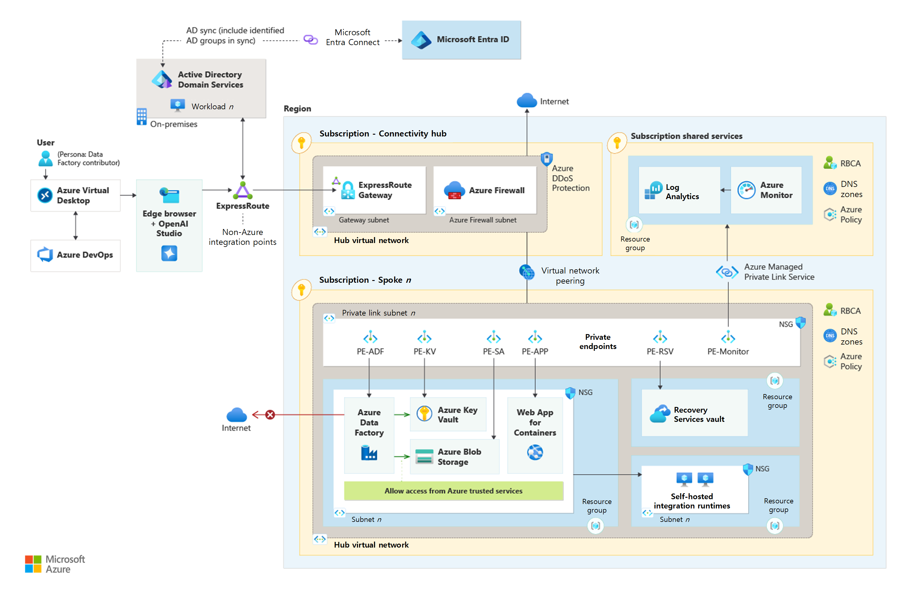

This reference architecture describes how to deliver a mission-critical advanced analytical solution with Azure Data Factory, and is an extension of the [baseline architecture](azure-data-factory-on-azure-landing-zones-baseline.yml) and the [enterprise hardened architecture](azure-data-factory-hardened.yml). The guidance presented in this article reflects only the changes recommended to be made to operate the workload as a mission-critical workload.

This architecture reflects [Microsoft's Cloud Adoption Framework for Azure](/azure/cloud-adoption-framework/) for best practice and guidance, and the guidance for [mission-critical](/azure/well-architected/mission-critical/) workloads. 

## Context and Key-Design-Decisions

As described in the [enterprise hardened architecture](azure-data-factory-hardened.yml), Contoso has implemented a [medallion lakehouse architecture](/azure/databricks/lakehouse/medallion) supporting their enterprise analytical data needs and enabling business users via a domain model. With Contoso expanding across the globe, the Finance department has developed a deal fraud model using Azure Machine Learning which is now required to be further refined to function as a mission-critical, operational service.

### Key Requirements

- The machine learning (ML) model MUST be designed as a mission-critical, operational service that is available to the various deal operational systems globally.  
- The ML model outcomes and performance metrics must be made available for retraining and auditing.
- The ML model auditing trails must be retained for 10 years.
- While the ML model targets the US, Europe and South America, there are plans to expand into Asia as well.
  - The Solution must adhere to the region's data compliance requirements, like GDPR for European countries.
- The ML model is forecast to be used by up to 1,000 concurrent users in any given region during peak-business hours.
   - When not in use, the ML processing MUST scale back to minimize costs.

### The Key Design Decisions (KDDs)

- The cost and complexity of rearchitecting the platform to mission-critical specifications isn't justified by the requirement. Instead, the ML model should be containerized and then deployed to a mission-critical solution. This approach minimizes cost and complexity, isolating to the model service and follows [mission-critical guidance](/azure/well-architected/mission-critical/mission-critical-application-platform#containerization).
  - This design requires the model to be developed on the platform and then containerized for deployment.
- Once the model is containerized, it can be served out via an API using a [scale-unit architecture](/azure/well-architected/mission-critical/mission-critical-application-design#scale-unit-architecture), in US, European, and South American Azure regions.
  - Only regions that are [paired and have availability zones](https://azure.microsoft.com/explore/global-infrastructure/geographies/#geographies) are in scope, supporting redundancy requirements.
- Given the nature of a simple, single API service, [Web App for Containers](https://azure.microsoft.com/products/app-service/containers/?activetab=pivot:deploytab) is the chosen app hosting service. This is a trade-off for simplicity versus control and the steep learning curve of [Azure Kubernetes Service (AKS)](/azure/well-architected/mission-critical/mission-critical-application-platform#design-considerations-and-recommendations-for-azure-app-service).  
- The model will be deployed via a [MLOps framework](/azure/machine-learning/concept-model-management-and-deployment?view=azureml-api-2), and Azure Data Factory (ADF) will be used to move data in and out of the mission-critical implementation.
- As part of the containerization, the following work is required:
  - an API front-end to serve the model results.
  - offloading audit and performance metrics to a storage account, which can then be transferred back to the main platform via ADF using a [scheduled job](/azure/data-factory/how-to-create-schedule-trigger?tabs=data-factory).
  - Deployment and rollback deployment pipelines, enabling each regional deployment to be in sync with the correct current version of the model.
  - Service [health modeling](/azure/architecture/reference-architectures/containers/aks-mission-critical/mission-critical-health-modeling) required to measure and manage the overall health of a workload.
 - Audit trails can be initially stored within a Log Analytics workspace for real-time analysis and operational support. After 30 days or 90 days if using Microsoft Sentinel, they can be automatically transferred to Azure Data Explorer for long-term retention. This approach allows for interactive queries of up to two years within the Log Analytics Workspace and the ability to keep older, less frequently used data at a reduced cost for up to twelve years. Using Azure Data Explorer for data storage enables running cross-platform queries and visualizing data across both Azure Data Explorer and Microsoft Sentinel, providing a cost-effective solution for meeting long-term storage requirements while maintaining support optionality. If there's no requirement to hold excessive data, the guidance is to consider deleting it. 
  
## Architecture

### Design Callouts

The design callouts for the mission-critical architecture are:

1.	The data platform is where the ML model will be developed and tested. This design change will require the following updates to the architecture:

- [Azure Container registry](/azure/container-registry/) enabling the build, storage, and management of Docker container images and artifacts in a private registry supporting the ML model deployment. 
- [Web App for Containers](https://azure.microsoft.com/products/app-service/containers/?activetab=pivot:deploytab) enabling the CI/CD activities required to deliver the ML model outputs as an API service. 
- ADF enables the migration of any data required by the model to run and the ingestion of model output and performance metrics from the mission-critical implementation.
- The data lake's Bronze layer (Raw) directory structure stores the model output and performance metrics, using the [Archive tier](/azure/storage/blobs/access-tiers-overview) to meet the data retention requirement.

2. Deployment of the model codebase, along with the creation and retirement of regional deployments of all supporting services are orchestrated with [Azure DevOps](/azure/devops/?view=azure-devops).
  
3. The ML model is deployed as a dedicated mission-critical workload, under its own defined subscription avoiding any [component or service limits](/azure/azure-resource-manager/management/azure-subscription-service-limits) impacted by the data platform.

4. A set of shared resources across the entire solution and therefore defined as global. These are:

- [Azure Container registry](/azure/container-registry/) enabling the distribution of the current ML model version across the regional deployments.
- [Azure Front Door](/azure/frontdoor/front-door-overview) providing load-balancing services to distribute traffic across regional deployments.
- A monitoring capability using [Azure Log Analytics](/azure/azure-monitor/logs/log-analytics-overview) and [Azure Data Lake Storage](/azure/storage/blobs/data-lake-storage-introduction).
  
5.	The regional [deployment stamp](/azure/well-architected/mission-critical/mission-critical-architecture-pattern#regional-stamp-resources) is a set of solution components that can be deployed into any target region, providing scale, service resiliency and regional-specific service.

- Depending on the nature of the ML model, there may be regional data compliance requirements that require the ML model to adhere to sovereignty regulations. This design will support these requirements.
- Each regional deployment comes with its own monitoring and storage stack, providing isolation from the rest of solution.
   
7.	The [scale unit](/azure/well-architected/mission-critical/mission-critical-application-design#scale-unit-architecture) of the solution contains the following elements:

- [Web App for Containers](https://azure.microsoft.com/products/app-service/containers/?activetab=pivot:deploytab) hosting the ML model and serving its outputs.
  -  As the core service component in this solution, Web App for Containers [scale limits](/azure/azure-resource-manager/management/azure-subscription-service-limits#app-service-limits) are the key constraints to be aware of. If these limits don't support the solutions requirements, then AKS should be reconsidered. 
- [Azure Key Vault](/azure/key-vault/) enforces appropriate controls over secrets, certificates, and keys at the regional scope, secured via [Private Link](/azure/key-vault/general/private-link-service?tabs=portal). 
- [Azure Data Lake Storage](/azure/storage/blobs/data-lake-storage-introduction) provides data storage, secured via [Private Link](/azure/storage/common/storage-private-endpoints). 
- [Azure DNS](/azure/dns/dns-overview) provides name resolution enabling service resiliency and ease of use for load balancing across the solution.
   
8.	To enable support and trouble shooting of the solution, the following components are also included:

- [Azure Bastion](/azure/bastion/) provides a secure connection to jump hosts, without requiring a public IP.
- [Azure VM](/azure/virtual-machines/) acts as a jump host to the solution, enabling a better security posture.
- [Self-Hosted Build Agents](/azure/devops/pipelines/agents/agents) provides scale and performance to support solution deployments.

### Network Design

- A next generation firewall, like [Azure Firewall](/azure/firewall/overview), should be used to secure network connectivity between your on-premises infrastructure and your Azure virtual network.
- Self-hosted integration runtime (SHIR) can be deployed on a virtual machine (VM) in your on-premises environment or in Azure. It's recommended to deploy the VM in Azure as part of the shared support resource landing zone to simplify governance and security. The SHIR can be used to securely connect to on-premises data sources and perform data integration tasks in ADF.
- ML-assisted data labeling doesn't support default storage accounts as they're secured behind a virtual network. First create a storage account for ML-assisted data labeling, apply the labeling and secure it behind the virtual network.

**[Private Endpoints](/azure/private-link/private-endpoint-overview):** provide a private IP address from your VNet to an Azure service, effectively bringing the service into your VNet. This makes the service accessible only from your VNet or connected networks, ensuring a more secure and private connection. Private Endpoints use Azure Private Link, which secures the connection to the PaaS service. If your workload uses any resources that don't support Private Endpoints, you may be able to use [Service Endpoints](/azure/virtual-network/virtual-network-service-endpoints-overview). Private Endpoints are the recommended solution for mission-critical workloads, so default to using them whenever possible and practical.

Further guidance for mission-critical - [Networking and connectivity](/azure/well-architected/mission-critical/mission-critical-networking-connectivity)

## Callouts

- The preferred approach would shift the ML workload into the operational system/domain. The Data Platform targets analytical workloads and their related SLAs and capabilities. This should be investigated before committing to standing up a mission-critical solution.

## Alternatives

- [Azure Kubernetes Service (AKS)](/azure/aks/what-is-aks) can be used to host the containers. For this use case, the management burden required for AKS makes it a less preferable choice for the solution. 
- [Azure Traffic Manager](/azure/traffic-manager/traffic-manager-overview) as an alternate for load balancing: Azure Front Door is preferred for this scenario due to the additional functionality available and a quicker [failover](/azure/architecture/guide/technology-choices/load-balancing-overview#azure-load-balancing-services) performance.
- If the model also requires read/write capabilities for the data as part of its processing, [Cosmos DB](/azure/well-architected/mission-critical/mission-critical-data-platform#globally-distributed-multi-region-write-datastore) can be considered.

## Considerations

The following considerations provide guidance for implementing the pillars of the [Azure Well-Architected Framework](/azure/well-architected/) in the context of this architecture.

### Reliability

[Reliability](/azure/well-architected/reliability/) ensures that solution resilient to malfunction and to ensure that it returns to a fully functioning state after a failure occurs. 

The delta this architecture provides includes:

- Alignment with the [Mission-critical baseline architecture](/azure/architecture/reference-architectures/containers/aks-mission-critical/mission-critical-intro) reference architecture.
- Following the guidance from the mission-critical [reliability](/azure/well-architected/mission-critical/mission-critical-design-principles#reliability) design considerations.
- Deploying an initial [health model](/azure/well-architected/mission-critical/mission-critical-health-modeling) for the solution to maximize reliability.

### Security

[Security](/azure/well-architected/security/) provides guidance to your architecture to help ensure the confidentiality, integrity, and availability of your data and systems.

The delta this architecture provides includes:

- Following the guidance from the mission-critical [security](/azure/well-architected/mission-critical/mission-critical-design-principles#security) design considerations.
- Implementing the [security guidance](/azure/well-architected/mission-critical/mission-critical-security) from the mission-critical reference architecture.  

### Cost optimization

[Cost optimization](/azure/well-architected/cost-optimization/) provides guidance in your architecture to sustain and improve your return on investment (ROI).

Mission-critical designs are [expensive](/azure/well-architected/mission-critical/mission-critical-design-principles#cost-optimization) nature, making it important to implement controls like:

- Aligning the component SKU selection to the solution [scale-unit](/azure/well-architected/mission-critical/mission-critical-application-design#scale-unit-architecture) boundaries to avoiding overprovisioning.
- Available and practical operating expenses (OpEx) saving benefits, such as [Azure Reservations](/azure/cost-management-billing/reservations/save-compute-costs-reservations) for stable workloads and [Savings plans](/azure/cost-management-billing/savings-plan/scope-savings-plan) for dynamic workloads, and Log Analytics [Commitment tiers](/azure/azure-monitor/logs/cost-logs).
- Cost and budget alerting via [Cost Management](/azure/cost-management-billing/costs/cost-mgt-alerts-monitor-usage-spending).

### Operational efficiency

[Operational excellence](/azure/well-architected/operational-excellence/) ensures workload quality through standardized processes and team cohesion. 

The delta this architecture provides includes:

- Following the guidance from the mission-critical [operational excellence](/azure/well-architected/mission-critical/mission-critical-design-principles#operational-excellence) design considerations.
- Separating out global and regional monitoring resources to avoid a single of point failure in [observability](/azure/architecture/reference-architectures/containers/aks-mission-critical/mission-critical-intro#unified-data-sink).
- Implementing the [Deployment and testing guidance](/azure/well-architected/mission-critical/mission-critical-deployment-testing) and [Operational procedures](/azure/well-architected/mission-critical/mission-critical-operational-procedures) from the mission-critical reference architecture.  
- Aligning the solution with [Azure engineering roadmaps](/azure/well-architected/mission-critical/mission-critical-cross-cutting-issues#azure-roadmap-alignment) and [regional rollouts](https://azure.microsoft.com/updates/) to account for Azure's constantly evolving services.  
 
### Performance efficiency

[Performance efficiency](/azure/well-architected/performance-efficiency/) is the ability of your workload to scale to meet the demands placed on it by users in an efficient manner. 

The delta this architecture provides includes:

- Following the guidance from the mission-critical [performance efficiency](/azure/well-architected/mission-critical/mission-critical-design-principles#performance-efficiency) design considerations.
- Completing an [Well-Architected assessment](/azure/well-architected/mission-critical/mission-critical-assessment) providing a baseline of readiness for the solution. This assessment should be regularly revisited as part of a proactive cycle of measure and manage. 

## Anti-patterns

- **The "shopping list" approach** - Business stakeholders are often presented with a "shopping list" of features and service levels, without the context of cost or complexity. It's recommended that any solution is based upon validated requirements and solution design is supported by financial modeling with options. This approach allows stakeholders to make informed decisions and pivot if required.
- **Not challenging the requirements** - Mission-critical designs can be very expensive and complex to implement and maintain. Business stakeholders should be challenged on their requirements to ensure "mission-critical" is actually required.
- **Deploy and forget** - The model is deployed without continuous monitoring, updates, or support mechanisms in place. Once deployed, there's little to no ongoing maintenance, and the model is left to operate in isolation. This neglect can lead to performance degradation, drift in model accuracy, and vulnerabilities to emerging data patterns. Ultimately, it undermines the reliability and effectiveness of the model in serving its intended purpose.

## Related resources

- [Azure Well-Architected Framework mission-critical guidance](/azure/well-architected/mission-critical/)
- [Microsoft Cloud Adoption Framework for Azure](/azure/cloud-adoption-framework/)
- [ADF Baseline architecture](azure-data-factory-on-azure-landing-zones-baseline.yml)
- [Enterprise hardened architecture](azure-data-factory-enterprise-hardened.yml)
