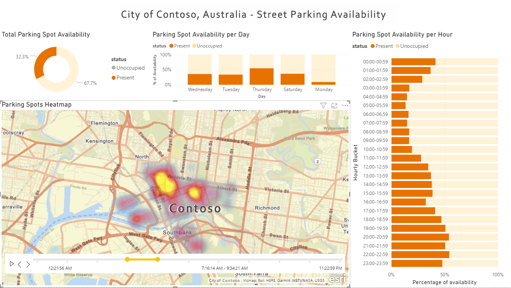

This article describes how a fictional city planning office could use this solution. The solution provides an end-to-end data pipeline that follows the MDW architectural pattern, along with corresponding DevOps and DataOps processes, to assess parking use and make more informed business decisions.

## Architecture

The following diagram shows the overall architecture of the solution.

:::image type="content" source="_images/architecture-diagram-demonstrating-dataops-for-the-modern-data-warehouse.svg" lightbox="_images/architecture-diagram-demonstrating-dataops-for-the-modern-data-warehouse.svg" alt-text="Architecture diagram demonstrating DataOps for the modern data warehouse." border="false":::

*Download a [Visio file](https://arch-center.azureedge.net/architecture-diagram-demonstrating-dataops-for-the-modern-data-warehouse.vsdx) of this architecture.*

### Data flow

Azure Data Factory orchestrates and Azure Data Lake Storage Gen2 stores the data.

The following data flow corresponds to the previous diagram:

1. The Contoso city parking web service API is available to transfer data from the parking spots.

1. There's a data factory copy job that transfers the data into the Landing schema.

1. Next, Azure Databricks cleanses and standardizes the data. It takes the raw data and conditions it so data scientists can use it.

1. If validation reveals any bad data, it gets dumped into the Malformed schema.

    > [!IMPORTANT]
    > People have asked why the data isn't validated before it's stored in Data Lake Storage. The reason is that the validation might introduce a bug that could corrupt the dataset. If you introduce a bug at this step, you can fix the bug and replay your pipeline. If you dumped the bad data before you added it to Data Lake Storage, then the corrupted data is useless because you can't replay your pipeline.

1. There's a second Azure Databricks transform step that converts the data into a format that you can store in the data warehouse.

1. Finally, the pipeline serves the data in two different ways:

    1. Databricks makes the data available to the data scientist so they can train models.

    1. Polybase moves the data from the data lake to Azure Synapse Analytics and Power BI accesses the data and presents it to the business user.

### Components

- [Azure Data Factory](/azure/data-factory/introduction) is a cloud-based data integration service that enables data movement and orchestration. In this architecture, it initiates the pipeline by copying data from the Contoso city parking web service API into the landing zone of the data lake.

- [Azure Data Lake Storage Gen2](/azure/storage/blobs/data-lake-storage-introduction) is a scalable and secure data lake built on Azure Blob Storage that supports tiered storage and replayable pipelines. In this architecture, it serves as the central repository for both raw and processed data across landing, malformed, and validated data zones.

- [Azure Databricks](/azure/well-architected/service-guides/azure-databricks) is an Apache Spark-based analytics platform designed for big data and machine learning. In this architecture, it performs two critical transformation steps. First, it cleanses and standardizes raw data while filtering malformed records to a separate schema. Then it converts validated data into a format suitable for data warehouse storage and makes processed data available to data scientists for model training.

- [Azure Key Vault](/azure/key-vault/general/overview) is a secure cloud service for managing secrets, keys, and certificates. In this architecture, it stores sensitive configuration settings and credentials used throughout the pipeline, providing centralized and secure configuration management.

- [Azure Synapse Analytics](/azure/synapse-analytics/) is an integrated analytics service that combines big data and data warehousing capabilities. In this architecture, it serves as the data warehouse that ingests transformed data from Data Lake Storage via PolyBase for querying and reporting.

- [Power BI](/power-bi/fundamentals/power-bi-overview) is a business analytics tool that delivers interactive visualizations and dashboards. In this architecture, it connects to Azure Synapse Analytics to present parking usage data insights to city planners for informed decision-making.

## Scenario details

A modern data warehouse (MDW) lets you easily bring all of your data together at any scale. It doesn't matter if it's  structured, unstructured, or semi-structured data. You can gain insights to an MDW through analytical dashboards, operational reports, or advanced analytics for all your users.

Setting up an MDW environment for both development (dev) and production (prod) environments is complex. Automating the process is key. It helps increase productivity while minimizing the risk of errors.

This article describes how a fictional city planning office could use this solution. The solution provides an end-to-end data pipeline that follows the MDW architectural pattern, along with corresponding DevOps and DataOps processes, to assess parking use and make more informed business decisions.

### Solution requirements

* Ability to collect data from different sources or systems.

* Infrastructure as code: deploy new dev and staging (stg) environments in an automated manner.

* Deploy application changes across different environments in an automated manner:

  - Implement continuous integration and continuous delivery (CI/CD) pipelines.

  - Use deployment gates for manual approvals.

* Pipeline as Code: ensure the CI/CD pipeline definitions are in source control.

* Carry out integration tests on changes using a sample data set.

* Run pipelines on a scheduled basis.

* Support future agile development, including the addition of data science workloads.

* Support for both row-level and object-level security:

  - The security feature is available in SQL Database.

  - You can also find it in Azure Synapse Analytics, Azure Analysis Services and Power BI.

* Support for 10 concurrent dashboard users and 20 concurrent power users.

* The data pipeline should carry out data validation and filter out malformed records to a specified store.

* Support monitoring.

### Potential use cases

This article uses the fictional city of Contoso to describe the use case scenario. In the narrative, Contoso owns and manages parking sensors for the city. It also owns the APIs that connect to and get data from the sensors. They need a platform that will collect data from many different sources. The data then must be validated, cleansed, and transformed to a known schema. Contoso city planners can then explore and assess report data on parking use with data visualization tools, like Power BI, to determine whether they need more parking or related resources.

## Considerations

These considerations implement the pillars of the Azure Well-Architected Framework, which is a set of guiding tenets that can be used to improve the quality of a workload. For more information, see [Microsoft Azure Well-Architected Framework](/azure/well-architected/).

The considerations in this section summarize key learnings and best practices demonstrated by this solution:

* **Use data tiering in your data lake.** Retain unmodified source data in the landing zone, route records that fail validation to the malformed zone, and transform validated data into a warehouse-ready format. Retaining source data lets you reprocess it without returning to the source system. For the analogous bronze, silver, and gold lakehouse pattern, see [medallion architecture](/azure/databricks/lakehouse/medallion).

* **Make your data pipelines replayable and idempotent.** Design transformation steps so that rerunning them over the same input produces the same result. Replaying a pipeline lets you fix a defect in transformation logic and reprocess historical data instead of discarding it.

### Security

Security provides assurances against deliberate attacks and the abuse of your valuable data and systems. For more information, see [Design review checklist for Security](/azure/well-architected/security/checklist).

* **Secure and centralize configuration.** Store connection strings, keys, and other secrets in Key Vault instead of in notebooks, pipeline definitions, or source control. Reference them from [Data Factory linked services](/azure/data-factory/store-credentials-in-key-vault) and from [Azure Databricks secret scopes](/azure/databricks/security/secrets/) so that each environment resolves its own values.

### Operational Excellence

Operational excellence covers the operations processes that deploy an application and keep it running in production. For more information, see [Design review checklist for Operational Excellence](/azure/well-architected/operational-excellence/checklist).

* **Validate data early in your pipeline.** Apply schema and quality checks in the first transformation step and route records that fail into the malformed schema. Early validation keeps defective records out of downstream tiers and gives you a record of what was rejected and why.

* **Ensure data transformation code is testable.** Factor transformation logic into functions and modules that run outside a notebook so that you can cover them with [unit tests](/azure/databricks/notebooks/testing) in the pull request validation pipeline.

* **Have a CI/CD pipeline.** Build and release every environment from source control rather than by hand. For the technology-specific mechanics, see [CI/CD in Azure Data Factory](/azure/data-factory/continuous-integration-delivery) and [CI/CD on Azure Databricks](/azure/databricks/dev-tools/ci-cd/).

* **Monitor infrastructure, pipelines, and data.** Collect metrics and logs from each layer so that a failure surfaces as an alert instead of as a stale report. For more information, see [Monitor Data Factory](/azure/data-factory/monitor-data-factory).

## Deploy this scenario

The following list contains the high-level steps required to set up this solution with corresponding build and release pipelines.

### Setup and deployment

1. **Initial setup**: Install any prerequisites, create the Git repository that holds the infrastructure, notebook, and pipeline code, and set required environment variables.
1. **Deploy Azure resources**: Use an infrastructure as code deployment, such as [Bicep](/azure/azure-resource-manager/bicep/overview) or [Terraform](/azure/developer/terraform/overview), to deploy the Azure resources and Microsoft Entra service principals for each environment. Separately configure the Azure Pipelines definitions, variable groups, and service connections that invoke the infrastructure deployment.
1. **Set up Git integration in dev Data Factory**: [Configure Git integration](/azure/data-factory/source-control) so that the development data factory commits to your repository.

1. **Carry out an initial build and release**: Create a sample change in Data Factory, like enabling a schedule trigger, then watch the change automatically deploy across environments.

### Deployed resources

If deployment is successful, there should be three resource groups in Azure representing three environments: dev, stg, and prod. Each resource group contains a data factory, an Azure Databricks workspace, a Data Lake Storage Gen2 account, a key vault, and an Azure Synapse Analytics workspace. There should also be end-to-end build and release pipelines in Azure DevOps that can automatically deploy changes across these three environments.

### Continuous integration and continuous delivery (CI/CD)

The following diagram demonstrates the CI/CD process and sequence for the build and release pipelines.

:::image type="content" source="_images/ci-cd-process-diagram-new.svg" lightbox="_images/ci-cd-process-diagram-new.svg" alt-text="Diagram that shows the process and sequence for build and release." border="false":::

*Download a [Visio file](https://arch-center.azureedge.net/ci-cd-process-diagram.vsdx) of this architecture.*

1. Developers develop in their own sandbox environments within the dev resource group and commit changes into their own short-lived Git branches. For example, `<developer_name>/<branch_name>`.

1. When changes are complete, developers raise a pull request (PR) to the main branch for review. Doing so automatically kicks off the PR validation pipeline, which runs the unit tests, linting, and data-tier application package (DACPAC) builds.

1. On completion of the PR validation, the commit to main will trigger a build pipeline that publishes all necessary build artifacts.

1. The completion of a successful build pipeline will trigger the first stage of the release pipeline. Doing so deploys the publish build artifacts into the dev environment, except for Data Factory.

    Developers manually publish to the dev Data Factory from the collaboration branch (main). The manual publishing updates the Azure Resource Manager templates in the `adf_publish` branch.

1. The successful completion of the first stage triggers a manual approval gate.

    On Approval, the release pipeline continues with the second stage, deploying changes to the stg environment.

1. Run integration tests to test changes in the stg environment.

1. Upon successful completion of the second stage, the pipeline triggers a second manual approval gate.

    On Approval, the release pipeline continues with the third stage, deploying changes to the prod environment.

For more information about implementing these stages, see [CI/CD in Azure Data Factory](/azure/data-factory/continuous-integration-delivery).

### Testing

The solution includes support for both unit testing and integration testing. Unit tests cover the Python transformation modules, and integration tests trigger a Data Factory pipeline and verify its output as part of the release to the staging environment. For more information, see [Unit testing for notebooks](/azure/databricks/notebooks/testing).

### Observability and monitoring

The solution supports observability and monitoring for Databricks and Data Factory. Route diagnostic logs and metrics from both services into a Log Analytics workspace, then set up alerts on pipeline failures and job latency. For more information, see [Monitor Data Factory](/azure/data-factory/monitor-data-factory).

## Next steps

The following resources help you implement the DataOps practices that this article describes.

### Continuous integration and delivery

* [CI/CD in Azure Data Factory](/azure/data-factory/continuous-integration-delivery)
* [CI/CD on Azure Databricks](/azure/databricks/dev-tools/ci-cd/)

### Observability/monitoring

Azure Databricks

* [Monitoring Azure Databricks Jobs with Application Insights](/archive/msdn-magazine/2018/june/azure-databricks-monitoring-azure-databricks-jobs-with-application-insights)

Data Factory

* [Monitor Azure Data Factory with Azure Monitor](/azure/data-factory/monitor-using-azure-monitor)
* [Create alerts to proactively monitor your data factory pipelines](https://azure.microsoft.com/blog/create-alerts-to-proactively-monitor-your-data-factory-pipelines)

Azure Synapse Analytics

* [Monitoring resource utilization and query activity in Azure Synapse Analytics](/azure/synapse-analytics/sql-data-warehouse/sql-data-warehouse-concept-resource-utilization-query-activity)
* [Monitor your Azure Synapse Analytics SQL pool workload using DMVs](/azure/synapse-analytics/sql-data-warehouse/sql-data-warehouse-manage-monitor)

Azure Storage

* [Monitor Azure Storage](/azure/storage/common/monitor-storage?tabs=azure-powershell)

### Resiliency and disaster recovery

Azure Databricks

* [Regional disaster recovery for Azure Databricks clusters](/azure/azure-databricks/howto-regional-disaster-recovery)

Data Factory

* [Create and configure a self-hosted integration runtime - High availability and scalability](/azure/data-factory/create-self-hosted-integration-runtime#high-availability-and-scalability)

Azure Synapse Analytics

* [Geo-backups and Disaster Recovery](/azure/synapse-analytics/sql-data-warehouse/backup-and-restore#geo-backups-and-disaster-recovery)
* [Geo-restore for SQL Pool](/azure/synapse-analytics/sql-data-warehouse/sql-data-warehouse-restore-from-geo-backup)

Azure Storage

* [Disaster recovery and storage account failover](/azure/storage/common/storage-disaster-recovery-guidance?toc=/azure/storage/blobs/toc.json)
* [Best practices for using Azure Data Lake Storage Gen2 – High availability and Disaster Recovery](/azure/storage/blobs/data-lake-storage-best-practices#high-availability-and-disaster-recovery)
* [Azure Storage Redundancy](/azure/storage/common/storage-redundancy)

### Detailed overview

For a detailed overview of the solution and key concepts, watch the following video recording: [DataDevOps for the Modern Data Warehouse on Microsoft Azure](https://www.youtube.com/watch?v=Xs1-OU5cmsw%22)
