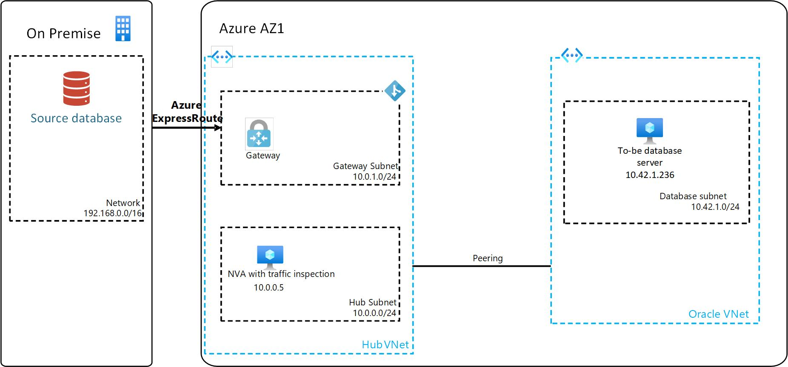
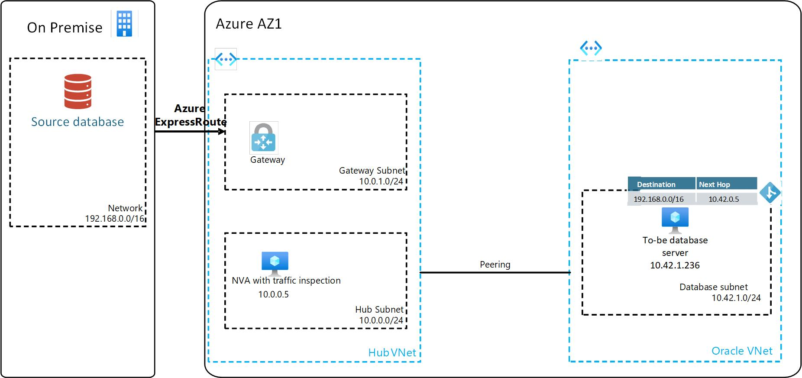

# Introduction

This article describes considerations and recommendations when doing a physical online migration of an Oracle Database from an on-premises Oracle Database implementation to Azure virtual machines using Oracle Data Guard. The article assumes that you have a basic understanding of Oracle Database technologies as well as Azure Compute and networking. The article builds on the scenario described in the article [Migrating Oracle database workloads to Azure](topic-migrating-oracle-to-azure.yml).

## Scenario

Consider the following scenario:

- On your on-premises network you have an existing Oracle Database instance ora01 and you are looking to migrate database1 from ora01 to an Azure virtual machine.
- Database1 is 20TB in size and is running on Oracle Enterprise Linux (x86), the database version is Oracle Database 19c, Enterprise Edition.
- Currently the database is RAC enabled (two nodes) and for disaster recovery it is replicated via Oracle Data Guard to another data center geographically distant from where the primary is located.
- You have conducted an assessment of your on-premises Oracle Database and application services as described in the article [Capacity planning for migrating Oracle workloads to Azure](/azure/cloud-adoption-framework/scenarios/oracle-iaas/oracle-capacity-planning#overall-performance-considerations), and deployed a virtual machine in Azure with the required compute size and storage configuration.
- The virtual machine is placed in database subnet in Oracle Vnet which is peered to the Hub Vnet. The address range of the database subnet is 10.42.1.0/24
- In Hub vnet the traffic has to traverse a third-party NVA (FortiGate, CheckPoint, Cisco or other), the NVA functions as a routing device, ensuring that connectivity between the virtual machine and on-premises Oracle database implementation is fully routable. In addition to this the NVA is configured for traffic inspection so that all traffic going to and from on-premises is inspected. The IP address of the Hub NVA is 10.0.0.5.
- Hybrid connectivity is configured in Hub VNet with an Express Route connection to your on-premises network.

You need to migrate the on-premises database to the the Azure VM with the minimum amount of downtime. You have decided to use Oracle Data Guard as well as Oracle Recovery Manager (RMAN) for the migration.

## Network connectivity

To use Oracle Data Guard for migration, you need to ensure that the source and target databases can communicate with each other. An Azure Route Table will need to be created and associated to the database subnet. The Azure Route Table should point to the IP address of the Hub NVA for routing to on-premises. The Hub NVA should be configured to route traffic between on-premises and the database subnet.

### Route table configuration

- Create an Azure Route Table with the following configuration and associate to the database subnet:
  - Address prefix: 192.168.0.0/16
  - Next hop type: Virtual appliance
  - Next hop IP address: 10.0.0.5
  - Name: \<Route table name\>

For an example of the updated network configuration, see the following diagram:

### Verify connectivity

1. Log on to the Azure virtual machine and verify that you can ssh to the on-premises database server.
1. Log on to the on-premises database server and verify that you can ssh to the Azure virtual machine.

## Migration activities

1. Backup the database with RMAN from the on-premises database server and restore onto the target system as described in [Restoring a Database on a New Host)](https://docs.oracle.com/en/database/oracle/oracle-database/19/bradv/rman-recovery-advanced.html#GUID-6B71E7DF-A2B6-44F5-A8D5-B184BB41A768). Depending on database backup file size and network bandwidth, you could decide to copy the backup files directly to the Azure virtual machine on a staging area set of disks created expressly for that purpose. Alternatively if such an operation is not feasible due to network bandwidth constraints, you could use [Azure Data Box](https://learn.microsoft.com/en-us/azure/databox/data-box-overview) to copy the backup files to Azure. Once the files are in Azure blob storage, you should copy them to the Azure virtual machine staging area set of disks for the restore operation.
1. Configure Oracle Data Guard between the on-premises database server (primary replica) and the Azure virtual machine (secondary replica)on the Azure virtual machine as described in [Creating a Physical Standby Database](https://docs.oracle.com/en/database/oracle/oracle-database/19/sbydb/creating-oracle-data-guard-physical-standby.html#GUID-B511FB6E-E3E7-436D-94B5-071C37550170).
1. Once Oracle Data Guard replication is successful and the databases are in sync, perform a switchover to the Azure virtual machine as described in [Role Transitions](https://docs.oracle.com/en/database/oracle/oracle-database/19/sbydb/managing-oracle-data-guard-role-transitions.html#GUID-66282DCD-5E7B-43C2-ADA1-03342E2750A0). Note that this should be coordinated with the application team to ensure that the application services are updated to point to the new database. Also note that application migration activities as mentioned below will most likely need to be done in parallel with the database migration, for the least amount of downtime.
1. Application services migration
    - Migrate application services as planned and discussed.
    - Update the application services to point to the new database, including the connection string, TNS entries, and any other configuration that is needed. 
    - Verify that the application services are working as expected 

## Post-migration activities

- Configure backup for the database on the Azure virtual machine. For strategies on how to do this, refer to [Backup strategies for Oracle Database on an Azure Linux VM](/azure/virtual-machines/workloads/oracle/oracle-database-backup-strategies)
- Since RAC is not supported on Azure virtual machines, consider using Oracle Data Guard for HA and disaster recovery. For more information, see [Business continuity and disaster recovery for Oracle on Azure Virtual Machines](/azure/cloud-adoption-framework/scenarios/oracle-iaas/oracle-disaster-recovery-iaas).
- Keep the on-premises database running as secondary Data Guard replica for a period of time to ensure that the migration was successful.
- Once on-premises database is no longer needed, decommission the database and the server. Also ensure that ports and firewall changes made to allow communication between on-premises and Azure virtual machine are reviewed and removed if no longer needed.

## Conclusion

The above configuration changes will enable you to migrate your database from on-premises to Azure virtual machines. The configuration changes will ensure that the source and target databases can communicate with each other and that the migration can be performed with minimal downtime.

## Contributors

*This article is maintained by Microsoft. It was originally written by the following contributors.*

- [Jan Faurskov](https://www.linkedin.com/in/jfaurskov) | Cloud Solution Architect
- [Güher Kayali Sarikan](https://www.linkedin.com/in/guherkayali) | Cloud Solution Architect

*To see non-public LinkedIn profiles, sign in to LinkedIn.*

## Next steps

Review the following articles to ensure that your implementation follows recommended practices:

- [Network topology and connectivity for Oracle on Azure Virtual Machine](/azure/cloud-adoption-framework/scenarios/oracle-iaas/oracle-network-topology-iaas)
- [Security guidelines for Oracle workloads on Azure Virtual Machine](/azure/cloud-adoption-framework/scenarios/oracle-iaas/oracle-security-overview-iaas)
- [Manage and monitor Oracle workloads on Azure Virtual Machine](/azure/cloud-adoption-framework/scenarios/oracle-iaas/oracle-manage-monitor-iaas)
- [Business continuity and disaster recovery for Oracle on Azure Virtual Machine](/azure/cloud-adoption-framework/scenarios/oracle-iaas/oracle-disaster-recovery-iaas)

## References

Refer to these articles for supporting information:

- [Implement Oracle Data Guard on an Azure Linux virtual machine](/azure/virtual-machines/workloads/oracle/configure-oracle-dataguard).
- [Implement Oracle Golden Gate on an Azure Linux VM](/azure/virtual-machines/workloads/oracle/configure-oracle-golden-gate).
- [Introduction to Oracle Data Guard](https://docs.oracle.com/en/database/oracle/oracle-database/18/sbydb/introduction-to-oracle-data-guard-concepts.html#GUID-5E73667D-4A56-445E-911F-1E99092DD8D7)
- [Oracle Data Guard Broker Concepts](https://docs.oracle.com/en/database/oracle/oracle-database/12.2/dgbkr/oracle-data-guard-broker-concepts.html)
- [Oracle Active Data Guard Far Sync Zero Data Loss at Any Distance](https://www.oracle.com/docs/tech/database/disaster-recovery.pdf)
- [Oracle Recovery Manager (RMAN)](https://www.oracle.com/database/technologies/high-availability/rman.html)
