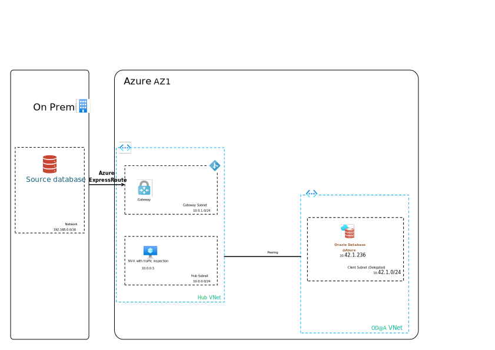
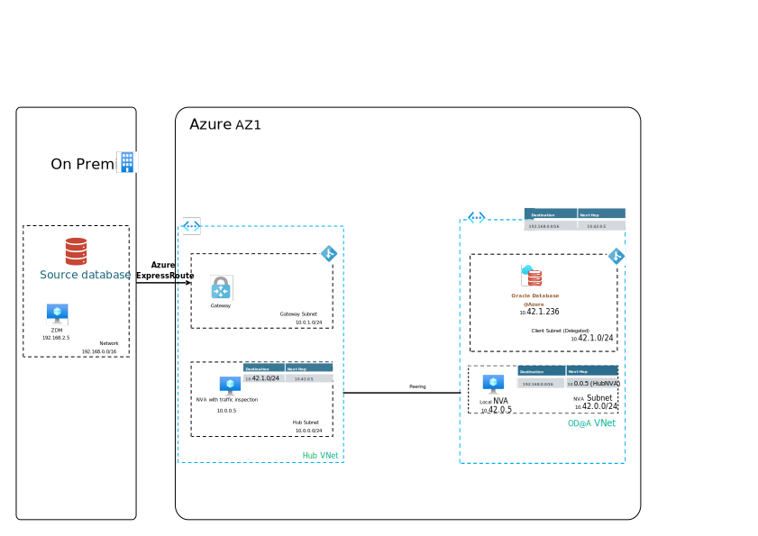

# Introduction

This article describes considerations and recommendations when doing a physical online migration of an Oracle Database from an on-premises Exadata to Oracle Database@Azure using Oracle Zero Downtime Migration (ZDM). The article assumes that you have a basic understanding of Oracle Database@Azure and Oracle Zero Downtime Migration. The article builds on the scenario described in the article [Migrating Oracle database workloads to Azure](topic-migrating-oracle-to-azure-content.md).

## Scenario

Consider the following scenario: You have deployed Oracle Database@Azure into your Azure region of choice and configured a VM cluster with 2 database servers and 3 Storage cell nodes. The Oracle Database@Azure delegated subnet (Client Subnet) is in OD@A Vnet which is peered to the HUB Vnet. OD@A Vnet also includes NVA subnet which has no delegations. In HUB vnet the traffic has to traverse a third-party NVA (FortiGate, CheckPoint, Cisco or other), the NVA functions as a routing device, ensuring that Oracle Database@Azure cluster nodes are fully routable within the infrastructure. In addition to this the NVA is configured for traffic inspection so that all traffic going to and from on-premises is inspected. Hybrid connectivity is configured in hubvnet with an Express Route connection to your on-premises network. On you on-premises network you have an existing Exadata implementation Exa01 and you are looking to migrate database1 from Exa01 to Oracle Database@Azure. Database1 is 2TB in size and is running on Exadata X8M-2, the database version is Oracle Database 19c, Enterprise Edition. Currently the database is RAC enabled and for disaster recovery it is replicated via Oracle Data Guard to another data center geographically distant from where the primary is located.

You need to migrate the database to Oracle Database@Azure with the minimum amount of downtime. You have been asked to leverage Oracle Zero-Downtime Migration tool to orchestrate the migration.

## Network connectivity

To use ZDM for migration, you need to ensure that the source and target databases can communicate with each other. An Azure Route Table will need to be created and associated to the Client subnet. The Azure Route Table should point to the IP address of the HUB NVA for routing to on-premises. The HUB NVA should be configured to route traffic between on-premises and the Client subnet.

### Route table configuration

- Create an Azure Route Table with the following configuration and associate to the Client subnet:
        - Address prefix: \<the IP range of the on-premises network\>
        - Next hop type: Virtual appliance
        - Next hop IP address: \<HUB NVA private IP\>
        - Name: NVA-RT

For an example of the updated network configuration, see the following diagram:

### Verify connectivity

1. Log on to an Oracle Database@Azure database node and verify that you can ssh to the on-premises database server.
1. Log on to the on-premises database server and verify that you can ssh to the Oracle Database@Azure database node.

## Migration activities

1. Leverage the guidance found in [Preparing for a Physical Database Migration](https://docs.oracle.com/en/database/oracle/zero-downtime-migration/21.3/zdmug/preparing-for-database-migration.html#GUID-25B07C59-8143-41CB-B431-3D9225CCFDD6) to prepare for the migration. Note that it is assumed that there will be sufficient bandwidth between the source and target databases to support an online migration with no need to do an offline migration (restore of backup on ODAA) first.
1. Leverage the steps found in [Migrating Your Database with Zero Downtime Migration](https://docs.oracle.com/en/database/oracle/zero-downtime-migration/21.3/zdmug/migrating-with-zero-downtime-migration.html#GUID-C20DB7D4-E0CE-4B50-99D0-B16C18DDD34B) to perform the migration.
    - Note that application migration activities as mentioned below will most likely need to be done in parallel with the ZDM migration, for the least amount of downtime.
1. Application services migration
    - Migrate application services as planned and discussed.
    - Update the application services to point to the new database, including the connection string, TNS entries, and any other configuration that is needed.
    - Verify that the application services are working as expected.

## Post-migration activities

- Configure automated backups for the Oracle Database@Azure database as described [here](https://docs.public.oneportal.content.oci.oraclecloud.com/en-us/iaas/exadatacloud/exacs/manage-databases.html#GUID-21EF9E4B-E5D3-4A52-8B1C-609FBADD2A7D).
- Configure automated Data Guard failover as described [here](https://docs.public.oneportal.content.oci.oraclecloud.com/en-us/iaas/exadatacloud/exacs/using-data-guard-with-exacc.html#ECSCM-GUID-603988C3-604A-4305-B20A-EA0FF79C0835). Note that this presupposes that the customer has a separate instance already created in another availability zone or region.
- Keep the on-premises database running as secondary Data Guard replica for a period of time to ensure that the migration was successful.

## Conclusion

The above configuration changes will enable you to migrate your database from on-premises to Oracle Database@Azure using Oracle Zero Downtime Migration. The configuration changes will ensure that the source and target databases can communicate with each other and that the migration can be performed with minimal downtime.

## Contributors

*This article is maintained by Microsoft. It was originally written by the following contributors.*

- [Jan Faurskov](https://www.linkedin.com/in/jfaurskov) | Cloud Solution Architect
- [Güher Kayali Sarikan](https://www.linkedin.com/in/guherkayali) | Cloud Solution Architect
- [Moises Gomez-Cortez](https://www.linkedin.com/in/moisesjgomez) | Cloud Solution Architect

*To see non-public LinkedIn profiles, sign in to LinkedIn.*

## Next steps

Review the following articles to ensure that your implementation follows recommended practices:

- [Network topology and connectivity for Oracle Database@Azure](/azure/cloud-adoption-framework/scenarios/oracle-iaas/oracle-network-topology-odaa)
- [Identity and access management for Oracle Database@Azure](/azure/cloud-adoption-framework/scenarios/oracle-iaas/oracle-iam-odaa)
- [Security guidelines for Oracle Database@Azure](/azure/cloud-adoption-framework/scenarios/oracle-iaas/oracle-security-overview-odaa)
- [Manage and monitor Oracle Database@Azure](/azure/cloud-adoption-framework/scenarios/oracle-iaas/oracle-manage-monitor-oracle-database-azure)
- [Business continuity and disaster recovery considerations for Oracle Database@Azure](/azure/cloud-adoption-framework/scenarios/oracle-iaas/oracle-disaster-recovery-oracle-database-azure)

## References

- [Introduction to Zero Downtime Migration](https://docs.oracle.com/en/database/oracle/zero-downtime-migration/21.4/zdmug/introduction-to-zero-downtime-migration.html#GUID-A4EC1775-307C-47A6-89FB-E4C3F1FBC4F5)
- [ZDM Physical Online Migration Whitepaper](https://www.oracle.com/a/otn/docs/database/zdm-physical-migration-to-oracle-at-azure.pdf)