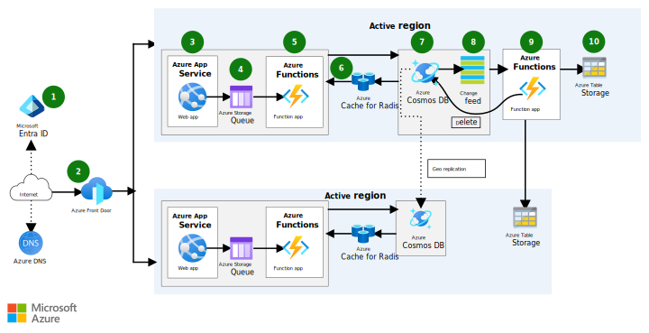

This article presents a high-availability solution for a web application dealing with large volumes of data that need to be accessible within a specific time frame. The solution involves using Azure Cosmos DB as the primary data store and using the Azure Cosmos DB change feed to replicate data to low-cost secondary storage. When the specified time period expires, Azure Functions is used to delete the data from Azure Cosmos DB. The data in secondary storage remains available for a longer period of time to enable other solutions for auditing and analysis purposes. The solution also provides high durability by replicating data to different data services.

## Architecture

*Download a [Visio file](https://arch-center.azureedge.net/minimal-storage-change-feed-replicate-data.vsdx) of this architecture.*

## Dataflow

1. The client authenticates with Microsoft Entra ID and is granted access to web applications hosted on Azure App Service.
1. Azure Front Door, a firewall and layer-7 load balancer, switches user traffic to the standby region if there's a regional outage.
1. App Service hosts websites and RESTful web APIs. Browser clients run Asynchronous JavaScript and XML (AJAX) applications that use the APIs.
1. Web APIs delegate responsibility to code hosted by Functions to handle background tasks. The tasks are queued in Azure Queue Storage queues.
1. The queued messages trigger the functions, which perform the background tasks.
1. Azure Managed Redis caches database data for the functions. By using the cache, the solution offloads database reads for slowly changing data and speeds up the function apps and web apps.
1. Azure Cosmos DB holds recently generated data.
1. Azure Cosmos DB issues a change feed that can be used to replicate changes.
1. A function app reads the change feed and replicates the changes to Azure Table Storage tables. Another function app periodically removes expired data from Azure Cosmos DB.
1. Table Storage provides low-cost storage.

### Components

- [Microsoft Entra ID](/entra/fundamentals/whatis) is an identity and access management service that can synchronize with an on-premises directory. In this architecture, it authenticates users and grants access to web applications hosted on App Service.
- [Azure DNS](/azure/dns/dns-overview) is a high-availability hosting service for Domain Name System (DNS) domains. In this architecture, Azure DNS provides DNS resolution and for the web app exposed through Azure Front Door.
- [Azure Front Door](/azure/well-architected/service-guides/azure-front-door) is a secure content delivery network and load balancer. In this architecture, it accelerates content delivery, provides failover capabilities, and protects apps from cyber threats.
- [App Service](/azure/well-architected/service-guides/app-service-web-apps) is a fully managed service for building, deploying, hosting, and scaling web apps. You can build apps by using .NET, .NET Core, Node.js, Java, Python, or PHP. Apps can run in containers or on Windows or Linux. In a mainframe migration, you can code the front-end screens or web interface as HTTP-based REST APIs. You can segregate them and make them stateless to orchestrate a microservices-based system. For more information about web APIs, see [RESTful web API design](../../best-practices/api-design.md). In this architecture, App Service hosts the web interface and REST APIs for the application.
- [Functions](/azure/well-architected/service-guides/azure-functions) provides an environment to run small pieces of code, called functions, without having to establish an application infrastructure. You can use it to process bulk data, integrate systems, work with Internet of Things (IoT) devices, and build simple APIs and microservices. With microservices, you can create servers that connect to Azure services and always remain up to date. In this architecture, Functions handles background tasks like replicating data and deleting expired records.
- [Azure Storage](/azure/storage/common/storage-introduction) is a set of massively scalable and secure cloud services for data, apps, and workloads. It includes [Azure Files](/azure/well-architected/service-guides/azure-files), which serves as an effective tool to migrate mainframe workloads.
  - [Queue Storage](/azure/storage/queues/storage-queues-introduction) provides simple, cost-effective, durable message queueing for large workloads. This architecture uses Queue Storage for task messaging.
  - [Table Storage](/azure/storage/tables/table-storage-overview) is a NoSQL key-value store for rapid development that uses massive semi-structured datasets. The tables are schemaless and adapt readily as needs change. Access is fast and cost-effective for many types of applications, and typically costs less than other types of keyed storage. This architecture uses Table Storage to store a synchronized and restructured copy of the data in Azure Cosmos DB.
- [Azure Managed Redis](/azure/redis/overview) is a fully managed in-memory caching service and message broker for sharing data and state among compute resources. You can improve the performance of high-throughput online transaction processing (OLTP) applications by designing them to scale and to make use of an in-memory data store such as Azure Managed Redis. In this architecture, Azure Managed Redis accelerates access to frequently used data, which improves performance for both function apps and web apps.
- [Azure Cosmos DB](/azure/well-architected/service-guides/cosmos-db) is a globally distributed, multi-model database that enables your solutions to elastically and independently scale throughput and storage across any number of geographic regions. It provides throughput, latency, availability, and consistency guarantees with comprehensive service-level agreements (SLAs). In this architecture, Azure Cosmos DB stores recent data and emits a change feed used to replicate updates to Table Storage.

### Alternatives

- [Azure Traffic Manager](/azure/traffic-manager/traffic-manager-overview) directs incoming DNS requests across the global Azure regions based on your choice of traffic routing methods. It also provides automatic failover and performance routing.
- [Azure Content Delivery Network](/azure/cdn/cdn-overview) caches static content in edge servers for quick response, and uses network optimizations to improve response for dynamic content. Content Delivery Network is especially useful when the user base is global.
- [Azure Container Apps](/azure/well-architected/service-guides/azure-container-apps) is a fully managed, serverless container service used to build and deploy modern apps at scale.
- [Azure Kubernetes Service (AKS)](/azure/well-architected/service-guides/azure-kubernetes-service) is a fully managed Kubernetes service for deploying and managing containerized applications. You can use it to implement a microservices architecture whose components scale independently on demand.
- [Azure Container Instances](/azure/container-instances/container-instances-overview) provides a quick and simple way to run tasks without having to manage infrastructure. It's useful during development or for running unscheduled tasks.
- [Azure Service Bus](/azure/well-architected/service-guides/service-bus/reliability) is a reliable cloud messaging service for simple hybrid integration. It can be used instead of Queue Storage in this architecture. For more information, see [Storage queues and Service Bus queues - compared and contrasted](/azure/service-bus-messaging/service-bus-azure-and-service-bus-queues-compared-contrasted).

## Scenario details

This solution uses Azure Cosmos DB to store the large volume of data that the web application uses. Web apps that handle massive amounts of data benefit from the ability of Azure Cosmos DB to elastically and independently scale throughput and storage.

Another key solution component is the Azure Cosmos DB change feed. When changes are made to the database, the change feed stream is sent to an event-driven Functions trigger. A function then runs and replicates the changes to Table Storage tables, which provide a low-cost storage solution. You can also orchestrate broader downstream data movement by using Azure Data Factory pipelines or Microsoft Fabric Data Factory to land data in analytics zones.

The web app needs the data for only a limited amount of time. The solution takes advantage of that fact to further reduce costs. Specifically, another function periodically runs and deletes expired data from Azure Cosmos DB. Besides being triggered, functions can also be scheduled to run at set times.

### Potential use cases

The architecture is appropriate for any application that:

- Uses a massive amount of data.
- Requires that data is always available when it's needed.
- Uses data that expires.

Examples include apps that:

- Personalize customer experience and drive engagement through live data feeds and sensors in physical locations.
- Track customer spending habits and shopping behavior.
- Track vehicle fleets by collecting data on vehicle location, performance, and driver behavior for improved efficiency and safety.
- Forecast weather.
- Offer smart traffic systems or implement smart traffic systems or use smart technology to monitor traffic.
- Analyze manufacturing IoT data.
- Display smart meter data or use smart technology to monitor meter data.

## Considerations

These considerations implement the pillars of the Azure Well-Architected Framework, which is a set of guiding tenets that can be used to improve the quality of a workload. For more information, see [Microsoft Azure Well-Architected Framework](/azure/well-architected/).

- When you implement and maintain this solution, you incur extra costs.
- Using the change feed for replication requires less code maintenance than doing the replication in the core application.
- You need to migrate existing data. The migration process requires ad hoc scripts or routines to copy old data to storage accounts. When you migrate the data, make sure that you use time stamps and copy flags to track migration progress.
- To avoid deleting entries from the Azure Table secondary storage, ignore delete feeds that are generated when your functions delete entries from Azure Cosmos DB.

## Contributors

*This article is maintained by Microsoft. It was originally written by the following contributors.*

Principal author:

- [Nabil Siddiqui](https://www.linkedin.com/in/nabilshams/) | Cloud Solution Architect - Digital and Application Innovation

Other contributors:

- [Filipe Moreira](https://www.linkedin.com/in/filipefumaux/) | Cloud Solution Architect

## Next steps

- [Web-Queue-Worker architecture style](../../guide/architecture-styles/web-queue-worker.md)
- [Design a geographically distributed application](/training/modules/design-a-geographically-distributed-application)
- [Distribute your data globally with Azure Cosmos DB](/training/modules/distribute-data-globally-with-cosmos-db)
- [Choose the appropriate API for Azure Cosmos DB](/training/modules/choose-api-for-cosmos-db)
- [Store and access NoSQL data with Azure Cosmos DB for Table](/training/modules/store-access-data-cosmos-table-api)
- [Work with NoSQL data in Azure Cosmos DB](/training/paths/work-with-nosql-data-in-azure-cosmos-db)
- [How to model and partition data on Azure Cosmos DB using a real-world example](/azure/cosmos-db/how-to-model-partition-example)
- [Options to migrate your on-premises or cloud data to Azure Cosmos DB](/azure/cosmos-db/cosmosdb-migrationchoices)
- [Migrate hundreds of terabytes of data into Azure Cosmos DB](/azure/cosmos-db/migrate-cosmosdb-data)
- [Change feed design patterns in Azure Cosmos DB](/azure/cosmos-db/change-feed-design-patterns)
- [Serverless event-based architectures with Azure Cosmos DB and Azure Functions](/azure/cosmos-db/change-feed-functions)
- [Introduction to Azure Data Factory](/training/modules/intro-to-azure-data-factory)
- [Orchestrate data movement and transformation in Azure Data Factory](/training/modules/orchestrate-data-movement-transformation-azure-data-factory)
- [Data integration with Data Factory in Microsoft Fabric](/fabric/data-factory/)

## Related resources

- [RESTful web API design](../../best-practices/api-design.md)
