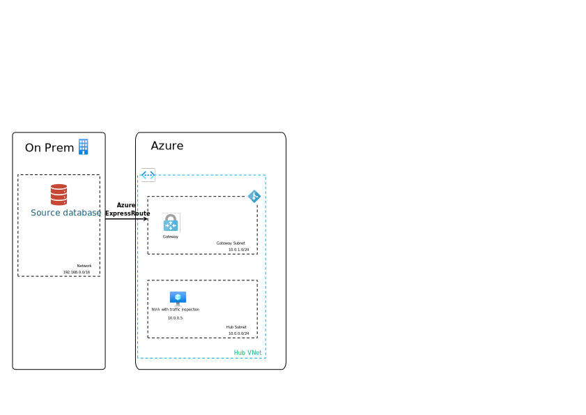

# Migrating Oracle database workloads to Azure

## Introduction to migrating Oracle database workloads to Azure

This article describes considerations and recommendations when migrating Oracle database workloads from on-premises to Azure. The article assumes that you are familar with Oracle Database technologies and Azure networking. The following scenarios are covered in the article:

- Physical migration of Oracle databases to Azure virtual machines
- Physical migration of Oracle databases to Oracle Database@Azure, Exadata Database Service

## Scenario

Consider the following initial scenario. You have one or more Oracle databases running in your on-premises data center. You are looking to migrate these databases to Azure. The databases are running on Oracle Database 19c, Enterprise Edition. The databases are RAC enabled and for disaster recovery they are replicated via Oracle Data Guard to another data center geographically distant from where the primary is located.You need to migrate the databases to Azure with the minimum amount of downtime. Application services dependent on the database will be migrated to Azure as well. You have established network connectivity to Azure through ExpressRoute, and are leveraging a hub and spoke network topology in Azure. In the hub vnet the traffic has to traverse a third-party NVA (FortiGate, CheckPoint, Cisco or other), this NVA doubles as a routing device, ensuring that traffic to/from Azure undergoes traffic inspection, while at the same time being fully routable.

## Implementation checklist

- If you will be migrating to Azure virtual machines, review [fixme article name](./migrating-oracle-to-azure-iaas.md). 
- If you will be migrating to Oracle Database@Azure, Exadata Database Service, review [fixme article name](fixme link).

As you're looking to implement TOPIC, ensure you're reviewed the following topics:

<!-- markdownlint-disable MD032 -->

> [!div class="checklist"]
> - Important [SECTION1](#section1) 
> - Important [SECTION2](#section2) 

<!-- markdownlint-enable MD032 -->

## SECTION1

### SUB-SECTION

This is a template that allows for the card layout on topic pages.  Use it for links to scenarios, reference architectures, and solutions.  Only the highlighted sections (link, image, title, & description) will need to be changed.

<ul class="columns is-multiline has-margin-left-none has-margin-bottom-none has-padding-top-medium">
    <li class="column is-one-third has-padding-top-small-mobile has-padding-bottom-small">
        <a class="is-undecorated is-full-height is-block"
            href="/azure/architecture/example-scenario/apps/hpc-saas?context=/azure/architecture/topics/high-performance-computing/context/hpc-context">
            <article class="card has-outline-hover is-relative is-fullheight">
                    <figure class="image has-margin-right-none has-margin-left-none has-margin-top-none has-margin-bottom-none">
                        
                    </figure>
                

                    

                        <h3 class="is-size-4 has-margin-top-none has-margin-bottom-none has-text-primary">Computer-aided engineering services on Azure</h3>
                    

                    

                        
Provide a software-as-a-service (SaaS) platform for computer-aided engineering (CAE) on Azure.

                    

                

            </article>
        </a>
    </li>
    <li class="column is-one-third has-padding-top-small-mobile has-padding-bottom-small">
        <a class="is-undecorated is-full-height is-block"
            href="/azure/architecture/example-scenario/infrastructure/hpc-cfd?context=/azure/architecture/topics/high-performance-computing/context/hpc-context">
            <article class="card has-outline-hover is-relative is-fullheight">
                    <figure class="image has-margin-right-none has-margin-left-none has-margin-top-none has-margin-bottom-none">
                        
                    </figure>
                

                    

                        <h3 class="is-size-4 has-margin-top-none has-margin-bottom-none has-text-primary">Computational fluid dynamics (CFD) simulations on Azure</h3>
                    

                    

                        
Execute computational fluid dynamics (CFD) simulations on Azure.

                    

                

            </article>
        </a>
    </li>
 </ul>

## Cost or pricing

Details of how much this will cost and what effects it

## Security

For an overview of security best practices on Azure, review the [Azure Security Documentation](https://learn.microsoft.com/azure/security/azure-security?context=/azure/architecture/topics/high-performance-computing/context/hpc-context).  

Anything else that would relate to security

## Customer stories

Links to case studies or customer stories running this workload

## Other important information

## Next steps