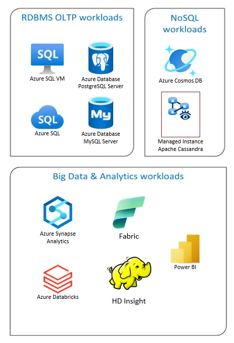

This article provides an overview of the Azure **operational** database solutions described in Azure Architecture Center. 

If you want to explore Analytical databases (OLAP) and architectures please visit [Analytical Data Stores](azure/architecture/solution-ideas/articles/analytics-get-started).

**Azure operational database solutions** include traditional relational database management systems (RDBMS) as well as NoSQL solutions. Azure Databases are managed, highly reliable (secure and scale-proof), AI-ready and natively integrated with other Azure services such as Fabric and AI Foundry in order to build and end-to-end data platform to bring value to your business processes.

-	If you want to explore non-relational databases on Azure see [NoSQL Data](/azure/architecture/data-guide/big-data/non-relational-data) and [What are NoSQL Databases?](https://azure.microsoft.com/resources/cloud-computing-dictionary/what-is-nosql-database/)
-   Refer to [RDBMS Databases](/products/category/databases/?msockid=1c5190a7254460011f6a862a24566162#tabs-pill-bar-ocd815_tab1) in order to understand the options for RDBMS on Azure.

This article provides resources to learn about Azure databases. It outlines paths to implement the architectures that meet your needs and best practices to keep in mind as you design your solutions.

There are many architectures for you to draw from to address your database needs. We also provide solution ideas for you to build on, which include links to all the components you need.

## Learn about databases on Azure

As you start thinking about possible architectures for your solution, it's vital that you choose the correct data store. If you're new to databases on Azure, the best place to start is Microsoft Learn. This free online platform provides videos and tutorials for hands-on learning. Microsoft Learn offers learning paths that are based on your job role, such as developer or data analyst.

You can start with a general description of the [different databases](/products/category/databases) in Azure and their use. You can also browse [Azure data modules](/training/browse/?products=azure&terms=database). These articles help you understand your choices in Azure data solutions and learn why some solutions are recommended in specific scenarios.

Here are some **Learn modules** about Azure databases:

- [Design your migration to Azure](/training/modules/design-your-migration-to-azure)
- [Deploy Azure SQL PaaS options](/training/modules/deploy-paas-solutions-with-azure-sql/)
- [SQL Server on Azure VMs](/azure/azure-sql/virtual-machines/windows/sql-server-on-azure-vm-iaas-what-is-overview) 
- [Secure your Azure SQL Database](/training/modules/secure-your-azure-sql-database)
- [Azure Cosmos DB](/azure/cosmos-db/introduction) 
- [What is Azure DocumentDB (with MongoDB compatibility)?](/azure/documentdb/overview)
- [Azure Database for PostgreSQL](/azure/postgresql/)
- [HorizonDB](/products/horizondb?msockid=1c5190a7254460011f6a862a24566162)
- [Azure Database for MySQL](/azure/mysql/flexible-server/overview-single)

## Intelligent applications and agents with Azure databases

If you want to understand the role and added value of a database in an AI scenario as well as available tools and features please check:

- [Azure Cosmos DB as vector database](/azure/cosmos-db/vector-database)
- [AI agents in Azure Cosmos DB](/azure/cosmos-db/ai-agents)
- [AI agents in Azure Database for PostgreSQL](/azure/postgresql/azure-ai/generative-ai-agents)
- [Azure AI extension in Azure Database for PostgreSQL](/azure-ai/generative-ai-azure-overview)
- [Intelligent applications and AI with Azure SQL](/sql/sql-server/ai/artificial-intelligence-intelligent-applications?view=azuresqldb-current)
- [Azure Database for PostgreSQL tools for the Azure MCP Server](/azure-mcp-server/tools/azure-database-postgresql)
- [Azure Cosmos DB tools for the Azure MCP Server](/azure/developer/azure-mcp-server/tools/azure-cosmos-db)
- [Azure SQL tools for the Azure MCP Server](/azure/developer/azure-mcp-server/tools/azure-sql)

## Integration with Analytics services

Connect your operational data to analytics solutions in order to get business insights:

- [What is Mirroring in Fabric?](/fabric/mirroring/overview)
- [Mirroring Azure Cosmos DB](/fabric/mirroring/azure-cosmos-db?context=%2Fazure%2Fcosmos-db%2Fcontext%2Fcontext)
- [Mirroring Azure Database for PostgreSQL flexible server](/fabric/mirroring/azure-database-postgresql)
- [Mirroring Azure SQL Database](/fabric/mirroring/azure-sql-database)
- [Mirroring Azure SQL Managed Instance](/fabric/mirroring/azure-sql-managed-instance)

## Path to production

To find options helpful for dealing with relational data, consider these resources:

-   To learn about OLTP systems record business interactions as they occur, see [Online transaction processing](https://github.com/MicrosoftDocs/architecture-center/blob/main/docs/data-guide/relational-data/online-transaction-processing.md).
-   To learn about OLAP, which organizes large business databases and supports complex analysis, see [Online analytical processing](https://github.com/MicrosoftDocs/architecture-center/blob/main/docs/data-guide/relational-data/online-analytical-processing.md).

A nonrelational database doesn't use the tabular schema of rows and columns. For more information, see [Non-relational data and NoSQL](/azure/architecture/databases/).

## Best practices

Review these best practices when designing your solutions.

| Best practices | Description |
|--------------- |------------ |
| [Transactional Outbox pattern with Azure Cosmos DB](../databases/guide/transactional-outbox-cosmos.yml) | Learn how to use the Transactional Outbox pattern for reliable messaging and guaranteed delivery of events. |
| [Distribute your data globally with Azure Cosmos DB](/azure/cosmos-db/distribute-data-globally) | To achieve low latency and high availability, some applications need to be deployed in datacenters that are close to their users. |
| [Security in Azure Cosmos DB](/azure/cosmos-db/database-security) | Security best practices help prevent, detect, and respond to database breaches. |
| [Continuous backup with point-in-time restore in Azure Cosmos DB](/azure/cosmos-db/continuous-backup-restore-introduction) | Learn about Azure Cosmos DB point-in-time restore feature. |
| [Achieve high availability with Azure Cosmos DB](/azure/cosmos-db/high-availability) | Azure Cosmos DB provides multiple features and configuration options to achieve high availability. |
| [High availability for Azure SQL Database and SQL Managed Instance](/azure/azure-sql/database/high-availability-sla) | The database shouldn't be a single point of failure in your architecture. |
| [Azure Cosmos DB Agent Kit](/azure/cosmos-db/gen-ai/agent-kit)  | Azure Cosmos DB Agent Kit for AI coding assistants including 45+ curated rules across eight categories  |
| [Azure Cosmos DB Gallery](https://azurecosmosdb.github.io/gallery/)  | Best source for patterns and content for Azure Cosmos DB |
| [Azure Cosmos DB Blog](https://devblogs.microsoft.com/cosmosdb/) | Azure Cosmos DB Blog for Cosmos DB for NoSQL, Azure DocumentDB and Managed Instance for Apache Cassandra |
| [Build AI Apps with Azure Database for PostgreSQL](/training/paths/build-ai-apps-azure-database-postgresql/) | Learn about how to easily implement an AI application with Azure Database for PostgreSQL |
| [Architecture Best Practices for Azure SQL Database](/azure/well-architected/service-guides/azure-sql-database) | Architectural recommendations for Azure SQL that are mapped to the principles of the [Well-Architected Framework pillars](/azure/well-architected/pillars) |
| [Azure SQL Managed Instance and operational excellence](/azure/well-architected/service-guides/azure-sql-managed-instance/operational-excellence) | Azure SQL Managed Instance configuration recommendations |
| [Azure Database for PostgreSQL Best Practices](/azure/well-architected/service-guides/postgresql) | Architectural recommendations for Azure Database for PostgreSQL that are mapped to the principles of the [Well-Architected Framework pillars](/azure/well-architected/pillars)|
| [Azure Database for MySQL Best Practices](/azure/well-architected/service-guides/azure-db-mysql-cost-optimization)| Architectural recommendations for Azure Database for MySQL that are mapped to the principles of the [Well-Architected Framework pillars](/azure/well-architected/pillars)|
| [MCP server for Azure Cosmos DB](/azure/developer/azure-mcp-server/tools/azure-cosmos-db)| Azure MCP Server tools for Azure Cosmos DB |
| [MCP Server for Azure Database for PostgreSQL](/azure/developer/azure-mcp-server/tools/azure-database-postgresql)| Azure MCP Server tools for Azure DB for PostgreSQL |
| [MCP Server for Azure Database for MySQL](/azure/developer/azure-mcp-server/tools/azure-mysql)| Azure MCP Server tools for Azure DB for MySQL |
| [Optimize administration of SQL Server instances](azure/architecture/hybrid/azure-arc-sql-server) | Optimize your SQL Server Instances

## Technology choices

There are many options for technologies to use with Azure Databases. These articles help you choose the best technologies for your needs.
-   [Choose a Data Store](/azure/architecture/guide/technology-choices/data-stores-getting-started)
-	[Choose a search data store in Azure](/azure/architecture/data-guide/technology-choices/search-options)

## Stay current with databases

Refer to [Azure updates](https://azure.microsoft.com/updates/?category=databases) to keep current with Azure Databases technology.

## Contributors

*Microsoft maintains this article. The following contributors wrote this article.*

- [Mohit Agarwal](https://www.linkedin.com/in/mohitagarwal01/) |  Principal Cloud Solution Architect

*To see nonpublic LinkedIn profiles, sign in to LinkedIn.*

## Similar database products

If you're familiar with Amazon Web Services (AWS) or Google Cloud, refer to the following comparisons:

- [Relational database technologies on Azure and AWS](../aws-professional/databases.md)
- [Google Cloud to Azure services comparison - Data platform](../gcp-professional/services.md#data-platform)
