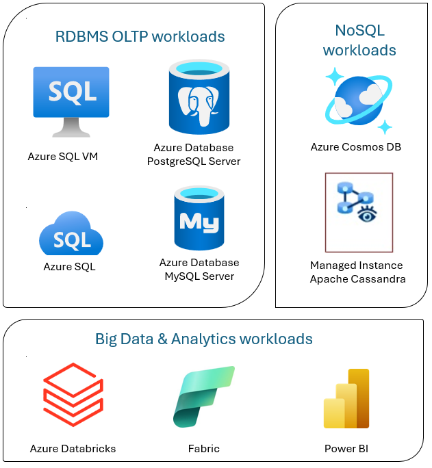

This article provides an overview of the Azure database solutions described in Azure Architecture Center.

*Apache®, Apache Cassandra®, and the Hadoop logo are either registered trademarks or trademarks of the Apache Software Foundation in the United States and/or other countries. No endorsement by The Apache Software Foundation is implied by the use of these marks.*

Azure Database solutions include traditional relational database management systems (RDBMS and OLTP), big data and analytics workloads (including OLAP), and NoSQL workloads.

RDBMS workloads include online transaction processing (OLTP) and online analytical processing (OLAP).
Data from multiple sources in the organization can be consolidated into a data warehouse.
You can use an extract, transform, load (ETL) or extract, load, transform (ELT) process to move and transform the source data. For more information on RDBMS Databases, see [Explore Relational Databases in Azure](/training/modules/explore-provision-deploy-relational-database-offerings-azure/).

A big data architecture is designed to handle the ingestion, processing, and analysis of large or complex data.
Big data solutions typically involve a large amount of relational and nonrelational data, which traditional RDBMS systems aren't well suited to store. These typically involve solutions such as Data Lakes, Delta Lakes, and lakehouses. See more information in [Analytics Architecture Design](/azure/architecture/solution-ideas/articles/analytics-start-here).

NoSQL databases are interchangeably referred to as *nonrelational*, *NoSQL DBs*, or *non-SQL* to highlight the fact that they can handle huge volumes of rapidly changing, unstructured data. They don't store data in tables, rows, and columns, like (SQL) databases. For more information on No SQL DBs Databases, see [NoSQL Data](/azure/architecture/data-guide/big-data/non-relational-data) and [What are NoSQL Databases?](https://azure.microsoft.com/resources/cloud-computing-dictionary/what-is-nosql-database/).

This article provides resources to learn about Azure databases. It outlines paths to implement the architectures that meet your needs and best practices to keep in mind as you design your solutions.

There are many architectures for you to draw from to address your database needs.
We also provide solution ideas for you to build on, which include links to all the components you need.

## Learn about databases on Azure

As you start thinking about possible architectures for your solution, it's vital that you choose the correct data store. If you're new to databases on Azure, the best place to start is Microsoft Learn. This free online platform provides videos and tutorials for hands-on learning. Microsoft Learn offers learning paths that are based on your job role, such as developer or data analyst.

You can start with a general description of the [different databases](https://azure.microsoft.com/products/category/databases) in Azure and their use. You can also browse [Azure data modules](/training/browse/?products=azure&terms=database) and [Choose a data storage approach in Azure](/training/modules/choose-storage-approach-in-azure). These articles help you understand your choices in Azure data solutions and learn why some solutions are recommended in specific scenarios.

Here are some Learn modules you might find useful:

- [Design your migration to Azure](/training/modules/design-your-migration-to-azure)
- [Deploy Azure SQL Database](/training/modules/deploy-azure-sql-database)
- [Explore Azure database and analytics services](/training/modules/azure-database-fundamentals)
- [Secure your Azure SQL Database](/training/modules/secure-your-azure-sql-database)
- [Azure Cosmos DB](/azure/cosmos-db/introduction)
- [Azure Database for PostgreSQL](/azure/postgresql/)
- [Azure Database for MySQL](/azure/mysql/flexible-server/overview-single)
- [SQL Server on Azure VMs](/azure/azure-sql/virtual-machines/windows/sql-server-on-azure-vm-iaas-what-is-overview)

## Path to production

To find options helpful for dealing with relational data, consider these resources:

- To learn about resources for gathering data from multiple sources and how to and apply data transformations within the data pipelines, see [Analytics in Azure](/azure/architecture/solution-ideas/articles/analytics-start-here).
- To learn about OLAP, which organizes large business databases and supports complex analysis, see [Online analytical processing](../data-guide/relational-data/online-analytical-processing.md).
- To learn about OLTP systems record business interactions as they occur, see [Online transaction processing](../data-guide/relational-data/online-transaction-processing.md).

A *nonrelational database* doesn't use the tabular schema of rows and columns. For more information, see [Nonrelational data and NoSQL](../data-guide/big-data/non-relational-data.yml).

To learn about data lakes, which hold a large amount of data in its native, raw format, see [Data lakes](../data-guide/scenarios/data-lake.md).

A big data architecture can handle ingestion, processing, and analysis of data that is too large or too complex for traditional database systems. For more information, see [Big data architectures](../databases/guide/big-data-architectures.md) and [Analytics](/azure/architecture/solution-ideas/articles/analytics-start-here).

A hybrid cloud is an IT environment that combines public cloud and on-premises datacenters. For more information, consider [Azure Arc](/azure/azure-arc/overview) combined with Azure databases.

Azure Cosmos DB is a fully managed NoSQL database service for modern app development. For more information, see [Azure Cosmos DB resource model](/azure/cosmos-db/account-databases-containers-items).

To learn about the options for transferring data to and from Azure, see [Transfer data to and from Azure](../data-guide/scenarios/data-transfer.md).

## Best practices

Review these best practices when designing your solutions.

| Best practices | Description |
|--------------- |------------ |
| [Transactional Outbox pattern with Azure Cosmos DB](../databases/guide/transactional-outbox-cosmos.yml) | Learn how to use the Transactional Outbox pattern for reliable messaging and guaranteed delivery of events. |
| [Distribute your data globally with Azure Cosmos DB](/azure/cosmos-db/distribute-data-globally) | To achieve low latency and high availability, some applications need to be deployed in datacenters that are close to their users. |
| [Security in Azure Cosmos DB](/azure/cosmos-db/database-security) | Security best practices help prevent, detect, and respond to database breaches. |
| [Continuous backup with point-in-time restore in Azure Cosmos DB](/azure/cosmos-db/continuous-backup-restore-introduction) | Learn about Azure Cosmos DB point-in-time restore feature. |
| [Achieve high availability with Azure Cosmos DB](/azure/cosmos-db/high-availability) | Azure Cosmos DB provides multiple features and configuration options to achieve high availability. |
| [High availability for Azure SQL Database and SQL Managed Instance](/azure/azure-sql/database/high-availability-sla) | The database shouldn't be a single point of failure in your architecture. |

## Technology choices

There are many options for technologies to use with Azure Databases.
These articles help you choose the best technologies for your needs.

- [Choose a Data Store](/azure/architecture/guide/technology-choices/data-stores-getting-started)
- [Choose an analytical data store in Azure](../data-guide/technology-choices/analytical-data-stores.md)
- [Choose a data analytics technology in Azure](../data-guide/technology-choices/analysis-visualizations-reporting.md)
- [Choose a batch processing technology in Azure](../data-guide/technology-choices/batch-processing.md)
- [Choose a big data storage technology in Azure](../data-guide/technology-choices/data-storage.md)
- [Choose a data pipeline orchestration technology in Azure](../data-guide/technology-choices/pipeline-orchestration-data-movement.md)
- [Choose a search data store in Azure](../data-guide/technology-choices/search-options.md)
- [Choose a stream processing technology in Azure](../data-guide/technology-choices/stream-processing.md)

## Stay current with databases

Refer to [Azure updates](https://azure.microsoft.com/updates/?category=databases) to keep current with Azure Databases technology.

## Contributors

*Microsoft maintains this article. The following contributors wrote this article.*

- [Mohit Agarwal](https://www.linkedin.com/in/mohitagarwal01/) |  Principal Cloud Solution Architect

*To see nonpublic LinkedIn profiles, sign in to LinkedIn.*

## Related resources

- [Adatum Corporation scenario for cloud-scale analytics in Azure](/azure/cloud-adoption-framework/scenarios/cloud-scale-analytics/architectures/reference-architecture-adatum)
- [Lamna Healthcare scenario for data management and analytics in Azure](/azure/cloud-adoption-framework/scenarios/data-management/architectures/reference-architecture-lamna)
- [Optimize administration of SQL Server instances](../hybrid/azure-arc-sql-server.yml)
- [Relecloud scenario for data management and analytics in Azure](/azure/cloud-adoption-framework/scenarios/data-management/architectures/reference-architecture-relecloud)

### Similar database products

If you're familiar with Amazon Web Services (AWS) or Google Cloud, refer to the following comparisons:

- [Relational database technologies on Azure and AWS](../aws-professional/databases.md)
- [Google Cloud to Azure services comparison - Data platform](../gcp-professional/services.md#data-platform)
