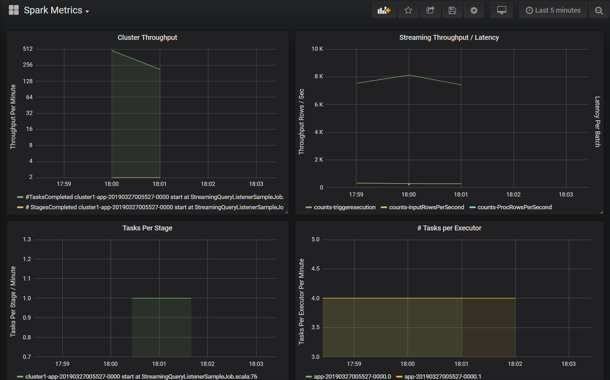

<!-- cSpell:ignore Grafana perftools loganalytics bitnami sparkmonitoring LOGTYPE -->

# Use dashboards to visualize Azure Databricks metrics

> [!NOTE]
> This article relies on an open source library hosted on GitHub at: https://github.com/mspnp/spark-monitoring.
>
> The original library supports Azure Databricks Runtimes 10.x (Spark 3.2.x) and earlier.
>
> Databricks has contributed an updated version to support Azure Databricks Runtimes 11.0 (Spark 3.3.x) and above on the `l4jv2` branch at: https://github.com/mspnp/spark-monitoring/tree/l4jv2.
>
> Please note that the 11.0 release is not backwards compatible due to the different logging systems used in the Databricks Runtimes. Be sure to use the correct build for your Databricks Runtime. The library and Github repository are in maintenance mode. There are no plans for further releases, and issue support will be best-effort only. For any additional questions regarding the library or the roadmap for monitoring and logging of your Azure Databricks environments, please contact azure-spark-monitoring-help@databricks.com.

This article shows how to set up a Grafana dashboard to monitor Azure Databricks jobs for performance issues.

[Azure Databricks](/azure/azure-databricks) is a fast, powerful, and collaborative [Apache Spark](https://spark.apache.org)–based analytics service that makes it easy to rapidly develop and deploy big data analytics and artificial intelligence (AI) solutions. Monitoring is a critical component of operating Azure Databricks workloads in production. The first step is to gather metrics into a workspace for analysis. In Azure, the best solution for managing log data is [Azure Monitor](/azure/azure-monitor). Azure Databricks does not natively support sending log data to Azure monitor, but a [library for this functionality](https://github.com/mspnp/spark-monitoring) is available in [GitHub](https://github.com).

This library enables logging of Azure Databricks service metrics as well as Apache Spark structure streaming query event metrics. Once you've successfully deployed this library to an Azure Databricks cluster, you can further deploy a set of [Grafana](https://grafana.com) dashboards that you can deploy as part of your production environment.



## Prerequisites

Configure your Azure Databricks cluster to use the monitoring library, as described in the [GitHub readme][config-cluster].

## Deploy the Azure Log Analytics workspace

To deploy the Azure Log Analytics workspace, follow these steps:

1. Navigate to the `/perftools/deployment/loganalytics` directory.
1. Deploy the **logAnalyticsDeploy.json** Azure Resource Manager template. For more information about deploying Resource Manager templates, see [Deploy resources with Resource Manager templates and Azure CLI][rm-cli]. The template has the following parameters:

    - **location**: The region where the Log Analytics workspace and dashboards are deployed.
    - **serviceTier**: The workspace pricing tier. See [here][sku] for a list of valid values.
    - **dataRetention** (optional): The number of days the log data is retained in the Log Analytics workspace. The default value is 30 days. If the pricing tier is `Free`, the data retention must be seven days.
    - **workspaceName** (optional): A name for the workspace. If not specified, the template generates a name.

    ```azurecli
    az deployment group create --resource-group <resource-group-name> --template-file logAnalyticsDeploy.json --parameters location='East US' serviceTier='Standalone'
    ```

This template creates the workspace and also creates a set of predefined queries that are used by dashboard.

## Deploy Grafana in a virtual machine

Grafana is an open source project you can deploy to visualize the time series metrics stored in your Azure Log Analytics workspace using the Grafana plugin for Azure Monitor. Grafana executes on a virtual machine (VM) and requires a storage account, virtual network, and other resources. To deploy a virtual machine with the bitnami-certified Grafana image and associated resources, follow these steps:

1. Use the Azure CLI to accept the Azure Marketplace image terms for Grafana.

    ```azurecli
    az vm image terms accept --publisher bitnami --offer grafana --plan default
    ```

1. Navigate to the `/spark-monitoring/perftools/deployment/grafana` directory in your local copy of the GitHub repo.
1. Deploy the **grafanaDeploy.json** Resource Manager template as follows:

    ```azurecli
    export DATA_SOURCE="https://raw.githubusercontent.com/mspnp/spark-monitoring/master/perftools/deployment/grafana/AzureDataSource.sh"
    az deployment group create \
        --resource-group <resource-group-name> \
        --template-file grafanaDeploy.json \
        --parameters adminPass='<vm password>' dataSource=$DATA_SOURCE
    ```

Once the deployment is complete, the bitnami image of Grafana is installed on the virtual machine.

## Update the Grafana password

As part of the setup process, the Grafana installation script outputs a temporary password for the **admin** user. You need this temporary password to sign in. To obtain the temporary password, follow these steps:

1. Log in to the Azure portal.
1. Select the resource group where the resources were deployed.
1. Select the VM where Grafana was installed. If you used the default parameter name in the deployment template, the VM name is prefaced with **sparkmonitoring-vm-grafana**.
1. In the **Support + troubleshooting** section, click **Boot diagnostics** to open the boot diagnostics page.
1. Click **Serial log** on the boot diagnostics page.
1. Search for the following string: "Setting Bitnami application password to".
1. Copy the password to a safe location.

Next, change the Grafana administrator password by following these steps:

1. In the Azure portal, select the VM and click **Overview**.
1. Copy the public IP address.
1. Open a web browser and navigate to the following URL: `http://<IP address>:3000`.
1. At the Grafana login screen, enter **admin** for the user name, and use the Grafana password from the previous steps.
1. Once logged in, select **Configuration** (the gear icon).
1. Select **Server Admin**.
1. On the **Users** tab, select the **admin** login.
1. Update the password.

## Create an Azure Monitor data source

1. Create a service principal that allows Grafana to manage access to your Log Analytics workspace. For more information, see [Create an Azure service principal with Azure CLI](/cli/azure/create-an-azure-service-principal-azure-cli)

    ```azurecli
    az ad sp create-for-rbac --name http://<service principal name> \
                    --role "Log Analytics Reader" \
                    --scopes /subscriptions/mySubscriptionID
    ```

1. Note the values for appId, password, and tenant in the output from this command:

    ```json
    {
        "appId": "xxxxxxxx-xxxx-xxxx-xxxx-xxxxxxxxxxxx",
        "displayName": "azure-cli-2019-03-27-00-33-39",
        "name": "http://<service principal name>",
        "password": "xxxxxxxx-xxxx-xxxx-xxxx-xxxxxxxxxxxx",
        "tenant": "xxxxxxxx-xxxx-xxxx-xxxx-xxxxxxxxxxxx"
    }
    ```

1. Log into Grafana as described earlier. Select **Configuration** (the gear icon) and then **Data Sources**.
1. In the **Data Sources** tab, click **Add data source**.
1. Select **Azure Monitor** as the data source type.
1. In the **Settings** section, enter a name for the data source in the **Name** textbox.
1. In the **Azure Monitor API Details** section, enter the following information:

    - Subscription Id: Your Azure subscription ID.
    - Tenant Id: The tenant ID from earlier.
    - Client Id: The value of "appId" from earlier.
    - Client Secret: The value of "password" from earlier.

1. In the **Azure Log Analytics API Details** section, check the **Same Details as Azure Monitor API** checkbox.
1. Click **Save & Test**. If the Log Analytics data source is correctly configured, a success message is displayed.

## Create the dashboard

Create the dashboards in Grafana by following these steps:

1. Navigate to the `/perftools/dashboards/grafana` directory in your local copy of the GitHub repo.
1. Run the following script:

    ```bash
    export WORKSPACE=<your Azure Log Analytics workspace ID>
    export LOGTYPE=SparkListenerEvent_CL

    sh DashGen.sh
    ```

    The output from the script is a file named **SparkMonitoringDash.json**.

1. Return to the Grafana dashboard and select **Create** (the plus icon).
1. Select **Import**.
1. Click **Upload .json File**.
1. Select the **SparkMonitoringDash.json** file created in step 2.
1. In the **Options** section, under **ALA**, select the Azure Monitor data source created earlier.
1. Click **Import**.

## Visualizations in the dashboards

Both the Azure Log Analytics and Grafana dashboards include a set of time-series visualizations. Each graph is time-series plot of metric data related to an Apache Spark [job](https://spark.apache.org/docs/latest/job-scheduling.html), stages of the job, and tasks that make up each stage.

The visualizations are:

### Job latency

This visualization shows execution latency for a job, which is a coarse view on the overall performance of a job. Displays the job execution duration from start to completion. Note that the job start time is not the same as the job submission time. Latency is represented as percentiles (10%, 30%, 50%, 90%) of job execution indexed by cluster ID and application ID.

### Stage latency

The visualization shows the latency of each stage per cluster, per application, and per individual stage. This visualization is useful for identifying a particular stage that is running slowly.

### Task latency

This visualization shows task execution latency. Latency is represented as a percentile of task execution per cluster, stage name, and application.

### Sum Task Execution per host

This visualization shows the sum of task execution latency per host running on a cluster. Viewing task execution latency per host identifies hosts that have much higher overall task latency than other hosts. This may mean that tasks have been inefficiently or unevenly distributed to hosts.

### Task metrics

This visualization shows a set of the execution metrics for a given task's execution. These metrics include the size and duration of a data shuffle, duration of serialization and deserialization operations, and others. For the full set of metrics, view the Log Analytics query for the panel. This visualization is useful for understanding the operations that make up a task and identifying resource consumption of each operation. Spikes in the graph represent costly operations that should be investigated.

### Cluster throughput

This visualization is a high-level view of work items indexed by cluster and application to represent the amount of work done per cluster and application. It shows the number of jobs, tasks, and stages completed per cluster, application, and stage in one minute increments.

### Streaming Throughput/Latency

This visualization is related to the metrics associated with a structured streaming query. The graph shows the number of input rows per second and the number of rows processed per second. The streaming metrics are also represented per application. These metrics are sent when the OnQueryProgress event is generated as the structured streaming query is processed and the visualization represents streaming latency as the amount of time, in milliseconds, taken to execute a query batch.

### Resource consumption per executor

Next is a set of visualizations for the dashboard show the particular type of resource and how it is consumed per executor on each cluster. These visualizations help identify outliers in resource consumption per executor. For example, if the work allocation for a particular executor is skewed, resource consumption will be elevated in relation to other executors running on the cluster. This can be identified by spikes in the resource consumption for an executor.

### Executor compute time metrics

Next is a set of visualizations for the dashboard that show the ratio of executor serialize time, deserialize time, CPU time, and Java virtual machine time to overall executor compute time. This demonstrates visually how much each of these four metrics is contributing to overall executor processing.

### Shuffle metrics

The final set of visualizations shows the data shuffle metrics associated with a structured streaming query across all executors. These include shuffle bytes read, shuffle bytes written, shuffle memory, and disk usage in queries where the file system is used.

## Next steps

> [!div class="nextstepaction"]
> [Troubleshoot performance bottlenecks](./performance-troubleshooting.md)

## Related resources

- [Monitoring Azure Databricks](index.md)
- [Send Azure Databricks application logs to Azure Monitor](application-logs.md)
- [Modern analytics architecture with Azure Databricks](../solution-ideas/articles/azure-databricks-modern-analytics-architecture.yml)
- [Ingestion, ETL, and stream processing pipelines with Azure Databricks](../solution-ideas/articles/ingest-etl-stream-with-adb.yml)

<!-- links -->

[config-cluster]: https://github.com/mspnp/spark-monitoring/blob/master/README.md
[rm-cli]: /azure/azure-resource-manager/resource-group-template-deploy-cli
[sku]: /azure/templates/Microsoft.OperationalInsights/2015-11-01-preview/workspaces#sku-object
