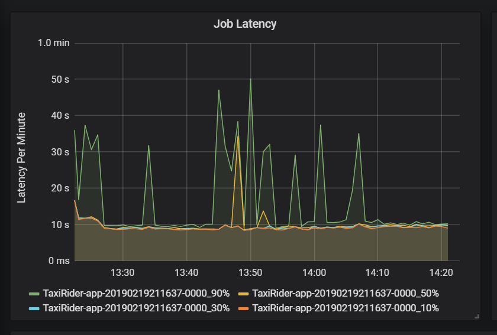
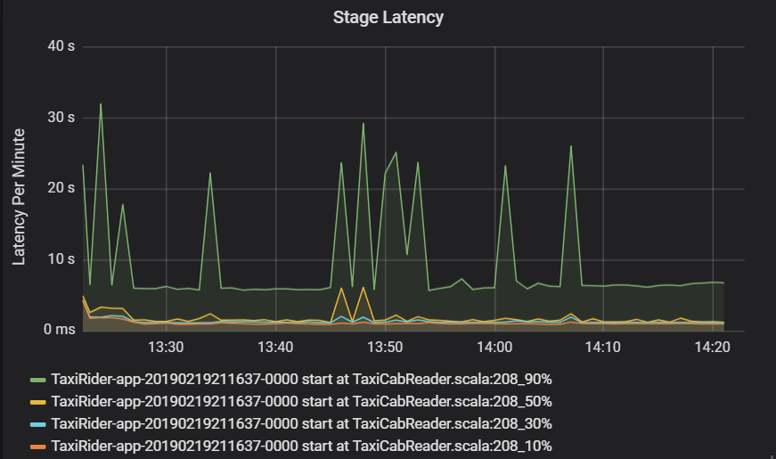
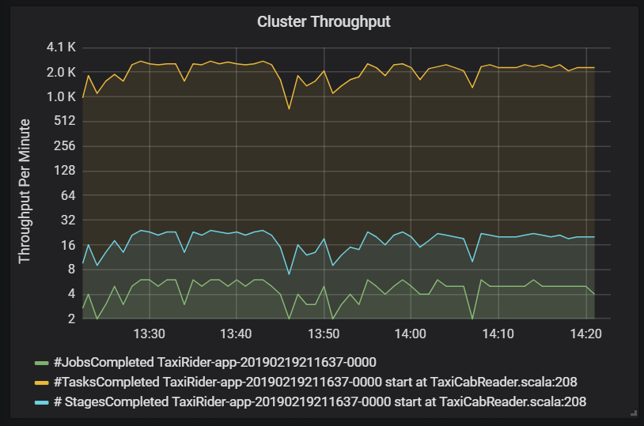
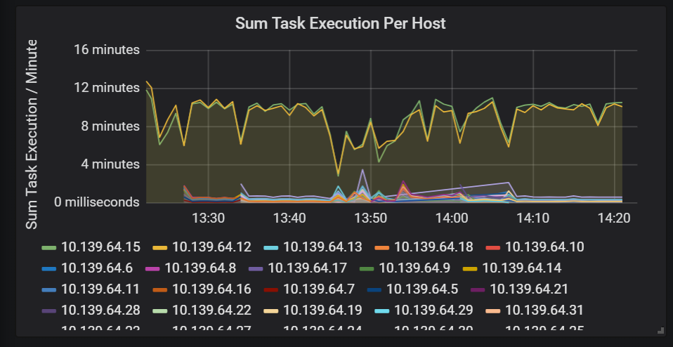
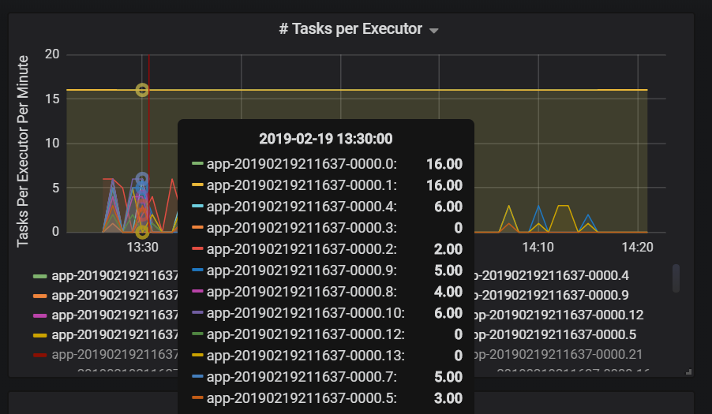
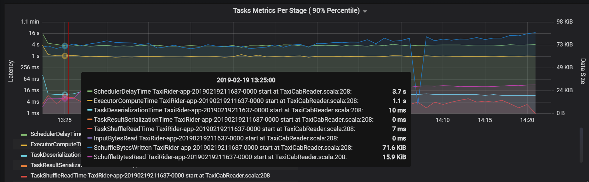
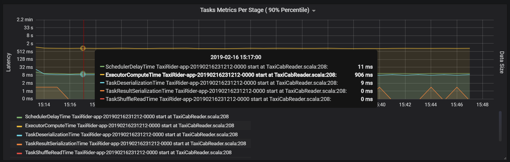
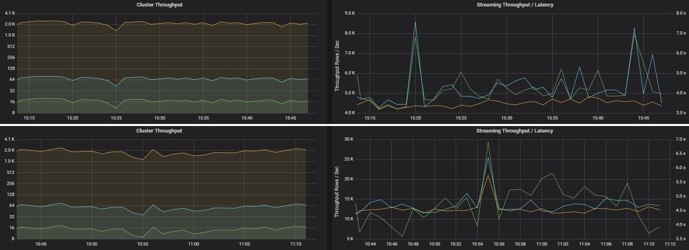
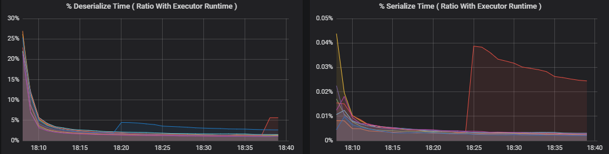
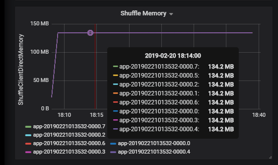

<!-- cSpell:ignore Grafana -->

# Troubleshoot performance bottlenecks in Azure Databricks

> [!NOTE]
> This article relies on an open source library hosted on GitHub at: https://github.com/mspnp/spark-monitoring. The original library supports Azure Databricks Runtimes 10.x (Spark 3.2.x) and earlier. Databricks has contributed an updated version to support Azure Databricks Runtimes 11.0 (Spark 3.3.x) and above: https://github.com/mspnp/spark-monitoring/tree/l4jv2. Please note the 11.0 release is not backwards compatible due to the different logging systems used in the Databricks Runtimes. Be sure to use the correct build for your Databricks Runtime. This library and Github repository are in maintenance mode. There are no plans for further releases, and issue support will be best-effort only. For any additional questions regarding this library or the roadmap for monitoring and logging of your Azure Databricks environments, please contact azure-spark-monitoring-help@databricks.com.

This article describes how to use monitoring dashboards to find performance bottlenecks in Spark jobs on Azure Databricks.

[Azure Databricks](/azure/azure-databricks) is an [Apache Spark](https://spark.apache.org)–based analytics service that makes it easy to rapidly develop and deploy big data analytics. Monitoring and troubleshooting performance issues is a critical when operating production Azure Databricks workloads. To identify common performance issues, it's helpful to use monitoring visualizations based on telemetry data.

## Prerequisites

To set up the Grafana dashboards shown in this article:

- Configure your Databricks cluster to send telemetry to a Log Analytics workspace, using the Azure Databricks Monitoring Library. For details, see the [GitHub readme][config-cluster].

- Deploy Grafana in a virtual machine. See [Use dashboards to visualize Azure Databricks metrics](./dashboards.md).

The Grafana dashboard that is deployed includes a set of time-series visualizations. Each graph is time-series plot of metrics related to an Apache Spark job, the stages of the job, and tasks that make up each stage.

## Azure Databricks performance overview

Azure Databricks is based on Apache Spark, a general-purpose distributed computing system. Application code, known as a **job**, executes on an Apache Spark cluster, coordinated by the cluster manager. In general, a job is the highest-level unit of computation. A job represents the complete operation performed by the Spark application. A typical operation includes reading data from a source, applying data transformations, and writing the results to storage or another destination.

Jobs are broken down into **stages**. The job advances through the stages sequentially, which means that later stages must wait for earlier stages to complete. Stages contain groups of identical **tasks** that can be executed in parallel on multiple nodes of the Spark cluster. Tasks are the most granular unit of execution taking place on a subset of the data.

The next sections describe some dashboard visualizations that are useful for performance troubleshooting.

## Job and stage latency

Job latency is the duration of a job execution from when it starts until it completes. It is shown as percentiles of a job execution per cluster and application ID, to allow the visualization of outliers. The following graph shows a job history where the 90th percentile reached 50 seconds, even though the 50th percentile was consistently around 10 seconds.

Investigate job execution by cluster and application, looking for spikes in latency. Once clusters and applications with high latency are identified, move on to investigate stage latency.

Stage latency is also shown as percentiles to allow the visualization of outliers. Stage latency is broken out by cluster, application, and stage name. Identify spikes in task latency in the graph to determine which tasks are holding back completion of the stage.

The cluster throughput graph shows the number of jobs, stages, and tasks completed per minute. This helps you to understand the workload in terms of the relative number of stages and tasks per job. Here you can see that the number of jobs per minute ranges between 2 and 6, while the number of stages is about 12 &ndash; 24 per minute.

## Sum of task execution latency

This visualization shows the sum of task execution latency per host running on a cluster. Use this graph to detect tasks that run slowly due to the host slowing down on a cluster, or a misallocation of tasks per executor. In the following graph, most of the hosts have a sum of about 30 seconds. However, two of the hosts have sums that hover around 10 minutes. Either the hosts are running slow or the number of tasks per executor is misallocated.

The number of tasks per executor shows that two executors are assigned a disproportionate number of tasks, causing a bottleneck.

## Task metrics per stage

The task metrics visualization gives the cost breakdown for a task execution. You can use it see the relative time spent on tasks such as serialization and deserialization. This data might show opportunities to optimize &mdash; for example, by using [broadcast variables](https://spark.apache.org/docs/2.2.0/rdd-programming-guide.html#broadcast-variables) to avoid shipping data. The task metrics also show the shuffle data size for a task, and the shuffle read and write times. If these values are high, it means that a lot of data is moving across the network.

Another task metric is the scheduler delay, which measures how long it takes to schedule a task. Ideally, this value should be low compared to the executor compute time, which is the time spent actually executing the task.

The following graph shows a scheduler delay time (3.7 s) that exceeds the executor compute time (1.1 s). That means more time is spent waiting for tasks to be scheduled than doing the actual work.

In this case, the problem was caused by having too many partitions, which caused a lot of overhead. Reducing the number of partitions lowered the scheduler delay time. The next graph shows that most of the time is spent executing the task.

## Streaming throughput and latency

Streaming throughput is directly related to structured streaming. There are two important metrics associated with streaming throughput: Input rows per second and processed rows per second. If input rows per second outpaces processed rows per second, it means the stream processing system is falling behind. Also, if the input data comes from Event Hubs or Kafka, then input rows per second should keep up with the data ingestion rate at the front end.

Two jobs can have similar cluster throughput but very different streaming metrics. The following screenshot shows two different workloads. They are similar in terms of cluster throughput (jobs, stages, and tasks per minute). But the second run processes 12,000 rows/sec versus 4,000 rows/sec.

Streaming throughput is often a better business metric than cluster throughput, because it measures the number of data records that are processed.

## Resource consumption per executor

These metrics help to understand the work that each executor performs.

**Percentage metrics** measure how much time an executor spends on various things, expressed as a ratio of time spent versus the overall executor compute time. The metrics are:

- % Serialize time
- % Deserialize time
- % CPU executor time
- % JVM time

These visualizations show how much each of these metrics contributes to overall executor processing.

**Shuffle metrics** are metrics related to data shuffling across the executors.

- Shuffle I/O
- Shuffle memory
- File system usage
- Disk usage

## Common performance bottlenecks

Two common performance bottlenecks in Spark are *task stragglers* and a *non-optimal shuffle partition count*.

### Task stragglers

The stages in a job are executed sequentially, with earlier stages blocking later stages. If one task executes a shuffle partition more slowly than other tasks, all tasks in the cluster must wait for the slow task to catch up before the stage can end. This can happen for the following reasons:

1. A host or group of hosts are running slow. Symptoms: High task, stage, or job latency and low cluster throughput. The summation of tasks latencies per host won't be evenly distributed. However, resource consumption will be evenly distributed across executors.

1. Tasks have an expensive aggregation to execute (data skewing). Symptoms: High task latency, high stage latency, high job latency, or low cluster throughput, but the summation of latencies per host is evenly distributed. Resource consumption will be evenly distributed across executors.

1. If partitions are of unequal size, a larger partition may cause unbalanced task execution (partition skewing). Symptoms: Executor resource consumption is high compared to other executors running on the cluster. All tasks running on that executor will run slow and hold the stage execution in the pipeline. Those stages are said to be *stage barriers*.

### Non-optimal shuffle partition count

During a structured streaming query, the assignment of a task to an executor is a resource-intensive operation for the cluster. If the shuffle data isn't the optimal size, the amount of delay for a task will negatively impact throughput and latency. If there are too few partitions, the cores in the cluster will be underutilized which can result in processing inefficiency. Conversely, if there are too many partitions, there's a great deal of management overhead for a small number of tasks.

Use the resource consumption metrics to troubleshoot partition skewing and misallocation of executors on the cluster. If a partition is skewed, executor resources will be elevated in comparison to other executors running on the cluster.

For example, the following graph shows that the memory used by shuffling on the first two executors is 90X bigger than the other executors:

[config-cluster]: https://github.com/mspnp/spark-monitoring/blob/master/README.md

## Next steps

- [Monitoring Azure Databricks in an Azure Log Analytics Workspace](https://github.com/mspnp/spark-monitoring/blob/main/README.md)
- [Learning path: Build and operate machine learning solutions with Azure Databricks](/training/paths/build-operate-machine-learning-solutions-azure-databricks)
- [Azure Databricks documentation](/azure/databricks)
- [Azure Monitor overview](/azure/azure-monitor/overview)

## Related resources

- [Monitoring Azure Databricks](index.md)
- [Send Azure Databricks application logs to Azure Monitor](application-logs.md)
- [Use dashboards to visualize Azure Databricks metrics](dashboards.md)
- [Modern analytics architecture with Azure Databricks](../solution-ideas/articles/azure-databricks-modern-analytics-architecture.yml)
- [Ingestion, ETL, and stream processing pipelines with Azure Databricks](../solution-ideas/articles/ingest-etl-stream-with-adb.yml)