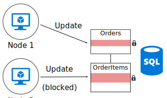
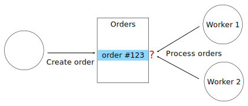

# Minimize coordination between application services. 

Most cloud applications consist of multiple application services &mdash; web front ends, databases, business processes, reporting and analysis, and so on. To achieve scalability and reliability, each of those services runs on multiple instances. 

What happens when two instances try to perform concurrent operations that affect  some shared state? In some cases, there must be coordination across nodes, for example to preserve ACID guarantees. In this diagram, `Node2` is waiting for `Node1` to release a database lock:

Coordination limits the benefits of horizontal scale and creates bottlenecks. In this example, as you scale out the application and add more instances, you'll see increased lock contention. In the worse case, the front-end instances will spend most of their time waiting on locks.

"Exactly once" semantics are another frequent source of coordination. For example, an order must be processed exactly once. Two workers are listening for new orders. `Worker1` picks up an order for processing. The application must ensure that `Worker2` doesn't duplicate the work, but also if `Worker1` 
crashes, the order isn't dropped.

You can use a pattern such as [Scheduler Agent Supervisor][sas-pattern] to coordinate between the workers, but in this case a better approach might be to partition the work. Each worker is assigned a certain range of orders (say, by billing region). If a worker crashes, a new instance picks up where the previous instance left off, but multiple instances aren't contending.

## Recommendations

**Use optimistic concurrency control.** Pessimistic concurrency causes excessive locking.

**Use multiversion concurrency control (MVCC)** when the database engine supports it. MVCC isolates reads from write transactions without locking. 

**Use event sourcing**. With this approach, changes to state are recorded as a series of events to an append-only data store. Appending an event to the stream is an atomic operation, requiring minimal locking. The current state is obtained by replaying the events.

**Embrace eventual consistency.** If you separate reads from writes (using a pattern such as [CQRS][cqrs]), the read path does not have to wait on writes. The tradeoff is that reads might get slightly stale data. In many applications, that's an acceptable tradeoff.

**Partition data.**  Avoid putting all of your data into one relational DB scheme that is shared across many application services. (Microservices architectures enforce this prinicple by making each service responsible for its own data store.) Within a single database, partitioning the data into shards can improve concurrency, because a service writing to one shard does not affect a service writing to a different shard.

**Perform asynchronous parallel processing**. In a multi-step operation, call several services asynchronously in parallel, and then aggregate the results, rather than wait for each service to respond before calling the next.	

**Design idempotent operations.** When possible, design operations to be idempotent. That way, they can be handled using at-least-once semantics. For example, you can put work items on a queue. If a worker crashes in the middle of an operation, another worker simply picks up the work item.

**Use MapReduce or other parallel, distributed algorithms.** A MapReduce job splits work into independent tasks that can be performed by multiple nodes working in parallel.

<!-- links -->

[cqrs]: ../patterns/command-and-query-responsibility-segregation-cqrs.md
[sas-pattern]: ../patterns/scheduler-agent-supervisor.md