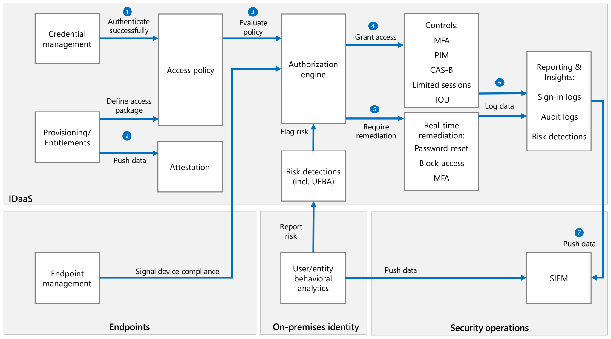

This architecture shows how security operations center (SOC) teams can incorporate Azure Active Directory (Azure AD) identity and access capabilities into an overall integrated and layered *zero-trust* security strategy.

Network security dominated SOC operations when all services and devices were contained on managed networks in organizations. However, [Gartner](https://www.gartner.com/en/newsroom/press-releases/2019-04-02-gartner-forecasts-worldwide-public-cloud-revenue-to-g) predicts that through 2022, the market size of cloud services will grow at a rate nearly three times that of overall IT services. As more companies embrace cloud computing, there's a shift toward treating [user identity](/azure/security/fundamentals/identity-management-best-practices#treat-identity-as-the-primary-security-perimeter) as the primary security boundary.

Securing identities in the cloud is a high priority.

- Verizon's [2020 data breach investigations report](https://enterprise.verizon.com/resources/reports/dbir/2020/summary-of-findings/) stated that 37% involved use of stolen credentials, and 22% of data breaches involved phishing.

- A 2019 IBM [study of data breach incidents](https://newsroom.ibm.com/2019-07-23-IBM-Study-Shows-Data-Breach-Costs-on-the-Rise-Financial-Impact-Felt-for-Years) reported that the average global cost of a data breach was $3.9M, with the US average cost closer to $8.2M.

- The [Microsoft 2019 security intelligence report](https://www.microsoft.com/security/blog/2019/02/28/microsoft-security-intelligence-report-volume-24-is-now-available/) reported that phishing attacks increased by a margin of 250% between January and December of 2018.

The [zero trust security model](https://www.microsoft.com/security/business/zero-trust) treats all hosts as if they're internet-facing, and considers the entire network to be potentially compromised and hostile. This approach focuses on building strong authentication, authorization, and encryption, while also providing compartmentalized access and better operational agility.

Gartner promotes an [adaptive security architecture](https://www.gartner.com/smarterwithgartner/build-adaptive-security-architecture-into-your-organization/) that replaces an incident response-based strategy with a *prevent-detect-respond-predict* model. Adaptive security combines access control, behavioral monitoring, usage management, and discovery with continuous monitoring and analysis.

The [Microsoft Cybersecurity Reference Architecture (MCRA)](https://gallery.technet.microsoft.com/Cybersecurity-Reference-883fb54c) describes Microsoft's cybersecurity capabilities and how they integrate with existing security architectures, including cloud and hybrid environments, that use Azure AD for *Identity-as-a-Service (IDaaS)*.

This article advances the zero-trust, adaptive security approach to IDaaS, emphasizing components available on the Azure AD platform.

## Potential use cases

- Design new security solutions
- Enhance or integrate with existing implementations
- Educate SOC teams

## Architecture

### Workflow

1. *Credential management* controls authentication.
1. *Provisioning* and *entitlement management* define the access package, assign users to resources, and push data for *attestation*.
1. The *authorization engine* evaluates the *access policy* to determine access. The engine also evaluates *risk detections*, including *user/entity behavioral analytics (UEBA)* data, and checks device compliance for *endpoint management*.
1. If authorized, the user or device gains access per *conditional access policies and controls*.
1. If authorization fails, users can do *real-time remediation* to unblock themselves.
1. All session data is *logged* for analysis and reporting.
1. The SOC team's *security information and event management system (SIEM)* receives all log, risk detection, and UEBA data from cloud and on-premises identities.

### Components

The following security processes and components contribute to this Azure AD IDaaS architecture.

#### Credential management

[Credential management](/azure/active-directory/authentication/index) includes services, policies, and practices that issue, track, and update access to resources or services. Azure AD credential management includes the following capabilities:

- [Self-service password reset (SSPR)](/azure/active-directory/authentication/concept-sspr-howitworks) lets users self-serve and reset their own lost, forgotten, or compromised passwords. SSPR not only reduces helpdesk calls, but provides greater user flexibility and security.

- [Password writeback](/azure/active-directory/authentication/concept-sspr-writeback) syncs passwords changed in the cloud with on-premises directories in real time.

- [Banned passwords](/azure/active-directory/authentication/concept-password-ban-bad) analyzes telemetry data exposing commonly used weak or compromised passwords, and bans their use globally throughout Azure AD. You can customize this functionality for your environment, and include a list of [custom passwords](/azure/active-directory/authentication/concept-password-ban-bad#custom-banned-password-list) to ban within your own organization.

- [Smart lockout](/azure/active-directory/authentication/howto-password-smart-lockout) compares legitimate authentication attempts with brute-force attempts to gain unauthorized access. Under the default smart lockout policy, an account locks out for one minute after 10 failed sign-in attempts. As sign-in attempts continue to fail, the account lockout time increases. You can use policies to adjust the settings for the appropriate mix of security and usability for your organization.

- [Multi-factor authentication (MFA)](/azure/active-directory/authentication/concept-mfa-howitworks) requires multiple forms of authentication when users attempt to access protected resources. Most users are familiar with using something they know, like a password, when accessing resources. MFA asks users to also demonstrate something that they have, like access to a trusted device, or something that they are, like a biometric identifier. MFA can use different kinds of [authentication methods](/azure/active-directory/authentication/concept-authentication-methods) like phone calls, text messages, or [notification through the authenticator app](https://www.microsoft.com/en-us/account/authenticator).

- [Passwordless authentication](https://www.microsoft.com/security/business/identity-access/azure-active-directory-passwordless-authentication) replaces the password in the authentication workflow with a smartphone or hardware token, biometric identifier, or PIN. Microsoft passwordless authentication can work with Azure resources like [Windows Hello for Business](/windows/security/identity-protection/hello-for-business/hello-identity-verification), and the [Microsoft Authenticator app](https://www.microsoft.com/en-us/account/authenticator) on mobile devices. You can also enable passwordless authentication with [FIDO2-compatible security keys](/azure/active-directory/authentication/howto-authentication-passwordless-security-key), which use [WebAuthn](https://www.w3.org/TR/webauthn-2/) and the [FIDO Alliance's Client-to-Authenticator (CTAP) protocol](https://fidoalliance.org/specifications/download/).

#### App provisioning and entitlement

- [Entitlement management](/azure/active-directory/governance/entitlement-management-overview) is an Azure AD [identity governance](/azure/active-directory/governance/identity-governance-overview) feature that enables organizations to manage identity and access lifecycle at scale. Entitlement management automates access request workflows, access assignments, reviews, and expirations.

- [Azure AD provisioning](/azure/active-directory/manage-apps/user-provisioning) lets you automatically create user identities and roles in applications that users need to access. You can configure [Azure AD provisioning](/azure/active-directory/app-provisioning/how-provisioning-works) for third-party *software-as-a-service (SaaS)* apps like [SuccessFactors](/azure/active-directory/saas-apps/sap-successfactors-inbound-provisioning-tutorial), [Workday](/azure/active-directory/saas-apps/workday-inbound-tutorial), and [many more](/azure/active-directory/saas-apps/tutorial-list).

- [Seamless single sign-on (SSO)](/azure/active-directory/hybrid/how-to-connect-sso) automatically authenticates users to cloud-based applications once they sign into their corporate devices. You can use Azure AD seamless SSO with either [password hash synchronization](/azure/active-directory/hybrid/how-to-connect-password-hash-synchronization) or [pass-through authentication](/azure/active-directory/hybrid/how-to-connect-pta).

- Attestation with [Azure AD access reviews](/azure/active-directory/governance/access-reviews-overview) help meet monitoring and auditing requirements. Access reviews let you do things like quickly identify the number of admin users, make sure new employees can access needed resources, or review users' activity to determine whether they still need access.

#### Conditional access policies and controls

A [conditional access policy](/azure/active-directory/conditional-access/concept-conditional-access-policies) is an if-then statement of assignments and access controls. You define the response ("do this") to the reason for triggering your policy ("if this"), enabling the *authorization engine* to make decisions that enforce organizational policies. With [Azure AD conditional access](/azure/active-directory/active-directory-conditional-access-azure-portal), you can control how authorized users access your apps. The Azure AD [What If tool](/azure/active-directory/conditional-access/troubleshoot-conditional-access-what-if) can help you understand why a conditional access policy was or wasn't applied, or if a policy would apply to a user in a specific circumstance.

[Conditional access controls](/azure/active-directory/conditional-access/controls) work in conjunction with conditional access policies to help enforce organizational policy. Azure AD conditional access controls let you implement security based on factors detected at the time of the access request, rather than a one-size fits all approach. By coupling conditional access controls with access conditions, you reduce the need to create additional security controls. As a typical example, you can allow users on a domain-joined device to access resources using SSO, but require MFA for users off-network or using their own devices.

Azure AD can use the following conditional access controls with conditional access policies:

- [Azure role-based access control (Azure RBAC)](/azure/role-based-access-control/) lets you configure and assign appropriate roles to users who need to do administrative or specialized tasks with Azure resources. You can use Azure RBAC to create or maintain separate dedicated admin-only accounts, scope access to roles you set up, time limit access, or grant access through approval workflows.

- [Privileged identity management (PIM)](/azure/active-directory/privileged-identity-management) helps reduce the attack vector for your organization by letting you add additional monitoring and protection to administrative accounts. With [Azure AD PIM](/azure/active-directory/privileged-identity-management/pim-configure), you can manage and control access to resources within Azure, Azure AD, and other Microsoft 365 services with [just-in-time (JIT) access and just-enough-administration (JEA)](/azure/azure-australia/role-privileged). PIM provides a history of administrative activities and a change log, and alerts you when users are added or removed from roles you define.

  You can use PIM to [require approval](/azure/active-directory/privileged-identity-management/pim-resource-roles-configure-role-settings) or justification for activating administrative roles. Users can maintain normal privileges most of the time, and request and receive access to roles they need to complete administrative or specialized tasks. When they complete their work and sign out, or the time limit on their access expires, they can reauthenticate with their standard user permissions.

- [Microsoft Defender for Cloud Apps](https://www.microsoft.com/security/business/siem-and-xdr/microsoft-defender-cloud-apps) is a *cloud access security broker (CASB)* that analyzes traffic logs to discover and monitor the applications and services in use in your organization. With Defender for Cloud Apps, you can:

  - [Create policies](/cloud-app-security/control-cloud-apps-with-policies) to manage interaction with apps and services
  - Identify applications as [sanctioned or unsanctioned](/cloud-app-security/governance-discovery)
  - [Control and limit access to data](/cloud-app-security/governance-actions)
  - [Apply information protection](/cloud-app-security/azip-integration) to guard against information loss

  Defender for Cloud Apps can also work with [access policies](/cloud-app-security/access-policy-aad) and [session policies](/cloud-app-security/session-policy-aad) to control user access to SaaS apps. For example, you can:
  
  - [Limit the IP ranges](/azure/active-directory/conditional-access/location-condition) that can access apps
  - [Require MFA](/azure/active-directory/authentication/concept-mfa-howitworks) for app access
  - [Allow activities only from within approved apps](/azure/active-directory/conditional-access/app-based-conditional-access)

- The [access control page in the SharePoint admin center](https://admin.microsoft.com/sharepoint?page=accessControl&modern=true) provides several ways to control access to SharePoint and OneDrive content. You can choose to [block access](/sharepoint/control-access-from-unmanaged-devices#block-access-using-the-new-sharepoint-admin-center), allow [limited, web-only access](/sharepoint/control-access-from-unmanaged-devices#limit-access-using-the-new-sharepoint-admin-center) from unmanaged devices, or [control access based on network location](/sharepoint/control-access-based-on-network-location).

- You can [scope application permissions to specific Exchange Online mailboxes](/graph/auth-limit-mailbox-access) by using **ApplicationAccessPolicy** from the Microsoft Graph API.

- [Terms of Use (TOU)](/azure/active-directory/conditional-access/terms-of-use) provides a way to present information that end users must consent to before gaining access to protected resources. You upload TOU documents to Azure as PDF files, which are then available as controls in conditional access policies. By creating a conditional access policy that requires users to consent to TOU at sign-in, you can easily audit users that accepted the TOU.

- [Endpoint management](/azure/active-directory/conditional-access/require-managed-devices) controls how authorized users can access your cloud apps from a broad range of devices, including mobile and personal devices. You can use conditional access policies to restrict access only to devices that meet certain security and compliance standards. These *managed devices* require a [device identity](/azure/active-directory/devices/overview).

#### Risk detection

[Azure Identity Protection](/azure/active-directory/identity-protection) includes several policies that can help your organization manage responses to suspicious user actions. *User risk* is the probability that a user identity is compromised. *Sign-in risk* is the probability that a sign-in request isn't coming from the user. Azure AD calculates sign-in risk scores based on the probability of the sign-in request originating from the actual user, based on behavioral analytics.

- [Azure AD risk detections](/azure/active-directory/reports-monitoring/concept-risk-events) use adaptive machine learning algorithms and heuristics to detect suspicious actions related to user accounts. Each detected suspicious action is stored in a record called a *risk detection*. Azure AD calculates user and sign-in risk probability using this data, enhanced with Microsoft's internal and external threat intelligence sources and signals.

- You can use the Identity Protection [risk detection APIs](/azure/active-directory/identity-protection/howto-identity-protection-graph-api) in Microsoft Graph to expose information about risky users and sign-ins.

- [Real-time remediation](/azure/active-directory/identity-protection/howto-identity-protection-remediate-unblock) allows users to unblock themselves by using SSPR and MFA to self-remediate some risk detections.

## Considerations

Keep these points in mind when you use this solution.

### Logging

Azure AD [audit reports](/azure/active-directory/reports-monitoring/concept-audit-logs) provide traceability for Azure activities with audit logs, sign-in logs, and risky sign-in and risky user reports. You can filter and search the log data based on several parameters, including service, category, activity, and status.

You can route Azure AD log data to endpoints like:

- Azure Storage accounts
- [Azure Monitor logs](/azure/active-directory/reports-monitoring/concept-activity-logs-azure-monitor)
- [Azure event hubs](/azure/azure-monitor/platform/stream-monitoring-data-event-hubs)
- SIEM solutions like [Microsoft Sentinel](/azure/sentinel/quickstart-onboard), [ArcSight](/azure/active-directory/reports-monitoring/howto-integrate-activity-logs-with-arcsight), [Splunk](/azure/active-directory/reports-monitoring/howto-integrate-activity-logs-with-splunk), [SumoLogic](/azure/active-directory/reports-monitoring/howto-integrate-activity-logs-with-sumologic), [other external SIEM tools](/azure/azure-monitor/platform/stream-monitoring-data-event-hubs#partner-tools-with-azure-monitor-integration), or your own solution.

You can also use the Microsoft Graph [reporting API](/azure/active-directory/reports-monitoring/concept-reporting-api) to retrieve and consume Azure AD log data within your own scripts.

### On-premises and hybrid considerations

Authentication methods are key to securing your organization's identities in a hybrid scenario. Microsoft provides [specific guidance](/azure/security/fundamentals/choose-ad-authn) on choosing a hybrid authentication method with Azure AD.

[Microsoft Defender for Identity](/defender-for-identity/what-is) can use your on-premises Active Directory signals to identify, detect, and investigate advanced threats, compromised identities, and malicious insider actions. Defender for Identity uses UEBA to identify insider threats and flag risk. Even if an identity becomes compromised, Defender for Identity can help identify the compromise based on unusual user behavior.

Defender for Identity is [integrated with Defender for Cloud Apps](/azure-advanced-threat-protection/atp-mcas-integration) to extend protection to cloud apps. You can use Defender for Cloud Apps to create [session policies](/cloud-app-security/session-policy-aad#protect-download) that protect your files on download. For example, you can automatically set view-only permissions on any file downloaded by specific types of users.

You can configure an on-premises application in Azure AD to use Defender for Cloud Apps for real-time monitoring. Defender for Cloud Apps uses Conditional Access App Control to monitor and control sessions in real-time based on Conditional Access policies. You can apply these policies to on-premises applications that use Application Proxy in Azure AD.

Azure AD [Application Proxy](/azure/active-directory/manage-apps/application-proxy) lets users access on-premises web applications from remote clients. With Application Proxy, you can monitor all sign-in activities for your applications in one place.

You can use Defender for Identity with [Azure AD Identity Protection](/azure/active-directory/identity-protection/) to help protect user identities that are synchronized to Azure with [Azure AD Connect](/azure/active-directory/hybrid/whatis-azure-ad-connect).

If some of your apps already use an existing [delivery controller or network controller](/azure/active-directory/manage-apps/secure-hybrid-access) to provide off-network access, you can integrate them with Azure AD. Several partners including [Akamai](/azure/active-directory/saas-apps/akamai-tutorial), [Citrix](/azure/active-directory/saas-apps/citrix-netscaler-tutorial), [F5 Networks](/azure/active-directory/saas-apps/headerf5-tutorial), and [Zscaler](/azure/active-directory/saas-apps/zscalerprivateaccess-tutorial) offer solutions and guidance for integration with Azure AD.

### Cost optimization

Azure Active Directory pricing ranges from free, for features like SSO and MFA, to Premium P2, for features like PIM and Entitlement Management. For pricing details, see [Azure Active Directory pricing](https://azure.microsoft.com/pricing/details/active-directory).

## Next steps

- [Zero Trust security](https://www.microsoft.com/security/business/zero-trust)
- [Zero Trust Deployment Guide for Microsoft Azure Active Directory](https://www.microsoft.com/security/blog/2020/04/30/zero-trust-deployment-guide-azure-active-directory)
- [Overview of the security pillar](/azure/architecture/framework/security/overview)
- [Azure Security Compass](https://github.com/MarkSimos/MicrosoftSecurity/blob/master/Azure%20Security%20Compass%201.1/AzureSecurityCompassIndex.md)
- [Azure Active Directory demo tenant](https://demos.microsoft.com) (requires a Microsoft Partner Network account), or [Enterprise Mobility + Security free trial](https://www.microsoft.com/microsoft-365/enterprise-mobility-security)
- [Azure Active Directory deployment plans](/azure/active-directory/fundamentals/active-directory-deployment-plans)

## Related resources

- [Azure IoT reference architecture](/azure/architecture/reference-architectures/iot)
- [COVID-19 safe environments with IoT Edge monitoring and alerting](/azure/architecture/solution-ideas/articles/cctv-iot-edge-for-covid-19-safe-environment-and-mask-detection)
- [Security considerations for highly sensitive IaaS apps in Azure](/azure/architecture/reference-architectures/n-tier/high-security-iaas)
