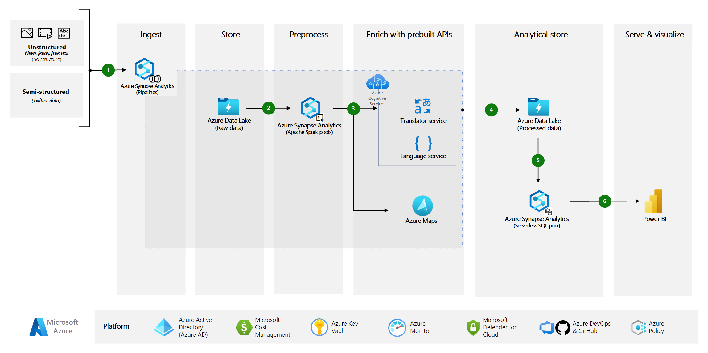

Organizations nowadays are capitalizing on various ways in order to extract valuable insights about their customers and how to best address their needs. On this article we have presented some of the use cases in which this architecture would be valuable.

This article covers a wider spectrum of applications for analyzing news/social media data. This article is an extension to a Solution Accelerator, which helps developers with all the resources needed to build and deploy a Social Media monitoring platform on Azure, which helps you to collect data from social media and websites and evaluate the data to make business decisions.

Leveraging the NEWS API as well as the Twitter API someone can access information around the web about a specific topic. For instance, if someone would like to find out the latest discussions about Satya Nadella, he/she would need to just provide this as query.

## Architecture

This architecture is an extension to the existing [Social Media Analytics Solution Accelerator(SA)](https://github.com/microsoft/Azure-Social-Media-Analytics-Solution-Accelerator.git) - which helps you build an end-to-end social media analytics solution  in just few hours.

*Download a [Visio file](https://arch-center.azureedge.net/[file-name].vsdx) of this architecture.*

### Dataflow

The following dataflow corresponds to the above diagram:

1. In Azure Synapse Analytics, two pipelines are responsible to ingest the external data from News API and Twitter API into the Azure Data Lake.
2. This data is then processed using Apache Spark pools in Azure Synapse Analytics.
3. Apache Spark pools are responsible for executing the data processing and enrichment logic using Azure Cognitive Services for Language, Translator and Azure Maps. The following features are used:
    - [Translator](https://learn.microsoft.com/en-us/azure/cognitive-services/translator/translator-overview): is a Cognitive Service that translates text from the original language to another (see list of [supported languages for Translator](https://learn.microsoft.com/en-us/azure/cognitive-services/translator/language-support#translation)).
    - [Named Entity Recognition(NER)](https://learn.microsoft.com/en-us/azure/cognitive-services/language-service/named-entity-recognition/overview): is a cognitive services feature used to identify and categorize entities in unstructured text. For example: people, places, organizations, and quantities.
    - [Key Phrase Extraction](https://learn.microsoft.com/en-us/azure/cognitive-services/language-service/key-phrase-extraction/overview): is a cognitive services feature which is used to identify the key main talking points in a post or an article. 
    - [Sentiment Analysis](https://learn.microsoft.com/en-us/azure/cognitive-services/language-service/sentiment-opinion-mining/overview#sentiment-analysis):  is used in order to extract sentiment insights (positive, negative, neutral and mixed) out of the posts, etc.
    - [Azure Maps](https://azure.microsoft.com/en-us/products/azure-maps/#azuremaps-overview) is an Azure Service which is used to easily incorporate location-based data into web/mobile solutions. Using location and map data we can generate better user experience and link our data with geographical coordinates. e.g. mapping of latitude and Longitude coordinates of countries, with their news and posts onto an actual map.
4. The enriched data is stored in the Azure Data Lake.
5. 6, and 7. Enriched data can be either:
    1. used directly through Azure Synapse Serverless pool(step 5) to populate a Microsoft Power BI Dashboard (step 6) in order to provide insights onto the Power BI Desktop or alternatively those dashboards could be also embed into an Azure Web App Service to enhance the Web/Mobile App end user experience (step 7).
    2. or can be used to train a custom ML model in Azure Machine Learning (step 5), which can be deployed to an Managed Online Endpoint(step 6) for real-time /online model inference (such as mobile app) or Managed Batch Endpoint for offline model inference (step 7).

### Components

  - [Azure Synapse Analytics](https://azure.microsoft.com/en-us/products/synapse-analytics/) is an integrated analytics service that accelerates time to insight across data warehouses and big data systems.
  - [Azure Cognitive Services for Language](https://azure.microsoft.com/en-us/products/cognitive-services/language-service/) consists of cloud-based services that provide AI functionality. The REST APIs and client library SDKs help you build cognitive intelligence into apps even if you don't have AI or data science skills.
  - [Azure Cognitive Services Translator](https://azure.microsoft.com/en-us/products/cognitive-services/translator/) helps you to translate text instantly or in batches across more than 100 languages, powered by the latest innovations in machine translation. Support a wide range of use cases, such as translation for call centers, multilingual conversational agents, or in-app communication.
  - [Azure Maps](https://azure.microsoft.com/en-us/products/azure-maps/#azuremaps-overview) is a suite of geospatial services that help organizations easily incorporate location-based data into web and mobile solutions. Use location and map data to generate insights, inform data-driven decisions, enhance security, and improve customer experiences.
  - [Azure Data Lake](https://azure.microsoft.com/services/storage/data-lake-storage) is a massively scalable and secure data lake for high-performance analytics workloads.
  - [Azure App Service](https://azure.microsoft.com/services/app-service): provides a framework for building, deploying, and scaling web apps. The [Web Apps](https://azure.microsoft.com/services/app-service/web) feature is a service for hosting web applications, REST APIs, and mobile back ends.
  - [Azure Machine Learning](https://azure.microsoft.com/en-us/products/machine-learning/) is a cloud-based environment that you can use to train, deploy, automate, manage, and track machine learning models.
  - [Azure Power BI](https://powerbi.microsoft.com/) is a collection of analytics services and apps. You can use Power BI to connect and display unrelated sources of data.

#### Prerequisites

To use this solution accelerator, you will need access to an [Azure subscription](https://azure.microsoft.com/en-us/free/). While not required, a prior understanding of Azure Synapse Analytics, Azure Cognitive Services, Azure Maps and Power BI  will be helpful.

Note: The deployment of the [Social Media Analytics Solution Accelerator(SA)](https://github.com/microsoft/Azure-Social-Media-Analytics-Solution-Accelerator.git) assumes you have already a Twitter developer account with "Elevated" access to the Twitter API's features and a News API account(see Deploy this Scenario section for the step-by-step deployment guide).

### Alternatives

In case that someone is not interested to use custom ML models in AML, this architecture could be simplified. Considering this scenario, the following end-to-end architecture could be deployed by following the [Social Media Analytics Solution Accelerator(SA)](https://github.com/microsoft/Azure-Social-Media-Analytics-Solution-Accelerator.git) deployment guide.

For more information, see the "Deploy this scenario" section below, on this article.
 

## Scenario details

Marketing campaigns are about more than the message that you deliver. When and how you deliver that message is just as important. Without a data-driven, analytical approach, campaigns can easily miss opportunities or struggle to gain traction.
Those campaigns are often based on social media analysis, which has become increasingly important for companies and organizations around the world. Social media analysis is a powerful tool that you can use to receive instant feedback on products and services, improve interactions with customers to increase customer satisfaction, keep up with the competition, and more. Companies often lack efficient, viable ways to monitor social media conversations. As a result, they miss countless opportunities to use these insights to inform their strategies and plans.

Leveraging the architecture presented on this article, and quickly deploying such solution into an Azure Subscription reduces the "time to market" for deploying manually all resources. This solution can help customers to quickly extract news and twitter posts which talk about a specific topic, translate them to their preferred language, extracting the various key points mentioned, or the entities mentioned in those texts, as well as identifying the sentiment. Those insights are very important for a variety of use cases, which are presented in detail in the next section.

### Potential use cases

Extracting information about your customers from social media, you can enhance customer experiences, increase customer satisfaction, gain new leads, and prevent customer churn. These applications of social media analytics fall into three main areas:

- **Measuring brand health:**

  - Capturing customer reactions and feedback for new products or services on social media.
  - Analyzing sentiment on social media interactions for a newly introduced product or service.
  - Capturing the perception and sentiment about a company's or organization's Brand, e.g. positive/negative

- **Building and maintaining customer relationships:**

  - Quickly identifying customer concerns.
  - Listening to untagged brand mentions.

- **Optimizing marketing investments:**

  - Extracting insights from social media for campaign analysis.
  - Targeted marketing optimization.
  - Find new leads, influencers to reach more audience.

Marketing is an integral part of every organization nowadays. Therefore, the above mentioned use cases and the Social Media Analytics Solution can be applicable to a variety of industries, such as:

- retail
- finance
- manufacturing
- healthcare
- government
- energy
- telecommunications
- automotive
- nonprofit
- game
- media (media and entertainment)
- travel (e.g. hospitality, restaurants)
- facilities (e.g. real estate)
- and sports.

## Considerations

These considerations implement the pillars of the Azure Well-Architected Framework, which is a set of guiding tenets that can be used to improve the quality of a workload. For more information, see [Microsoft Azure Well-Architected Framework](/azure/architecture/framework).

### Reliability

Reliability ensures your application can meet the commitments you make to your customers. For more information, see [Overview of the reliability pillar](/azure/architecture/framework/resiliency/overview).

### Security

Security provides assurances against deliberate attacks and the abuse of your valuable data and systems. For more information, see [Overview of the security pillar](/azure/architecture/framework/security/overview).

### Cost optimization

Cost optimization is about looking at ways to reduce unnecessary expenses and improve operational efficiencies. For more information, see [Overview of the cost optimization pillar](/azure/architecture/framework/cost/overview).

Regarding the pricing of such solution, please see the link to the pricing calculator (https://azure.microsoft.com/en-us/pricing/calculator) and add all those resources in order to estimate the price.

### Operational excellence

Operational excellence covers the operations processes that deploy an application and keep it running in production. For more information, see [Overview of the operational excellence pillar](/azure/architecture/framework/devops/overview).

### Performance efficiency

Performance efficiency is the ability of your workload to scale to meet the demands placed on it by users in an efficient manner. For more information, see [Performance efficiency pillar overview](/azure/architecture/framework/scalability/overview).

## Deploy this scenario

In order to deploy this end-to-end solution there is detailed step-by-step deployment guide which will help you to set-up the architecture as well as run an example Social Media Analytics scenario. All these resources are available on the [Social Media Analytics Solution Accelerator(SA)](https://github.com/microsoft/Azure-Social-Media-Analytics-Solution-Accelerator.git), on the "Getting Started" section.

Please note that following the above mentioned solution accelerator, will help you to set-up the end-to-end architecture and the connection to resources which are marked with blue solid arrows in the architecture. All resources which are connected with dashed blue arrows, are complementary and therefore are not part of this Solution Accelerator (e.g. Azure Machine Learning, managed endpoints,etc.).The architecture diagram is included in the "Alternatives" section of this article.

## Contributors

*This article is maintained by Microsoft. It was originally written by the following contributors.* 

Principal author:

- [Christina Skarpathiotaki](https://www.linkedin.com/in/christinaskarpathiotaki) | AI Specialized Cloud Solution Architect

## Next steps

Learn more with the following materials and learning paths:

- [Azure Synapse Analytics](https://azure.microsoft.com/en-us/services/synapse-analytics/)
- [Azure Text Analytics](https://azure.microsoft.com/en-us/services/cognitive-services/text-analytics)
- [Azure Translator](https://azure.microsoft.com/en-us/services/cognitive-services/translator)
- [Azure Maps](https://docs.microsoft.com/en-us/azure/azure-maps/about-azure-maps)
- [Power BI](https://docs.microsoft.com/en-us/power-bi/fundamentals/power-bi-overview)
- [Sentiment Analysis with Cognitive Services in Azure Synapse Analytics](/azure/synapse-analytics/machine-learning/tutorial-cognitive-services-sentiment)
- [Text Analytics with Cognitive Services in Azure Synapse Analytics](/azure/synapse-analytics/machine-learning/tutorial-text-analytics-use-mmlspark)

## Related resources

Links to further resources:
  - [Azure Machine Learning documentation](/azure/machine-learning)
  - [What are Azure Cognitive Services?](/azure/cognitive-services/what-are-cognitive-services)
  - [Artificial intelligence (AI) - Architectural overview](/azure/architecture/data-guide/big-data/ai-overview)
  - [Choosing a Microsoft cognitive services technology](/azure/architecture/data-guide/technology-choices/cognitive-services)
