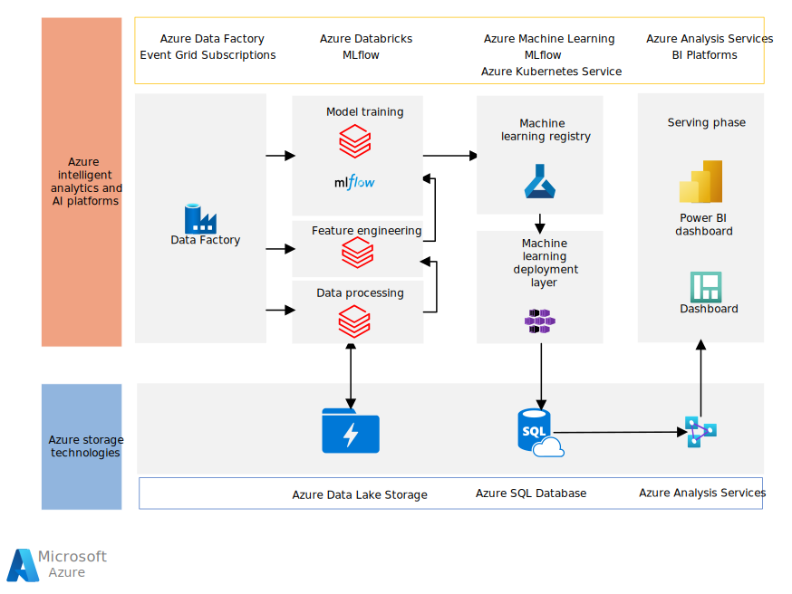

This scenario shows a solution for creating predictive models of [customer lifetime value](https://en.wikipedia.org/wiki/Customer_lifetime_value) and [churn rate](https://en.wikipedia.org/wiki/Churn_rate) by using Azure AI technologies.

## Architecture

*Download a [Visio file](https://arch-center.azureedge.net/architecture-customer-lifetime-churn.vsdx) of this architecture.*

### Dataflow

1. **Ingestion and orchestration**: Ingest historical, transactional, and third-party data for the customer from on-premises data sources. Use Azure Data Factory and store the results in Azure Data Lake Storage.

1. **Data processing**: Use Azure Databricks to pick up and clean the raw data from the Data Lake Storage. Store the data in the *silver layer* in Azure Data Lake Storage.

1. **Feature engineering**: With Azure Databricks, load data from the silver layer of Data Lake Storage. Use [PySpark](https://spark.apache.org/docs/latest/api/python/index.html) to enrich the data. After preparation, use feature engineering to provide a better representation of data. Feature engineering can also improve the performance of the machine learning algorithm.

1. **Model training**: In model training, the silver tier data is the model training dataset. You can use MLflow to manage machine learning experiments. MLflow keeps track of all metrics you need to evaluate your machine learning experiment.

   MLflow parameters stores model-related parameters, such as training hyperparameters. MLflow metrics stores model performance metrics. The machine learning model iteratively retrains using Azure Data Factory pipelines. The model retraining pipeline gets updated training data from the Azure Data Lake Storage and retrains the model. The model retraining pipeline kicks off in the following conditions:

   - When the accuracy of the current model in production drops below a threshold tracked by MLflow.
   - When calendar triggers, based on the customer defined rules, are reached.
   - When data drift is detected.

1. **Machine learning registry**: An Azure Data Factory pipeline registers the best machine learning model in the Azure Machine Learning Service according to the metrics chosen. The machine learning model is deployed by using the [Azure Kubernetes Service](https://azure.microsoft.com/services/kubernetes-service).

1. **Serving phase**: In the serving phase, you can use reporting tools to work with your model predictions. These tools include Power BI and Azure Analyses Services.

### Components

- [Azure Analysis Services](https://azure.microsoft.com/services/analysis-services) provides enterprise-grade data models in the cloud.

- [Azure Data Factory](https://azure.microsoft.com/services/data-factory) provides a data integration and transformation layer that works across your digital transformation initiatives.

- [Azure Databricks](https://azure.microsoft.com/services/databricks) is a data analytics platform optimized for the Microsoft Azure cloud services platform.

- [Azure Machine Learning](https://azure.microsoft.com/services/machine-learning) includes a range of experiences to build, train, and deploy machine learning models and foster team collaboration.

- [Azure SQL Database](https://azure.microsoft.com/products/azure-sql/database) is a database engine that handles most management functions without your involvement. Azure SQL Database enables you to focus on the domain-specific database administration and optimization activities for your business.

- [MLflow](/azure/databricks/applications/mlflow) is an open-source platform for managing the end-to-end machine learning life cycle.

### Alternatives

- Data Factory orchestrates the workflows for your data pipeline. If you want to load data only one time or on demand, use tools like SQL Server bulk copy and AzCopy to copy data into [Azure Blob Storage](https://azure.microsoft.com/services/storage/blobs). You can then load the data directly into [Azure Synapse Analytics](/azure/synapse-analytics) using PolyBase.

- Some business intelligence tools may not support Azure Analysis Services. The curated data can instead be accessed directly from Azure SQL Database. Data is stored using Azure Data Lake Storage and accessed using Azure Databricks storage for data processing.

## Scenario details

Customer lifetime value measures the net profit from a customer. This metric includes profit from the customer's whole relationship with your company. *Churn* or *churn rate* measures the number of individuals or items moving out of a group over a period.

This retail customer scenario classifies your customers based on marketing and economic measures. This scenario also creates a customer segmentation based on several metrics. It trains a multi-class classifier on new data. The resulting model scores batches of new customer orders through a regularly scheduled Azure Databricks notebook job.

This solution demonstrates how to interconnect the following Azure AI technologies:

- Use Azure Data Lake and Azure Databricks to implement best practices for data operations.
- Use Azure Databricks to do exploratory data analysis.
- Do batch experiment training of an [Sklearn](https://www.adamsmith.haus/python/docs/sklearn) machine learning model on Azure Databricks.
- Use MLflow to track machine learning experiments.
- Batch score machine learning models on Azure Databricks.
- Use Azure Machine Learning to model registration and deployment.
- Use Azure Data Factory and Azure Databricks notebooks to orchestrate the MLOps pipeline.

### Potential use cases

This solution is ideal for the retail industry. It's helpful in the following use cases:

- In marketing, to determine how much to spend to acquire a customer.
- For product teams, to tailor products and services for their best customers.
- For customer support, to decide how much to spend to service and keep a customer.
- For sales representatives, to decide what types of customers to spend the most time trying to acquire.

## Considerations

These considerations implement the pillars of the Azure Well-Architected Framework, which is a set of guiding tenets that can be used to improve the quality of a workload. For more information, see [Microsoft Azure Well-Architected Framework](/azure/architecture/framework).

### Availability

Azure components offer availability through redundancy and as specified in service-level agreements (SLAs):

- For information about Data Factory pipelines, see [SLA for Data Factory](https://azure.microsoft.com/support/legal/sla/data-factory/v1_2).
- For information about Azure Databricks, see [Azure Databricks](https://azure.microsoft.com/services/databricks).
- Data Lake Storage offers availability through redundancy. See [Azure Storage redundancy](/azure/storage/common/storage-redundancy).

### Scalability

This scenario uses Azure Data Lake Storage to store data for machine learning models and predictions. Azure Storage is scalable. It can store and serve many exabytes of data. This amount of storage is available with throughput measured in gigabits per second (Gbps). Processing runs at near-constant per-request latencies. Latencies are measured at the service, account, and file levels.

This scenario uses Azure Databricks clusters, which enable autoscaling by default. Autoscaling enables Databricks during runtime to dynamically reallocate resources. With autoscaling, you don't need to start a cluster to match a workload, which makes it easier to achieve high cluster usage.

### Security

Security provides assurances against deliberate attacks and the abuse of your valuable data and systems. For more information, see [Overview of the security pillar](/azure/architecture/framework/security/overview).

Protect assets by using controls on network traffic originating in Azure, between on-premises and Azure hosted resources, and traffic to and from Azure. For instance, Azure self-hosted integration runtime securely moves data from on-premises data storage to Azure.

Use [Azure Key Vault](https://azure.microsoft.com/services/key-vault) and Databricks scoped secret to access data in Azure Data Lake Storage.

Azure services are either deployed in a secure virtual network or accessed using the Azure Private Link feature. If necessary, row-level security provides granular access to individual users in Azure Analysis Services or SQL Database.

### Cost optimization

Cost optimization is about looking at ways to reduce unnecessary expenses and improve operational efficiencies. For more information, see [Overview of the cost optimization pillar](/azure/architecture/framework/cost/overview).

Azure Databricks is a premium Apache Spark offering with an associated cost.

There are standard and premium Databricks pricing tiers. For this scenario, the standard pricing tier is sufficient. If your application requires automatically scaling clusters to handle larger workloads or interactive Databricks dashboards, you might need the premium tier.

Costs related to this use case depend on the standard pricing for the following services for your usage:

- [Azure Databricks pricing](https://azure.microsoft.com/pricing/details/databricks)
- [Azure Data Factory pricing](https://azure.microsoft.com/pricing/details/data-factory/data-pipeline)
- [Azure Data Lake Storage pricing](https://azure.microsoft.com/pricing/details/storage/data-lake)
- [Azure Machine Learning pricing](https://azure.microsoft.com/pricing/details/machine-learning)

To estimate the cost of Azure products and configurations, visit the [Azure pricing calculator](https://azure.microsoft.com/pricing/calculator).

## Contributors

*This article is maintained by Microsoft. It was originally written by the following contributors.*

Principal author:

- [Giulia Gallo](https://www.linkedin.com/in/giuliagallo) | Senior Cloud Solution Architect

## Next steps

- [Azure Machine Learning](/azure/machine-learning)
- [Introduction to Azure Data Lake Storage Gen2](/azure/storage/blobs/data-lake-storage-introduction)
- [Azure Databricks](/azure/databricks)
- [Azure Data Factory](/azure/data-factory)

## Related resources

- [Artificial intelligence](../../data-guide/big-data/ai-overview.md)
- [MLOps for Python models using Azure Machine Learning](../../reference-architectures/ai/mlops-python.yml)
- [Customer churn prediction using real-time analytics](../../solution-ideas/articles/customer-churn-prediction.yml)
- [Predict Length of Stay and Patient Flow](/azure/architecture/example-scenario/digital-health/predict-patient-length-of-stay)
- [Product recommendations for retail using Azure](../../solution-ideas/articles/product-recommendations.yml)
