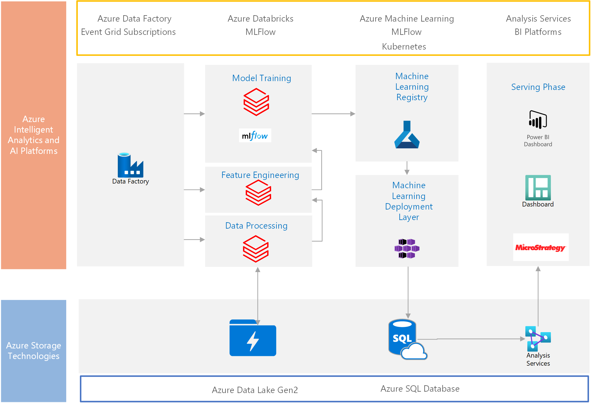

This scenario shows a solution for creating predictive models of the customer lifetime value. The solution can help your retail company understanding your customers better by using Azure AI technologies.

#### Customer lifetime value and churn rate

In marketing, customer lifetime value measures the net profit from a customer. This metric includes profit from the customer's whole relationship with a company. Prediction models vary in sophistication and accuracy. They can be a crude heuristic or use complex predictive analytics techniques. The customer lifetime value metric can help your business concentrate on your most profitable clients. For more information, see [Customer lifetime value](https://en.wikipedia.org/wiki/Customer_lifetime_value).

Another important metric for understanding how customers behave is churn or churn rate. Churn measures the number of individuals or items moving out of a group over a period. For more information, see [Churn Rate](https://en.wikipedia.org/wiki/Churn_rate).

Customer lifetime value and customer churn are key metrics in marketing analytics. You can use these metrics to determine your ability to retain a certain customer. These metrics can provide an overview of the total worth of a customer to your business over the period of your relationship.

This solution demonstrates how to interconnect the following Azure AI technologies:

- Use Azure Data Lake and Azure Databricks to implement best practices for data operations.
- Use Azure Databricks to do exploratory data analysis.
- Do batch experiment training of a sklearn machine learning model on Azure Databricks.
- Use MLFlow to track machine learning experiments.
- Batch score machine learning models on Azure Databricks.
- Use Azure Machine Learning to model registration and deployment.
- Use Azure Data Factory and Azure Databricks notebooks to orchestrate the MLOps pipeline.

This retail customer scenario classifies your customers based on marketing and economic measures. Based on this information, you can calculate customer lifetime value.

This scenario next creates a customer segmentation based on several metrics. It trains a multi-class classifier on new data. The resulting supervised multi-class classifier model scores batches of new customer orders through a regularly scheduled Azure Databricks notebook job.

## Potential use cases

In general, the true value of a customer relationship can help answer these questions:

- **In marketing**: How much should I spend to acquire a customer?
- **For a product team**: How can I offer products and services tailored for my best customers?
- **For customer support**: How much should I spend to service and keep a customer?
- **In sales**: What types of customers should our representatives spend the most time trying to acquire?

## Architecture

1. Ingestion and orchestration

   Ingest historical, transactional, and third-party data for the customer from on-premises data sources. Use Azure Data Factory and store the results in Azure Data Lake Storage.

1. Data processing

   In the data processing phase, use Azure Databricks to pick up and clean the raw data from the Data Lake Storage. The data is stored in the silver layer in Azure Data Lake Services Gen2.

1. Feature engineering

   With Azure Databricks, load data from the silver layer of Data Lake Storage. The data is enriched using PySpark. After preparation, use feature engineering to provide better representation of data. Feature engineering can also improve the performance of the machine learning algorithm.

1. Model training

   In the model training phase, the silver tier data is the model training dataset. You can use MLFlow to manage machine learning experiments. MLFlow keeps track of all metrics you need to evaluate your machine learning experiment.

   MLFlow parameters and MLFlow metrics are used for storing model-related parameters, such as training hyperparameters, and for storing model performance metrics. The machine learning model is iteratively retrained using Azure Data Factory pipelines. The model retraining pipeline gets updated training data from the Azure Data Lake Gen2 and retrains the model. The model retraining pipeline kicks off in the following ways:

   - When the accuracy of the current model in production drops below a threshold tracked by MLFlow.
   - When calendar triggers, based on the customer defined rules, are reached.
   - When data drift is detected.

1. Machine learning registry

   An Azure Data Factory pipeline registers the best machine learning model in the Azure Machine Learning Service according to the metrics chosen. The machine learning model is deployed by using the Azure Kubernetes Service.

1. Serving phase

   In the serving phase, you can use reporting tools, such as Power BI, MicroStrategy, and Analyses Services, for your model predictions.

### Components

- [Azure Storage](https://azure.microsoft.com/product-categories/storage/) and [Azure Files](https://azure.microsoft.com/services/storage/files/) offer fully managed file shares in the cloud that are accessible by using the industry-standard SMB protocol. You can mount Azure file shares concurrently on cloud or on-premises deployments of Windows, Linux, and macOS.

- [Azure SQL Database](https://azure.microsoft.com/products/azure-sql/database/) is a fully managed database engine that handles most of the database management functions without user involvement. Azure SQL Database enables you to focus on the domain-specific database administration and optimization activities that are critical for your business.

- [Azure Blob Storage](https://azure.microsoft.com/services/storage/blobs/) is a cloud service for storing large amounts of unstructured data such as text, binary data, audio, and documents. Azure Blob Storage allows data scientists quick access to data for experimentation and AI model building.

- [Azure Databricks](https://azure.microsoft.com/services/databricks/) is a data analytics platform optimized for the Microsoft Azure cloud services platform.

- [Azure Machine Learning](https://azure.microsoft.com/services/machine-learning/) includes a range of productive experiences to build, train, and deploy machine learning models and foster team collaboration. Accelerate time to market with industry-leading MLOps—machine learning operations or DevOps for machine learning. Innovate on a secure, trusted platform.

- [Azure Data Factory](https://azure.microsoft.com/services/data-factory/) provides a data integration and transformation layer that works across your digital transformation initiatives.

- [MLFlow](/azure/databricks/applications/mlflow/) is an open-source platform for managing the end-to-end machine learning life cycle.

### Alternatives

Data Factory orchestrates the workflows for your data pipeline. If you want to load data only one time or on demand, use tools like SQL Server bulk copy and AzCopy to copy data into Blob storage. You can then load the data directly into Azure Synapse using PolyBase.

Azure Synapse Analytics brings together enterprise data warehousing and big data analytics. For more information, see [Azure Synapse Analytics](https://docs.microsoft.com/en-us/azure/synapse-analytics/).

## Considerations

Some business intelligence tools may not support Azure Analysis Services. The curated data can instead be accessed directly from Azure SQL Database. In this implementation, data is stored using Azure Data Lake Storage Gen2 and accessed using Azure Databricks storage for data processing.

### Availability

The service level agreements (SLAs) of most Azure components guarantee availability:

- At least 99.9 percent of Data Factory pipelines are guaranteed to run successfully. See [SLA for Data Factory](https://azure.microsoft.com/en-us/support/legal/sla/data-factory/v1_2/).
- The Azure Databricks SLA guarantees 99.95 percent availability. See [Azure Databricks](https://azure.microsoft.com/en-us/services/databricks/)
- Blob Storage and Data Lake Storage offer availability through redundancy. See [Azure Storage redundancy](https://docs.microsoft.com/en-us/azure/storage/common/storage-redundancy).

### Scalability

This scenario uses Azure Data Lake Storage to store data for machine learning models and predictions. Azure Storage is scalable. It can store and serve many exabytes of data. This amount of storage is available with throughput measured in gigabits per second (Gbps). Processing runs at near-constant per-request latencies. Latencies are measured at the service, account, and file levels.

This scenario uses Azure Databricks clusters, which enable autoscaling by default. Autoscaling enables Databricks during runtime to dynamically reallocate workers. With Autoscaling, you don't need to start a cluster to match a workload, which makes it easier to achieve high cluster usage.

### Security

Protect assets by using controls on network traffic originating in Azure, between on-premises and Azure hosted resources, and traffic to and from Azure. For instance, Azure self-hosted integration runtime securely moves data from on-premises data storage to Azure.

Use Azure Key Vault and Databricks scoped secret to access data in Azure Data Lake Storage Gen2.

Azure services are either deployed in a secure virtual network or access uses the Azure Private Link feature. If necessary, row-level security in Azure Analysis Services or SQL Database provides granular access to individual users.

## Pricing

Azure Databricks is a premium Spark offering with an associated cost.

There are standard and premium Databricks pricing tiers. For this scenario, the standard pricing tier is sufficient. If your application requires automatically scaling clusters to handle larger workloads or interactive Databricks dashboards, you might need the premium tier.

Costs related to this use case depend on the standard pricing for the following services for your usage:

- [Azure Databricks pricing](https://azure.microsoft.com/pricing/details/databricks/)

- [Azure Data Factory pricing](https://azure.microsoft.com/en-us/pricing/details/data-factory/data-pipeline/)

- [Azure Data Lake Storage pricing](https://azure.microsoft.com/en-us/pricing/details/storage/data-lake/)

- [Azure Machine Learning pricing](https://azure.microsoft.com/en-us/pricing/details/machine-learning/)

To estimate the cost of Azure products and configurations, visit the [Azure pricing calculator](https://azure.microsoft.com/pricing/calculator/).

## Next steps

Use these resources to explore this scenario:

- [Artificial intelligence](../../data-guide/big-data/ai-overview.md)
- [Azure Machine Learning](https://docs.microsoft.com/azure/machine-learning/)
- [Introduction to Azure Data Lake Storage Gen2](https://docs.microsoft.com/azure/storage/blobs/data-lake-storage-introduction)
- [Azure Databricks](https://docs.microsoft.com/en-us/azure/databricks/)
- [Azure Data Factory](https://docs.microsoft.com/en-us/azure/data-factory/)

To learn more, explore other scenarios:

- [MLOps for Python models using Azure Machine Learning](https://docs.microsoft.com/azure/architecture/reference-architectures/ai/mlops-python)
- [Customer churn prediction using real-time analytics](https://docs.microsoft.com/azure/architecture/solution-ideas/articles/customer-churn-prediction)
- [Predict Length of Stay and Patient Flow](https://docs.microsoft.com/azure/architecture/solution-ideas/articles/predict-length-of-stay-and-patient-flow-with-healthcare-analytics)
- [Product recommendations for retail using Azure](https://docs.microsoft.com/azure/architecture/solution-ideas/articles/product-recommendations)
