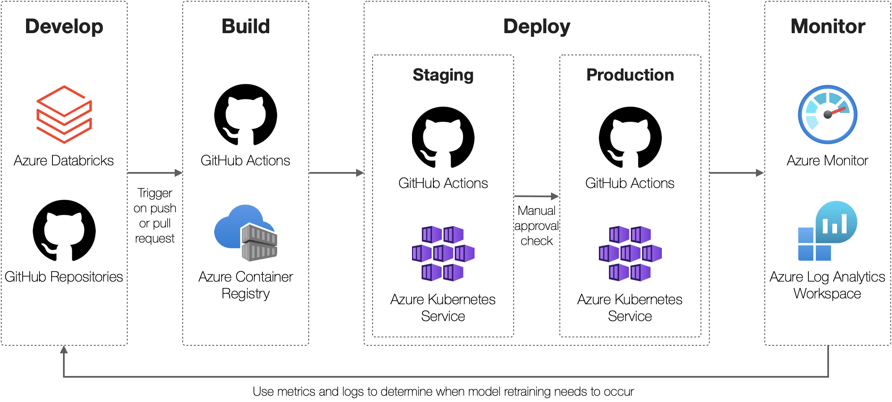

The problem of employee attrition has grown in prominence since the COVID-19 pandemic. This has resulted in a trend in which employees voluntarily resign from their jobs en masse—known as _the Great Resignation_. The problem can also be magnified for certain departments in an organization that might lack dedicated teams that perform advanced analytics, such as Human Resources.

This example scenario illustrates an operating model of centralized machine learning. This comprises a central team that is responsible for building and deploying machine-learning models for external teams across departments within an organization. This approach is useful when departments are too small to maintain a team that's dedicated to machine learning while the organization aims to infuse advanced analytics into all products and processes.

This solution demonstrates how a machine-learning team can use Azure Databricks and Azure Kubernetes Service to develop and deploy machine learning, as an API, to predict the likelihood of employee attrition. The API can be integrated with external applications that are used by the Human Resources team to provide additional insights into the likelihood of attrition for a given employee within the organization. This information can be used to retain high-impact employees who are likely to leave the organization and provide Human Resources with the ability to proactively incentivize such employees to stay.

## Potential use cases

Even though this scenario is focused on building a machine-learning model of employee attrition and integrating it with external applications that are used by Human Resources teams, the design can be generalized to many machine-learning workloads that are built by centralized and decentralized teams alike.

This generalized approach is best suited for:

- Machine-learning teams that have standardized on Databricks for data engineering or machine-learning applications.
- Machine-learning teams that have experience deploying and managing Kubernetes workloads with a preference to apply these skills for operationalizing machine-learning workloads.
- Integrating machine-learning workloads with external applications that require low latency and interactive model predictions (for example, real-time inference).

## Architecture

:::image type="content" alt-text="Diagram of the architecture that's described in this article, showing development, deployment, exposure of the API, and monitoring of metrics and logs." source="media/employee-retention-with-databricks-and-kubernetes-design.png" lightbox="media/employee-retention-with-databricks-and-kubernetes-design.png":::

### Workflow

At a high level, this solution design addresses each stage of the machine-learning lifecycle:

- Data Preparation: this includes sourcing, cleaning, and transforming the data for processing and analysis. Data can live in a data lake or data warehouse and be stored in a feature store after it's curated.

- Model Development: this includes core components of the model development process such as experiment tracking and model registration using [MLflow](/azure/databricks/applications/mlflow/).

- Model Deployment: this includes implementing a CI/CD pipeline to containerize machine-learning models as API services. These services will be deployed to Azure Kubernetes clusters for end users to consume.

- Model Monitoring: this includes monitoring the API performance and model data drift by analyzing log telemetry with Azure Monitor.

After the  machine-learning team has deployed the machine-learning model as an API for real-time inference, it can be easily integrated with external applications that are used by external teams, such as Human Resources. Telemetry is collected when the external team uses the model service. The machine-learning team can use this telemetry to determine when the model needs to be redeployed. This approach allows teams to work independently and allows external teams to benefit from the skills of the centralized machine-learning team.

> [!NOTE]
>
>- When implementing a [CI/CD pipeline](/azure/architecture/microservices/ci-cd), various tools can be used, such as Azure DevOps Pipelines and GitHub Actions.
>- The services covered by this architecture are only a subset of a much larger family of Azure services.
>- Specific business requirements for your analytics use case could require the use of different services or features that are not considered in this design.

### Components

The following components are used as part of this design:

- [Azure Databricks](https://docs.microsoft.com/en-us/azure/databricks/scenarios/what-is-azure-databricks): easy and collaborative Apache Spark-based big data analytics service designed for data science and data engineering.
- [Azure Kubernetes Service](https://docs.microsoft.com/en-us/azure/aks/intro-kubernetes): simplified deployment and management of Kubernetes by offloading the operational overhead to Azure.
- [Azure Container Registry](https://docs.microsoft.com/en-us/azure/container-registry/container-registry-intro): managed and private Docker registry service based on the open-source Docker.
- [Azure Data Lake Gen 2](https://docs.microsoft.com/en-us/azure/storage/blobs/data-lake-storage-introduction): scalable solution optimized for storing massive amounts of unstructured data.
- [Azure Monitor](https://docs.microsoft.com/en-us/azure/azure-monitor/overview): a comprehensive solution for collecting, analyzing, and acting on telemetry from your workloads.
- [MLflow](https://docs.microsoft.com/en-us/azure/databricks/applications/mlflow): open-source solution integrated within Databricks for managing the end-to-end machine-learning lifecycle.
- [Azure API Management](https://docs.microsoft.com/en-us/azure/api-management/api-management-key-concepts): a fully managed service that enables customers to publish, secure, transform, maintain, and monitor APIs.
- [Azure Application Gateway](https://docs.microsoft.com/en-us/azure/application-gateway/overview): a web traffic load balancer that enables you to manage traffic to your web applications.
- [Azure DevOps](https://azure.microsoft.com/solutions/devops/) or [GitHub](https://azure.microsoft.com/products/github/): solutions for implementing DevOps practices to enforce automation and compliance with your workload development and deployment pipelines.

## Considerations

Before implementing this solution some factors you might want to consider,  include:

- This solution is designed for teams who require a high degree of customization and have extensive expertise deploying and managing Kubernetes workloads. If your data science team doesn’t have this expertise consider deploying models to another service like [Azure Machine Learning](https://azure.microsoft.com/services/machine-learning).
- The [Machine Learning DevOps Guide](/azure/cloud-adoption-framework/ready/azure-best-practices/ai-machine-learning-mlops#machine-learning-devops-mlops-best-practices-with-azure-machine-learning) presents best practices and learnings on adopting ML operations (MLOps) in the enterprise with machine learning.
- Follow the recommendations and guidelines defined in the [Azure Well-Architected Framework](../../framework/index.md) to improve the quality of your Azure solutions.
- When implementing a [CI/CD pipeline](/azure/architecture/microservices/ci-cd) different tools such as Azure Pipelines or GitHub Actions can be used.
- Specific business requirements for your analytics use case could require the use of different services or features that aren’t considered in this design.

## Deploy this scenario

A proof-of-concept implementation of this scenario is available at the [Proof-of-Concept: Employee Retention with Databricks and Kubernetes](https://github.com/Azure/employee-retention-databricks-kubernetes-poc) repository.

This proof-of-concept illustrates:

- How an MLflow model for employee attrition can be trained on Azure Databricks.
- How to package models as a web service using open-source tools.
- How to deploy to Kubernetes via CI/CD using GitHub Actions.
- How to monitor API performance and model data drift within Azure Monitor and Azure Log Analytics Workspaces.

## Pricing

All services deployed in this solution use a consumption-based pricing model. The [Azure pricing calculator](https://azure.microsoft.com/pricing/calculator) can be used to estimate costs for a specific scenario. For other considerations, see [Cost Optimization](../../framework/cost/index.yml) in the Well-Architected Framework.

## Next steps

Product documentation:

- [What is Azure Databricks?](https://docs.microsoft.com/en-us/azure/databricks/scenarios/what-is-azure-databricks)
- [What is MLflow?](https://docs.microsoft.com/en-us/azure/databricks/applications/mlflow)
- [What is Azure Kubernetes Service?](https://docs.microsoft.com/en-us/azure/aks/intro-kubernetes)
- [What is Azure Container Registry?](https://docs.microsoft.com/en-us/azure/container-registry/container-registry-intro)
- [What is Azure API Management?](https://docs.microsoft.com/en-us/azure/api-management/api-management-key-concepts)
- [What is Azure Application Gateway?](https://docs.microsoft.com/en-us/azure/application-gateway/overview)
- [What is Azure Data Lake Gen 2?](https://docs.microsoft.com/en-us/azure/storage/blobs/data-lake-storage-introduction)
- [What is Azure Monitor?](https://docs.microsoft.com/en-us/azure/azure-monitor/overview)
- [What is Azure DevOps?](https://azure.microsoft.com/solutions/devops/)
- [What is GitHub?](https://azure.microsoft.com/products/github/)

Microsoft Learn modules:

- [Perform data science with Azure Databricks](https://docs.microsoft.com/en-us/learn/paths/perform-data-science-azure-databricks/)
- [Build and operate machine-learning solutions with Azure Databricks](https://docs.microsoft.com/en-us/learn/paths/build-operate-machine-learning-solutions-azure-databricks/)
- [Introduction to Kubernetes on Azure](https://docs.microsoft.com/en-us/learn/paths/intro-to-kubernetes-on-azure/)
- [Develop and deploy applications on Kubernetes](https://docs.microsoft.com/en-us/learn/paths/develop-deploy-applications-kubernetes/)
- [Automate your workflow with GitHub Actions](https://docs.microsoft.com/en-us/learn/paths/automate-workflow-github-actions/)

## Related resources

You may also find these Architecture Center articles useful:

- [Machine Learning Operations maturity model](../../example-scenario/mlops/mlops-maturity-model.yml)
- [Team Data Science Process for data scientists](../../data-science-process/team-data-science-process-for-data-scientists.md)
- [Modern analytics architecture with Azure Databricks](../../solution-ideas/articles/azure-databricks-modern-analytics-architecture.yml)
