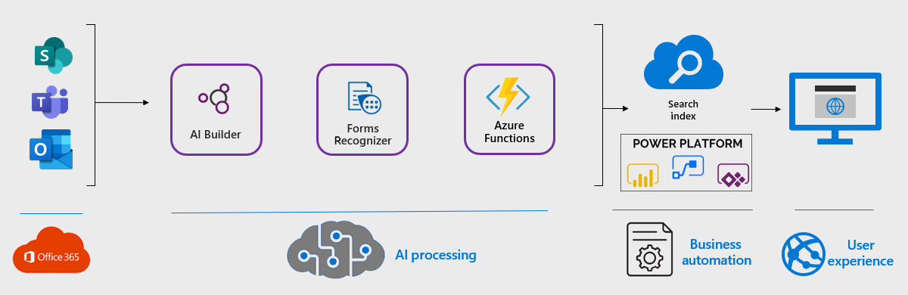

Schematic and industrial diagrams often have objects that contain text. AI Builder can retrieve this information for you. A Power Automate workflow can use a trained model to extract text from an image. By using this solution, your organization can index this information and easily retrieve the data.

Once you've configured a workflow, you can search documents for meaningful text imbedded in shapes and objects. Manually scanning an entire document reduces the contextual relevancy for isolating specific objects.

## Potential use cases

Use cases include...

- Engineering schematic diagrams are complicated and contain various types of objects. By using this solution, a user can search for a specific component on a diagram. Having access to embedded text in objects can be helpful for investigations, exposing shortages, or looking for recall and failure notices.
- Industrial diagrams show the components in a manufacturing assembly. This solution will allow you to identify pumps, valves, automated switches, and other components. Identifying components help with preventative maintenance, isolating hazardous components, and increasing the visibility of risk management in your organization.

## Architecture

*Download a [Visio file](https://arch-center.azureedge.net/architecture-extract-object-text.vsdx) of this architecture.*

1. An AI Builder model is created by using an object detection template. The model identifies the objects you want to capture, producing a JSON file that detects the object and pixel coordinates.
1. When Power Automate receives the document, an event is triggered.  That event calls the AI Builder model, Cognitive Services, and Azure Functions. This process populates the document library with metadata from the document.
1. Form Recognizer in Azure Cognitive Services is configured to receive the document where an optical character recognition (OCR) scan is conducted. The result is a JSON file that captures the text and pixel coordinates.
1. Azure Functions analyzes the JSON file output and determines if the object detected intersects with text from Azure Cognitive Services. If they do, then it's considered a match and the text is returned in a JSON file for consumption.
1. The document is ingested through SharePoint document libraries, OneDrive, or through Teams.
1. Metadata is captured in the SharePoint search index.
1. Users can search for text only, when using the PnP Modern Search.  For more information, see [PnP Modern Search](https://microsoft-search.github.io/pnp-modern-search/).

### Components

- [AI Builder](/ai-builder/overview) is a Power Platform capability. You can use AI Builder to train object detection models to recognize text that you specify.
- [Azure Form Recognizer](https://azure.microsoft.com/services/form-recognizer/) is a cloud-based Azure Applied AI Service. This service uses machine-learning models to extract and analyze form fields, text, and tables from your documents.
- [Azure Cognitive Services](https://azure.microsoft.com/services/cognitive-services/) brings AI within reach of every developer and data scientist. Various use cases can be unlocked with leading models.
- [Power Automate](/azure/architecture/example-scenario/power-automate/power-automate) is part of the no-code or low-code Power Platform.  Power Automate is used for workflow automation and business process flow.
- [PnP Modern Search](https://microsoft-search.github.io/pnp-modern-search/) solution is a set of SharePoint Online modern web parts. SharePoint super users, webmasters, and developers can create highly flexible and personalized search-based experiences in minutes.

### Alternatives

- Azure Cognitive Services can do a full OCR scan of the document, with the resulting metadata stored in SharePoint.
- SharePoint can run OCR scans on documents and add content output to the index for retrieval. Use search techniques to target key information in documents.

### Considerations

Consider these points when you analyze and process documents:

- AI Builder can capture square coordinates when training a model. Objects with text outside their boundaries, like triangles and circles, could potentially add unwanted and unnecessary information.
- The metadata that's output from Azure Functions can contain extra characters if there's text outside the object's boundaries.
- The AI Builder creation process can tag more than one object. The resulting JSON file from the Azure Functions will contain all object types and text. The application consuming the metadata will need to parse through and process the results, based on the use cases.

### Availability

[Azure Cognitive Search](https://azure.microsoft.com/services/search/) is a cloud search service with built-in AI capabilities. To ensure durability and high availability for Azure Cognitive Search, create multiple replicas. Business continuity and disaster recovery are achieved through multiple search services. For more information, see [Add or reduce replicas and partitions](/azure/search/search-capacity-planning#add-or-reduce-replicas-and-partitions).

Data redundancy protects you from planned and unplanned events—including transient hardware failures, network or power outages, and natural disasters. You can choose to replicate your data within the same data center, across zonal data centers within the same region, or across geographically separated regions. For more information, see [Data Recovery](/security/benchmark/azure/baselines/cognitive-services-security-baseline#data-recovery).

Azure Cognitive Search doesn't offer a Service Level Agreement (SLA) for the Free tier. For more information, see [SLA for Azure Cognitive Search](https://azure.microsoft.com/support/legal/sla/search/v1_0/)

### Scalability

[Azure Functions](/azure/azure-functions/functions-scale) is highly scalable. This platform offers multiple plans that automatically scale on demand when events are triggered. For more information, see [Event driven scaling](/azure/azure-functions/event-driven-scaling).

If you want to process a high rate of documents, consider using Azure Logic Apps to configure the components. Azure Logic Apps prevents you from hitting consumption limits in your tenant, and is cost-effective.  For more information, see [Azure Logic Apps](/azure/logic-apps/logic-apps-overview).

>**NOTE:** Azure Functions has a limit of 200 instances. If you need to scale beyond this limit, add multiple regions or app plans.

### Security

Use standard security practices for the components being used, and for the SharePoint document library that the metadata will be stored in.

[Form Recognizer](/legal/cognitive-services/form-recognizer/fr-data-privacy-security) is designed with compliance, privacy, and security in mind.  It will authenticate access using an API key, encrypt data during transit and storage, and returns results using the API key.

AI Builder relies on environment security and Microsoft Dataverse security roles and privileges to grant access to AI features at Microsoft Power Apps. For more information, see [Security overview](/power-platform/admin/wp-security).

Some privileges are set by default in Dataverse, with built-in security roles to use AI Builder without further actions from system administrators.

## Deploy this scenario

For more information on deploying this scenario, see [Power Automate Community Blog](https://powerusers.microsoft.com/t5/Power-Automate-Community-Blog/Extract-Text-From-Objects/ba-p/1249705) and [ExtractTextFromObjects GitHub repo](https://github.com/Spucelik/ExtractTextFromObjects).

## Pricing

- For Power Automate, make sure the licenses that you've purchased and assigned are adequate for the volume of documents that you process. You must also have the HTTP premium connector to call the Forms Recognizer and the Azure function.
- AI Builder credits should be purchased based on the expected model utilization.
- Azure Cognitive Services consumption for the Form Recognizer module should be estimated and planned for. The [Azure calculator](https://azure.microsoft.com/pricing/calculator) can assist with estimating usage.

## Next steps

- Understand the types of documents that would be well suited for this solution. Typical documents include schematic diagrams, manufacturing control processes, and diagrams that contain many shapes that need to be isolated.
- Become familiar with the capabilities that AI Builder and Cognitive Services offer.
- Define an information architecture that can receive and process your metadata.
- For information on how the solution works and whether it's suitable for your use cases, see [Extract text from objects](https://powerusers.microsoft.com/t5/Power-Automate-Community-Blog/Extract-Text-From-Objects/ba-p/1249705).

## Related Resources

[Azure Cognitive Services](/azure/cognitive-services)

[Azure Cognitive Services security](/azure/cognitive-services/cognitive-services-security)

[Azure Cognitive Search concept scenarios](/azure/search/cognitive-search-concept-image-scenarios)

[Azure Cognitive Search with skillsets](/azure/architecture/solution-ideas/articles/cognitive-search-with-skillsets)

[Azure Form Recognizer](/azure/applied-ai-services/form-recognizer)

[High availability](/azure/search/search-performance-optimization#high-availability)