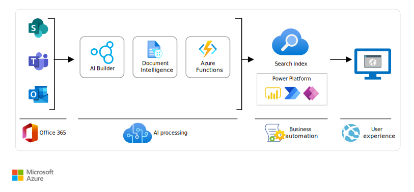

This article presents a solution for extracting text from images so it can be indexed and retrieved in SharePoint. By using AI Builder and Azure AI Document Intelligence, you can configure a Power Automate workflow to use a trained model to extract text from an image. Once you've configured a workflow, you can quickly search documents for meaningful text that's embedded in shapes and objects.

## Architecture

*Download a [Visio file](https://arch-center.azureedge.net/architecture-extract-object-text.vsdx) of this architecture.*

### Workflow

1. An object detection model is trained in AI Builder to recognize objects that a user specifies.
1. A new document enters a SharePoint document library, OneDrive, or Teams.
1. The document's arrival triggers a Power Automate event. That event:
   1. Runs the AI Builder model. AI Builder returns a JSON file that contains the pixel coordinates of any specified objects.
   1. Sends the document to Document Intelligence for a full optical character recognition (OCR) scan. Document Intelligence returns a JSON file that contains scanned-in text and pixel coordinates of the text.
   1. Runs a function in Azure Functions. The function analyzes the pixel coordinates in the AI Builder and Document Intelligence output files. If detected objects intersect with scanned-in text, the function returns the matched data in a JSON file.
   1. Enters the metadata, or the text from detected objects, into a document library.
1. The metadata is captured in a SharePoint search index.
1. Users search for the metadata by using PnP Modern Search web parts.

### Components

- [AI Builder](/ai-builder/overview) is a Microsoft Power Platform capability. Use AI Builder to train models to recognize objects in images. AI Builder also offers prebuilt models for object detection.
- [Document Intelligence Studio](/azure/ai-services/document-intelligence/studio-overview) uses machine-learning models to extract and analyze form fields, text, and tables from your documents.

  > [!NOTE]
  > Before using Document Intelligence Studio, evaluate if your scenario works from within Microsoft Foundry. The capabilities found in the Document Intelligence Studio are being migrated to Foundry. To help you select a portal experience, see [Choose the correct studio experience](/azure/ai-services/document-intelligence/studio-overview#choose-the-correct-studio-experience).
- [Power Automate](/power-automate/getting-started) is a part of Microsoft Power Platform no-code or low-code intuitive solutions. Power Automate is an online workflow service that automates actions across apps and services.
- [Azure Functions](/azure/azure-functions/functions-overview) is an event-driven serverless compute platform. Azure Functions runs on demand and at scale in the cloud.
- [PnP Modern Search](https://microsoft-search.github.io/pnp-modern-search) solution is a set of SharePoint in Microsoft 365 modern web parts. By using these tools, you can create highly flexible and personalized search-based experiences.

### Alternatives

- [Azure AI Document Intelligence](/azure/ai-services/document-intelligence/overview) can do a full OCR scan of documents, with the resulting metadata stored in SharePoint.
- SharePoint can run OCR scans on documents and add content output to the index for retrieval. Use search techniques to target key information in documents.
- If you want to process a high rate of documents, consider using Azure Logic Apps to configure the components. Azure Logic Apps helps avoid consumption limits primarily through its integration with a dedicated workflow engine and its ability to run under different pricing tiers, and is cost-effective. For more information, see [Azure Logic Apps](/azure/logic-apps/logic-apps-limits-and-config?tabs=consumption).

## Scenario details

Schematic and industrial diagrams often have objects that contain text. Manually scanning documents for relevant text can be laborious and time consuming.

### Potential use cases

Use cases include:

- Complicated engineering schematic diagrams that contain various types of objects. By using this solution, you can quickly search for specific components on a diagram. Having access to embedded text in objects is helpful for investigations, exposing shortages, or looking for recall and failure notices.
- Industrial diagrams that show the components in a manufacturing assembly. This solution promptly identifies pumps, valves, automated switches, and other components. Identifying components helps with preventative maintenance, isolating hazardous components, and increasing the visibility of risk management in your organization.

## Contributors

*This article is maintained by Microsoft. It was originally written by the following contributors.*

Principal author:

- [Steve Pucelik](https://www.linkedin.com/in/stevepucelik/) | Sr. Product Manager

## Next steps

- Understand the types of documents that would be well suited for this solution. Typical documents include schematic diagrams, manufacturing control processes, and diagrams that contain many shapes that need to be isolated. For more information, see [Document Intelligence custom models](/azure/ai-services/document-intelligence/train/custom-model).
- Become familiar with the capabilities that AI Builder offers. For more information, see [AI Builder in Power Automate overview](/ai-builder/use-in-flow-overview).
- Define an information architecture that can receive and process your metadata. For more information, see [Azure AI Search skill set](../../solution-ideas/articles/ai-search-skillsets.yml).
- For more information about how the solution works and whether it's suitable for your use cases, see [Extract text from objects](https://community.powerplatform.com/blogs/post/?postid=7e80e9fc-2613-47b1-96f7-c4416624fc52).
