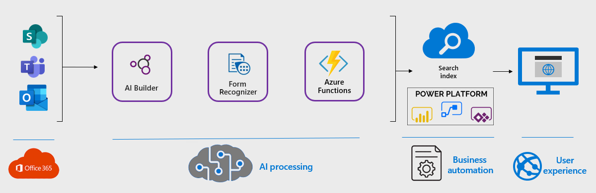

Many organizations have schematic or industrial diagrams that contain standard objects that represent a component or industrial part. Often these components have text inside of them that provide information end users need without going back to the person who drafted the diagram. By using AI Builder in the Power Platform and Forms Recognizer in Cognitive Services, a Power Automate workflow can be configured to automatically use a trained model to extract text from an image so it can be indexed and retrieved in SharePoint.

## Potential use cases

Documents can contain various types of shapes containing meaningful text that can be searched. Simply scanning the entire document reduces the contextual relevancy of the specific object you want to isolate.
User cases can include:

- Engineering schematic diagrams can be very complicated and contain several types of objects. Users typically want to search by a specific component on the diagram for investigation, exposure to shortages or recall/failure notices.
- Industrial diagrams showing the components in a manufacturing assembly such as pumps, valves, or automated switches. Identifying this helps with preventative maintenance, exposure to certain types of components and organization wide exposure for risk management.

## Architecture

1. An AI Builder model using the Object Detection template is created identifying the objects you want to capture, producing a JSON file the object detected and pixel coordinates.
1. Forms Recognition in Azure Cognitive Services is configured to receive the document where a full OCR scan is conducted resulting in a JSON file with text captured and pixel coordinates.
1. An Azure Function analyzes both JSON file outputs and determines if the object detected, intersects with text from Azure Cognitive Services.
1. Documents are ingested through SharePoint document libraries, OneDrive, or Teams collaboration.
1. Power Automate is configured to trigger an event when a new document is received calling the AI Builder Model, Cognitive Services and the Azure function ultimately populating the document library with metadata.
1. Metadata is captured in the SharePoint search index.
1. Users can search for only text within a given object using the Modern PnP Search Web Parts.
 
### Components

- AI builder in the Power Platform is used to train an Object Detection model to recognize certain objects the user specifies.
- Forms Recognizer in Azure Cognitive Services will receive the document and perform a full OCR scan.
- The AI Builder model and Forms Recognizer both return a JSON file containing pixel coordinates for the object and text OCRed respectfully. These files are passed to an Azure function where analysis is done to determine if the pixel coordinates for the object detected in AI Builder intersect with the text OCRed in Forms Recognizer. If they do, then this is considered a match and the text is returned in a JSON file for consumption.
- Power Automate is used as the trigger for a SharePoint document library, OneDrive location or Microsoft Team. When a new document is added, the above components are used to process the document ultimately retrieving metadata (text from the object) to store.
- The PnP Modern Search web parts are configured so users can search only the metadata related to the documents processed.

### Alternatives

- Cognitive Services can be used to perform a full OCR scan of the document with the resulting metadata stored in SharePoint.
- SharePoint can OCR specific documents and add the full content to the index for retrieval. Search techniques can be used to target key information on the documents.

### Availability

The solution uses Forms Recognizer in Cognitive Services that is stored in Azure where the data is always automatically replicated to ensure durability and [high availability](https://docs.microsoft.com/en-us/azure/search/search-performance-optimization#high-availability). Azure copies your data so that it is protected from planned and unplanned events, including transient hardware failures, network or power outages, and massive natural disasters. You can choose to replicate your data within the same data center, across zonal data centers within the same region, or across geographically separated regions.  For more information see our [baseline](https://docs.microsoft.com/en-us/security/benchmark/azure/baselines/cognitive-services-security-baseline) for service.

### Scalability

The solution has been designed to use AI Builder and Cognitive services that are built to scale . Customers wanting to process a high rate of documents may want to consider using a Logic App to configure the components versus a Power Automate. This will generally be cheaper and avoid any consumption limits in their tenant.

The majority of the components used in this example scenario are managed services that will automatically scale. A couple of notable exceptions: Azure Functions has a limit of a maximum of 200 instances. If you need to scale beyond this limit, consider multiple regions or app plans.

### Security

Customers should apply normal security to the components being used and the SharePoint document library the metadata will be stored in.

AI Builder relies on environment security and Microsoft Dataverse security roles and privileges to grant access to AI features in Microsoft Power Apps. For more information, see [Security overview](https://docs.microsoft.com/en-us/power-platform/admin/wp-security).

Some privileges are set by default in Dataverse. This allows built-in security roles to use AI Builder without further actions from system administrators

## Deploy this scenario
Steps to deploy the solution can be found in in this [blog article](https://powerusers.microsoft.com/t5/Power-Automate-Community-Blog/Extract-Text-From-Objects/ba-p/1249705) and also the [GitHub repo](https://github.com/Spucelik/ExtractTextFromObjects).

## Pricing

Customer should take into considerations the impact of executing this solution based on the components used.

- Power Automate – review the volume of documents being processed against licenses purchased and assigned. You must also have the HTTP premium connector to call the Forms Recognizer and Azure function.
- AI Builder credits should be purchased based on model utilization anticipated.
- Cognitive Services consumption for the Forms Recognizer module should be estimated and planned accordingly. The [Azure calculator](https://azure.microsoft.com/en-us/pricing/calculator) can assist with estimating usage.

## Next steps

Customers determining if this solution is to be considered should:

- Understand the types of documents that would be well suited for this solution.  Typical documents include schematic diagrams, manufacturing control processes and diagrams containing many shapes that need to be isolated.
- Become familiar with the capabilities offered in AI Builder and Cognitive Services.
- Have a defined information architecture to support receiving the metadata and using it to solve the identified use case.
- Review the [in-depth blog](https://powerusers.microsoft.com/t5/Power-Automate-Community-Blog/Extract-Text-From-Objects/ba-p/1249705) article explaining how the solution works and if it’s suitable for the use cases identified.
- Download and review the solution components for configuration in their tenant.