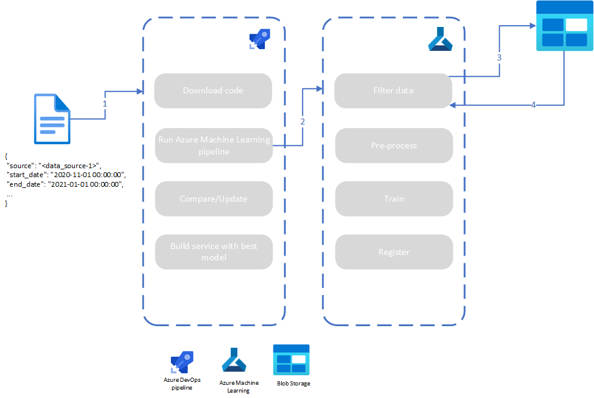

When you deploy machine learning models to multiple lines, the assumption that a model for one line will work for all other lines isn't likely to be correct. Each line will have its own distribution and will need a model that works best for that distribution. This article is intended to make it easier for you to deploy models for multiple lines.

The organization whose architecture is described in this article pushes edge device data to blob storage to validate the results of a machine learning model. These results are used to train future generations of machine learning models, but the distribution of data that comes in from each line is different. The organization needed a process to differentiate between each line's data and each line's model. This differentiation would allow the company to train and validate that each line's model performs the best for each line's distribution as time passes. 

The company resolved this problem by running a multiple-step process to train and compare the newly trained model with the existing best model. This process was wrapped in a continuous deployment (CD) pipeline. It doesn't necessarily need to be attached to a CD pipeline, but it's a good practice to automate the process.

## Potential use cases 

 This example comes from the manufacturing and energy industry, but the solution can be used in many scenarios. When you have a set of data-emitting objects that mimic each other's distributions except for some slight skewness, this solution is a good fit. If each object's distribution looks vastly different, this solution won't work. This solution might apply to these industries:

- Energy
- Medicine

## Architecture

*Download a [Visio file](https://arch-center.azureedge.net/Multiline-deployment-pipeline.vsdx) of this architecture.*

### Dataflow 

1. The architecture starts with the continuous deployment (CD) pipeline. The CD pipeline orchestrates the computation steps that run. This pipeline is the only interface into training the models, so there are some parameters that the CD pipeline should expect. Assuming that the multiple-line architecture is needed, a line identifier is needed to select the model and get the training data. If more fine-tuning on the data is required, more parameters can also be added as parameters to the CD pipeline. In the scenario described here, the CD pipeline takes in the start and end dates of the data to pull.

   Before the CD pipeline runs, there's typically a CI pipeline that runs or that has already run. In this scenario, there was a corresponding CI pipeline for the model. After this CI pipeline runs, relevant code from the repo is published to an Azure Artifacts feed. The first step in this CD pipeline downloads the code from the Artifacts feed.

2. The second phase of the CD pipeline runs an Azure Machine Learning experiment to train a model by using the applied filters. The Azure Machine Learning experiment is constructed as a pipeline that sequentially runs steps. In this case, there are four main steps that need to run. The first step is to filter the data. The filtering occurs only if filter parameters are passed in, but the data will always be pulled from the source. If all the data is located in the same place, some filters, like the line ID, can be passed as well to increase data segregation. 

3. In the example scenario, the data for all lines is stored in one Azure Blob Storage instance, so the line and location are always needed to find the relevant data. 

4. After the correct data is retrieved, the data must be pre-processed. Essentially, data pre-processing is the process of extracting and transforming the data into a form that's usable for the model. This transformation process can include one-hot encoding and filling in missing labels. After the data is cleansed, the model trains on the data. When training is complete, the model is registered in Azure Machine Learning.

   After the Azure Machine Learning pipeline runs, the live model and the newly trained model are compared. Because the targets are stored for the live model's predictions, the performance of the model is constantly updated, so the loss of the current model can be compared to the loss of the new model. If the loss of the newly trained model is better than that of the live model, the live model's tag as the best model is removed in Azure Machine Learning. The new model is tagged as the best model for the given line.

   The last step depends on where the model is used. The organization described here needs the model in a container that's installed on edge devices. The best model (either the live model or the newly trained one) is installed in the code base of the container. The image is pushed to Azure Container Registry.

### Why this approach?
This approach is used mainly because there's one model that's used across all the lines. Other than the dataset that the data was trained on, there's no real differentiating factor. Because the system is consistent for all the lines, the only variable is the dataset. This allowed the use of a repeatable process, the only differentiable factor being the data. 

The data resides in blob storage primarily because of the constraints of how and how often the data gets to the cloud from the edge devices. This method still works if the data is written to a table. Data filtering might be easier if the data is in a database. 

### Components 
- [Azure Pipelines](https://azure.microsoft.com/services/devops/pipelines) is used to create and run the CD pipeline. 
- [Azure Machine Learning](https://azure.microsoft.com/services/machine-learning-service) is used for the end-to-end machine learning lifecycle. In the scenario represented in this architecture, it's used to train the models.   
- [Azure Blob Storage](https://azure.microsoft.com/services/storage/blobs) provides massively scalable and secure object storage for cloud-native workloads, archives, data lakes, high-performance computing, and machine learning. Here, it's used to store data from edge devices. 
- [Azure Container Registry](https://azure.microsoft.com/services/container-registry) is used to store the images that contain the machine learning models.

### Alternatives
If your data can arrive in table form, you might want to consider storing it in [Azure Data Explorer](https://azure.microsoft.com/services/data-explorer) rather than using blob storage.

If your repo is in GitHub, you might consider [GitHub Actions](https://github.com/features/actions) as an alternative to the Azure DevOps pipeline.

## Considerations
In the architecture used by the organization described here, the Azure Machine Learning pipeline isn't run remotely. Because the model doesn't take long to train, running remotely isn't needed. If you're running a more complex model or the Azure Machine Learning pipeline takes a long time to complete, it would be advantageous to run the Azure Machine Learning pipeline remotely. Doing so would free up an Azure DevOps agent while the Azure Machine Learning pipeline is running.

Scale is an important consideration with this approach. This configuration was a proof of concept. The environment wasn't a production environment where hundreds or thousands of lines constantly needed to be optimized. In a production environment, it might be beneficial to spread the resources out so that all the compute and resources aren't on just a few resources.

A data drift feature is a key component of this architecture. This feature gives insight into possible changes in the distribution of new data coming in. Over time, it's not uncommon to see the distribution of the data changing. That's because the models are trained on data that might be of a different distribution (as data drift would show). It's important to optimize on the new distribution coming in rather than using the old model.

### Performance 

Be sure that the compute used in Azure Machine Learning is optimized for the algorithm. If you use a deep learning model, investigate whether you need a GPU. If you do, be sure the model is optimized to train on a GPU.

### Security 

Be sure to use managed identities to provide access to Azure resources.
 
## Pricing
To better understand the cost of running this scenario on Azure, use the [Azure pricing calculator](https://azure.microsoft.com/pricing/calculator/).

- The size of the storage account depends on the size and average volume of your data.
- Azure Machine Learning uses one compute instance of AzureML-sklearn-0.24-ubuntu18.04-py37-cuda11-gpu.
- The organization described here uses two build agents, but your scenario might require a different number of build agents. 
- Azure Container Registry is used in this scenario. It's not needed if there's no other purpose for the model other than maintaining the state of the best model in Azure Machine Learning.

To see how pricing differs for your use case, change the variables to match your expected setup. Set the expected data volume, the Azure Machine Learning compute, and the number of build agents.

## Next steps 

- [What is Azure Machine Learning?](/azure/machine-learning/overview-what-is-azure-machine-learning)
- [Azure Machine Learning pipelines](/azure/machine-learning/concept-ml-pipelines)
- [What is Azure Pipelines?](/azure/devops/pipelines/get-started/what-is-azure-pipelines?view=azure-devops)
- [Get started with Azure DevOps Starter](/azure/devops-project/azure-devops-project-github)
- [Use automated machine learning in Azure Machine Learning](https://docs.microsoft.com/learn/modules/use-automated-machine-learning)
- [Implement CI/CD with Azure DevOps](https://docs.microsoft.com/learn/modules/implement-ci-cd-azure-devops)

## Related resources 

- [Upscale ML lifecycle with MLOps framework](/azure/architecture/example-scenario/mlops/mlops-technical-paper)
- [Distributed training of deep learning models on Azure](/azure/architecture/reference-architectures/ai/training-deep-learning)
- [Artificial intelligence architecture](/azure/architecture/data-guide/big-data/ai-overview)
- [Deploy AI and ML computing on-premises and to the edge](/azure/architecture/hybrid/deploy-ai-ml-azure-stack-edge)
