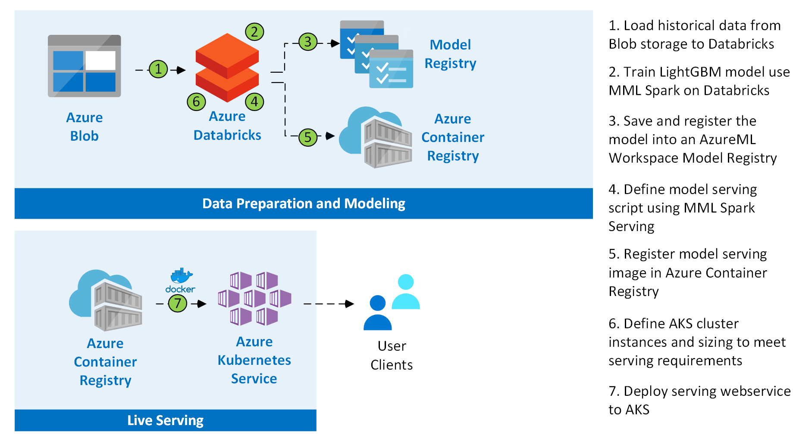

[!INCLUDE [header_file](../../../includes/sol-idea-header.md)]
Recommendations are a key revenue driver for many businesses and are used in different kinds of industries, including retail, news, and media. With the availability of large amounts of data, you can now provide highly relevant recommendations using machine learning.

There are three main types of recommendation systems in supervised learning techniques: collaborative filtering, content-based & the hybrid method approach.

**Collaborative filtering**: Collaborative filtering identifies similar patterns in customer behavior and recommends items that other similar customers have interacted with. An advantage of using the collaborative filtering approach is the ease of data generation - users create data while interacting with the items / products. Moreover, the customers could discover new items / products outside of those curated from their historical profile. However, the downside of using a collaborative filtering approach is dealing with the "cold-start" problem. Since there is a scarcity of user-new product interactions, introducing new products to the system is difficult. 

**Content-based**: Content-based recommendation uses information about the items to learn customer preferences and recommends items that share properties with items that a customer has previously interacted with. Content based recommendation systems are resilient to the cold-start problem and can adapt to the novel product introduction. However, the recommendations are limited to the features of the original item. 

**Hybrid method**: Another approach of building recommendation systems is an amalgamation of content-based and collaborative filtering. This system recommends based on the user ratings in similar space and the features of the product. The hybrid approach extracts the advantages of both the approaches. 

## Scenario details

The approach described in this article focuses on building a content-based recommendation system. More details on the best practices of building recommendation systems can be found at [Best Practices on Recommendation Systems](https://github.com/microsoft/recommenders).

This example scenario shows how your business can use machine learning to automate content-based personalization for your customers. At a high level, you use [Azure Databricks](/azure/databricks/scenarios/what-is-azure-databricks) to train a model that predicts the probability a user will engage with an item. That model is deployed to production as a prediction service using [Batched Managed Endpoints](/azure/machine-learning/concept-endpoints). In turn, you can use this prediction to create personalized recommendations by ranking items based on the content that a user is most likely to consume. 

### Potential use cases

This solution is ideal for the retail industry. This scenario is relevant to the following use cases:

- Content recommendations for websites or mobile apps
- Product recommendations for e-commerce sites
- Displayed ad recommendations for websites

## Architecture

### Dataflow

1. Large amounts of user and consumer behavior data are stored in Azure Data Lake Storage v2. 
1. Read: [Azure Databricks](/azure/databricks/scenarios/what-is-azure-databricks) connects to and reads from the ADLS storage. Ingestion into Databricks enables preprocessing and training to register the model. 
1. Data preprocessing involves data cleansing, transformations, and how the data should be fed to the recommendations system model. 
1. Training is a two-step process: Feature Engineering and Model training. During the training stage, Azure Databricks uses the preprocessed dataset to train and explain the best recommendation model. 
1. Postprocessing involves model evaluation and selection of the best performing model. 
1. The model is maintained with Azure Databricks and deployed utilizing [Batch Managed Endpoints](/azure/machine-learning/concept-endpoints) for exposure to front-end display. As the model is deployed, the new data is accessible via new endpoints – Batch and near-real time recommendations will be supported.  
1. The stored model results can be consumed through user interfaces, such as a web application. The results are written to and captured in Azure Synapse. The model runs as batch inference and stores the results in the respective datastore. 

### Components

This architecture makes use of the following components:

- [Azure Data Lake Storage v2] is a set of storage capabilities dedicated to big data analytics and provides file system semantics, file-level security & scale.
- [Azure Databricks] is a managed Apache Spark cluster for model training and evaluation. 
- [Azure Synapse] is the fast, flexible, and trusted cloud data warehouse that lets you scale, compute, and store elastically and independently, with a massively parallel processing architecture.
- [Microsoft Recommenders] is an open-source repository that contains utility code and samples. By using this repository, users can start to build, evaluate, and operationalize a recommender system.

## Next steps

- To see more examples, tutorials, and tools to help you build your own recommendation system, visit the [Microsoft Recommenders] GitHub repository.
- See the blog post, [Building recommender systems with Azure Machine Learning service](https://azure.microsoft.com/blog/building-recommender-systems-with-azure-machine-learning-service).

## Contributors

*This article is maintained by Microsoft. It was originally written by the following contributors.*

Principal author:

- [Scott Graham](https://www.linkedin.com/in/scott-graham-3a23822) | Principal Data Scientist

## Related resources

- [Build a real-time recommendation API on Azure](../../reference-architectures/ai/real-time-recommendation.yml)
- [Build a movie recommendation system using machine learning](movie-recommendations-with-machine-learning.yml)
- [Optimize and reuse an existing recommendation system](../../industries/retail/recommendation-engine-optimization.yml)
- [Product recommendations for retail using Azure](../../solution-ideas/articles/product-recommendations.yml)
- [Personalization using Cosmos DB](../../solution-ideas/articles/personalization-using-cosmos-db.yml)
- [Batch scoring of Spark models on Azure Databricks](../../reference-architectures/ai/batch-scoring-databricks.yml)
- [Retail assistant with visual capabilities](../../solution-ideas/articles/retail-assistant-or-vacation-planner-with-visual-capabilities.yml)
- [Create personalized marketing solutions in near real time](../../solution-ideas/articles/personalized-marketing.yml)
- [Personalized offers](../../solution-ideas/articles/personalized-offers.yml)

<!-- links -->

[Azure Databricks]: https://azure.microsoft.com/services/databricks
[Azure Data Lake Storage v2]: /azure/storage/blobs/data-lake-storage-introduction
[Azure Machine Learning]: https://azure.microsoft.com/services/machine-learning-service
[Microsoft Recommenders]: https://github.com/Microsoft/Recommenders
[Azure Synapse]: https://azure.microsoft.com/en-us/services/synapse-analytics/