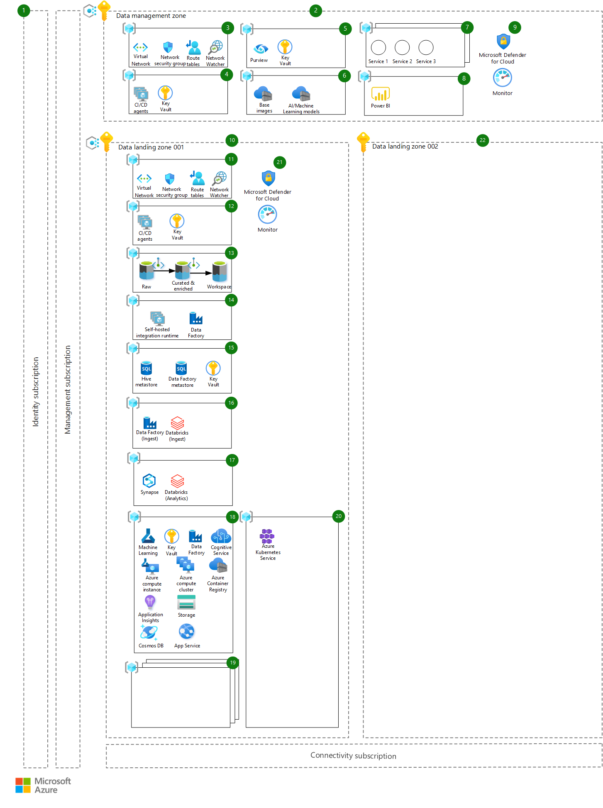

In this article, we discuss Azure architectural considerations related to the analysis and implementation of common high-risk tier classification set of information security risk management (ISRM) controls.

## Architecture

The architecture is shown in this diagram and follows the principle of [enterprise-scale landing zones](/azure/cloud-adoption-framework/ready/enterprise-scale/architecture), specifically the enterprise-scale analytics and AI reference architecture.

*Download a [Visio file](https://arch-center.azureedge.net/scalable-ai-platform-in-regulated-industries-v1.vsdx) of this architecture.*

### Workflow

The architecture consists of the workflow described in the following sections. Each component of the architecture has a corresponding number in the diagram. We describe the main purpose of the component, how it fits into the architecture, and any other important considerations that you should take when adopting it:

1. **Platform subscriptions** – Core Azure subscriptions that provide management, connectivity, and identity, through Azure Active Directory (Azure AD). They aren't outlined here in more detail and are assumed to be ready and available as part of the core enterprise-scale setup.

#### Data management

2. **Data management zone** – The data management zone is responsible for data governance across the platform and enforces guardrails to provide more flexibility downstream in the data landing zones. It has its own subscription and hosts centralized services such as data cataloging, monitoring, audits, and so on. This environment is highly controlled and subject to stringent audits. All data classification types are stored in the central data catalog (Azure Purview). Depending on metadata, different policies and access patterns are enforced. There's only one data management zone subscription for the whole tenant. The data management zone is peered (through VNET peering) with all other data landing zones. Private endpoints are used whenever possible to ensure that the deployed services aren't accessible via public internet.
1. **Networking resource group** – Azure Virtual Networks, network security groups, and all other networking-related resources needed for the data management zone are provisioned within the networking resource group.
1. **Deployment resource group** – A deployment resource group hosts private Azure DevOps CI/CD agents (virtual machines) needed for the data management zone and a Key Vault for storing any deployment-related secrets.
1. **Data governance resource group** – Azure Purview is used as a data governance and data catalog solution and is used to enforce the necessary guardrails for datasets to follow data requirements and data regulations that are imposed by law or other entities. Purview is hosted centrally within this resource group, along with a Key Vault instance for storing secrets.
1. **Centralized assets** – Centralized assets hosts important and valuable assets that are central to the platform, such as:
   - Azure Container Registries that host base images used in Azure Machine Learning-based data products (images that are previously scanned and vulnerability-free)
   - AI/Machine Learning models that are published and made available to consumers on the platform (so they can be deployed to one or more data landing zones if needed).
1. **Additional services** – Any other services that should be centralized can be hosted in one of these resource groups, which can include centralized Azure API Management instances, third-party software, and so on.
1. **Data visualization resource group** – This resource group hosts data visualization solutions shared across data landing zones. Solutions can be Power BI, Tableau, or any other visualization solution.
1. **Additional infrastructure controls and governance** – Microsoft Defender for Cloud and Azure Monitor are used as baseline security and monitoring solutions.

#### Data landing zones

10. **Data landing zone 001** – A data landing zone is a subscription that represents a unit of scale within the data platform. Data landing zones are deployed based on the core data landing zone architecture (blueprint), including all key capabilities to host an analytics and AI platform. There can be one or many data landing zones within the environment. Azure Policy is applied to keep access and configurations of various Azure services secure. The data landing zone is peered (through VNET peering) with all other data landing zones and the data management zone. Private endpoints are used whenever possible to ensure that the deployed services aren't accessible via public internet.
1. **Networking resource group** – Azure Virtual Networks, network security groups, and all other networking-related resources needed for the data landing zone are provisioned within this resource group.
1. **Deployment resource group** – A deployment resource group hosts private Azure DevOps CI/CD agents (virtual machines) needed for the data landing zone and a Key Vault for storing any deployment-related secrets.
1. **Data storage resource group** – A data storage resource group contains the main data storage accounts for this data landing zone, deployed as Azure Data Lake Storage Gen2, with hierarchical namespace. They're spread across three main areas:
   - **Raw** – Data is ingested from the data source in its original state
   - **Curated and Enriched** – Data is cleansed, validated, and aggregated
   - **Workspace** – Specific data products can store their datasets or the outputs of the Machine Learning models, and so on

    The arrows in the diagrams show the expected data flow, from raw data to curated and enriched (trusted) data, and over to workspace for exploration, analytics, and providing extra value out of the data product.
1. **Data integration resource group** – The data integration resource group hosts an Azure Data Factory that shares connectivity with the on-premises self-hosted integration runtime (SHIR). Its main purpose is to establish connectivity. Other Data Factory instances reuse it so that connectivity is maintained only in one place. Its other purpose is to host the self-hosted integration runtime for the Azure Purview service so that it can access the data sources on this data landing zone, for scanning purposes.
1. **Metadata management resource group** – The metadata management resource group hosts metadata for Azure Databricks (the Hive meta store) and Azure Data Factory ingestion and processing pipelines. It also hosts a Key Vault to store secrets for accessing this data. Azure SQL Database is used to host the metadata.
1. **Data ingestion resource group** – The data ingestion resource group hosts an Azure Data Factory instance where all data ingestion pipelines specific for a data domain are deployed. Azure Databricks is used as a processing engine to load and transform the data and store it in the data lake accounts.
1. **Analytics resource group** – The analytics resource group includes two shared services for further data analytics and exploration: Azure Synapse and Azure Databricks. Both of these services provide extensive compute and scale for massive data exploration and analytics purposes.
1. **Data product resource group** – The data product resource group is a blueprint for a data product, with a resource group containing basic Azure resources that a data product might need. The deployment should be configurable through an Azure DevOps pipeline based on the specific needs of the business. The core Azure services deployed here are as follows:
   - Azure Machine Learning workspace as the basis for any enterprise machine learning project with related services such as Key Vault (for storing secrets)
   - Application Insights (for model monitoring)
   - Azure storage (for storing datasets)
   - An Azure Container Registry for storing model images during development

   Cognitive Services is deployed as a bundle to provide API access to multiple AI-backed services, and Azure Machine Learning compute instance and compute clusters are used for development, model building, and testing purposes. Azure Data Factory is used to orchestrate batch scoring of models, if needed. Azure App Service and Azure Cosmos DB provide an extra layer for deployment of the data product, where a custom application or API can be hosted with its own internal data store.

   Regulated industries usually have strict data access restrictions, and usually allow production data to be hosted only within the production environment. Because of this reason, the development lifecycle of data products is occurring only in the production data landing zone, and a separate environment, or resource group, is provisioned for development, testing, and deployment purposes.
1. **Additional data products** – These resource groups host other data products, since one data landing zone can host one or many data products.
1. **Shared compute resource group** – Any shared compute that is needed for hosting and deploying data products is provisioned within this resource group. An Azure Kubernetes Service cluster is an example.
1. **Additional infrastructure controls and governance** – Microsoft Defender for Cloud, and Azure Monitor are used as baseline security and monitoring solutions.
1. **Data landing zone 002** – This landing zone is a placeholder for extra Azure subscriptions that would be used for hosting new data landing zones. They're based on criteria mentioned before, such as data residency requirements, or a different business unit that has its own cross-functional team and a set of use cases to be delivered.

### Components

- [Azure Active Directory](https://azure.microsoft.com/services/active-directory)
- [Azure Purview](https://azure.microsoft.com/services/purview)
- [Azure Virtual Network](https://azure.microsoft.com/services/virtual-network)
- [Azure DevOps](https://azure.microsoft.com/services/devops)
- [Azure Container Registry](https://azure.microsoft.com/services/container-registry)
- [Azure Machine Learning](https://azure.microsoft.com/services/machine-learning)
- [Microsoft Defender for Cloud](https://azure.microsoft.com/services/security-center)
- [Azure Monitor](https://azure.microsoft.com/services/monitor)
- [Azure Policy](https://azure.microsoft.com/services/azure-policy)
- [Azure Data Lake Storage](https://azure.microsoft.com/services/storage/data-lake-storage)
- [Azure Data Factory](https://azure.microsoft.com/services/data-factory)
- [Azure SQL Database](https://azure.microsoft.com/products/azure-sql/database)
- [Azure Databricks](https://azure.microsoft.com/services/databricks)
- [Azure Synapse Analytics](https://azure.microsoft.com/services/synapse-analytics)
- [Azure Kubernetes Service](https://azure.microsoft.com/services/kubernetes-service)

### Alternatives

In distributed organizations, business groups operate independently and with high degrees of autonomy. As such, they might consider an alternative solution design, with full isolation of use cases in Azure landing zones, sharing a minimal set of common services. Although this design allows a fast start, it requires high effort from IT and ISRM organizations, since design of individual use cases can quickly diverge from blueprint designs. Additionally, it requires independent ISRM processes and audits for each of the AI and Machine Learning products hosted in Azure.

## Scenario details

Scaling AI and machine learning initiatives in regulated environments poses significant challenges to organizations, no matter their digital maturity and size. In this article, we discuss key architectural decisions to consider when adopting Azure's data engineering and machine learning services in regulated industries. These decisions are based on what was learned from a recent implementation in a Fortune 500 global life sciences and healthcare company.

The architecture presented in this article follows the enterprise-scale analytics and AI reference architecture design and was one of its first implementations.

If you set up data science projects and develop machine learning models in life sciences and healthcare environments, then in almost all cases, you need access to high business impact (HBI) data sources. For example, these sources can be clinical trial protocol information without patient data, molecule's chemical formulae, or manufacturing process secrets.

In regulated industries, IT systems are classified based on the classification of the data sources those systems access. AI and machine learning environments running on Azure are classified as HBI, and are required to comply with an extensive set of ISRM policies and controls.

### Design principles

This architecture is based on the following principles:

- Enterprise-scale is an architectural approach and a reference implementation aligned with the Azure roadmap and part of the Microsoft Cloud Adoption Framework (CAF). It enables effective construction and operationalization of landing zones on Azure, at scale. The name *landing zone* is used as a boundary in which new or migrated applications land in Azure. In this scenario, it also refers to parts of the data platform that are used to host the data and the AI and Machine Learning models.
- Traditional monolithic data platform architectures have an inherent limitation that slows the delivery of features and values. The architecture described here lets organizations scale their data estate and address the challenges of a centralized monolithic data lake by using a decentralized approach with separation of ownership (data mesh). The approach lets organizations scale to thousands of ingest pipelines and data products, while keeping the data platform secure and maintainable by decoupling the core data platform and data management services (deployed in a separate landing zone called data management zone) from data domains and data products (deployed to one or more data landing zones).
- Subscriptions are used as units of management and scale aligned with business needs and priorities. Scaling is achieved by providing new subscriptions (data landing zones) to business units based on criteria such as different business stakeholders, different business goals and requirements, and data residency requirements (where data needs to be hosted in a specific geo-region).
- Azure Policy is used to provide guardrails and ensure continued compliance within the company's IT landscape.
- Single control and management plane (through the Azure portal) provides a consistent experience across all Azure resources and provisioning channels subject to role-based access and policy-driven controls. Azure-native platform services and capabilities are used whenever possible.
- Cross-functional teams take ownership of the design, development, and operations to shorten the time to market and the agility within the platform. Core principles like DevOps, Infrastructure as Code (IaC), and resilient designs are used to avoid human error and single points of failure.
- Domain and data source subject matter experts can use data domains to pull in data assets from Azure, third-party, or on-premises environments. A data domain is a resource group within a data landing zone that cross-functional teams can use for custom data ingestion. There can be one or many data domains within a data landing zone. Data domains can be viewed similarly to domains in Domain-Driven Design where they provide a context boundary and are self-sufficient and isolated. An example of a data domain would be clinical trial data or supply chain data.

### Potential use cases

The architectural considerations discussed in this article have their source in the life sciences and healthcare industries. However, they're also relevant for organizations in other regulated industries, including these industries:

- Financial services
- Healthcare providers
- Oil and gas

Implementation of enterprise-scale analytics and AI reference architecture in regulated environments follows similar design patterns.

## Considerations

These considerations implement the pillars of the Azure Well-Architected Framework, which is a set of guiding tenets that can be used to improve the quality of a workload. For more information, see [Microsoft Azure Well-Architected Framework](/azure/architecture/framework).

In this section, we discuss lessons learned from the implementation of the architecture described earlier in a life sciences and healthcare regulated environment. We also cover high-level design considerations to meet common ISRM controls and policies.

### Security

Security provides assurances against deliberate attacks and the abuse of your valuable data and systems. For more information, see [Overview of the security pillar](/azure/architecture/framework/security/overview).

#### Environments

In regulated environments, IT systems classified as HBI are required to have multiple segregated environments, such as development, quality, and production, or similar. Access to protected data sources is only authorized in production-certified environments.

Since AI and machine learning development requires access to sensitive data sets, the different stages of the machine learning operations process, such as model build, training, and inference (or similar), all take place in production. Development and quality environments are typically restricted to infrastructure, operations, and data engineering type of work, to ensure continuous enhancements as new Azure services and features become available.

AI and data science development activities should be carried out in production environments, except for sandbox or early exploratory work.

#### Encryption

IT systems accessing, storing, and processing sensitive business data are required to implement specific requirements on encryption keys management, like FIPS 140-2 level 2 or level 3 policies, with Customer-Managed Keys (CMK) integration. Protected data must always be encrypted at rest and in transit, using TLS 1.2 or higher protocols.

During architecture design, a careful analysis of the support and integration of Azure services to an organization's CMK infrastructure is required. Any exceptions to data encryption must be documented. Support for hardware security module (HSM) vendors is always being expanded, and additional information can be found at [Azure Key Vault Managed Hardware Security Module](/azure/storage/common/customer-managed-keys-overview).

#### Network design and ring fencing

AI and machine learning environments must have ring-fencing in place, with network segmentation and network access controls implemented. Network communication between architecture components is limited to required data flows and underlying infrastructure to function in an allowlisting approach. Signature-based analysis and behavior-based analysis should be applied.

Enforce network access controls across several layers in the architecture, including Azure Firewalls, inspecting inbound and outbound network connectivity, network security groups, and access to web application endpoint protected with web application firewall (WAF).

#### Authorization management

AI and machine learning environments running on Azure must be integrated with an organization's main account provisioning system, where requests to grant access to critical business applications are submitted, approved, and audited.

Account provisioning systems are expected to connect to an organization's Active Directory and Azure AD, so that business authorization roles map to corresponding Active Directory and Azure AD security groups.

AI and machine learning environments follow a role-based access control model. Access level control authorizations ensure that users can only perform the tasks and actions for their job role and business requirement. Machine learning use cases are expected to be high segregated, as data scientists working in a particular use case are only allowed to access the resources part of that use case, following a principle of least privilege. These resources can include:

- Storage accounts
- Azure Machine Learning workspaces
- Computing instances

Role-based access control uses security groups in Azure AD.

#### Multifactor authentication

Multifactor authentication must be in place and implemented for access to all environments running on Azure and classified as high-business impact. Multifactor authentication can be enforced using Azure Active Directory multifactor authentication services. Application endpoints – including Azure DevOps, Azure Management Portal, Azure Machine Learning, Azure Databricks, and Azure Kubernetes Services – should be configured in multifactor authentication access control policies.

Multifactor authentication must be enforced to all users, including Azure service managers, data engineers, and data scientists.

### Operational excellence

Operational excellence covers the operations processes that deploy an application and keep it running in production. For more information, see [Overview of the operational excellence pillar](/azure/architecture/framework/devops/overview).

#### Logging and monitoring

All Azure services must ingest their security events into an organization's Security Operations Center (SOC) platform, and the following security events should be recorded:

- Successful and failed authentication attempts
- Sensitive data access
- Changes to security policy
- Changes to admin user groups, users, or roles
- Sensitive data transfers to external locations, if applicable
- Activation and deactivation of protection systems, such as ABAC controls
- Updated access to logs and interruption to logging

Azure security logs can be ingested into SOC through different patterns:

- A central Azure Log Analytics workspace
- Event hub connected to SOC platform systems, such as Splunk
- Windows VM and other compute resources deployed with SOC agents

#### DevOps

In regulated environments, IT systems must follow strict waterfall-style quality control processes, with formal approvals (or gates) between process phases – like user requirements specifications, functional specifications, design, and testing specifications, or similar – with extensive and time-consuming supporting documentation.

Azure environments and data science development follow iterative processes, anchored in a DevOps culture. A significant effort in scaling AI and machine learning initiatives is spent communicating the pillars of a DevOps organization and creating automated end-to-end traceability mapping between Azure DevOps epics, features, user stories, test plans and CI/CD pipelines, and required quality control entities and evidence.

### Performance efficiency

Performance efficiency is the ability of your workload to scale to meet the demands placed on it by users in an efficient manner. For more information, see [Performance efficiency pillar overview](/azure/architecture/framework/scalability/overview).

To scale AI and machine learning in regulated environments, and drive rapid adoption across organization's business areas, we recommend you design and put in place an adoption framework to measure, monitor, and evaluate the value created by the Azure services. From our life sciences and healthcare industry example, the following business value levers and key performance indicators (KPI) were evaluated:

**Scalability** – To ensure Azure architecture can scale alongside business requirements, no matter the scale point, the following KPIs are suggested:

- Number of compute instances, and total storage and memory used
- Number of experiments ran
- Number of models deployed

**Acceleration of AI development** – To accelerate AI and machine learning solution development, the following KPIs are suggested:

- Number of different business units consuming Azure's AI and machine learning services
- Number of users onboarded, per category – for example, data engineers, data scientists, citizen data scientists, and business users
- Number of experiments ran
- Time between onboarding of users and active usage
- Time to provision services – from change configuration request to service provisioning completion

**Compliance** – To ensure continuous compliance of deployed AI and machine learning solutions, the following KPIs are suggested:

- Overall compliancy with applicable ISRM controls
- Number of security vulnerability warnings
- Number of security incidents for the last period

**User Experience** – To ensure that high quality and consistent user experiences are available, the following KPIs are suggested:

- Number of user help desk requests
- Net Promoter Score (NPS)

**Secure Foundations** – To ensure safe and secure foundations are in place, the following KPIs are suggested:

- Critical services uptime
- Number of incidents reported related to performance availability

### Cost optimization

Cost optimization is about looking at ways to reduce unnecessary expenses and improve operational efficiencies. For more information, see [Overview of the cost optimization pillar](/azure/architecture/framework/cost/overview).

Cost management is an important part of design in the implementation of scalable AI and machine learning platforms, since running costs don't follow simple and predictable patterns. Cost is primarily driven by the number and size of the AI and machine learning experiments being executed in the platform, and more specifically on the number and SKUs of the compute resources used in model training and inference.

Here are some practices we recommend:

- Assign every use case and AI and machine learning product its own Azure services budget, which is a good cost management practice.
- Establish a transparent cost model for platform shared services.
- Use tags consistently to associate use case and product resources with cost centers.
- Use Azure Advisor and Azure Budget to understand where resources aren't being used in the most optimal way and review configurations regularly.

## Contributors

*This article is maintained by Microsoft. It was originally written by the following contributors.*

Principal author:

- [Eran Sagi](https://il.linkedin.com/in/sagieran) | AI Solution Architect

## Next steps

Learn how to train and deploy models and manage the machine learning lifecycle with Azure Machine Learning. Tutorials, code examples, API references, and more, available here:

- [Azure Machine Learning Documentation](/azure/machine-learning)

Learn how to implement an enterprise-scale landing zone for data analytics and AI in Azure:

- [Enterprise-scale analytics and AI reference architecture](/azure/cloud-adoption-framework/scenarios/data-management/enterprise-scale-landing-zone)

Product documentation:

- [Azure Machine Learning](https://azure.microsoft.com/services/machine-learning)
- [Machine Learning Operations](https://azure.microsoft.com/services/machine-learning/mlops)
- [Azure Databricks](https://azure.microsoft.com/services/databricks)
- [Azure Data Lake Storage Gen2](/azure/storage/blobs/data-lake-storage-introduction)

## Related resources

Azure Architecture Center overview articles:

- [Machine learning at scale](/azure/architecture/data-guide/big-data/machine-learning-at-scale)
- [Implementing the Azure blueprint for AI](/previous-versions/azure/industry-marketing/health/sg-healthcare-ai-blueprint)
- [Microsoft Azure Well-Architected Framework](/azure/architecture/framework)
