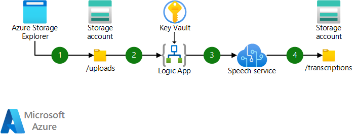
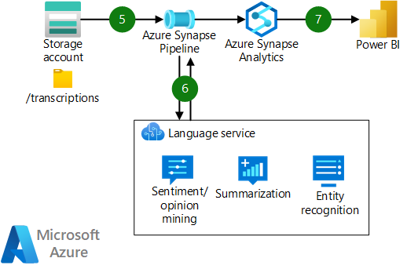

Speech recognition and analysis of recorded customer calls can provide your business with valuable information about current trends, product shortcomings, and successes.

The example solution described in this article outlines a repeatable pipeline for transcribing and analyzing conversation data.

## Architecture

The architecture consists of two pipelines: A transcription pipeline to convert audio to text, and an enrichment and visualization pipeline.

### Transcription pipeline

*Download a [Visio file](https://arch-center.azureedge.net/speech-to-text-transcription-pipeline.vsdx) of this architecture.*

#### Dataflow

1. Audio files are uploaded to an Azure Storage account via any supported method. You can use a UI-based tool like [Azure Storage Explorer](/azure/vs-azure-tools-storage-manage-with-storage-explorer) or use a [storage SDK or API](/azure/storage/blobs/reference).
1. The upload to Azure Storage triggers an Azure logic app. The logic app accesses any necessary credentials in Azure Key Vault and makes a request to the Speech service's batch transcription API.
1. The logic app submits the audio files call to the Speech service, including optional settings for speaker diarization.
1. The Speech service completes the batch transcription and loads the transcription results to the Storage account.

### Enrichment and visualization pipeline

*Download a [Visio file](https://arch-center.azureedge.net/speech-to-text-transcription-pipeline.vsdx) of this architecture.*

#### Dataflow

5. An Azure Synapse Analytics pipeline runs to retrieve and process the transcribed audio text.
6. The pipeline sends processed text via an API call to the Language service. The service performs various natural language processing (NLP) enrichments, like sentiment and opinion mining, summarization, and custom and pre-built named entity recognition.
7. The processed data is stored in an Azure Synapse Analytics SQL pool, where it can be served to visualization tools like Power BI.

### Components

- [Azure Blob Storage.](https://azure.microsoft.com/services/storage/blobs) Massively scalable and secure object storage for cloud-native workloads, archives, data lakes, high-performance computing, and machine learning. In this solution, it stores the audio files and transcription results and serves as a data lake for downstream analytics.
- [Azure Logic Apps.](https://azure.microsoft.com/services/logic-apps) An integration platform as a service (iPaaS) that's built on a containerized runtime. In this solution, it integrates storage and speech AI services. 
- [Azure Cognitive Services Speech service.](https://azure.microsoft.com/services/cognitive-services/speech-services) An AI-based API that provides speech capabilities like speech-to-text, text-to-speech, speech translation, and speaker recognition. Its batch transcription functionality is used in this solution.
- [Azure Cognitive Service for Language.](https://azure.microsoft.com/services/cognitive-services/language-service) An AI-based managed service that provides natural language capabilities like sentiment analysis, entity extraction, and automated question answering.
- [Azure Synapse Analytics.](https://azure.microsoft.com/services/synapse-analytics) A suite of services that provide data integration, enterprise data warehousing, and big data analytics. In this solution, it transforms and enriches transcription data and serves data to downstream visualization tools.
- [Power BI.](https://powerbi.microsoft.com) A data modeling and visual analytics tool. In this solution, it presents transcribed audio insights to users and decision makers.

### Alternatives

Here are some alternative approaches to this solution architecture:

* Consider configuring the Blob Storage account to use a hierarchical namespace. This configuration provides ACL-based security controls and can improve performance for some big data workloads.
* You might be able to use Azure Functions as a code-first integration tool instead of Logic Apps or Azure Synapse pipelines, depending on the size and scale of the workload.

## Scenario details

Customer care centers are an integral part of the success of many businesses in many industries. This solution uses the Speech API from [Azure Cognitive Services](/azure/cognitive-services/speech-service/overview) for the audio transcription and diarization of recorded customer calls. [Azure Synapse Analytics](/azure/synapse-analytics) is used to process and perform NLP tasks like sentiment analysis and custom named entity recognition through API calls to [Azure Cognitive Service for Language](/azure/cognitive-services/language-service).

You can use the services and pipeline described here to process transcribed text to recognize and remove sensitive information, perform sentiment analysis, and more. You can scale the services and pipeline to accommodate any volume of recorded data.

### Potential use cases

This solution can provide value to organizations in many industries, including telecommunications, financial services, and government. It applies to any organization that records conversations. In particular, customer-facing or internal call centers or support desks can benefit from the insights derived from this solution.

## Considerations

These considerations implement the pillars of the Azure Well-Architected Framework, which is a set of guiding tenets that you can use to improve the quality of a workload. For more information, see [Microsoft Azure Well-Architected Framework](/azure/architecture/framework).

### Security

Security provides assurances against deliberate attacks and the abuse of your valuable data and systems. For more information, see [Overview of the security pillar](/azure/architecture/framework/security/overview).

- The request to the Speech API can include a shared access signature (SAS) URI for a destination container in Azure Storage. A SAS URI enables the Speech service to directly output the transcription files to the container location. If your organization doesn't allow the use of SAS URIs for storage, you need to implement a function to periodically poll the Speech API for completed assets. 
- Credentials like account or API keys should be stored in Azure Key Vault as secrets. Configure your Logic Apps and Azure Synapse pipelines to access the key vault by using managed identities to avoid storing secrets in application settings or code.
- The audio files that are stored in the blob might contain sensitive customer data. If multiple clients are using the solution, you need to restrict access to these files. Use hierarchical namespace on the storage account and enforce folder and file level permissions to limit access to only the needed Azure Active Directory instance.

### Cost optimization

Cost optimization is about looking at ways to reduce unnecessary expenses and improve operational efficiencies. For more information, see [Overview of the cost optimization pillar](/azure/architecture/framework/cost/overview).

All Azure services described in this architecture provide an option for pay-as-you-go billing, so solution costs scale linearly.

Azure Synapse provides an option for serverless SQL pools, so the compute for the data warehousing workload can be spun up on demand. If you aren't using Azure Synapse to serve other downstream use cases, consider using serverless to reduce costs.

See [Overview of the cost optimization pillar](/azure/architecture/framework/cost/overview) for more cost optimization strategies.

For pricing for the services suggested here, see this [estimate in the Azure pricing calculator](https://azure.com/e/27232ae18e00459fa724d25275250f11).

### Performance efficiency

Performance efficiency is the ability of your workload to scale to meet the demands placed on it by users in an efficient manner. For more information, see [Performance efficiency pillar overview](/azure/architecture/framework/scalability/overview).

The batch speech API is designed for high volume, but other Cognitive Services APIs might have request limits for each subscription tier. Consider containerizing these APIs to avoid throttling large-volume processing. Containers give you flexibility in deployment, in the cloud or on-premises. You can also mitigate side effects of new version rollouts by using containers. For more information, see [Container support in Azure Cognitive Services](/azure/cognitive-services/cognitive-services-container-support).

## Contributors

*This article is maintained by Microsoft. It was originally written by the following contributors.*

Principal authors:

* [Dhanashri Kshirsagar](https://www.linkedin.com/in/dhanashrikr) | Senior Content Program Manager
* [Brady Leavitt](https://www.linkedin.com/in/bradyleavitt) | Dir Specialist GBB
* [Kirpa Singh](https://www.linkedin.com/in/kirpa-singh-80676713) | Senior Software Engineer
* [Christina Skarpathiotaki](https://www.linkedin.com/in/christinaskarpathiotaki) | Cloud Solution Architect

Other contributor:

- [Mick Alberts](https://www.linkedin.com/in/mick-alberts-a24a1414) | Technical Writer

*To see non-public LinkedIn profiles, sign in to LinkedIn.*

## Next steps

- [Quickstart: Recognize and convert speech to text](/azure/cognitive-services/speech-service/get-started-speech-to-text?tabs=windowsinstall%2Cterminal&pivots=programming-language-python)
- [Quickstart: Create an integration workflow with multi-tenant Azure Logic Apps and the Azure portal](/azure/logic-apps/quickstart-create-first-logic-app-workflow)
- [Quickstart: Get started with Language Studio](/azure/cognitive-services/language-service/language-studio)
- [Cognitive Services in Azure Synapse Analytics](/azure/synapse-analytics/machine-learning/overview-cognitive-services)
- [What is the Speech service?](/azure/cognitive-services/speech-service/overview)
- [What is Azure Logic Apps?](/azure/logic-apps/logic-apps-overview)
- [What is Azure Cognitive Service for Language?](/azure/cognitive-services/language-service/overview)
- [What is Azure Synapse Analytics?](/azure/synapse-analytics/overview-what-is)
- [Extract insights from text with the Language service](/training/modules/extract-insights-text-with-text-analytics-service)
-  [Model, query, and explore data in Azure Synapse](/training/paths/model-query-explore-data-for-azure-synapse)

## Related resources

- [Natural language processing technology](../../data-guide/technology-choices/natural-language-processing.yml)
- [Optimize marketing with machine learning](../../solution-ideas/articles/optimize-marketing-with-machine-learning.yml)
- [Big data analytics with enterprise-grade security using Azure Synapse](../../solution-ideas/articles/big-data-analytics-enterprise-grade-security.yml)
