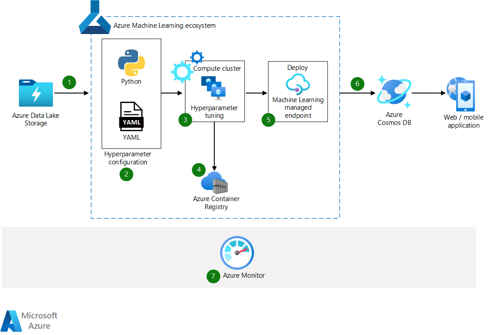

---
ms.custom:
  - devx-track-python
---
This article describes distributed hyperparameter tuning for Python machine learning models. Hyperparameters are adjustable parameters that control machine learning model training. Machine learning model performance depends heavily on hyperparameters.

Hyperparameter tuning, also called hyperparameter optimization, is the process of finding hyperparameter configurations that produce the best model training performance. [Azure Machine Learning](/azure/machine-learning/overview-what-is-azure-machine-learning) can help automate and distribute hyperparameter tuning.

## Architecture

*Download a [Visio file](https://arch-center.azureedge.net/hyperparameters-for-machine-learning-models.vsdx) of this architecture.*

### Workflow

1. The Machine Learning ecosystem ingests data from Azure Data Lake Storage.

1. Python or YAML can configure sets of hyperparameters.

1. Distributed hyperparameter tuning trains model instances on multiple CPUs and GPUs to identify the best-performing model.

1. An Azure Container Registry model registry holds the trained models. Registering the models into the model registry makes them easy to organize and track.

1. The best-performing model registers with Machine Learning and deploys through Machine Learning managed endpoints.

1. Azure Cosmos DB stores the model so the web or mobile application can consume it.

1. Azure Monitor monitors and logs activities throughout the process.

### Components

- [Azure Data Lake Storage](https://azure.microsoft.com/products/storage/data-lake-storage) provides a massively scalable and secure data lake for high-performance analytics workloads.

- [Microsoft Data Science Virtual Machine](https://azure.microsoft.com/products/virtual-machines/data-science-virtual-machines) (DSVM) offers Windows Server and Linux virtual machine (VM) images configured with data analytics and machine learning tools. The scenarios in this article use Ubuntu Linux DSVMs.

- [Azure Machine Learning](https://azure.microsoft.com/products/machine-learning/#product-overview) trains, tests, deploys, automates, and manages machine learning and AI models at cloud scale. [Machine Learning managed compute](/azure/machine-learning/service/concept-compute-target#azure-machine-learning-compute-managed) allocates [compute target](/azure/machine-learning/concept-compute-target) nodes on demand, based on an automatic [scaling](/azure/virtual-machine-scale-sets/overview) option. Each compute node is a VM that runs a training job for a particular hyperparameter set.

- [Azure Container Registry](https://azure.microsoft.com/products/container-registry) stores images for Docker container deployments. In this workload, containers on each compute node run Python training scripts they pull from Container Registry.

- [Azure Cosmos DB](https://azure.microsoft.com/products/cosmos-db) is a fully managed, serverless NoSQL database for high-performance applications of any size or scale.

- [Azure Monitor](https://azure.microsoft.com/products/monitor) collects, analyzes, and acts on telemetry data from Azure and on-premises environments. Monitor helps maximize the performance and availability of applications and proactively identify problems.

## Scenario details

Adjustable training parameters or hyperparameters control machine learning model training. For example, hyperparameters for deep learning neural networks include the number of hidden layers and the number of nodes in each layer. It's important to determine the sets of hyperparameters that produce the best model training performance.

The hyperparameter tuning or optimization process is typically manual, computationally expensive, and time consuming. [Machine Learning](/azure/machine-learning/overview-what-is-azure-machine-learning) can automate hyperparameter tuning and let you run experiments in parallel to efficiently tune hyperparameters.

The following sections describe hyperparameter optimization scenarios for scikit-learn models and deep learning models with graphics processing units (GPUs). To operationalize these scenarios, see [MLOps for Python models using Azure Machine Learning](../../reference-architectures/ai/mlops-python.yml).

### Stack Overflow FAQ matching scenario

This scenario tunes a [scikit-learn](https://pypi.org/project/scikit-learn) pipeline to address frequently asked questions (FAQ) matching. The scenario uses a subset of Stack Overflow question data that includes original questions, their duplicate questions, and their answers. The model predicts the probability that a duplicate question matches one of the original questions. The goal is to build a model that finds similarities between duplicate questions.

This scenario uses grid sampling, a hyperparameter tuning technique that does a simple grid search over values based on specified range and increment. This technique can exhaustively search over the entire search space. The grid sampling technique supports discrete hyperparameters and early termination of low-performing jobs.

### Out-of-stock detection scenario

This scenario tunes an object detection model deployed as a web service to help detect out-of-stock products on store shelves. The model uses images of store shelves filled with products to predict empty spaces, and combines empty space predictions with other information sources, such as planograms and databases. This model uses a dataset distributed under a [CC-BY 4.0 license](https://creativecommons.org/licenses/by/4.0) and covers only empty space prediction.

You can distribute hyperparameter tuning in neural networks by configuring multiple sets of hyperparameters, like number of hidden layers and learning rate, and running them on GPU-enabled compute clusters in parallel. For more information about state-of-the-art object detection algorithms, see [A Survey of Modern Deep Learning-based Object Detection Models](https://arxiv.org/abs/2104.11892).

## Considerations

These considerations implement the pillars of the Azure Well-Architected Framework, which is a set of guiding tenets that can be used to improve the quality of a workload. For more information, see [Microsoft Azure Well-Architected Framework](/azure/architecture/framework).

### Security

Security provides assurances against deliberate attacks and the abuse of your valuable data and systems. For more information, see [Overview of the security pillar](/azure/architecture/framework/security/overview).

Implement the following practices to improve Machine Learning security in Azure:

- Restrict access to resources and operations by user account or groups.
- Restrict incoming and outgoing network communications.
- Encrypt data in transit and at rest.
- Scan for vulnerabilities.
- Apply and audit configuration policies.

For more information about Machine Learning security, see [Enterprise security and governance for Azure Machine Learning](/azure/machine-learning/concept-enterprise-security).

### Cost optimization

Cost optimization is about looking at ways to reduce unnecessary expenses and improve operational efficiencies. For more information, see [Overview of the cost optimization pillar](/azure/architecture/framework/cost/overview).

The cost of a hyperparameter tuning run depends on the Machine Learning compute VM size, whether low-priority nodes are used, and the maximum number of nodes allowed in the cluster.

Ongoing costs when the cluster isn't in use depend on the minimum number of nodes the cluster requires. With cluster autoscaling, the system automatically adds nodes up to the allowed maximum when needed, and removes nodes down to the requested minimum when no longer needed. If the cluster can autoscale down to zero nodes, it doesn't cost anything when not in use.

For more information about Machine Learning costs, see [Plan to manage costs for Azure Machine Learning](/azure/machine-learning/concept-plan-manage-cost).

### Operational excellence

Operational excellence covers the operations processes that deploy an application and keep it running in production. For more information, see [Overview of the operational excellence pillar](/azure/architecture/framework/devops/overview).

For this workload, Monitor can log training, registry, and deployment activities. Monitor also helps track experiments and analyze logs.

### Performance efficiency

Performance efficiency is the ability of your workload to scale to meet the demands placed on it by users in an efficient manner. For more information, see [Performance efficiency pillar overview](/azure/architecture/framework/scalability/overview).

Each set of hyperparameters runs on one Machine Learning compute node. For the FAQ matching scenario, each node can be a Standard_D4_v5 VM, which has four cores. This scenario uses a LightGBM classifier, a gradient boosting framework for machine learning. As a result, the hyperparameter tuning run takes one quarter of the original time to search through all sets on a single node. The compute requirements might change depending on use case and dataset.

You can use GPU-enabled compute nodes, such as Standard_NC6s_v3, for deep learning use cases like the out-of-stock detection scenario. Each hyperparameter tuning run uses a single GPU on each Standard_NC6s_v3 VM. The compute requirements might change depending on use case.

While adding more nodes can significantly speed up run time, increased start-up times typically add several minutes of overhead. Choose a configuration with appropriate compute capacity to minimize runtime vs unit costs and start-up times.

## Contributors

*This article is maintained by Microsoft. It was originally written by the following contributors.*

Principal authors:

- Mario Bourgoin | Senior Data Scientist
- [Fidan Boylu Uz](https://www.linkedin.com/in/fidan-boylu-uz-ph-d-mba-3a6b782/) | Principal D&AS Manager
- [Ashish Chauhan](https://www.linkedin.com/in/a69171115) | Sr Cloud Solution Architect

*To see non-public LinkedIn profiles, sign in to LinkedIn.*

## Next steps

- [Hyperparameter tuning a model](/azure/machine-learning/how-to-tune-hyperparameters)
- [Distributed GPU training guide](/azure/machine-learning/how-to-train-distributed-gpu)
- [Microsoft Neural Network Intelligence](https://github.com/microsoft/nni)
- [Train and evaluate deep learning models](/training/modules/train-evaluate-deep-learn-models)
- [Tune hyperparameters with Azure Machine Learning](/training/modules/tune-hyperparameters-with-azure-machine-learning)

## Related resources

- [Distributed training of deep learning models on Azure](../../reference-architectures/ai/training-deep-learning.yml)
- [Machine learning at scale](../../data-guide/big-data/machine-learning-at-scale.md)
- [Real-time scoring of Python models](../../reference-architectures/ai/real-time-scoring-machine-learning-models.yml)
- [Batch scoring of Python models on Azure](../../reference-architectures/ai/batch-scoring-python.yml)
- [Many models machine learning with Spark](many-models-machine-learning-azure-spark.yml)
- [Azure Machine Learning decision guide for optimal tool selection](../mlops/aml-decision-tree.yml)
