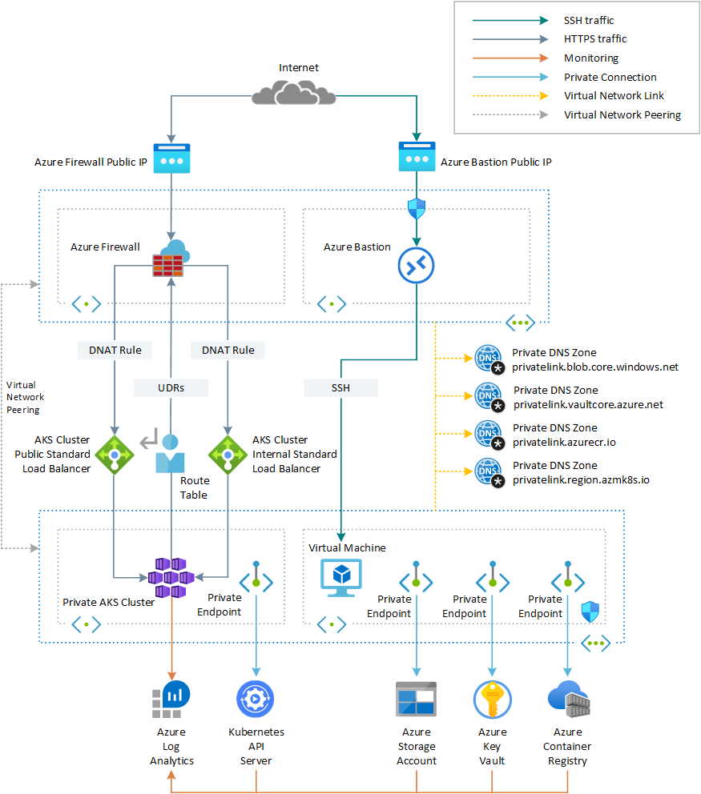
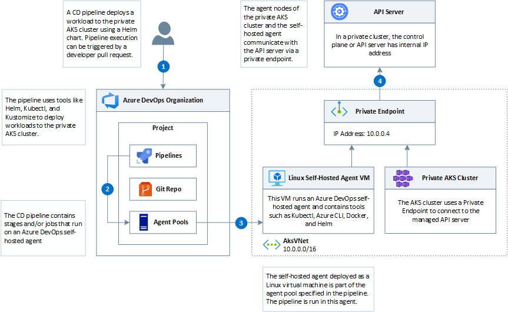
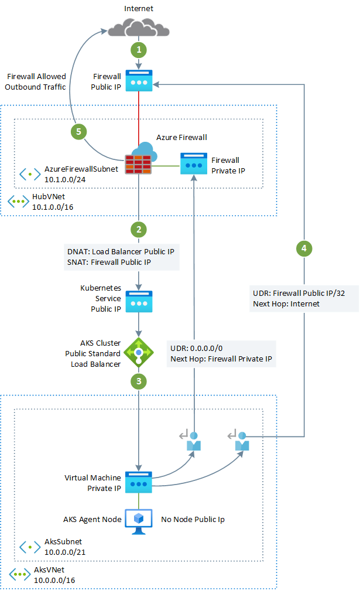
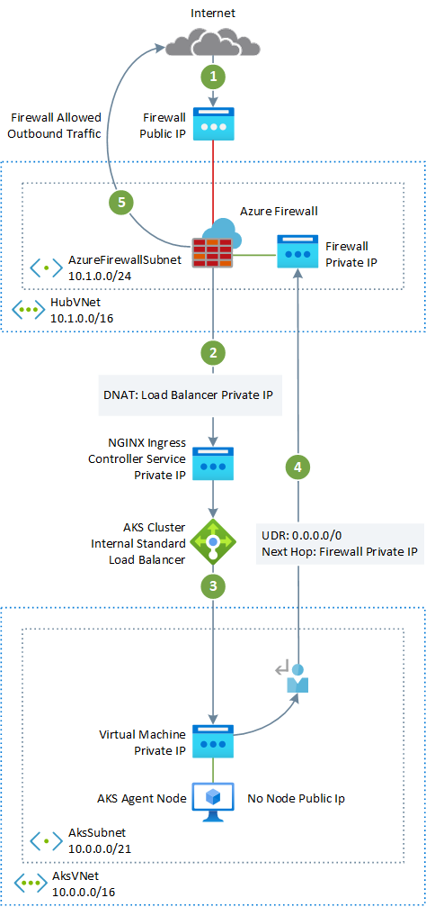

In a production environment, communications with a Kubernetes cluster should be protected via a firewall that monitors and controls the incoming and outgoing network traffic based on a predetermined set of security rules. A firewall typically establishes a barrier between a trusted network and an untrusted network, such as the Internet. The [Azure Firewall](/azure/firewall/overview) can be deployed and used in a hub virtual network to inspect, allow, or block the ingress and egress traffic to and from one or more [Azure Kubernetes Services](/azure/aks/) clusters hosted by one or more spoke virtual networks peered to the hub virtual network.

By default, AKS clusters have unrestricted outbound internet access. This level of network access allows nodes and services running in the AKS cluster to access external resources as needed. If you wish to restrict egress traffic, a limited number of ports and addresses must be accessible to maintain healthy cluster maintenance tasks. The simplest solution to securing the outbound traffic from a Kubernetes cluster such as AKS lies in using a software firewall that can control outbound traffic based on domain names. Azure Firewall, for example, can restrict outbound HTTP and HTTPS traffic based on the FQDN of the destination. You can also configure your preferred firewall and security rules to allow these required ports and addresses. For more information, see [Control egress traffic for cluster nodes in Azure Kubernetes Service (AKS)](/azure/aks/limit-egress-traffic). 

Likewise, you can control and secure the ingress traffic by enabling [Threat intelligence-based filtering](/azure/firewall/threat-intel) on an Azure Firewall deployed to a shared perimeter network to alert and deny traffic from/to known malicious IP addresses and domains. Azure Firewall is fully integrated with Azure Monitor for logging incoming and outgoing traffic processed by the firewall. For more information, see [Azure Firewall threat intelligence-based filtering](/azure/firewall/threat-intel).

The Azure platform provides protections against various threats, such as network intrusion and DDoS attacks. A web application firewall (WAF) should be used to protect any AKS-hosted web applications and services that expose a public HTTPS endpoint from common threats such as SQL injection, cross-site scripting, and other web exploits using Open Web Application Security Project (OWASP) rules and custom rules. [Azure Web Application Firewall (WAF)](/azure/web-application-firewall/overview) provides centralized protection of your web applications from common exploits and vulnerabilities. Azure WAF can be deployed with [Azure Application Gateway](/azure/web-application-firewall/ag/ag-overview), [Azure Front Door](/azure/web-application-firewall/afds/afds-overview), and [Azure Content Delivery Network (CDN)](/azure/web-application-firewall/cdn/cdn-overview) service from Microsoft.

Distributed denial of service (DDoS) attacks are some of the largest availability and security concerns facing customers that are moving their applications to the cloud. A DDoS attack attempts to exhaust an application's resources, making the application unavailable to legitimate users. DDoS attacks can be targeted at any endpoint that is publicly reachable through the internet. Every property in Azure is protected by Azure's infrastructure DDoS (Basic) Protection at no additional cost. The scale and capacity of the globally deployed Azure network provides defense against common network-layer attacks through always-on traffic monitoring and real-time mitigation. DDoS Protection Basic requires no user configuration or application changes. DDoS Protection Basic helps protect all Azure services, including PaaS services like Azure DNS.

[Azure DDoS Protection Standard](/azure/ddos-protection/ddos-protection-overview), combined with application design best practices, provides enhanced DDoS mitigation features to defend against DDoS attacks. [Azure DDOS Protection Standard](/azure/ddos-protection/ddos-protection-overview) should be enabled on any perimeter virtual network for better protection.

## Potential use cases

Use [Terraform](https://www.terraform.io/intro/index.html) and [Azure DevOps](/azure/devops/pipelines/get-started/what-is-azure-pipelines?view=azure-devops) to automate the deployment of a private [Azure Kubernetes Service cluster](/azure/aks/private-clusters) in a hub and spoke network topology where [Azure Firewall](/azure/firewall/overview) is used to control the inbound and outbound traffic using [DNAT rules, network rules, and application rules](/azure/firewall/rule-processing) and protect workloads using [threat intelligence-based filtering](/azure/firewall/threat-intel).

## Architecture



Companion Terraform modules deploy a new virtual network with four subnets:

- AksSubnet: Hosts the AKS cluster
- VmSubnet: Hosts a jump-box virtual machine and private endpoints
- AppGatewaySubnet: Hosts Application Gateway WAF2
- AzureBastionSubnet: Azure Bastion

The Azure Kubernetes Service (AKS) cluster uses a user-defined managed identity to create additional resources, like load balancers and managed disks in Azure. The Terraform modules allow you to optionally deploy an AKS cluster with the following features:

- [Container Storage Interface (CSI) drivers for Azure disks and Azure Files](/azure/aks/csi-storage-drivers)
- [AKS-managed AAD integration](/azure/aks/managed-aad)
- [Azure RBAC for Kubernetes Authorization](/azure/aks/manage-azure-rbac)
- [Managed identity in place of a service principal](/azure/aks/use-managed-identity)
- [Azure Network Policies](/azure/aks/use-network-policies)
- [Azure Monitor for containers add-on](/azure/azure-monitor/containers/container-insights-enable-new-cluster)
- [Application Gateway Ingress Controller add-on](https://azure.github.io/application-gateway-kubernetes-ingress/)
- [Dynamic allocation of IPs and enhanced subnet support](/azure/aks/configure-azure-cni#dynamic-allocation-of-ips-and-enhanced-subnet-support-preview)

The AKS cluster is composed of the following:

- System node pool that hosts only critical system pods and services.
- User node pool that hosts user workloads and artifacts.

A virtual machine (VM) is deployed in the same virtual network that is hosting the AKS cluster. When you deploy Azure Kubernetes Service as a private cluster, this VM can be used by system administrators to manage the cluster via the [Kubernetes command-line tool](https://kubernetes.io/docs/tasks/tools/). The boot diagnostics logs of the virtual machine are stored in an Azure Storage account.

An Azure Bastion host provides secure and seamless SSH connectivity to the jump-box VM, directly in the Azure portal over SSL. Azure Container Registry (ACR) is used to build, store, and manage container images and artifacts (such as Helm charts).

The architecture includes an [Azure Firewall](/azure/firewall/overview) that is used to control the inbound and outbound traffic using [DNAT rules, network rules, and application rules](/azure/firewall/rule-processing) and protect workloads using [threat intelligence-based filtering](/azure/firewall/threat-intel). The Azure Firewall and Bastion are deployed to a hub virtual network peered with the virtual network that hosts the private AKS cluster. A route table and user-defined routes are used to route the outbound traffic from the private AKS cluster to the Azure Firewall.

A Key Vault is used as a secret store by workloads that run on Azure Kubernetes Service (AKS) to retrieve keys, certificates, and secrets via a client library, [Secrets Store CSI Driver](/azure/aks/csi-secrets-store-driver), or [Dapr](https://docs.dapr.io/developing-applications/building-blocks/secrets/secrets-overview/). [Azure Private Link](/azure/private-link/private-link-overview) enables AKS workloads to access Azure PaaS Services, such as Key Vault, over a private endpoint in the virtual network.

The sample topology includes the following private endpoints and Private DNS zones for the following services:

- Azure Blob Storage account
- Azure Container Registry (ACR)
- Azure Key Vault
- If you opt for a private AKS cluster, a private endpoint to the API server of the Kubernetes cluster

A Virtual Network Link exists between the hub and spoke virtual networks hosting the AKS cluster and the above Private DNS Zones. 

A Log Analytics workspace is used to collect the diagnostics logs and metrics from Azure services.

### Components

- [Azure Firewall](/azure/firewall/overview) is a cloud-native and intelligent network firewall security service that provides the best of breed threat protection for your cloud workloads running in Azure. It's a fully stateful, firewall as a service with built-in high availability and unrestricted cloud scalability. It provides both east-west and north-south traffic inspection.

- [Azure Container Registry](/azure/container-registry/container-registry-intro) is a managed, private Docker registry service based on the open-source Docker Registry 2.0. You can use Azure container registries with your existing container development and deployment pipelines, or use Azure Container Registry Tasks to build container images in Azure. Build on demand, or fully automate builds with triggers, such as source code commits and base image updates.

- [Azure Kubernetes Services](/azure/aks/) simplifies deploying a managed Kubernetes cluster in Azure by offloading the operational overhead to Azure. As a hosted Kubernetes service, Azure handles critical tasks, like health monitoring and maintenance. Since Kubernetes masters are managed by Azure, you only manage and maintain the agent nodes.

- [Azure Key Vault](/azure/key-vault/general/overview/) securely stores and controls access to secrets like API keys, passwords, certificates, and cryptographic keys. Azure Key Vault also lets you easily provision, manage, and deploy public and private Transport Layer Security/Secure Sockets Layer (TLS/SSL) certificates, for use with Azure and your internal connected resources.

- [Azure Bastion](/azure/bastion/bastion-overview) is a fully managed platform as a service (PaaS) that you provision inside your virtual network. Azure Bastion provides secure and seamless Remote Desktop Protocol (RDP) and secure shell (SSH) connectivity to the VMs in your virtual network, directly from the Azure portal over TLS.

- [Azure Virtual Machines](https://azure.microsoft.com/services/virtual-machines/) provides on-demand, scalable computing resources that give you the flexibility of virtualization, without having to buy and maintain the physical hardware.

- [Azure Virtual Network](/azure/virtual-network/virtual-networks-overview) is the fundamental building block for Azure private networks. With Virtual Network, Azure resources (like VMs) can securely communicate with each other, the internet, and on-premises networks. An Azure Virtual Network is similar to a traditional network that's on premises, but it includes Azure infrastructure benefits, such as scalability, availability, and isolation.

- [Virtual Network Interfaces](/azure/virtual-network/virtual-network-network-interface) let Azure virtual machines communicate with the internet, Azure, and on-premises resources. You can add several network interface cards to one Azure VM, so that child VMs can have their own dedicated network interface devices and IP addresses.

- [Azure Managed Disks](/azure/virtual-machines/windows/managed-disks-overview) provides block-level storage volumes that Azure manages on Azure VMs. The available types of disks are Ultra disks, Premium solid-state drives (SSDs), Standard SSDs, and Standard hard disk drives (HDDs).

- [Azure Blob Storage](/azure/storage/blobs/storage-blobs-introduction) is Microsoft's object storage solution for the cloud. Blob storage is optimized for storing massive amounts of unstructured data. Unstructured data is data that doesn't adhere to a particular data model or definition, such as text or binary data.

- [Azure Private Link](/azure/private-link/private-link-overview) enables you to access Azure PaaS services (for example, Azure Blob Storage and Key Vault) and Azure hosted customer-owned/partner services, over a private endpoint in your virtual network.

### Avoid asymmetric routing

When you deploy an Azure Firewall into a hub virtual network and your private AKS cluster in a spoke virtual network, and you want to use the Azure Firewall to control the egress traffic using network and application rule collections, you need to make sure to properly configure the ingress traffic to any public endpoint exposed by any service running on AKS to enter the system via one of the public IP addresses used by the Azure Firewall. In order to route the traffic of your AKS workloads to the Azure Firewall in the hub virtual network, you need to create and associate a route table to each subnet hosting the worker nodes of your cluster and create a user-defined route to forward the traffic for `0.0.0.0/0` CIDR to the private IP address of the Azure firewall and specify `Virtual appliance` as `next hop type`. For more information, see [Tutorial: Deploy and configure Azure Firewall using the Azure portal](/azure/firewall/tutorial-firewall-deploy-portal#create-a-default-route).

When you introduce an Azure firewall to control the egress traffic from your private AKS cluster, you need to configure the internet traffic to go through one of the public IP addresses associated to the Azure Firewall in front of the Public Standard Load Balancer used by your AKS cluster. This is where the problem occurs. Packets arrive on the firewall's public IP address, but return to the firewall via the private IP address (using the default route). To avoid this problem, create an additional user-defined route for the firewall's public IP address as shown in the picture below. Packets going to the firewall's public IP address are routed via the Internet. This avoids taking the default route to the firewall's private IP address.


For more information, see:

- [Restrict egress traffic from an AKS cluster using Azure firewall](/azure/aks/limit-egress-traffic#restrict-egress-traffic-using-azure-firewall)
- [Integrate Azure Firewall with Azure Standard Load Balancer](/azure/firewall/integrate-lb)

### Deploy workloads to a private AKS cluster using Azure DevOps

If you plan to use [Azure DevOps](/azure/devops/?view=azure-devops), you can't use [Azure DevOps Microsoft-hosted agents](/azure/devops/pipelines/agents/agents?view=azure-devops&tabs=browser#microsoft-hosted-agents) to deploy your workloads to a private AKS cluster as they don't have access to its API server. In order to deploy workloads to your private AKS cluster you need to provision and use an [Azure DevOps self-hosted agent](/azure/devops/pipelines/agents/agents?view=azure-devops&tabs=browser#install) in the same virtual network of your private AKS cluster or in peered virtual network. In this latter case, make sure to the create a virtual network link between the Private DNS Zone of the AKS cluster in the node resource group and the virtual network that hosts the Azure DevOps self-hosted agent. You can deploy a single [Windows](/azure/devops/pipelines/agents/v2-windows?view=azure-devops) or [Linux](/azure/devops/pipelines/agents/v2-linux?view=azure-devops) Azure DevOps agent using a virtual machine, or use a virtual machine scale set (VMSS). For more information, see [Azure virtual machine scale set agents](/azure/devops/pipelines/agents/scale-set-agents?view=azure-devops). As an alternative, you can set up a self-hosted agent in Azure Pipelines to run inside a Windows Server Core (for Windows hosts), or Ubuntu container (for Linux hosts) with Docker and deploy it as a pod with one or multiple replicas in your private AKS cluster. For more information, see:

- [Self-hosted Windows agents](/azure/devops/pipelines/agents/v2-windows?view=azure-devops)
- [Self-hosted Linux agents](/azure/devops/pipelines/agents/v2-linux?view=azure-devops)
- [Run a self-hosted agent in Docker](/azure/devops/pipelines/agents/docker?view=azure-devops)

If the subnets hosting the node pools of your private AKS cluster are configured to route the egress traffic to an Azure Firewall via a route table and user-defined route, make sure to create the proper application and network rules to allow the agent to access external sites to download and install tools like [Docker](https://www.docker.com/), [kubectl](https://kubectl.docs.kubernetes.io/guides/introduction/kubectl/), [Azure CLI](https://docs.microsoft.com/en-us/cli/azure/install-azure-cli), and [Helm](https://helm.sh/) to the agent virtual machine. For more informations, see [Run a self-hosted agent in Docker](https://docs.microsoft.com/en-us/azure/devops/pipelines/agents/docker?view=azure-devops) and [Build and deploy Azure DevOps Pipeline Agent on AKS](https://github.com/ganrad/Az-DevOps-Agent-On-AKS).



### Use Azure Firewall in front of a public Standard Load Balancer

Resource definitions in the Terraform modules make use of the [lifecycle](https://www.terraform.io/docs/language/meta-arguments/lifecycle.html) meta-argument to customize the actions when Azure resources are changed outside of Terraform control. The [ignore_changes](https://www.terraform.io/docs/language/meta-arguments/lifecycle.html#ignore_changes) argument is used to instruct Terraform to ignore updates to given resource properties such as tags. The Azure Firewall Policy resource definition contains a lifecycle block to prevent Terraform from fixing the resource when a rule collection or a single rule gets created, updated, or deleted. Likewise, the Azure Route Table contains a lifecycle block to prevent Terraform from fixing the resource when a user-defined route gets created, deleted, or updated. This allows to manage the DNAT, Application, and Network rules of an Azure Firewall Policy and the user-defined routes of an Azure Route Table outside of Terraform control.

The sample contains an Azure DevOps CD pipeline that shows how you can deploy a workload to a private AKS cluster using an [Azure DevOps Pipelines](/azure/devops/pipelines/get-started/what-is-azure-pipelines?view=azure-devops) that runs on a [Self-hosted Agent](/azure/devops/pipelines/agents/agents?tabs=browser). The sample deploys the Bitnami [redmine](https://artifacthub.io/packages/helm/bitnami/redmine) project management web application using a public [Helm](https://helm.sh/) chart. The following diagram shows the network topology of the sample:



The message flow can be described as follows:

1. A request for the AKS-hosted web application is sent to a public IP exposed by the Azure Firewall via a public IP configuration. Both the public IP and public IP configuration are dedicated to this workload.
2. An [Azure Firewall DNAT rule](/azure/firewall/tutorial-firewall-dnat) is used to to translate the Azure Firewall public IP address and port to the public IP and port used by the workload in the `kubernetes` public Standard Load Balancer of the AKS cluster in the node resource group.
3. The request is sent by the load balancer to one of the Kubernetes service pods running on one of the agent nodes of the AKS cluster.
4. The response message is sent back to the original caller via a user-defined with the Azure Firewall public IP as address prefix and Internet as next hope type.
5. Any workload-initiated outbound call is routed to the private IP address of the Azure Firewall by the default user-defined route with `0.0.0.0/0` as address prefix and virtual appliance as next hope type.

For more information, see [Use Azure Firewall in front of the Public Standard Load Balancer of the AKS cluster](https://github.com/Azure-Samples/private-aks-cluster-terraform-devops#Use-Azure-Firewall-in-front-of-the-Public-Standard-Load-Balancer-of-the-AKS-cluster).

### Use Azure Firewall in front of an internal Standard Load Balancer

In this scenario, an ASP.NET Core application is hosted as a service by an Azure Kubernetes Service cluster and fronted by an [NGINX ingress controller](https://kubernetes.github.io/ingress-nginx/). The [NGINX ingress controller](https://kubernetes.github.io/ingress-nginx/) is exposed via an internal load balancer with a private  IP address in the spoke virtual network that hosts the AKS cluster. For more information, see [Create an ingress controller to an internal virtual network in Azure Kubernetes Service (AKS)](/azure/aks/ingress-internal-ip). When you deploy an NGINX ingress controller or more in general a `LoadBalancer` or `ClusterIP` service with the `service.beta.kubernetes.io/azure-load-balancer-internal: "true"` annotation in the metadata section, an internal standard load balancer called `kubernetes-internal` gets created under the node resource group. For more information, see [Use an internal load balancer with Azure Kubernetes Service (AKS)](/azure/aks/internal-lb). As shown in the picture below, the test web application is exposed via the Azure Firewall using a dedicated Azure public IP.  



The message flow can be described as follows:

1. A request for the AKS-hosted test web application is sent to a public IP exposed by the Azure Firewall via a public IP configuration. Both the public IP and public IP configuration are dedicated to this workload.
2. An [Azure Firewall DNAT rule](/azure/firewall/tutorial-firewall-dnat) is used to to translate the Azure Firewall public IP address and port to the private IP address and port used by the NGINX ingress conroller in the internal Standard Load Balancer of the AKS cluster in the node resource group.
3. The request is sent by the internal load balancer to one of the Kubernetes service pods running on one of the agent nodes of the AKS cluster.
4. The response message is sent back to the original caller via a user-defined with `0.0.0.0/0` as address prefix and virtual appliance as next hope type.
5. Any workload-initiated outbound call is routed to the private IP address of the user-defined route.

For more information, see [Use Azure Firewall in front of an internal Standard Load Balancer](https://github.com/Azure-Samples/private-aks-cluster-terraform-devops#Use-Azure-Firewall-in-front-of-an-internal-Standard-Load-Balancer).

### Alternatives

You can use a third-party firewall from the Azure marketplace instead of the [Azure Firewall](/azure/firewall/overview). In this case, it's your responsibility to properly configure the firewall to inspect, allow, or deny the inbound and outbound traffic from the AKS cluster.

## Considerations

Although some of the following considerations are general recommendations that do not pertain to how to protect an Azure Kubernetes Service (AKS) cluster using Azure Firewall, we believe they are essential requirements when deploying this solution. This includes our security, performance, availability and reliability, storage, scheduler, service mesh, and monitoring considerations.

### Security considerations

This section contains a list of security best practices for the network topology in this sample workload.

#### Network security

- Create a [private endpoint](https://azure.microsoft.com/services/private-link/) for any PaaS service that is used by AKS workloads, such as Key Vault, Service Bus, or Azure SQL Database. The traffic between the applications and these services isn't exposed to the public internet. Traffic between the AKS cluster virtual network and an instance of a PaaS service via a private endpoint travels the Microsoft backbone network, but the communication does not pass by the Azure Firewall. This mechanism provides better security and protection against data leakage risks. For more information, see [What is Azure Private Link](/azure/private-link/private-link-overview).
- When using the [Azure Application Gateway](/azure/application-gateway/overview) in front of the AKS cluster, use a [Web Application Firewall Policy](/azure/application-gateway/waf-overview) to protect public-facing workloads (that are running on AKS) from malicious attacks.
- Use network policies to segregate and secure intra-service communications by controlling which components can communicate with each other. By default, all pods in a Kubernetes cluster can send and receive traffic without limitations. To improve security, you can use Azure Network Policies or Calico Network Policies to define rules that control the traffic flow between different microservices. For more information, see [Network Policy](/azure/aks/use-network-policies).
- Don't expose remote connectivity to your AKS nodes. Create a bastion host, or jump box, in a management virtual network. Use the bastion host to securely route traffic into your AKS cluster to remote management tasks.
- Consider using a [private AKS cluster](/azure/aks/private-clusters) in your production environment, or at least secure access to the API server, by using [authorized IP address ranges](/azure/aks/api-server-authorized-ip-ranges) in Azure Kubernetes Service. When using the authorized IP address ranges on a public cluster, allow all of the egress IP addresses on the Azure Firewall network rule collection, as in-cluster operations will consume the Kubernetes API server.
- With [DNS proxy](/azure/firewall/dns-settings) enabled, Azure Firewall can process and forward DNS queries from a Virtual Network(s) to your desired DNS server. This functionality is crucial and required to have reliable FQDN filtering in network rules. You can enable DNS proxy in Azure Firewall and Firewall Policy settings. To learn more about DNS proxy logs, see the [Azure Firewall log and metrics](/azure/firewall/logs-and-metrics) documentation.
- When using the [Azure Firewall](/azure/firewall/overview) in front of the [Azure Application Gateway](/azure/application-gateway/overview), you can configure your Kubernetes Ingress resource to expose workloads via HTTPS, and use a separate subdomain and digital certificate for each tenant. The [Application Gateway Ingress Controller (AGIC)](/azure/application-gateway/ingress-controller-overview) will automatically configure the [Azure Application Gateway](/azure/application-gateway/overview) listener for secure socket layer (SSL) termination.
- You can use the Azure Firewall in front of a service proxy such as the [NGINX ingress controller](https://github.com/kubernetes/ingress-nginx) that provides reverse proxy, configurable traffic routing, and TLS termination for Kubernetes services. Kubernetes ingress resources are used to configure the ingress rules and routes for individual Kubernetes services. Using an ingress controller and ingress rules, a single IP address can be used to route traffic to multiple services in a Kubernetes cluster. You can generate the TLS certificates using a recognized certificate authority (CA) or use Let's Encrypt to automatically generate TLS certificates with a [dynamic public IP address or with a static public IP address](https://docs.microsoft.com/en-us/azure/aks/ingress-tls). For more information, see [Create an HTTPS ingress controller and use your own TLS certificates on Azure Kubernetes Service (AKS)](https://docs.microsoft.com/en-us/azure/aks/ingress-own-tls).
- A strict coordination between the Azure Firewall operator and the cluster and workload teams is necessary both for initial cluster deployment and in an ongoing fashion as workload and cluster needs evolve, especially when configuring the authentication mechanisms, such as [OAuth2](https://docs.microsoft.com/en-us/azure/active-directory/develop/active-directory-v2-protocols) and [OpenID Connect](https://docs.microsoft.com/en-us/azure/active-directory/develop/v2-protocols-oidc), used by workloads to authenticate their clients.
- Implement the following guidelines to secure the environment described in this article:
  - [Azure security baseline for Azure Firewall](/security/benchmark/azure/baselines/firewall-security-baseline)
  - [Azure security baseline for Azure Kubernetes Service](/security/benchmark/azure/baselines/aks-security-baseline)
  - [Azure security baseline for Azure Bastion](/security/benchmark/azure/baselines/bastion-security-baseline)
  - [Azure security baseline for Azure DDoS Protection Standard](/security/benchmark/azure/baselines/ddos-protection-security-baseline)

### Availability and reliability considerations

Although the availability and reliability considerations are not fully pertaining to multitenancy in Azure Kubernetes Service (AKS), we believe they are essential requirements when deploying this solution. Consider the following ways to optimize availability for your AKS cluster and workloads.

#### Intra-region resiliency

- [Azure Firewall](/azure/firewall/overview) can be configured during deployment to span multiple Availability Zones for increased availability. With Availability Zones, your availability increases to 99.99% uptime. For more information, see the Azure Firewall [Service Level Agreement (SLA)](https://azure.microsoft.com/support/legal/sla/azure-firewall/v1_0/). The 99.99% uptime SLA is offered when two or more Availability Zones are selected. You can also associate Azure Firewall to a specific zone just for proximity reasons, using the service standard 99.95% SLA. There's no additional cost for a firewall deployed in an Availability Zone. However, there are added costs for inbound and outbound data transfers associated with Availability Zones. For more information, see [Bandwidth pricing details](https://azure.microsoft.com/pricing/details/bandwidth/).
- Consider deploying the node pools of your AKS cluster, across all the [Availability Zones](/azure/aks/availability-zones) within a region, and use an [Azure Standard Load Balancer](/azure/load-balancer/load-balancer-overview) or [Azure Application Gateway](/azure/application-gateway/overview) in front of your node pools. This topology provides better resiliency, in case of an outage of a single datacenter. This way, cluster nodes are distributed across multiple datacenters, in three separate Availability Zones within a region.
- Enable [zone redundancy in Azure Container Registry](/azure/container-registry/zone-redundancy), for intra-region resiliency and high availability.
- Use [Pod Topology Spread Constraints](https://kubernetes.io/docs/concepts/workloads/pods/pod-topology-spread-constraints/) to control how pods are spread across your AKS cluster among failure-domains, such as regions, availability zones, and nodes.
- Consider using Uptime SLA for AKS clusters that host mission-critical workloads. [Uptime SLA](/azure/aks/uptime-sla) is an optional feature to enable a financially backed, higher SLA for a cluster. Uptime SLA guarantees 99.95% availability of the Kubernetes API server endpoint, for clusters that use Availability Zones. And it guarantees 99.9% availability for clusters that don't use Availability Zones. AKS uses master node replicas across update and fault domains, in order to ensure the SLA requirements are met.

#### Disaster recovery and business continuity

- Consider deploying your solution to at least [two paired Azure regions](/azure/best-practices-availability-paired-regions) within a geography. You should also adopt a global load balancer, such as [Azure Traffic Manager](/azure/traffic-manager/traffic-manager-overview) or [Azure Front Door](/azure/frontdoor/front-door-overview), with an active/active or active/passive routing method, in order to guarantee business continuity and disaster recovery.
- [Azure Firewall](/azure/firewall/overview) is a regional service, hence if you decide to deploy your solution across two or more regions, you will have to create an Azure Firewall in each region. A global Azure Firewall Policy could be created to include organization-mandated rules that apply to all regional hubs. This policy would be used as a parent policy for regional Azure Policies. Policies created with non-empty parent policies inherit all rule collections from the parent policy. Network rule collections inherited from a parent policy are always prioritized above network rule collections defined as part of a new policy. The same logic also applies to application rule collections. However, network rule collections are always processed before application rule collections regardless of inheritance. For more information on Standard and Premium policies, see [Azure Firewall Manager policy overview](https://docs.microsoft.com/en-us/azure/firewall-manager/policy-overview).
- Make sure to script, document, and periodically test any regional failover process in a QA environment, to avoid unpredictable issues if a core service is affected by an outage in the primary region.
- These tests are also meant to validate if the DR approach meets the RPO/RTO targets, in conjunction to eventual manual processes and interventions that are needed for a failover.
- Make sure you test fail-back procedures, to understand if they work as expected.
- Store your container images in [Azure Container Registry](/azure/container-registry/container-registry-intro), and geo-replicate the registry to each AKS region. For more information, see [Geo-replication in Azure Container Registry](/azure/container-registry/container-registry-geo-replication).
- Where possible, don't store service state inside the container. Instead, use an Azure platform as a service (PaaS) that supports multi-region replication.
- If you use Azure Storage, prepare and test how to migrate your storage from the primary region to the backup region.

### DevOps considerations

- Deploy your workloads to Azure Kubernetes Service (AKS), with a [Helm](https://helm.sh/) chart in a CI/CD pipeline, by using a DevOps system, such as [GitHub Actions](https://docs.github.com/en/actions) or [Azure DevOps](https://azure.microsoft.com/services/devops/). For more information, see [Build and deploy to Azure Kubernetes Service](/azure/devops/pipelines/ecosystems/kubernetes/aks-template?view=azure-devops).
- Introduce A/B testing and canary deployments in your application lifecycle management, to properly test an application before making it available for all users. There are several techniques that you can use to split the traffic across different versions of the same service.
- As an alternative, you can use the traffic-splitting capabilities that are provided by a service mesh implementation. For more information, see:</p>

  - [Linkerd Traffic Split](https://linkerd.io/2.10/features/traffic-split/)
  - [Istio Traffic Management](https://istio.io/latest/docs/concepts/traffic-management/)

- Use Azure Container Registry or another container registry (like Docker Hub), to store the private Docker images that are deployed to the cluster. AKS can authenticate with Azure Container Registry, by using its Azure AD identity.
- Test ingress and egress on your workloads in a separate, pre-production environment that mirrors the network topology and firewall rules of your production environment. Having a stagged rollout strategy will help you detect any networking or security problems before releasing any new feature or network rule into production.

### Monitoring considerations

Although the monitoring considerations are not fully pertaining to multitenancy in Azure Kubernetes Service (AKS), we believe they are essential requirements when deploying this solution:

- Use [Container insights](/azure/azure-monitor/containers/container-insights-overview) to monitor the health status of the AKS cluster and workloads.
- Configure all the PaaS services (such as Azure Container Registry and Key Vault) to collect diagnostics logs and metrics, to [Azure Monitor Log Analytics](/azure/azure-monitor/logs/log-analytics-overview).

## Deploy this scenario

The source code for this scenario is available under [Azure Samples](https://github.com/azure-samples/private-aks-cluster-terraform-devops). This solution is open source and provided with a [MIT License](https://github.com/Azure-Samples/private-aks-cluster-terraform-devops/blob/main/LICENSE.md).

### Prerequisites

For online deployments, you must have an existing Azure account. If you need one, create a [free Azure account](https://azure.microsoft.com/free/?WT.mc_id=A261C142F) before you begin. There are some requirements you need to complete before we can deploy Terraform modules using Azure DevOps.

- Store the Terraform state file to an Azure storage account. For more information on how to create to use a storage account to store remote Terraform state, state locking, and encryption at rest, see [Store Terraform state in Azure Storage](/azure/developer/terraform/store-state-in-azure-storage?tabs=azure-cli)
- Create an Azure DevOps Project. For more information, see [Create a project in Azure DevOps](/azure/devops/organizations/projects/create-project?view=azure-devops&tabs=preview-page)
- Create an [Azure DevOps Service Connection](/azure/devops/pipelines/library/service-endpoints?view=azure-devops&tabs=yaml) to your Azure subscription. No matter you use Service Principal Authentication (SPA) or an Azure-Managed Service Identity when creating the service connection, make sure that the service principal or managed identity used by Azure DevOps to connect to your Azure subscription is assigned the owner role on the entire subscription.

### Deployment to Azure

1. Make sure you have your Azure subscription information handy.

2. Start by cloning the [workbench GitHub repository](https://github.com/Azure-Samples/private-aks-cluster-terraform-devops):

   ```git
   git clone https://github.com/Azure-Samples/private-aks-cluster-terraform-devops.git
   ```

3. Follow the instructions provided in the [README.md file](https://github.com/Azure-Samples/private-aks-cluster-terraform-devops/blob/master/README.md).

## Pricing

The cost of this architecture depends on configuration aspects, like the following:

- Service tiers
- Scalability, meaning the number of instances that are dynamically allocated by services to support a given demand
- Automation scripts
- Your disaster recovery level

After you assess these aspects, go to the [Azure pricing calculator](https://azure.microsoft.com/pricing/calculator) to estimate your costs. Also, for more pricing optimization options, see the [Principles of cost optimization](../../framework/cost/overview.md) in the Microsoft Azure Well-Architected Framework.

## Next steps

Review the recommendations and best practices for AKS under the [Microsoft Azure Well-Architected Framework](/azure/architecture/framework/):

- [Reliability](/azure/architecture/framework/services/compute/azure-kubernetes-service/reliability)
- [Security](/azure/architecture/framework/services/compute/azure-kubernetes-service/security)
- [Cost optimization](/azure/architecture/framework/services/compute/azure-kubernetes-service/cost-optimization)
- [Operational excellence](/azure/architecture/framework/services/compute/azure-kubernetes-service/operational-excellence)
- [Performance efficiency](/azure/architecture/framework/services/compute/azure-kubernetes-service/performance-efficiency)

## Related resources

### Azure Firewall

- [What is Azure Firewall?](/azure/firewall/overview)
- [Azure Firewall Policy rule sets](/azure/firewall/policy-rule-sets)
- [Configure Azure Firewall rules](/azure/firewall/rule-processing)
- [Azure Firewall DNS Proxy details](/azure/firewall/dns-details)
- [Azure Firewall Premium features](/azure/firewall/premium-features)
- [Azure Firewall threat intelligence-based filtering](/azure/firewall/threat-intel)

### Azure Kubernetes Service

- [Create a private Azure Kubernetes Service cluster](https://github.com/paolosalvatori/private-aks-cluster)
- [Best practices for multitenancy and cluster isolation](/azure/aks/operator-best-practices-cluster-isolation)
- [Best practices for basic scheduler features in Azure Kubernetes Service (AKS)](/azure/aks/operator-best-practices-scheduler)
- [Best practices for advanced scheduler features](/azure/aks/operator-best-practices-advanced-scheduler)
- [Best practices for authentication and authorization](/azure/aks/operator-best-practices-advanced-scheduler)
- [Best practices for cluster security and upgrades in Azure Kubernetes Service (AKS)](/azure/aks/operator-best-practices-cluster-security)
- [Best practices for container image management and security in Azure Kubernetes Service (AKS)](/azure/aks/operator-best-practices-container-image-management)
- [Best practices for network connectivity and security in Azure Kubernetes Service (AKS)](/azure/aks/operator-best-practices-network)
- [Best practices for storage and backups in Azure Kubernetes Service (AKS)](/azure/aks/operator-best-practices-storage)
- [Best practices for business continuity and disaster recovery in Azure Kubernetes Service (AKS)](/azure/aks/operator-best-practices-multi-region)
- [Azure Kubernetes Services (AKS) day-2 operations guide](../../operator-guides/aks/day-2-operations-guide.md)

### Architectural guidance

- [Azure Kubernetes Service (AKS) solution journey](../../reference-architectures/containers/aks-start-here.md)
- [AKS cluster best practices](/Azure/aks/best-practices?toc=https%3A%2F%2Fdocs.microsoft.com%2Fen-us%2Fazure%2Farchitecture%2Ftoc.json&bc=https%3A%2F%2Fdocs.microsoft.com%2Fen-us%2Fazure%2Farchitecture%2Fbread%2Ftoc.json)
- [Azure Kubernetes Services (AKS) day-2 operations guide](../../operator-guides/aks/day-2-operations-guide.md)
- [Choosing a Kubernetes at the edge compute option](../../operator-guides/aks/choose-kubernetes-edge-compute-option.md)

### Reference architectures

- [Baseline architecture for an Azure Kubernetes Service (AKS) cluster](../../reference-architectures/containers/aks/secure-baseline-aks.yml)
- [Microservices architecture on Azure Kubernetes Service (AKS)](../../reference-architectures/containers/aks-microservices/aks-microservices.yml)
- [Advanced Azure Kubernetes Service (AKS) microservices architecture](../../reference-architectures/containers/aks-microservices/aks-microservices-advanced.yml)
- [CI/CD pipeline for container-based workloads](../apps/devops-with-aks.yml)
- [Building a telehealth system on Azure](../apps/telehealth-system.yml)
