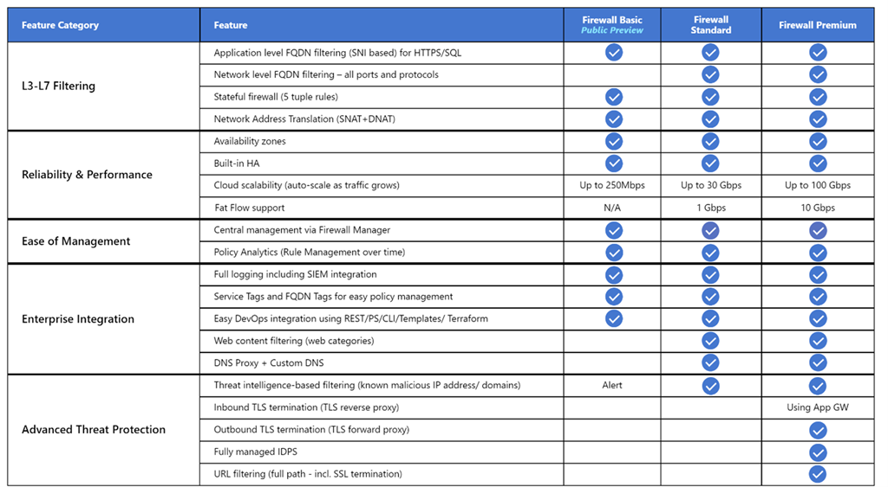

This article describes how to create a private AKS cluster in a hub-and-spoke network topology by using [Terraform](https://www.terraform.io) and Azure DevOps. [Azure Firewall](/azure/firewall/overview) is used to inspect traffic to and from the [Azure Kubernetes Service (AKS)](/azure/aks) cluster. The cluster is hosted by one or more spoke virtual networks peered to the hub virtual network. 

## Architecture

:::image type="content" border="false" source="media/aks-firewall.svg" alt-text="Diagram that shows an architecture that has a private A K S cluster in a hub-and-spoke network topology." lightbox="media/aks-firewall.svg":::

*Download a [Visio file](https://arch-center.azureedge.net/aks-firewall-digrams.vsdx) of this architecture.*

### Workflow

[Terraform modules](https://github.com/Azure-Samples/private-aks-cluster-terraform-devops/tree/main/terraform/modules) are used to deploy a new virtual network that has four subnets that host:

- The AKS cluster (AksSubnet).
- A jump-box virtual machine (VM) and private endpoints (VmSubnet).
- Application Gateway WAF2 (AppGatewaySubnet).
- Azure Bastion (AzureBastionSubnet).

The AKS cluster uses a user-defined managed identity to create additional resources, like load balancers and managed disks in Azure. The Terraform modules allow you to optionally deploy an AKS cluster that has these features:

- [Container Storage Interface (CSI) drivers for Azure disks and Azure Files](/azure/aks/csi-storage-drivers)
- [AKS-managed Azure Active Directory integration](/azure/aks/managed-aad)
- [Azure RBAC for Kubernetes Authorization](/azure/aks/manage-azure-rbac)
- [Managed identity in place of a service principal](/azure/aks/use-managed-identity)
- [Azure network policies](/azure/aks/use-network-policies)
- [Azure Monitor Container insights](/azure/azure-monitor/containers/container-insights-enable-new-cluster)
- [Application Gateway Ingress Controller](https://azure.github.io/application-gateway-kubernetes-ingress)
- [Dynamic allocation of IPs and enhanced subnet support](/azure/aks/configure-azure-cni#dynamic-allocation-of-ips-and-enhanced-subnet-support-preview)

The AKS cluster is composed of the following pools:

- A system node pool that hosts only critical system pods and services
- A user node pool that hosts user workloads and artifacts

A VM is deployed in the virtual network that's hosting the AKS cluster. When you deploy AKS as a private cluster, system administrators can use this VM to manage the cluster via the [Kubernetes command-line tool](https://kubernetes.io/docs/tasks/tools). The boot diagnostics logs of the VM are stored in an Azure Storage account.

An Azure Bastion host provides improved-security SSH connectivity to the jump-box VM over SSL. Azure Container Registry is used to build, store, and manage container images and artifacts (like Helm charts).

The architecture includes an [Azure Firewall](/azure/firewall/overview) that's used to control the inbound and outbound traffic via [DNAT rules, network rules, and application rules](/azure/firewall/rule-processing). It also helps protect workloads by using [threat intelligence-based filtering](/azure/firewall/threat-intel). The Azure Firewall and Bastion are deployed to a hub virtual network that's peered with the virtual network that hosts the private AKS cluster. A route table and user-defined routes are used to route the outbound traffic from the private AKS cluster to the Azure Firewall.

> [!NOTE]
>
> We highly recommend that you use the Premium SKU of Azure Firewall because it provides [advanced threat protection](/azure/firewall/premium-features).

A [Key Vault](https://azure.microsoft.com/services/key-vault) is used as a secret store by workloads that run on AKS to retrieve keys, certificates, and secrets via the [Azure AD workload identity](/azure/aks/workload-identity-overview), [Secrets Store CSI Driver](/azure/aks/csi-secrets-store-driver), or [Dapr](https://docs.dapr.io/developing-applications/building-blocks/secrets/secrets-overview). [Azure Private Link](/azure/private-link/private-link-overview) enables AKS workloads to access Azure PaaS services, like Azure Key Vault, over a private endpoint in the virtual network.

The topology includes private endpoints and private DNS zones for these services:

- Azure Blob Storage account
- Container Registry
- Key Vault
- The API server of the Kubernetes cluster

There's a virtual network link between the hub-and-spoke virtual networks that host the AKS cluster and the private DNS zones described earlier. 

A Log Analytics workspace is used to collect the diagnostics logs and metrics from Azure services.

### Components

- [Azure Firewall](https://azure.microsoft.com/services/azure-firewall) is a cloud-native, intelligent network firewall security service that provides threat protection for cloud workloads that run in Azure. It's a fully stateful firewall as a service with built-in high availability and unrestricted cloud scalability. It provides both east-west and north-south traffic inspection.

- [Container Registry](https://azure.microsoft.com/services/container-registry) is a managed, private Docker registry service that's based on the open-source Docker Registry 2.0. You can use Azure container registries with your existing container development and deployment pipelines or use Container Registry Tasks to build container images in Azure.

- [Azure Kubernetes Service](https://azure.microsoft.com/services/kubernetes-service) simplifies deploying managed Kubernetes clusters in Azure by offloading the operational overhead to Azure. As a hosted Kubernetes service, Azure handles critical tasks like health monitoring and maintenance. Because Kubernetes masters are managed by Azure, you only manage and maintain the agent nodes.

- [Key Vault](https://azure.microsoft.com/services/key-vault) stores and controls access to secrets like API keys, passwords, certificates, and cryptographic keys with improved security. Key Vault also lets you easily provision, manage, and deploy public and private Transport Layer Security/Secure Sockets Layer (TLS/SSL) certificates, for use with Azure and your internal connected resources.

- [Azure Bastion](https://azure.microsoft.com/services/azure-bastion) is a fully managed platform as a service (PaaS) that you provision inside your virtual network. Azure Bastion provides improved-security Remote Desktop Protocol (RDP) and Secure Shell (SSH) connectivity to the VMs in your virtual network, directly from the Azure portal over TLS.

- [Azure Virtual Machines](https://azure.microsoft.com/services/virtual-machines) provides on-demand, scalable computing resources that give you the flexibility of virtualization.

- [Azure Virtual Network](https://azure.microsoft.com/services/virtual-network) is the fundamental building block for Azure private networks. Virtual Network enables Azure resources (like VMs) to communicate with each other, the internet, and on-premises networks with improved security. An Azure virtual network is like a traditional network that's on-premises, but it includes Azure infrastructure benefits like scalability, availability, and isolation.

- [Virtual Network Interfaces](/azure/virtual-network/virtual-network-network-interface) enable Azure VMs to communicate with the internet, Azure, and on-premises resources. You can add several network interface cards to one Azure VM, so that child VMs can have their own dedicated network interface devices and IP addresses.

- [Azure managed disks](/azure/virtual-machines/windows/managed-disks-overview) provide block-level storage volumes that Azure manages on Azure VMs. Ultra disks, premium solid-state drives (SSDs), standard SSDs, and standard hard disk drives (HDDs) are available.

- [Blob Storage](https://azure.microsoft.com/services/storage/blobs) is an object storage solution for the cloud. Blob Storage is optimized for storing massive amounts of unstructured data.

- [Private Link](https://azure.microsoft.com/services/private-link) enables you to access Azure PaaS services (for example, Blob Storage and Key Vault) over a private endpoint in your virtual network. You can also use it to access Azure-hosted services that you own or that are provided by a Microsoft partner.

### Alternatives

You can use a third-party firewall from Azure Marketplace instead of [Azure Firewall](/azure/firewall/overview). If you do, it's your responsibility to properly configure the firewall to inspect and allow or deny the inbound and outbound traffic from the AKS cluster.

## Scenario details

In a production environment, communications with a Kubernetes cluster should be protected by a firewall that monitors and controls the incoming and outgoing network traffic based on a set of security rules. A firewall typically establishes a barrier between a trusted network and an untrusted network, such as the internet.

You can create a private AKS cluster in a hub-and-spoke network topology by using [Terraform](https://www.terraform.io) and Azure DevOps. [Azure Firewall](/azure/firewall/overview) is used to inspect traffic to and from the [Azure Kubernetes Service (AKS)](/azure/aks) cluster. The cluster is hosted by one or more spoke virtual networks peered to the hub virtual network.

Azure Firewall supports three different SKUs to cater to a wide range of customer use cases and preferences:

- Azure Firewall **Premium** is recommended to secure highly sensitive applications, such as payment processing. It supports advanced threat protection capabilities like malware and TLS inspection.
- Azure Firewall **Standard** is recommended for customers looking for a Layer 3–Layer 7 firewall and who need auto-scaling to handle peak traffic periods of up to 30 Gbps. It supports enterprise features, like threat intelligence, DNS proxy, custom DNS, and web categories.
- Azure Firewall **Basic** is recommended for customers with throughput needs of less than 250 Mbps.

The following table shows the features of the three Azure Firewall SKUs. For more information, see [Azure Firewall pricing](https://azure.microsoft.com/pricing/details/azure-firewall).



By default, AKS clusters have unrestricted outbound internet access. This level of network access allows nodes and services that run in the AKS cluster to access external resources as needed. If you want to restrict egress traffic, a limited number of ports and addresses must remain accessible to maintain healthy cluster maintenance tasks. The easiest way to provide security for the outbound traffic from a Kubernetes cluster like AKS is to use a software firewall that can control outbound traffic based on domain names. Azure Firewall can restrict outbound HTTP and HTTPS traffic based on the fully qualified domain name (FQDN) of the destination. You can also configure your firewall and security rules to allow these required ports and addresses. For more information, see [Control egress traffic for cluster nodes in AKS](/azure/aks/limit-egress-traffic).

Likewise, you can control ingress traffic and improve security by enabling [threat intelligence-based filtering](/azure/firewall/threat-intel) on an Azure Firewall deployed to a shared perimeter network. This filtering can provide alerts and deny traffic to and from known malicious IP addresses and domains.

### Potential use cases

This architecture applies to scenarios in which you need to improve security of inbound and outbound traffic to and from a Kubernetes cluster.  

### Avoid asymmetric routing

In this solution, Azure Firewall is deployed to a hub virtual network, and the private AKS cluster is deployed to a spoke virtual network. Azure Firewall uses network and application rule collections to control the egress traffic. In this situation, you need to configure the ingress traffic to any public endpoint exposed by any service running on AKS to enter the system via one of the public IP addresses used by the Azure Firewall.

 Packets arrive on the firewall's public IP address but return to the firewall via the private IP address (using the default route). This is a problem. To avoid it, create another user-defined route for the firewall's public IP address, as shown in the following diagram. Packets going to the firewall's public IP address are routed via the internet. This configuration avoids the default route to the firewall's private IP address.

To route the traffic of your AKS workloads to the Azure Firewall in the hub virtual network, you need to:

- Create and associate a route table to each subnet that hosts the worker nodes of your cluster. 
- Create a user-defined route to forward the traffic for 0.0.0.0/0 CIDR to the private IP address of the Azure Firewall. Specify **Virtual appliance** for the **Next hop type**.

For more information, see [Tutorial: Deploy and configure Azure Firewall using the Azure portal](/azure/firewall/tutorial-firewall-deploy-portal#create-a-default-route).

:::image type="content" border="false" source="media/firewall-lb-asymmetric.svg" alt-text="Diagram that shows how to avoid asymmetric routing when you use Azure Firewall in front of your workloads." lightbox="media/firewall-lb-asymmetric.svg":::

For more information, see:

- [Restrict egress traffic from an AKS cluster using Azure Firewall](/azure/aks/limit-egress-traffic#restrict-egress-traffic-using-azure-firewall)
- [Integrate Azure Firewall with Azure Standard Load Balancer](/azure/firewall/integrate-lb)

### Deploy workloads to a private AKS cluster when using Azure DevOps

If you use [Azure DevOps](/azure/devops), note that you can't use [Azure DevOps Microsoft-hosted agents](/azure/devops/pipelines/agents/agents?tabs=browser#microsoft-hosted-agents) to deploy your workloads to a private AKS cluster. They don't have access to its API server. To deploy workloads to your private AKS cluster, you need to provision and use an [Azure DevOps self-hosted agent](/azure/devops/pipelines/agents/agents?tabs=browser#install) in the same virtual network as your private AKS cluster, or in a peered virtual network. In the latter case, be sure to create a virtual network link between the private DNS zone of the AKS cluster in the node resource group and the virtual network that hosts the Azure DevOps self-hosted agent. 

You can deploy a single [Windows](/azure/devops/pipelines/agents/v2-windows) or [Linux](/azure/devops/pipelines/agents/v2-linux) Azure DevOps agent on a virtual machine, or you can use a Virtual Machine Scale Set. For more information, see [Azure Virtual Machine Scale Set agents](/azure/devops/pipelines/agents/scale-set-agents). As an alternative, you can set up a self-hosted agent in Azure Pipelines to run inside a Windows Server Core container (for Windows hosts) or Ubuntu container (for Linux hosts) with Docker. Deploy it as a pod with one or multiple replicas in your private AKS cluster. For more information, see:

- [Self-hosted Windows agents](/azure/devops/pipelines/agents/v2-windows)
- [Self-hosted Linux agents](/azure/devops/pipelines/agents/v2-linux)
- [Run a self-hosted agent in Docker](/azure/devops/pipelines/agents/docker)

If the subnets that host the node pools of your private AKS cluster are configured to route the egress traffic to an Azure Firewall via a route table and user-defined route, make sure to create the proper application and network rules. These rules need to allow the agent to access external sites to download and install tools like [Docker](https://www.docker.com), [Kubectl](https://kubectl.docs.kubernetes.io/guides/introduction/kubectl), [Azure CLI](/cli/azure/install-azure-cli), and [Helm](https://helm.sh) on the agent virtual machine. For more information, see [Run a self-hosted agent in Docker](/azure/devops/pipelines/agents/docker) and [Build and deploy Azure DevOps Pipeline Agent on AKS](https://github.com/ganrad/Az-DevOps-Agent-On-AKS).

:::image type="content" border="false" source="media/self-hosted-agent.svg" alt-text="Diagram that shows deployment of workloads to a private AKS cluster for use with Azure DevOps." lightbox="media/self-hosted-agent.svg":::

### Use Azure Firewall in front of a public Standard Load Balancer

Resource definitions in the [Terraform modules](https://github.com/Azure-Samples/private-aks-cluster-terraform-devops/tree/main/terraform/modules) use the [lifecycle](https://www.terraform.io/docs/language/meta-arguments/lifecycle.html) meta-argument to customize actions when Azure resources are changed outside of Terraform control. The [ignore_changes](https://www.terraform.io/docs/language/meta-arguments/lifecycle.html#ignore_changes) argument is used to instruct Terraform to ignore updates to given resource properties, like tags. The Azure Firewall Policy resource definition contains a lifecycle block to prevent Terraform from updating the resource when a rule collection or a single rule is created, updated, or deleted. Likewise, the Azure Route Table contains a lifecycle block to prevent Terraform from updating the resource when a user-defined route is created, deleted, or updated. This allows you to manage the DNAT, application, and network rules of an Azure Firewall Policy and the user-defined routes of an Azure Route Table outside of Terraform control.

[The sample](https://github.com/Azure-Samples/private-aks-cluster-terraform-devops) associated with this article contains an [Azure DevOps CD pipeline](https://github.com/Azure-Samples/private-aks-cluster-terraform-devops/blob/main/pipelines/cd-redmine-via-helm.yml) that shows how to deploy a workload to a private AKS cluster by using an [Azure DevOps pipeline](/azure/devops/pipelines/get-started/what-is-azure-pipelines) that runs on a [self-hosted agent](/azure/devops/pipelines/agents/agents?tabs=browser). The sample deploys the Bitnami [redmine](https://artifacthub.io/packages/helm/bitnami/redmine) project management web application by using a public [Helm](https://helm.sh) chart. This diagram shows the network topology of the sample:


:::image type="content" border="false" source="media/firewall-public-load-balancer.svg" alt-text="Diagram that shows Azure Firewall in front of a public Standard Load Balancer." lightbox="media/firewall-public-load-balancer.svg":::

Here's the message flow:

1. A request for the AKS-hosted web application is sent to a public IP that's exposed by Azure Firewall via a public IP configuration. Both the public IP and the public IP configuration are dedicated to this workload.
2. An [Azure Firewall DNAT rule](/azure/firewall/tutorial-firewall-dnat) translates the Azure Firewall public IP address and port to the public IP and port used by the workload in the Kubernetes public Standard Load Balancer of the AKS cluster in the node resource group.
3. The load balancer sends the request to one of the Kubernetes service pods that's running on one of the agent nodes of the AKS cluster.
4. The response message is sent back to the original caller via a user-defined route. The Azure Firewall public IP is the address prefix, and **Internet** is the **Next hop type**.
5. Any workload-initiated outbound call is routed to the private IP address of the Azure Firewall by the default user-defined route. **0.0.0.0/0** is the address prefix, and **Virtual appliance** is the **Next hop type**.

For more information, see [Use Azure Firewall in front of the Public Standard Load Balancer of the AKS cluster](https://github.com/Azure-Samples/private-aks-cluster-terraform-devops#Use-Azure-Firewall-in-front-of-the-Public-Standard-Load-Balancer-of-the-AKS-cluster).

### Use Azure Firewall in front of an internal Standard Load Balancer

In the [sample](https://github.com/Azure-Samples/private-aks-cluster-terraform-devops) associated with this article, an ASP.NET Core application is hosted as a service by an AKS cluster and fronted by an [NGINX ingress controller](https://kubernetes.github.io/ingress-nginx). The [NGINX ingress controller](https://kubernetes.github.io/ingress-nginx) is exposed via an internal load balancer that has a private IP address in the spoke virtual network that hosts the AKS cluster. For more information, see [Create an ingress controller to an internal virtual network in AKS](/azure/aks/ingress-internal-ip). When you deploy an NGINX ingress controller, or more generally a `LoadBalancer` or `ClusterIP` service, with the `service.beta.kubernetes.io/azure-load-balancer-internal: "true"` annotation in the metadata section, an internal standard load balancer called `kubernetes-internal` is created under the node resource group. For more information, see [Use an internal load balancer with AKS](/azure/aks/internal-lb). As shown in the following diagram, the test web application is exposed by the Azure Firewall via a dedicated Azure public IP.  

:::image type="content" border="false" source="media/firewall-internal-load-balancer.svg" alt-text="Diagram that shows Azure Firewall in front of an internal Standard Load Balancer." lightbox="media/firewall-internal-load-balancer.svg":::

Here's the message flow:

1. A request for the AKS-hosted test web application is sent to a public IP that's exposed by the Azure Firewall via a public IP configuration. Both the public IP and the public IP configuration are dedicated to this workload.
2. An [Azure Firewall DNAT rule](/azure/firewall/tutorial-firewall-dnat) translates the Azure Firewall public IP and port to the private IP and port used by the NGINX ingress controller in the internal Standard Load Balancer of the AKS cluster in the node resource group.
3. The request is sent by the internal load balancer to one of the Kubernetes service pods that's running on one of the agent nodes of the AKS cluster.
4. The response message is sent back to the original caller via a user-defined route. **0.0.0.0/0** is the address prefix, and **Virtual appliance** is the **Next hop type**.
5. Any workload-initiated outbound call is routed to the private IP address of the user-defined route.

For more information, see [Use Azure Firewall in front of an internal Standard Load Balancer](https://github.com/Azure-Samples/private-aks-cluster-terraform-devops#Use-Azure-Firewall-in-front-of-an-internal-Standard-Load-Balancer).

## Considerations

These considerations implement the pillars of the Azure Well-Architected Framework, which is a set of guiding tenets that can be used to improve the quality of a workload. For more information, see [Microsoft Azure Well-Architected Framework](/azure/architecture/framework).

Some of the following considerations are general recommendations that aren't specific to using Azure Firewall to improve the protection of an AKS cluster. We believe they're essential requirements of this solution. This applies to the security, performance, availability and reliability, storage, service mesh, and monitoring considerations.

### Security

Security provides assurances against deliberate attacks and the abuse of your valuable data and systems. For more information, see [Overview of the security pillar](/azure/architecture/framework/security/overview).

The Azure platform provides improved protection against various threats, such as network intrusion and distributed denial-of-service (DDoS) attacks. You should use a web application firewall (WAF) to provide protection for any AKS-hosted web applications and services that expose a public HTTPS endpoint. You need to provide protection from common threats like SQL injection, cross-site scripting, and other web exploits. To do that, use Open Web Application Security Project (OWASP) rules and custom rules. [Azure Web Application Firewall](/azure/web-application-firewall/overview) provides improved centralized protection of your web applications from common exploits and vulnerabilities. You can deploy Azure WAF with [Azure Application Gateway](/azure/web-application-firewall/ag/ag-overview), [Azure Front Door](/azure/web-application-firewall/afds/afds-overview), and [Azure Content Delivery Network](/azure/web-application-firewall/cdn/cdn-overview).

DDoS attacks are among the biggest availability and security concerns facing organizations that are moving their applications to the cloud. A DDoS attack attempts to exhaust an application's resources, making the application unavailable to legitimate users. DDoS attacks can be targeted at any endpoint that's publicly reachable via the internet. Every property in Azure includes protection via Azure DDoS infrastructure protection at no extra cost. The scale and capacity of the globally deployed Azure network provides improved defense against common network-layer attacks through always-on traffic monitoring and real-time mitigation. DDoS infrastructure protection requires no user configuration or application changes. It helps protect all Azure services, including PaaS services like Azure DNS.

[Azure DDoS Network Protection](/azure/ddos-protection/ddos-protection-overview), combined with application-design best practices, provides enhanced DDoS mitigation features to provide more defense against DDoS attacks. You should enable [Azure DDOS Network Protection](/azure/ddos-protection/manage-ddos-protection) on any perimeter virtual network.

Following are some additional security considerations:

- Create a [private endpoint](https://azure.microsoft.com/services/private-link) for any PaaS service that's used by AKS workloads, like Key Vault, Azure Service Bus, and Azure SQL Database. The traffic between the applications and these services isn't exposed to the public internet. Traffic between the AKS cluster virtual network and an instance of a PaaS service via a private endpoint travels the Microsoft backbone network, but the communication doesn't pass by the Azure Firewall. This mechanism provides better security and better protection against data leakage. For more information, see [What is Azure Private Link?](/azure/private-link/private-link-overview).
- When you use [Application Gateway](/azure/application-gateway/overview) in front of the AKS cluster, use a [Web Application Firewall Policy](/azure/application-gateway/waf-overview) to help protect public-facing workloads that run on AKS from attacks.
- Use network policies to segregate and help secure intraservice communications by controlling which components can communicate with one another. By default, all pods in a Kubernetes cluster can send and receive traffic without limitations. To improve security, you can use Azure network policies or Calico network policies to define rules that control the traffic flow between different microservices. For more information, see [network policy](/azure/aks/use-network-policies).
- Don't expose remote connectivity to your AKS nodes. Create a bastion host, or jump box, in a management virtual network. Use the bastion host to route traffic into your AKS cluster.
- Consider using a [private AKS cluster](/azure/aks/private-clusters) in your production environment, or at least secure access to the API server, by using [authorized IP address ranges](/azure/aks/api-server-authorized-ip-ranges) in AKS. When you use authorized IP address ranges on a public cluster, allow all the egress IP addresses in the Azure Firewall network rule collection. In-cluster operations consume the Kubernetes API server.
- If you enable [DNS proxy](/azure/firewall/dns-settings) in Azure Firewall, Azure Firewall can process and forward DNS queries from one or more virtual networks to a DNS server that you choose. This functionality is crucial and required for reliable FQDN filtering in network rules. You can enable DNS proxy in Azure Firewall and Firewall Policy settings. To learn more about DNS proxy logs, see [Azure Firewall log and metrics](/azure/firewall/logs-and-metrics).
- When you use [Azure Firewall](/azure/firewall/overview) in front of [Application Gateway](/azure/application-gateway/overview), you can configure your Kubernetes ingress resource to expose workloads via HTTPS, and use a separate subdomain and digital certificate for each tenant. The [Application Gateway Ingress Controller (AGIC)](/azure/application-gateway/ingress-controller-overview) automatically configures the [Application Gateway](/azure/application-gateway/overview) listener for Secure Sockets Layer (SSL) termination.
- You can use Azure Firewall in front of a service proxy like the [NGINX ingress controller](https://github.com/kubernetes/ingress-nginx). This controller provides reverse proxy, configurable traffic routing, and TLS termination for Kubernetes services. Kubernetes ingress resources are used to configure the ingress rules and routes for individual Kubernetes services. By using an ingress controller and ingress rules, you can use a single IP address to route traffic to multiple services in a Kubernetes cluster. You can generate the TLS certificates by using a recognized certificate authority. Alternatively, you can use Let's Encrypt to automatically generate TLS certificates with a [dynamic public IP address or with a static public IP address](/azure/aks/ingress-tls). For more information, see [Create an HTTPS ingress controller and use your own TLS certificates on AKS](/azure/aks/ingress-own-tls).
- Strict coordination among the Azure Firewall operator and the cluster and workload teams is necessary both for initial cluster deployment and in an ongoing fashion as workload and cluster needs evolve. This is especially true when you configure the authentication mechanisms, like [OAuth 2.0](/azure/active-directory/develop/active-directory-v2-protocols) and [OpenID Connect](/azure/active-directory/develop/v2-protocols-oidc), that are used by workloads to authenticate their clients.
- Use the following guidelines to help secure the environment described in this article:
  - [Azure security baseline for Azure Firewall](/security/benchmark/azure/baselines/firewall-security-baseline)
  - [Azure security baseline for Azure Kubernetes Service](/security/benchmark/azure/baselines/aks-security-baseline)
  - [Azure security baseline for Azure Bastion](/security/benchmark/azure/baselines/bastion-security-baseline)
  - [Azure security baseline for Azure DDoS Protection](/security/benchmark/azure/baselines/azure-ddos-protection-security-baseline)

### Availability and reliability

Reliability ensures your application can meet the commitments you make to your customers. For more information, see [Overview of the reliability pillar](/azure/architecture/framework/resiliency/overview).

The availability and reliability considerations here aren't specific to multitenancy in AKS. We believe they're essential requirements for this solution. Consider the following methods for optimizing the availability of your AKS cluster and workloads.

#### Intra-region resiliency

- During deployment, you can configure [Azure Firewall](/azure/firewall/overview) to span multiple availability zones for increased availability. For uptime percentages, see the Azure Firewall [SLA](https://azure.microsoft.com/support/legal/sla/azure-firewall/v1_1). You can also associate Azure Firewall with a specific zone for the sake of proximity, although this configuration affects the SLA. There's no extra cost for a firewall deployed in an availability zone. However, there are added costs for inbound and outbound data transfers that are associated with availability zones. For more information, see [Bandwidth pricing details](https://azure.microsoft.com/pricing/details/bandwidth).
- Consider deploying the node pools of your AKS cluster across all [availability zones](/azure/aks/availability-zones) in a region. Use an [Azure Standard Load Balancer](/azure/load-balancer/load-balancer-overview) or [Application Gateway](/azure/application-gateway/overview) in front of the node pools. This topology provides better resiliency if there's a single datacenter outage. The cluster nodes are distributed across multiple datacenters, in three separate availability zones within a region.
- Enable [zone redundancy in Container Registry](/azure/container-registry/zone-redundancy) for intra-region resiliency and high availability.
- Use [pod topology spread constraints](https://kubernetes.io/docs/concepts/workloads/pods/pod-topology-spread-constraints) to control how pods are spread across your AKS cluster among failure domains like regions, availability zones, and nodes.
- Consider using Uptime SLA for AKS clusters that host mission-critical workloads. Uptime SLA is an optional feature that enables a financially backed, higher SLA for a cluster. Uptime SLA guarantees high availability of the Kubernetes API server endpoint for clusters that use availability zones. You can also use it for clusters that don't use availability zones, but the SLA is lower. For SLA details, see [Uptime SLA](/azure/aks/uptime-sla). AKS uses master node replicas across update and fault domains to ensure SLA requirements are met.

#### Disaster recovery and business continuity

- Consider deploying your solution to at least [two paired Azure regions](/azure/best-practices-availability-paired-regions) within a geography. Use a global load balancer, like [Azure Traffic Manager](/azure/traffic-manager/traffic-manager-overview) or [Azure Front Door](/azure/frontdoor/front-door-overview), with an active/active or active/passive routing method, to guarantee business continuity and disaster recovery (DR).
- [Azure Firewall](/azure/firewall/overview) is a regional service. If you deploy your solution across two or more regions, you need to create an Azure Firewall in each region. You can create a global Azure Firewall Policy to include organization-mandated rules that apply to all regional hubs. You can use this policy as a parent policy for regional Azure policies. Policies created with non-empty parent policies inherit all rule collections from the parent policy. Network rule collections inherited from a parent policy are always prioritized above network rule collections that are defined as part of a new policy. The same logic applies to application rule collections. However, network rule collections are always processed before application rule collections, regardless of inheritance. For more information on Standard and Premium policies, see [Azure Firewall Manager policy overview](/azure/firewall-manager/policy-overview).
- Be sure to script, document, and periodically test any regional failover process in a QA environment. Doing so helps to avoid unpredictable issues if a core service is affected by an outage in the primary region. These tests also check whether the DR approach meets RPO/RTO targets, in conjunction with eventual manual processes and interventions that are needed for a failover.
- Be sure to test fail-back procedures to validate that they work as expected.
- Store your container images in [Container Registry](/azure/container-registry/container-registry-intro). Geo-replicate the registry to each AKS region. For more information, see [Geo-replication in Azure Container Registry](/azure/container-registry/container-registry-geo-replication).
- If possible, avoid storing service state in the container. Instead, use an Azure PaaS that supports multiregion replication.
- If you use Azure Storage, prepare and test a process for migrating your storage from the primary region to the backup region.

### Operational excellence

Operational excellence covers the operations processes that deploy an application and keep it running in production. For more information, see [Overview of the operational excellence pillar](/azure/architecture/framework/devops/overview).

#### DevOps

- Deploy your workloads to AKS by using a [Helm](https://helm.sh) chart in a continuous integration and continuous delivery (CI/CD) pipeline. Use a DevOps system like [GitHub Actions](https://docs.github.com/actions) or [Azure DevOps](https://azure.microsoft.com/services/devops). For more information, see [Build and deploy to Azure Kubernetes Service](/azure/devops/pipelines/ecosystems/kubernetes/aks-template).
- To properly test an application before you make it available to users, use A/B testing and canary deployments in your application lifecycle management. There are several techniques that you can use to split the traffic across different versions of the same service. As an alternative, you can use the traffic-splitting capabilities that are provided by a service mesh implementation. For more information, see [Linkerd Traffic Split](https://linkerd.io/2.10/features/traffic-split) and [Istio Traffic Management](https://istio.io/latest/docs/concepts/traffic-management).
- Use Azure Container Registry or another container registry (like Docker Hub), to store the private Docker images that are deployed to the cluster. AKS can authenticate with Azure Container Registry by using its Azure Active Directory identity.
- Test ingress and egress on your workloads in a separate pre-production environment that mirrors the network topology and firewall rules of your production environment. A staged rollout strategy will help you detect any networking or security problems before you release a new feature or network rule into production.

#### Monitoring

Azure Firewall is fully integrated with Azure Monitor for logging incoming and outgoing traffic processed by the firewall. For more information, see [Azure Firewall threat intelligence-based filtering](/azure/firewall/threat-intel).

The following monitoring considerations aren't specific to multitenancy in AKS, but we believe they're essential requirements for this solution.

- Use [Container insights](/azure/azure-monitor/containers/container-insights-overview) to monitor the health status of the AKS cluster and workloads.
- Configure all PaaS services (like Container Registry and Key Vault) to collect diagnostic logs and metrics.

### Cost optimization

The cost of this architecture depends on the following configuration details:

- Service tiers
- Scalability (the number of instances that are dynamically allocated by services to support a given demand)
- Automation scripts
- Your disaster recovery level

After you assess these configuration details, use the [Azure pricing calculator](https://azure.microsoft.com/pricing/calculator) to estimate your costs. For more pricing optimization options, see the [principles of cost optimization](/azure/architecture/framework/#cost-optimization) in the Microsoft Azure Well-Architected Framework.

## Deploy this scenario

The source code for this scenario is available in [GitHub](https://github.com/azure-samples/private-aks-cluster-terraform-devops). This solution is open source and provided with an [MIT License](https://github.com/Azure-Samples/private-aks-cluster-terraform-devops/blob/main/LICENSE.md).

### Prerequisites

For online deployments, you need an Azure account. If you don't have one, create a [free Azure account](https://azure.microsoft.com/free/?WT.mc_id=A261C142F) before you begin. You need to meet these requirements before you can deploy Terraform modules by using Azure DevOps:

- Store the Terraform state file in an Azure storage account. For more information about using a storage account to store remote Terraform state, state locking, and encryption at rest, see [Store Terraform state in Azure Storage](/azure/developer/terraform/store-state-in-azure-storage?tabs=azure-cli).
- Create an Azure DevOps project. For more information, see [Create a project in Azure DevOps](/azure/devops/organizations/projects/create-project?tabs=preview-page).
- Create an [Azure DevOps service connection](/azure/devops/pipelines/library/service-endpoints) to your Azure subscription. You can use Service Principal Authentication (SPA) or an Azure managed service identity when you create the service connection. In either case, be sure that the service principal or managed identity used by Azure DevOps to connect to your Azure subscription is assigned the owner role on the entire subscription.

### Deployment to Azure

1. Have your Azure subscription information handy.

2. Clone the [workbench GitHub repository](https://github.com/Azure-Samples/private-aks-cluster-terraform-devops):

   ```git
   git clone https://github.com/Azure-Samples/private-aks-cluster-terraform-devops.git
   ```

3. Follow the instructions provided in the [README.md file](https://github.com/Azure-Samples/private-aks-cluster-terraform-devops/blob/master/README.md).

## Contributors

*This article is maintained by Microsoft. It was originally written by the following contributors.*

Principal author:

- [Paolo Salvatori](https://www.linkedin.com/in/paolo-salvatori) | Principal Service Engineer

*To see non-public LinkedIn profiles, sign in to LinkedIn.* 

## Next steps

Review the recommendations and best practices for AKS in the [Microsoft Azure Well-Architected Framework](/azure/architecture/framework):

- [Reliability](/azure/architecture/framework/services/compute/azure-kubernetes-service/reliability)
- [Security](/azure/architecture/framework/services/compute/azure-kubernetes-service/security)
- [Cost optimization](/azure/architecture/framework/services/compute/azure-kubernetes-service/cost-optimization)
- [Operational excellence](/azure/architecture/framework/services/compute/azure-kubernetes-service/operational-excellence)
- [Performance efficiency](/azure/architecture/framework/services/compute/azure-kubernetes-service/performance-efficiency)

### Azure Firewall

- [What is Azure Firewall?](/azure/firewall/overview)
- [Azure Firewall Policy rule sets](/azure/firewall/policy-rule-sets)
- [Configure Azure Firewall rules](/azure/firewall/rule-processing)
- [Azure Firewall DNS Proxy details](/azure/firewall/dns-details)
- [Azure Firewall Premium features](/azure/firewall/premium-features)
- [Azure Firewall threat intelligence-based filtering](/azure/firewall/threat-intel)

### Azure Kubernetes Service

- [Create a private Azure Kubernetes Service cluster](https://github.com/paolosalvatori/private-aks-cluster)
- [Best practices for multitenancy and cluster isolation](/azure/aks/operator-best-practices-cluster-isolation)
- [Best practices for basic scheduler features in Azure Kubernetes Service (AKS)](/azure/aks/operator-best-practices-scheduler)
- [Best practices for advanced scheduler features](/azure/aks/operator-best-practices-advanced-scheduler)
- [Best practices for authentication and authorization](/azure/aks/operator-best-practices-advanced-scheduler)
- [Best practices for cluster security and upgrades in Azure Kubernetes Service (AKS)](/azure/aks/operator-best-practices-cluster-security)
- [Best practices for container image management and security in Azure Kubernetes Service (AKS)](/azure/aks/operator-best-practices-container-image-management)
- [Best practices for network connectivity and security in Azure Kubernetes Service (AKS)](/azure/aks/operator-best-practices-network)
- [Best practices for storage and backups in Azure Kubernetes Service (AKS)](/azure/aks/operator-best-practices-storage)
- [Best practices for business continuity and disaster recovery in Azure Kubernetes Service (AKS)](/azure/aks/operator-best-practices-multi-region)
- [Azure Kubernetes Service (AKS) day-2 operations guide](../../operator-guides/aks/day-2-operations-guide.md)

## Related resources

### Architectural guidance

- [Azure Kubernetes Service (AKS) solution journey](../../reference-architectures/containers/aks-start-here.md)
- [AKS cluster best practices](/Azure/aks/best-practices?toc=/azure/architecture/toc.json&bc=/azure/architecture/_bread/toc.json)
- [Azure Kubernetes Service (AKS) day-2 operations guide](../../operator-guides/aks/day-2-operations-guide.md)
- [Choose a Kubernetes at the edge compute option](../../operator-guides/aks/choose-kubernetes-edge-compute-option.md)

### Reference architectures

- [Baseline architecture for an Azure Kubernetes Service (AKS) cluster](/azure/architecture/reference-architectures/containers/aks/baseline-aks)
- [Microservices architecture on Azure Kubernetes Service (AKS)](../../reference-architectures/containers/aks-microservices/aks-microservices.yml)
- [Advanced Azure Kubernetes Service (AKS) microservices architecture](../../reference-architectures/containers/aks-microservices/aks-microservices-advanced.yml)
- [CI/CD pipeline for container-based workloads](../apps/devops-with-aks.yml)
- [Building a telehealth system on Azure](../apps/telehealth-system.yml)
