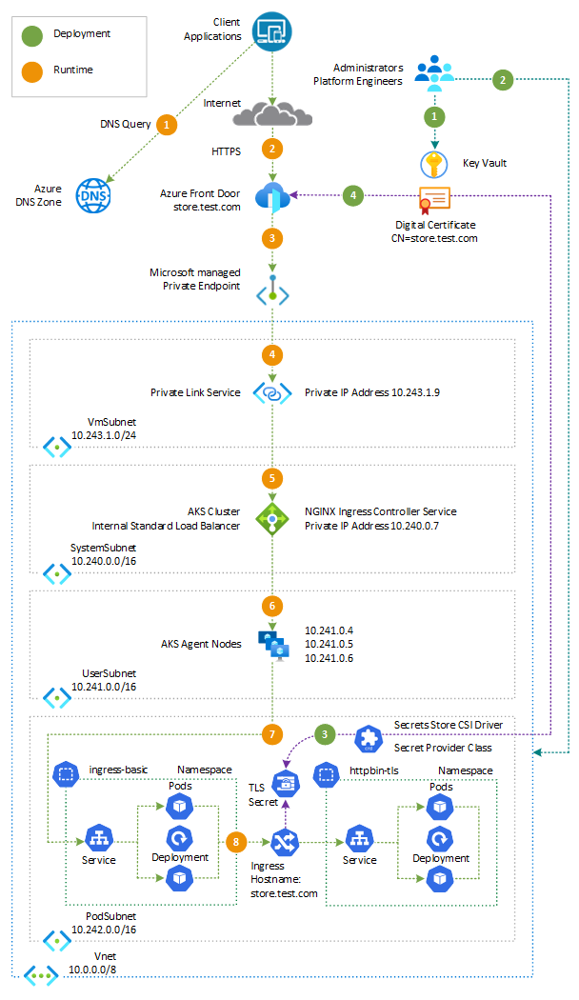

<!-- Use the aac-browse-header.yml   -->

This article describes how to set up end-to-end TLS encryption with [Azure Front Door Premium](/azure/frontdoor/front-door-overview) and [Azure Kubernetes Service (AKS)](https://docs.microsoft.com/en-us/azure/aks/intro-kubernetes) using [Bicep](/azure/azure-resource-manager/bicep/overview?tabs=bicep). It showcases the integration of [Azure Front Door Premium](/azure/frontdoor/front-door-overview), [Azure Web Application Firewall](/azure/web-application-firewall/afds/afds-overview), and [Azure Private Link Service (PLS)](/azure/private-link/private-link-service-overview) to securely expose and protect a workload running in [Azure Kubernetes Service(AKS)](https://docs.microsoft.com/en-us/azure/aks/intro-kubernetes). The web application is exposed via the [NGINX Ingress Controller](https://docs.nginx.com/nginx-ingress-controller/intro/overview/) configured to use a private IP address as a frontend IP configuration of the [AKS internal load balancer](/azure/aks/internal-lb?tabs=set-service-annotations).

## Architecture

:::image type="content" border="false" source="./media/aks-front-door.png" alt-text="Diagram displays an architecture diagram of the solution basezure Front Door and Azure Kubernetes Service." lightbox="./media/aks-front-door.png":::

*Download a [Visio file](https://arch-center.azureedge.net/aks-agic.vsdx) of this architecture.*

### Workflow

The following diagram illustrates the steps involved in the message flow during deployment and runtime.



#### Deployment workflow

The actions carried out during the deployment process are outlined below:

1. A security engineer generates a certificate for the custom domain used by the workload and saves it in an Azure Key Vault. You can obtain a valid certificate from a well-known [certification authority (CA)](https://en.wikipedia.org/wiki/Certificate_authority), or use a solution like [Key Vault Acmebot](https://github.com/shibayan/keyvault-acmebot) to acquire a certificate from one of the following ACME v2 compliant Certification Authority, such as [Let's Encrypt](https://letsencrypt.org/) and more.
2. A platform engineer specifies the necessary information in the `main.bicepparams` Bicep parameters file and deploys the Bicep modules to create the Azure resources. This includes:
   - A prefix for the Azure resources
   - The name and resource group of the existing Azure Key Vault that holds the TLS certificate for the workload hostname and Front Door custom domain.
   - The name of the certificate in the Key Vault.
   - The name and resource group of the DNS zone used for resolving the Front Door custom domain.
3. The [deployment script](/azure/azure-resource-manager/bicep/deployment-script-bicep) creates the [NGINX Ingress Controller](https://docs.nginx.com/nginx-ingress-controller/intro/overview/) and a sample [httpbin](https://httpbin.org/) web application using Helm and YAML manifests. The script defines a `SecretProviderClass` that retrieves the TLS certificate from the specified Azure Key Vault using the user-defined managed identity of the [Azure Key Vault provider for Secrets Store CSI Driver](/azure/aks/csi-secrets-store-driver), and creates a Kubernetes `secret`. The `deployment` and `ingress` objects are configured to use the certificate stored in the Kubernetes secret.
4. A Front Door [secret](/azure/templates/microsoft.cdn/profiles/secrets?pivots=deployment-language-bicep) resource is used to manage and store the TLS certificate from the Azure Key Vault. This certificate is used by the [custom domain](/azure/templates/microsoft.cdn/profiles/customdomains?pivots=deployment-language-bicep) associated with the Azure Front Door endpoint.

> [!NOTE]
> At the end of the deployment, you need approve the private endpoint connection before traffic can pass to the origin privately. For more information, see [Secure your Origin with Private Link in Azure Front Door Premium](/azure/frontdoor/private-link). You can approve private endpoint connections by using the Azure portal, Azure CLI, or Azure PowerShell. For more information, see [Manage a Private Endpoint connection](/azure/private-link/manage-private-endpoint).

#### Runtime workflow

During runtime, the message flow for a request initiated by an external client application is as follows:

1. The client application sends a request to the web application using its custom domain. The DNS zone associated with the custom domain uses a [CNAME record](https://en.wikipedia.org/wiki/CNAME_record) to redirect the DNS query for the custom domain to the original hostname of the Azure Front Door endpoint.
2. The request is sent to one of the [Azure Front Door points-of-presence](/azure/frontdoor/edge-locations-by-region).
3. Azure Front Door forwards the incoming request to the [Azure Private Endpoint](https://docs.microsoft.com/en-us/azure/private-link/private-endpoint-overview) connected to the [Azure Private Link Service](/azure/private-link/private-link-service-overview) used to expose the AKS-hosted workload.
4. The request is sent to the Azure Private Link Service.
5. The request is forwarded to the `kubernetes-internal` AKS internal load balancer.
6. The request is sent to one of the agent nodes hosting a pod of the NGINX Ingress Controller.
7. The request is handled by one of the NGINX Ingress Controller replicas
8. The NGINX Ingress Controller forwards the request to one of the workload pods.

### Components

The architecture consists of the following components:

- [Azure Kubernetes Service](https://azure.microsoft.com/services/kubernetes-service): A public or private AKS cluster composed of the following node pools:
  - A `system` node pool in a dedicated subnet. The default node pool hosts only critical system pods and services. The worker nodes have node taint which prevents application pods from beings scheduled on this node pool.
  - A `user` node pool hosting user workloads and artifacts in a dedicated subnet.
- [Azure Role Assignments](/azure/role-based-access-control/role-assignments): the deployment requires RBAC role assignments which include the following:
  - a `Grafana Admin` role assignment on the Azure Managed Grafana for the Microsoft Entra ID user whose objectID is defined in the `userId` parameter. The `Grafana Admin` role provides full control of the instance including managing role assignments, viewing, editing, and configuring data sources. For more information, see [How to share access to Azure Managed Grafana](/azure/managed-grafana/how-to-share-grafana-workspace?tabs=azure-portal).
  - a `Key Vault Administrator` role assignment on the existing Azure Key Vault resource which contains the TLS certificate for the user-defined managed identity used by the [Azure Key Vault provider for Secrets Store CSI Driver](/azure/aks/csi-secrets-store-driver). This assignment is necessary to let the CSI driver read the certificate from the source Key Vault.
- [Azure Front Door Premium](/azure/frontdoor/front-door-overview) is a layer 7 global load balancer and modern cloud Content Delivery Network (CDN) that provides fast, reliable, and secure access between your users and your applications’ static and dynamic web content across the globe. Azure Front Door delivers your content using Microsoft’s global edge network with hundreds of [global and local points of presence (PoPs)](/azure/frontdoor/edge-locations-by-region) distributed around the world close to both your enterprise and consumer end users. In this solution, Azure Front Door is used to expose an AKS-hosted sample web application via [Azure Private Link Service](/azure/private-link/private-link-service-overview) and [NGINX Ingress Controller](https://docs.nginx.com/nginx-ingress-controller/intro/overview/). Azure Front Door is configured to expose a custom domain for the Front Door endpoint. The custom domain is configured to use the Front Door secret that contains a TLS certificate read from [Azure Key Vault](/azure/key-vault/general/overview).
- [Azure Web Application Firewall (WAF)](/azure/web-application-firewall/afds/afds-overview) protects the AKS-hosted applications exposed via [Azure Front Door](/azure/frontdoor/front-door-overview) from common web-based attacks such as [OWASP](https://owasp.org) vulnerabilities, SQL injections, cross-site scripting, and others. This technology is cloud-native, which doesn't require any licensing and is pay-as-you-use.  provides protection for your web applications. WAF defends your web services against common exploits and vulnerabilities.
- [Azure DNS zone](/azure/dns/dns-overview) is used for the name resolution of the Azure Front Door custom domain. You can use Azure DNS to host your DNS domain and manage your DNS records.
  - [CNAME](/azure/templates/microsoft.network/dnszones/cname?pivots=deployment-language-bicep): this CNAME record is used to create an alias or pointer from one domain name to another. With this resource, you can configure a [CNAME record](https://en.wikipedia.org/wiki/CNAME_record) to redirect DNS queries for the custom domain to the original hostname of the Azure Front Door endpoint.
  - [TXT](/azure/templates/microsoft.network/dnszones/txt?pivots=deployment-language-bicep): this resource represents a Text (TXT) record within a DNS zone. A TXT record allows you to store arbitrary text information associated with a domain. In this project, the TXT record contains the validation token for the custom domain.
- [Azure Private Link Service](/azure/private-link/private-link-service-overview) is configured to reference the `kubernetes-internal` internal load balancer of the AKS cluster. When you enable Azure Private Link to your origin in Azure Front Door Premium, Front Door creates a private endpoint on your behalf from an Azure Front Door managed regional private network. You'll receive an Azure Front Door private endpoint request at the origin pending your approval. For more information, see [Secure your Origin with Private Link in Azure Front Door Premium](https://learn.microsoft.com/en-us/azure/frontdoor/private-link).
- [Azure Virtual Network](/azure/virtual-network/virtual-networks-overview) is used to create a single virtual network with six subnets:
  - `SystemSubnet` is used for the agent nodes of the `system` node pool.
  - `UserSubnet` is used for the agent nodes of the `user` node pool.
  - `PodSubnet` is used to allocate private IP addresses to pods dynamically when the AKS cluster is configured to use [Azure CNI](/azure/aks/configure-azure-cni) with [Dynamic IP Allocation](/azure/aks/configure-azure-cni#dynamic-allocation-of-ips-and-enhanced-subnet-support).
  - `ApiServerSubnet` uses [API Server VNET Integration](/azure/aks/api-server-vnet-integration) to project the API server endpoint directly into this delegated subnet where the AKS cluster is deployed.
  - `AzureBastionSubnet` is used for the [Azure Bastion Host](/azure/bastion/bastion-overview).
  - `VmSubnet` is used for the jump-box virtual machine that connects to the (private) AKS cluster and for the private endpoints.
- [User-assigned Managed Identity](/entra/identity/managed-identities-azure-resources/overview) is used by the AKS cluster to create additional resources like load balancers and managed disks in Azure.
- [Azure Virtual Machine](/azure/virtual-machines/overview) is used to create an option jumpbox virtual machine in the VMSubnet
- [Azure Bastion Host](/azure/bastion/bastion-overview) is deployed in the AKS cluster virtual network to provide SSH connectivity to the AKS agent nodes and virtual machines, if any.
- [Azure Storage Account](/azure/storage/common/storage-account-overview) is used to store the boot diagnostics logs of both the service provider and service consumer virtual machines. Boot Diagnostics is a debugging feature that allows you to view console output and screenshots to diagnose virtual machine status.
- [Azure Container Registry](/azure/container-registry/container-registry-intro) is used to build, store, and manage container images and artifacts.
- [Azure Key Vault](/azure/key-vault/general/overview) is used to store secrets, certificates, and keys that can be mounted as files by pods using [Azure Key Vault Provider for Secrets Store CSI Driver](https://github.com/Azure/secrets-store-csi-driver-provider-azure). For more information, see [Use the Azure Key Vault Provider for Secrets Store CSI Driver in an AKS cluster](/azure/aks/csi-secrets-store-driver) and [Provide an identity to access the Azure Key Vault Provider for Secrets Store CSI Driver](/azure/aks/csi-secrets-store-identity-access). In this project, an existing Azure Key Vault resource contains the TLS certificate used by the `ingress` Kubernetes object and by the custom domain of the Azure Front Door endpoint.
- [Azure Private Endpoint](https://docs.microsoft.com/en-us/azure/private-link/private-endpoint-overview) is created for each of the following resources:
  - Azure Container Registry
  - Azure Key Vault
  - Azure Storage Account
- [Azure Private DNS Zone](https://docs.microsoft.com/en-us/azure/dns/private-dns-overview) is created for each of the following resources:
  - Azure Container Registry
  - Azure Key Vault
  - Azure Storage Account
- [Azure Network Security Groups](https://docs.microsoft.com/en-us/azure/virtual-network/network-security-groups-overview) are used to to filter inbound and outbound traffic for the subnets hosting virtual machines and Azure Bastion Hosts.
- [Azure Monitor workspace](/azure/azure-monitor/essentials/azure-monitor-workspace-overview) is a unique environment for data collected by [Azure Monitor](/azure/azure-monitor/essentials/data-platform-metrics). Each workspace has its own data repository, configuration, and permissions. Log Analytics workspaces contain logs and metrics data from multiple Azure resources, whereas Azure Monitor workspaces currently contain only metrics related to [Prometheus](/azure/azure-monitor/essentials/prometheus-metrics-overview). Azure Monitor managed service for Prometheus allows you to collect and analyze metrics at scale using a Prometheus-compatible monitoring solution, based on the [Prometheus](https://aka.ms/azureprometheus-promio). This fully managed service allows you to use the [Prometheus query language (PromQL)](https://aka.ms/azureprometheus-promio-promql) to analyze and alert on the performance of monitored infrastructure and workloads without having to operate the underlying infrastructure. The primary method for visualizing Prometheus metrics is [Azure Managed Grafana](/azure/managed-grafana/overview). You can connect your [Azure Monitor workspace](/azure/azure-monitor/essentials/azure-monitor-workspace-overview) to an [Azure Managed Grafana](/azure/managed-grafana/overview) to visualize Prometheus metrics using a set of built-in and custom Grafana dashboards.
- [Azure Managed Grafana](/azure/managed-grafana/overview) instance used to visualize the [Prometheus metrics](/azure/azure-monitor/containers/prometheus-metrics-enable?tabs=azure-portal) generated by the [Azure Kubernetes Service(AKS)](https://docs.microsoft.com/en-us/azure/aks/intro-kubernetes) cluster deployed by the Bicep modules. Azure Managed Grafana](</azure/managed-grafana/overview>) is a fully managed service for analytics and monitoring solutions. It is supported by Grafana Enterprise, which provides extensible data visualizations. This managed service allows to quickly and easily deploy Grafana dashboards with built-in high availability and control access with Azure security.
- [Azure Log Analytics](https://docs.microsoft.com/en-us/azure/azure-monitor/logs/log-analytics-workspace-overview) workspace is used to collect the diagnostics logs and metrics from all the Azure resources:
  - Azure Kubernetes Service cluster
  - Azure Key Vault
  - Azure Network Security Group
  - Azure Container Registry
  - Azure Storage Account
- [Deployment scripts in Bicep](/azure/azure-resource-manager/bicep/deployment-script-bicep) are used to run a Bash script which installs the [httpbin](https://httpbin.org/) web application via YAML templates and the following packages to the AKS cluster via [Helm](https://helm.sh/).
  - [NGINX Ingress Controller](https://docs.nginx.com/nginx-ingress-controller/)
  - [Cert-Manager](https://cert-manager.io/docs/)
  - [Prometheus](https://prometheus.io/)

### Alternatives

You can use the [Azure Private Link Service](/azure/private-link/private-link-service-overview) feature to create a managed Private Link Service to the AKS cluster load balancer automatically. You only need to create private endpoint connections to it for private connectivity. You can expose a Kubernetes service via a Private Link Service using annotations. The sample here manually creates a Private Link Service to reference the cluster Azure Load Balancer.

## Scenario details

This scenario uses [Azure Front Door Premium](/azure/frontdoor/front-door-overview), [end-to-end TLS encryption](/azure/frontdoor/end-to-end-tls?pivots=front-door-standard-premium),  [Azure Web Application Firewall](/azure/web-application-firewall/afds/afds-overview), and [Azure Private Link Service](/azure/private-link/private-link-service-overview) to securely expose and protect a workload running in [Azure Kubernetes Service(AKS)]( /azure/aks/intro-kubernetes). 
With Front Door's TLS/SSL offload capability, the TLS connection is terminated and the incoming traffic is decrypted at the Front Door. The traffic is re-encrypted before being forwarded to the origin, which is a web application hosted in an Azure Kubernetes Service cluster. HTTPS is configured as the forwarding protocol on Azure Front Door when connecting to the AKS-hosted workload configured as an origin. This practice ensures that end-to-end TLS encryption is enforced for the entire request process, from the client to the origin. For more information, see [Secure your Origin with Private Link in Azure Front Door Premium](/azure/frontdoor/private-link).
The AKS-hosted web application is exposed via the [NGINX Ingress Controller](https://docs.nginx.com/nginx-ingress-controller/intro/overview/). The NGINX Ingress Controller is configured to use a private IP address as a frontend IP configuration of the `kubernetes-internal` internal load balancer, and it employs HTTPS as the transport protocol to expose the web application. For more information, see [Create an ingress controller using an internal IP address](/azure/aks/ingress-basic?tabs=azure-cli#create-an-ingress-controller-using-an-internal-ip-address).

The [Azure Kubernetes Service](https://docs.microsoft.com/en-us/azure/aks/intro-kubernetes) cluster is configured to use the following features:

- [API Server VNet Integration](/azure/aks/api-server-vnet-integration): API Server VNet Integration enables network communication between the API server and the cluster nodes without requiring a private link or tunnel. The API server is available behind an internal load balancer VIP in the delegated subnet, which the nodes are configured to utilize. By using API Server VNet Integration, you can ensure network traffic between your API server and your node pools remains on the private network only. AKS clusters with API Server VNET integration provide a series of advantages, for example, they can have public network access or private cluster mode enabled or disabled without redeploying the cluster. For more information, see [Create an Azure Kubernetes Service cluster with API Server VNet Integration](/azure/aks/api-server-vnet-integration).
- [Azure NAT Gateway](/azure/virtual-network/nat-gateway/nat-overview) to manage outbound connections initiated by AKS-hosted workloads. For more information, see [Create a managed or user-assigned NAT gateway for your Azure Kubernetes Service (AKS) cluster](/azure/aks/nat-gateway).

### Potential use cases

This scenario addresses the solution for ensuring security and compliance requirements for a web application or REST API running in AKS. It focuses on using Azure Front Door Premium, end-to-end TLS encryption, Azure Web Application Firewall, and Azure Private Link Service to securely expose and protect the AKS-hosted web application.

## Considerations

These considerations implement the pillars of the Azure Well-Architected Framework, which is a set of guiding tenets that can be used to improve the quality of a workload. For more information, see [Microsoft Azure Well-Architected Framework](/azure/architecture/framework).

Some of the following considerations are general recommendations that aren't specific to using [Azure Front Door](/azure/frontdoor/front-door-overview), [Azure Web Application Firewall](/azure/web-application-firewall/afds/afds-overview), and [Azure Private Link Service](/azure/private-link/private-link-service-overview) to improve the protection of an AKS cluster. We believe they're essential requirements of this solution. This applies to the security, performance, availability and reliability, storage, and monitoring considerations.

### Security

Security provides assurances against deliberate attacks and the abuse of your valuable data and systems. For more information, see [Overview of the security pillar](/azure/architecture/framework/security/overview).

- Use a web application firewall (WAF) to protect any AKS-hosted web applications and services that expose a public HTTPS endpoint. You need to provide protection from common threats like SQL injection, cross-site scripting, and other web exploits. Follow Open Web Application Security Project (OWASP) rules and your own custom rules. [Azure Web Application Firewall](/azure/web-application-firewall/overview) provides improved centralized protection of your web applications from common exploits and vulnerabilities. You can deploy Azure WAF with [Azure Application Gateway](/azure/web-application-firewall/ag/ag-overview), [Azure Front Door](/azure/web-application-firewall/afds/afds-overview), and [Azure Content Delivery Network](/azure/web-application-firewall/cdn/cdn-overview).

- Azure protects its infrastructure and services against DDoS attacks that would affect its customers. This protects the availability of regions, availability zones, and services. You should also protect your workload's public endpoints from DDoS attacks at layer 4 and layer 7. Use [Azure DDoS Network Protection](/azure/ddos-protection/ddos-protection-overview) with application-design best practices to defend against workloadDDoS attacks. You should enable [Azure DDOS Network Protection](/azure/ddos-protection/manage-ddos-protection) on any perimeter virtual network.
- You can use the [Azure Web Application Firewall rate-limit rule for Azure Front Door](https://learn.microsoft.com/en-us/azure/web-application-firewall/afds/waf-front-door-rate-limit) to effectively manage and control the number of requests allowed from a specific source IP address to your application within a defined rate-limit duration. This rule empowers you to enforce rate-limiting policies and make sure that your application remains protected from excessive traffic or potential abuse. By configuring the rate-limit rule, you can maintain optimal performance and security for your application with fine-grained control over request limits.
- Configure the WAF Policy associated with Azure Front Door in prevention mode. In prevention mode, the WAF Policy analyzes incoming requests and compares them against the configured rules. If a request matches one or more rules that are set to deny traffic when satisfied, it blocks the malicious traffic from reaching your web applications. This measure helps ensure that your applications are protected against potential vulnerabilities and unauthorized access attempts. For more information, see [Azure Web Application Firewall on Azure Front Door](https://learn.microsoft.com/en-us/azure/web-application-firewall/afds/afds-overview).
- Create an [Azure Private Endpoint](/azure/private-link/private-link-service-overview) for any PaaS service that's used by AKS workloads, like [Azure Key Vault](/azure/key-vault/general/overview), [Azure Service Bus](/azure/service-bus-messaging/service-bus-messaging-overview), and [Azure SQL Database](/azure/azure-sql/database/sql-database-paas-overview?view=azuresql). The traffic between the applications and these services isn't exposed to the public internet. Traffic between the AKS cluster virtual network and an instance of a PaaS service via a private endpoint travels the Microsoft backbone network, but the communication doesn't pass by the Azure Firewall. This mechanism provides better security and better protection against data leakage. For more information, see [What is Azure Private Link?](/azure/private-link/private-link-overview).
- When you use [Application Gateway](/azure/application-gateway/overview) in front of the AKS cluster, use a [Web Application Firewall Policy](/azure/application-gateway/waf-overview) to help protect public-facing workloads that run on AKS from attacks.
- Use [Kubernetes Network Policies](https://kubernetes.io/docs/concepts/services-networking/network-policies/) to segregate and help secure intraservice communications by controlling which components can communicate with one another. By default, all pods in a Kubernetes cluster can send and receive traffic without limitations. To improve security, you can use Azure network policies or Calico network policies to define rules that control the traffic flow between different microservices. For more information, see [network policy](/azure/aks/use-network-policies).
- Don't expose remote connectivity to your AKS nodes. Create a bastion host, or jump box, in a management virtual network. Use the bastion host to route traffic into your AKS cluster.
- Consider using a [Private AKS cluster](/azure/aks/private-clusters) in your production environment, or at least secure access to the API server, by using [authorized IP address ranges](/azure/aks/api-server-authorized-ip-ranges) in AKS. When you use authorized IP address ranges on a public cluster, allow all the egress IP addresses in the Azure Firewall network rule collection. In-cluster operations consume the Kubernetes API server.

### Reliability

Reliability ensures your application can meet the commitments you make to your customers. For more information, see [Overview of the reliability pillar](/azure/architecture/framework/resiliency/overview).
These recommendations are essential for single-tenant AKS solutions and aren't specific to multitenant AKS solutions, where the reliability targets are higher due to the number of users and workloads relying on the system. Consider the following recommendations for optimizing the availability of your AKS cluster and workloads.

#### Intra-region resiliency

- Deploy the node pools of your AKS cluster across all [availability zones](/azure/aks/availability-zones) in a region.
- Enable [zone redundancy in Container Registry](/azure/container-registry/zone-redundancy) for intra-region resiliency and high availability.
- Use [topology spread constraints](https://kubernetes.io/docs/concepts/workloads/pods/pod-topology-spread-constraints) to control how pods are spread across your AKS cluster among failure domains like regions, availability zones, and nodes.
- Consider using Uptime SLA for AKS clusters that host mission-critical workloads.

#### Disaster recovery and business continuity

- Consider deploying your solution to two regions and use the [paired Azure region](/azure/best-practices-availability-paired-regions) as the second region.
- Script, document, and periodically test any regional failover process in a quality assurance (QA) environment.
- Test failback procedures to validate that they work as expected.
- Store your container images in [Container Registry](/azure/container-registry/container-registry-intro). Geo-replicate the registry to each region where your AKS solution is deployed.
- If possible, avoid storing service state in the container. Instead, use an Azure PaaS that supports multiregion replication.
- If you use Azure Storage, prepare and test a process for migrating your storage from the primary region to the backup region.

### Operational excellence

Operational excellence covers the operations processes that deploy an application and keep it running in production. For more information, see [Overview of the operational excellence pillar](/azure/architecture/framework/devops/overview).

#### DevOps

- Deploy your workloads to AKS by using a [Helm](https://helm.sh) chart in a continuous integration and continuous delivery (CI/CD) pipeline.
- To properly test an application before you make it available to users, use A/B testing and canary deployments in your application lifecycle management.
- Use [Azure Container Registry](/azure/container-registry/container-registry-intro) or another container registry, such as [Harbor](https://goharbor.io/) or [Docker Hub](https://hub.docker.com/), to store the private container images that are deployed to the cluster.
- Test ingress and egress on your workloads in a separate pre-production environment that mirrors the network topology and firewall rules of your production environment.

#### Monitoring

- Use [Container insights](/azure/azure-monitor/containers/container-insights-overview) to monitor the health status of the AKS cluster and workloads.
- Use [Azure Monitor managed service for Prometheus](/azure/azure-monitor/essentials/prometheus-metrics-overview) to collect and analyze metrics at scale using a Prometheus-compatible monitoring solution, based on the [Prometheus](https://aka.ms/azureprometheus-promio) project from the Cloud Native Computing Foundation.
- Connect your [Azure Monitor managed service for Prometheus](/azure/azure-monitor/essentials/prometheus-metrics-overview) to an [Azure Managed Grafana](/azure/managed-grafana/overview) so that it can be used as a data source in a Grafana dashboard. You then have access to multiple prebuilt dashboards that use Prometheus metrics and the ability to create any number of custom dashboards.
- Configure all PaaS services, such as Azure Container Registry and Azure Key Vault, to collect diagnostic logs and metrics in an [Azure Log Analytics](https://docs.microsoft.com/en-us/azure/azure-monitor/logs/log-analytics-workspace-overview) workspace.

### Cost optimization

- Review the [Cost optimization](/azure/architecture/framework/services/compute/azure-kubernetes-service/azure-kubernetes-service#cost-optimization) section of the Azure Well-Architected Framework for AKS.
- Review [Optimize costs in Azure Kubernetes Service (AKS)](/azure/aks/best-practices-cost).
- Utilize the cluster autoscaler, Kubernetes Event-Driver Autoscaler (KEDA), and Horizontal Pod Autoscaler to scale the number of pods and nodes based on traffic conditions. [Cluster autoscaler](/azure/aks/cluster-autoscaler), [KEDA](https://keda.sh/), [Horizontal Pod Autoscaler](https://kubernetes.io/docs/tasks/run-application/horizontal-pod-autoscale/)
- Set proper resource requests and limits for pods to optimize resource allocation and improve application density. [Requests and limits](https://kubernetes.io/docs/concepts/configuration/manage-resources-containers/), [Best practices for resource management in AKS](/azure/aks/developer-best-practices-resource-management)
- Use ResourceQuota objects to set quotas for memory and CPU usage in namespaces, preventing noisy neighbor issues and improving application density. [ResourceQuota](https://kubernetes.io/docs/reference/kubernetes-api/policy-resources/resource-quota-v1/), [LimitRange](https://kubernetes.io/docs/reference/kubernetes-api/policy-resources/limit-range-v1/)
- Implement the Vertical Pod Autoscaler (VPA) to analyze and set CPU and memory resources required by pods, optimizing resource allocation. [Vertical Pod Autoscaler (VPA)](/azure/aks/vertical-pod-autoscaler)
- Choose the appropriate VM size for node pools based on workload requirements. [VM size selection](/azure/virtual-machines/sizes)
- Create multiple node pools with different VM sizes for specific workloads, utilizing node labels, node selectors, and affinity rules to optimize resource allocation. [Node pools](/azure/aks/use-multiple-node-pools?msclkid=4bcac87ab63c11eca58bba96cceafa21)
- Optimize costs by stopping or scaling down AKS clusters or node pools when not in use. [Stop and start AKS clusters](/azure/aks/start-stop-cluster?tabs=azure-cli), [Start and stop node pools](/azure/aks/start-stop-nodepools)
- Take advantage of Azure cost management tools, such as [Azure Advisor](/azure/advisor/advisor-overview), [Azure Reservations](/azure/cost-management-billing/reservations/save-compute-costs-reservations) and [Azure Savings Plans](/azure/cost-management-billing/savings-plan/savings-plan-compute-overview), to monitor and optimize costs. [Azure cost management](https://azure.microsoft.com/en-us/products/cost-management/#overview)
- Consider using [spot node pools](/azure/aks/spot-node-pool) for cost savings and benefit from unutilized capacity in Azure.
- Monitor and govern AKS costs using tools like [Kubecost](https://www.kubecost.com/) for cost allocation and optimization.```
- Use Azure tags to associate AKS resources with specific workloads or tenants for better cost tracking and management.

## Deploy this scenario

The source code for this scenario is available in [GitHub](https://github.com/Azure-Samples/aks-front-door-end-to-end-tls). This solution is open source and provided with an [MIT License](https://github.com/Azure-Samples/aks-front-door-end-to-end-tls/blob/main/LICENSE.md).

### Prerequisites

- An active [Azure subscription](https://docs.microsoft.com/en-us/azure/guides/developer/azure-developer-guide#understanding-accounts-subscriptions-and-billing). If you don't have one, create a [free Azure account](https://azure.microsoft.com/free/) before you begin.
- [Visual Studio Code](https://code.visualstudio.com/) installed on one of the [supported platforms](https://code.visualstudio.com/docs/supporting/requirements#_platforms) along with the [Bicep extension](https://marketplace.visualstudio.com/items?itemName=ms-azuretools.vscode-bicep).
- Azure CLI version 2.58.0 or later installed. to install or upgrade, see [Install Azure CLI](/cli/azure/install-azure-cli).
- An existing [Azure Key Vault](/azure/key-vault/general/overview) resource with a valid TLS certificate for the sample web application.
- An existing [Azure DNS Zone](/azure/dns/dns-zones-records) for the name resolution of the [Azure Front Door custom domain](/azure/frontdoor/front-door-custom-domain) via a [CNAME record](https://en.wikipedia.org/wiki/CNAME_record).

### Deployment to Azure

1. Have your Azure subscription information handy.

2. Clone the [workbench GitHub repository](https://github.com/Azure-Samples/aks-front-door-end-to-end-tls):

   ```git
   git clone https://github.com/Azure-Samples/aks-front-door-end-to-end-tls.git
   ```

3. Follow the instructions provided in the [README.md file](https://github.com/Azure-Samples/aks-front-door-end-to-end-tls/blob/master/README.md).

## Contributors

*This article is maintained by Microsoft. It was originally written by the following contributors.*

Principal author:

- [Paolo Salvatori](https://www.linkedin.com/in/paolo-salvatori) | Principal Service Engineer

*To see non-public LinkedIn profiles, sign in to LinkedIn.*

## Next steps

Review the recommendations and best practices for AKS in the [Microsoft Azure Well-Architected Framework](/azure/architecture/framework):

- [Reliability](/azure/architecture/framework/services/compute/azure-kubernetes-service/reliability)
- [Security](/azure/architecture/framework/services/compute/azure-kubernetes-service/security)
- [Cost optimization](/azure/architecture/framework/services/compute/azure-kubernetes-service/cost-optimization)
- [Operational excellence](/azure/architecture/framework/services/compute/azure-kubernetes-service/operational-excellence)
- [Performance efficiency](/azure/architecture/framework/services/compute/azure-kubernetes-service/performance-efficiency)

### Azure Front Door

- [What is Azure Front Door?](/azure/frontdoor/front-door-overview))
- [Traffic acceleration](/azure/frontdoor/front-door-traffic-acceleration?pivots=front-door-standard-premium))
- [Routing architecture overview](/azure/frontdoor/front-door-routing-architecture?pivots=front-door-standard-premium))
- [Origins and origin groups in Azure Front Door](/azure/frontdoor/origin?pivots=front-door-standard-premium))
- [Secure your Origin with Private Link in Azure Front Door Premium](/azure/frontdoor/private-link))
- [What is a rule set in Azure Front Door?](/azure/frontdoor/front-door-rules-engine?pivots=front-door-standard-premium)
- [Understand Azure Front Door billing](/azure/frontdoor/billing)
- [Azure Web Application Firewall on Azure Front Door](/azure/web-application-firewall/afds/afds-overview)
- [Best practices for Front Door](/azure/frontdoor/best-practices)

### Azure Kubernetes Service

- [Create a private Azure Kubernetes Service cluster](https://github.com/azure-samples/private-aks-cluster)
- [Best practices for multitenancy and cluster isolation](/azure/architecture/guide/multitenant/service/aks)
- [Best practices for basic scheduler features in Azure Kubernetes Service (AKS)](/azure/aks/operator-best-practices-scheduler)
- [Best practices for advanced scheduler features](/azure/aks/operator-best-practices-advanced-scheduler)
- [Best practices for authentication and authorization](/azure/aks/operator-best-practices-advanced-scheduler)
- [Best practices for cluster security and upgrades in Azure Kubernetes Service (AKS)](/azure/aks/operator-best-practices-cluster-security)
- [Best practices for container image management and security in Azure Kubernetes Service (AKS)](/azure/aks/operator-best-practices-container-image-management)
- [Best practices for network connectivity and security in Azure Kubernetes Service (AKS)](/azure/aks/operator-best-practices-network)
- [Best practices for storage and backups in Azure Kubernetes Service (AKS)](/azure/aks/operator-best-practices-storage)
- [Best practices for business continuity and disaster recovery in Azure Kubernetes Service (AKS)](/azure/aks/operator-best-practices-multi-region)
- [Azure Kubernetes Service (AKS) day-2 operations guide](../../operator-guides/aks/day-2-operations-guide.md)

## Related resources

### Architectural guidance

- [Azure Kubernetes Service (AKS) solution journey](../../reference-architectures/containers/aks-start-here.md)
- [AKS cluster best practices](/Azure/aks/best-practices?toc=/azure/architecture/toc.json&bc=/azure/architecture/_bread/toc.json)
- [Azure Kubernetes Service (AKS) day-2 operations guide](../../operator-guides/aks/day-2-operations-guide.md)

### Reference architectures

- [Baseline architecture for an Azure Kubernetes Service (AKS) cluster](/azure/architecture/reference-architectures/containers/aks/baseline-aks)
- [Microservices architecture on Azure Kubernetes Service (AKS)](../../reference-architectures/containers/aks-microservices/aks-microservices.yml)
- [Advanced Azure Kubernetes Service (AKS) microservices architecture](../../reference-architectures/containers/aks-microservices/aks-microservices-advanced.yml)
- [CI/CD pipeline for container-based workloads](../../guide/aks/aks-cicd-github-actions-and-gitops.yml)
- [Building a telehealth system on Azure](../../example-scenario/apps/telehealth-system.yml)
