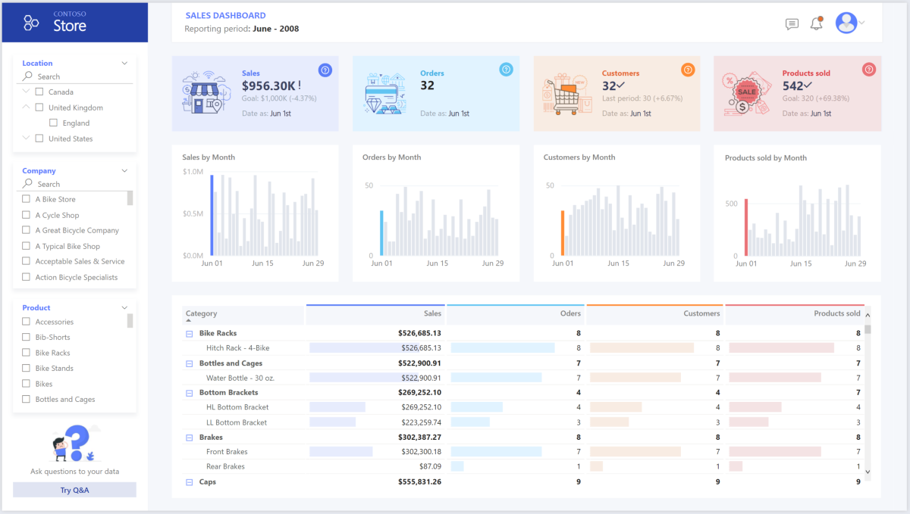

This example scenario shows how data can be ingested into a cloud environment from an on-premises data warehouse, then served using a business intelligence (BI) model. This approach could be an end goal or a first step toward full modernization with cloud-based components.

The following steps build on the [Azure Synapse Analytics end-to-end][e2e-analytics] scenario. This process uses Azure Synapse Analytics pipelines to ingest data from a SQL database into SQL pools. Then it performs data transformation for analysis. This article focuses on Azure Synapse Analytics pipelines, but you can also use Azure Data Factory pipelines or Microsoft Fabric Data Factory pipelines to perform these tasks.

## When to use this architecture

There are many ways to deliver the business requirements that are associated with enterprise BI. Business requirements are defined by aspects, such as current technology investment, human skills, time horizon for modernization, future vision, and a preference for platform as a service (PaaS) or software as a service (SaaS). 

Consider the following design approaches:

- [A lakehouse in Fabric](/azure/architecture/example-scenario/data/greenfield-lakehouse-fabric)
- [Fabric and Azure Databricks](/azure/architecture/solution-ideas/articles/small-medium-modern-data-platform) for customers that have existing investment in Azure Databricks and Power BI and want to modernize with Fabric 
- Enterprise BI for small and medium businesses that use an [Azure SQL ecosystem and Fabric](/azure/architecture/example-scenario/data/small-medium-data-warehouse)
- Data warehousing completely on Fabric for customers that prefer SaaS

The architecture in this article assumes that you selected Azure Synapse Analytics data warehouse as the persistent layer of the enterprise semantic model and selected Power BI for business intelligence. This PaaS approach has the flexibility to accommodate various business requirements and preferences.

## Architecture

:::image type="content" source="./media/enterprise-bi-scoped-architecture.svg" lightbox="./media/enterprise-bi-scoped-architecture.svg" alt-text="Diagram that shows the enterprise BI architecture with Azure Synapse Analytics." border="false":::

:::image type="complex" source="./media/enterprise-bi-scoped-architecture.svg" border="false" lightbox="./media/enterprise-bi-scoped-architecture.svg" alt-text="Diagram that shows the enterprise BI architecture with Azure Synapse Analytics.":::
The diagram shows types of input, like data streams, databases, data services, unstructured data, and structured data. Components in the Ingest phase receive the data input. The Ingest phase components are Azure Event Hubs, Azure IoT Hub, Azure Synapse Analytics, and pipelines. Azure Synapse Analytics is also in the Store phase and the Process phase. The next step in the dataflow is the Store phase, which contains Azure Data Lake Storage. Then the data goes to the Process phase, which contains Azure Stream Analytics, Azure Data Explorer pools, Apache Spark pools, and serverless and dedicated SQL pools. Some of the machine learning model data goes to the Enrich phase, which contains Azure Cognitive Services and Azure Machine Learning. The other data goes to the Serve phase, which contains Power BI premium, Azure Cosmos DB, Azure AI Search, and Azure Data Share. The data outputs to business users, analytics, appliations, and shared datasets.
:::image-end:::

*Download a [Visio file](https://arch-center.azureedge.net/enterprise-bi-scoped-architecture.vsdx) of this architecture.*

### Workflow

#### Data source

- The source data is located in a SQL Server database in Azure. To simulate the on-premises environment, deployment scripts for this scenario configure an Azure SQL database. The [AdventureWorks sample database][adventureworksdw-sample-link] is used as the source data schema and sample data. For information on how to copy data from an on-premises database, see [Copy and transform data to and from SQL Server](/azure/data-factory/connector-sql-server?tabs=data-factory).

#### Ingestion and data storage

- [Azure Data Lake Storage](/azure/databricks/data/data-sources/azure/adls-gen2) is used as a temporary *staging* area during data ingestion. You can then use [PolyBase to copy data into an Azure Synapse Analytics dedicated SQL pool](/azure/data-factory/connector-azure-sql-data-warehouse?tabs=data-factory#use-polybase-to-load-data-into-azure-synapse-analytics).

- [Azure Synapse Analytics](/azure/synapse-analytics) is a distributed system designed to perform analytics on large data. It supports massive parallel processing (MPP), which makes it suitable for running high-performance analytics. The Azure Synapse Analytics dedicated SQL pool is a target for ongoing ingestion from on-premises. It can be used for serving the data for [Power BI](/power-bi/fundamentals/power-bi-overview) through DirectQuery and for further processing.

- [Azure Synapse Analytics pipelines](/azure/data-factory/concepts-pipelines-activities) are used to orchestrate data ingestion and transformation within your Azure Synapse Analytics workspace.

#### Analysis and reporting

- The data-modeling approach in this scenario combines the [enterprise model][enterprise-model] and the [BI semantic model][bi-model]. The enterprise model is stored in an [Azure Synapse Analytics dedicated SQL pool][synapse-dedicated-pool]. The BI semantic model is stored in [Power BI Premium capacity][pbi-premium-capacities] F64. Power BI accesses the data via DirectQuery.

### Components

This scenario uses the following components:

- [Azure SQL Database](/azure/well-architected/service-guides/azure-sql-database-well-architected-framework) is a PaaS SQL server that's hosted on Azure. This architecture uses SQL Database to demonstrate the flow of data for the migration scenario. 

- [Data Lake Storage](/azure/storage/blobs/data-lake-storage-introduction) provides flexible cloud storage for unstructured data that's used for persisting intermediate migration results.
- [Azure Synapse Analytics](/azure/synapse-analytics/overview-what-is) is an enterprise analytics service for data warehousing and big data systems. Azure Synapse Analytics is used as main compute and persistent storage in enterprise semantic modeling and servicing.
- [Power BI Premium](/power-bi/enterprise/service-premium-what-is) is a BI tool that presents and visualizes data in this scenario.
- [Microsoft Entra ID](/entra/fundamentals/whatis) is a multicloud identity and network solution suite that supports the authentication and authorization flow.

### Simplified architecture

:::image type="content" source="./media/enterprise-bi-scoped-architecture.svg" lightbox="./media/enterprise-bi-scoped-architecture.svg" alt-text="Diagram that shows the enterprise BI architecture with Azure Synapse Analytics." border="false":::

:::image type="complex" source="./media/enterprise-bi-small-architecture.png" border="false" lightbox="./media/enterprise-bi-small-architecture.png" alt-text="Diagram that shows the enterprise BI simplified architecture.":::
The diagram shows a dataflow where Azure Synapse Analytics pipelines ingest relational databases. Azure Synapse Analytics dedicated SQL pools store the data. Power BI Premium serves the data. The data outputs to business users and analytics.
:::image-end:::

## Scenario details

In this scenario, an organization has a large on-premises data warehouse stored in a SQL database. The organization wants to use Azure Synapse Analytics to perform analysis, then serve these insights by using Power BI.

### Authentication

Microsoft Entra ID authenticates users who connect to Power BI dashboards and apps. Single sign-on is used to connect to the data source in an Azure Synapse Analytics provisioned pool. Authorization happens on the source.

### Incremental loading

When you run an automated extract, transform, load (ETL) or extract, load, transform (ELT) process, it's most efficient to load only the data that changed since the previous run. It's called an [incremental load](/azure/data-factory/tutorial-incremental-copy-overview), as opposed to a full load that loads all the data. To perform an incremental load, you need a way to identify which data has changed. The most common approach is to use a *high water mark* value, which tracks the latest value of some column in the source table, either a datetime column or a unique integer column.

You can use [temporal tables](/sql/relational-databases/tables/temporal-tables) in SQL Server. Temporal tables are system-versioned tables that store all data change history. The database engine automatically records the history of every change in a separate history table. You can query the historical data by adding a `FOR SYSTEM_TIME` clause to a query. Internally, the database engine queries the history table, but it's transparent to the application.

Temporal tables are useful for dimension data, which can change over time. Fact tables usually represent an immutable transaction such as a sale, in which case keeping the system version history doesn't make sense. Instead, transactions usually have a column that represents the transaction date, which can be used as the watermark value. For example, in the AdventureWorks data warehouse, the `SalesLT.*` tables have a `LastModified` field.

Here's the general flow for the ELT pipeline:

1. For each table in the source database, track the cutoff time when the last ELT job ran. Store this information in the data warehouse. On initial setup, all times are set to `1-1-1900`.

2. During the data export step, the cutoff time is passed as a parameter to a set of stored procedures in the source database. These stored procedures query any records that are changed or created after the cutoff time. For all tables in the example, you can use the `ModifiedDate` column.

3. When the data migration is complete, update the table that stores the cutoff times.

## Data pipeline

This scenario uses the [AdventureWorks sample database][adventureworksdw-sample-link] as a data source. This architecture uses the incremental data load pattern to ensure that it only loads data that's modified or added after the most recent pipeline run.

### Metadata-driven copy tool

The built-in [metadata-driven copy tool](/azure/data-factory/copy-data-tool-metadata-driven) within Azure Synapse Analytics pipelines incrementally loads all tables that are contained within the relational database.

1. Through a wizard interface, you can connect the Copy Data tool to the source database.

1. After it connects, you can configure incremental loading or full loading for each table.
1. The Copy Data tool creates the pipelines and SQL scripts needed to generate the control table. This table stores data for the incremental loading process, such as the high watermark value or column for each table.
1. After these scripts run, the pipeline can load all source data warehouse tables into the Azure Synapse Analytics dedicated pool.

:::image type="content" source="./media/metadata-copy.png" alt-text="Screenshot that shows the metadata-driven Copy Data tool in Azure Synapse Analytics.":::

The tool creates three pipelines to iterate over all the tables in the database, before loading the data.

The pipelines generated by this tool:

- Count the number of objects, such as tables, to be copied in the pipeline run.
- Iterate over each object to be loaded or copied and then:
  - Check whether a delta load is required. Otherwise, the pipeline completes a normal full load.
  - Retrieve the high watermark value from the control table.
  - Copy data from the source tables into the staging account in Data Lake Storage.
  - Load data into the dedicated SQL pool via the selected copy method, such as the PolyBase or Copy command.
  - Update the high watermark value in the control table.

### Load data into Azure Synapse Analytics SQL pool

The [copy activity](/azure/data-factory/copy-activity-overview) copies data from the SQL database into the Azure Synapse Analytics SQL pool. This example's SQL database is in Azure, so it uses the Azure integration runtime to read data from the SQL database and write the data into the specified staging environment.

The copy statement is then used to load data from the staging environment into the Azure Synapse Analytics dedicated pool.

### Use Azure Synapse Analytics pipelines

Pipelines in Azure Synapse Analytics are used to define the ordered set of activities to complete the incremental load pattern. Triggers are used to start the pipeline, which can be triggered manually or at a specific time.

### Transform the data

Because the sample database in this reference architecture isn't large, replicated tables that have no partitions are created. For production workloads, using distributed tables is likely to improve query performance. For more information, see [Guidance for designing distributed tables in Azure Synapse Analytics](/azure/sql-data-warehouse/sql-data-warehouse-tables-distribute). The example scripts run the queries via a static [resource class](/azure/sql-data-warehouse/resource-classes-for-workload-management).

In a production environment, consider creating staging tables with round-robin distribution. Then transform and move the data into production tables with clustered columnstore indexes, which offer the best overall query performance. Columnstore indexes are optimized for queries that scan many records. Columnstore indexes don't perform as well for singleton lookups, that is, looking up a single row. If you need to perform frequent singleton lookups, you can add a nonclustered index to a table. Singleton lookups can run faster by using a nonclustered index. However, singleton lookups are typically less common in data warehouse scenarios than online transaction processing workloads. For more information, see [Indexing tables in Azure Synapse Analytics](/azure/sql-data-warehouse/sql-data-warehouse-tables-index).

> [!NOTE]
> Clustered columnstore tables don't support `varchar(max)`, `nvarchar(max)`, or `varbinary(max)` data types. In that case, consider a heap or clustered index. You might put those columns into a separate table.

### Use Power BI Premium to access, model, and visualize data

Power BI Premium supports several options for connecting to data sources on Azure. You can use Azure Synapse Analytics provisioned pools to do the following actions:

- Import: The data is imported into the Power BI model.
- [DirectQuery](/power-bi/connect-data/desktop-directquery-about): Data is pulled directly from relational storage.
- [Composite model](/power-bi/transform-model/desktop-composite-models): Combine *Import* for some tables and *DirectQuery* for others.

This scenario is delivered with the DirectQuery dashboard because the amount of data used and model complexity aren't high, so this architecture can deliver a good user experience. DirectQuery delegates the query to the powerful compute engine underneath and utilizes extensive security capabilities on the source. Also, using DirectQuery ensures that results are always consistent with the latest source data.

Import mode provides the fastest query response time, and should be considered when the model fits entirely within Power BI's memory, the data latency between refreshes can be tolerated, and there might be some complex transformations between the source system and the final model. In this case, the end users want full access to the most recent data with no delays in Power BI refreshing, and all historical data, which is larger than what a Power BI dataset can handle. A Power BI dataset can handle 25-400 GB, depending on the capacity size. As the data model in the dedicated SQL pool is already in a star schema and needs no transformation, DirectQuery is an appropriate choice.

[Power BI Premium](/power-bi/enterprise/service-premium-gen2-what-is) gives you the ability to handle large models, paginated reports, deployment pipelines, and built-in Analysis Services endpoint. You can also have dedicated [capacity](/power-bi/admin/service-premium-what-is#reserved-capacities) with unique value proposition.

When the BI model grows or dashboard complexity increases, you can switch to composite models and start importing parts of look-up tables, via [hybrid tables](/power-bi/connect-data/service-dataset-modes-understand#hybrid-tables), and some preaggregated data. Enabling [query caching](/power-bi/connect-data/power-bi-query-caching) within Power BI for imported datasets and using [dual tables](/power-bi/transform-model/desktop-storage-mode) for the storage mode property are options.

Within the composite model, datasets act as a virtual pass-through layer. When the user interacts with visualizations, Power BI generates SQL queries to Azure Synapse Analytics SQL pools dual storage: in memory or direct query depending on which one is more efficient. The engine decides when to switch from in-memory to direct query and pushes the logic to the Azure Synapse Analytics SQL pool. Depending on the context of the query tables, they can act as either cached (imported) or not cached composite models. Pick and choose which table to cache into memory, combine data from one or more DirectQuery sources, and/or combine data from a mix of DirectQuery sources and imported data.

**Recommendations:**
When using DirectQuery over Azure Synapse Analytics provisioned pool:

- Use Azure Synapse Analytics [result set caching](/azure/synapse-analytics/sql-data-warehouse/performance-tuning-result-set-caching) to cache query results in the user database for repetitive use, improve query performance down to milliseconds, and reduce compute resource usage. Queries using cached results sets don't use any concurrency slots in Azure Synapse Analytics and thus don't count against existing concurrency limits.
- Use Azure Synapse Analytics [materialized views](/azure/synapse-analytics/sql/develop-materialized-view-performance-tuning) to precompute, store, and maintain data just like a table. Queries that use all or a subset of the data in materialized views can get faster performance, and they don't need to make a direct reference to the defined materialized view to use it.

## Considerations

These considerations implement the pillars of the Azure Well-Architected Framework, which is a set of guiding tenets that you can use to improve the quality of a workload. For more information, see [Well-Architected Framework](/azure/well-architected/).

### Security

Security provides assurances against deliberate attacks and the misuse of your valuable data and systems. For more information, see [Design review checklist for Security](/azure/well-architected/security/checklist).

Frequent headlines of data breaches, malware infections, and malicious code injection are among an extensive list of security concerns for companies looking to cloud modernization. Enterprise customers need a cloud provider or service solution that can address their concerns as they can't afford to get it wrong.

This scenario addresses the most demanding security concerns using a combination of layered security controls: network, identity, privacy, and authorization. The bulk of the data is stored in Azure Synapse Analytics provisioned pool, with Power BI using DirectQuery through single sign-on. You can use Microsoft Entra ID for authentication. There are also extensive security controls for data authorization of provisioned pools.

Some common security questions include:

- How can I control who can see what data?
  - Organizations need to protect their data to comply with federal, local, and company guidelines to mitigate risks of data breach. Azure Synapse Analytics offers multiple [data protection capabilities](/azure/synapse-analytics/guidance/security-white-paper-data-protection) to achieve compliance.
- What are the options for verifying a user's identity?
  - Azure Synapse Analytics supports a wide range of capabilities to control who can access what data via [access control](/azure/synapse-analytics/guidance/security-white-paper-access-control) and [authentication](/azure/synapse-analytics/guidance/security-white-paper-authentication).
- What network security technology can I use to protect the integrity, confidentiality, and access of my networks and data?
  - To secure Azure Synapse Analytics, there are a range of [network security](/azure/synapse-analytics/guidance/security-white-paper-network-security) options available to consider.
- What are the tools that detect and notify me of threats?
  - Azure Synapse Analytics provides many [threat detection](/azure/synapse-analytics/guidance/security-white-paper-threat-protection) capabilities like: SQL auditing, SQL threat detection, and vulnerability assessment to audit, protect, and monitor databases.
- What can I do to protect data in my storage account?
  - Azure Storage accounts are ideal for workloads that require fast and consistent response times, or that have a high number of input/output operations (IOP) per second. Storage accounts contain all your Azure Storage data objects, and have many options for [storage account security](/azure/architecture/framework/services/storage/storage-accounts/security).

### Cost Optimization

Cost Optimization focuses on ways to reduce unnecessary expenses and improve operational efficiencies. For more information, see [Design review checklist for Cost Optimization](/azure/well-architected/cost-optimization/checklist).

This section provides information on pricing for different services involved in this solution, and mentions decisions made for this scenario with a sample dataset. Use this starting configuration in the [Azure pricing calculator](https://azure.com/e/598c407dc58545e090c8cfd6c7dbc190), and adjust it to fit your scenario.

#### Azure Synapse Analytics

Azure Synapse Analytics serverless architecture allows you to scale your compute and storage levels independently. Compute resources are charged based on usage, and you can scale or pause these resources on demand. Storage resources are billed per terabyte, so your costs increase as you ingest more data.

#### Azure Synapse Analytics pipelines

Pricing details for pipelines in Azure Synapse Analytics can be found under the *Data Integration* tab on the [Azure Synapse Analytics pricing page](https://azure.microsoft.com/pricing/details/synapse-analytics). There are three main components that influence the price of a pipeline:

- Data pipeline activities and integration runtime hours
- Data flows cluster size and implementation
- Operation charges

The price varies depending on the components or activities, frequency, and number of integration runtime units.

For the sample dataset, the standard Azure-hosted integration runtime, *copy data activity* for the core of the pipeline, is triggered on a daily schedule for all of the entities (tables) in the source database. The scenario contains no data flows. There are no operational costs since there are fewer than 1 million operations with pipelines each month.

#### Azure Synapse Analytics dedicated pool and storage

Pricing details for Azure Synapse Analytics dedicated pool can be found under the *Data Warehousing* tab on the [Azure Synapse Analytics pricing page](https://azure.microsoft.com/pricing/details/synapse-analytics). Under the Dedicated consumption model, customers are billed per data warehouse unit (DWU) units provisioned, per hour of uptime. Another contributing factor is data storage costs, which includes the size of your data at rest, snapshots, and geo-redundancy, if any.

For the sample dataset, you can provision 500DWU, which guarantees a good experience for analytical load. You can keep compute up and running over business hours of reporting. If taken into production, reserved data warehouse capacity is an attractive option for cost management. Different techniques should be used to maximize cost and performance metrics, which are covered in the previous sections.

#### Blob storage

Consider using the Azure Storage reserved capacity feature to lower storage costs. With this model, you get a discount if you reserve fixed storage capacity for one or three years. For more information, see [Optimize costs for blob storage with reserved capacity][az-storage-reserved].

There's no persistent storage in this scenario.

#### Power BI Premium

Power BI Premium pricing details can be found on the [Power BI pricing page](https://powerbi.microsoft.com/pricing).

This scenario uses [Power BI Premium workspaces](/power-bi/admin/service-premium-what-is) with a range of performance enhancements built in to accommodate demanding analytical needs.

### Operational Excellence

Operational Excellence covers the operations processes that deploy an application and keep it running in production. For more information, see [Design review checklist for Operational Excellence](/azure/well-architected/operational-excellence/checklist).

- For guidance about how to use an Azure DevOps release pipeline and how to use GitHub Actions to automate the deployment of an Azure Synapse Analytics workspace across multiple environments, see [Continuous integration and continuous delivery for an Azure Synapse Analytics workspace](/azure/synapse-analytics/cicd/continuous-integration-delivery).
- Put each workload in a separate deployment template and store the resources in source control systems. You can deploy the templates together or individually as part of a continuous integration and continuous delivery (CI/CD) process, making the automation process easier. In this architecture, there are four main workloads:
  - The data warehouse server, and related resources
  - Azure Synapse Analytics pipelines
  - Power BI assets: dashboards, apps, and datasets
  - An on-premises to cloud simulated scenario

  Aim to have a separate deployment template for each of the workloads.
- Consider staging your workloads where practical. Deploy to various stages and run validation checks at each stage before moving to the next stage. That way you can push updates to your production environments in a controlled way and minimize unanticipated deployment problems. Use [blue-green deployment][blue-green-dep] and [canary release][canary-releases] strategies for updating live production environments.
- Have a good rollback strategy for handling failed deployments. For example, you can automatically redeploy an earlier, successful deployment from your deployment history. See the `--rollback-on-error` flag in the Azure CLI.
- [Azure Monitor][azure-monitor] is the recommended option for analyzing the performance of your data warehouse and the entire Azure analytics platform for an integrated monitoring experience. [Azure Synapse Analytics][synapse-analytics] provides a monitoring experience within the Azure portal to show insights about your data warehouse workload. The Azure portal is the recommended tool when monitoring your data warehouse because it provides configurable retention periods, alerts, recommendations, and customizable charts and dashboards for metrics and logs.

#### Quick start

- Tutorial: [Get started with Azure Synapse Analytics](/azure/synapse-analytics/get-started)
- The Azure CLI: [Create an Azure Synapse Analytics workspace with Azure CLI](/azure/synapse-analytics/quickstart-create-workspace-cli)

### Performance Efficiency

Performance Efficiency refers to your workload's ability to scale to meet user demands efficiently. For more information, see [Design review checklist for Performance Efficiency](/azure/well-architected/performance-efficiency/checklist).

This section provides details on sizing decisions to accommodate this dataset.

#### Azure Synapse Analytics provisioned pool

There's a range of [data warehouse configurations](/azure/synapse-analytics/sql-data-warehouse/sql-data-warehouse-manage-compute-overview) to choose from.

|Data warehouse units |# of compute nodes  |# of distributions per node|
|---------------------|:------------------:|:-------------------------:|
|DW100c               |1                   |60                         |
|                     | `-- TO --`         |                           |
|DW30000c             |60                  |1                          |

To see the performance benefits of scaling out, especially for larger data warehouse units, use at least a 1-TB dataset. To find the best number of data warehouse units for your dedicated SQL pool, try scaling up and down. Run a few queries with different numbers of data warehouse units after loading your data. Since scaling is quick, you can try various performance levels in an hour or less.

##### Find the best number of data warehouse units

For a dedicated SQL pool in development, begin by selecting a smaller number of data warehouse units. A good starting point is *DW400c* or *DW200c*. Monitor your application performance, observing the number of data warehouse units selected compared to the performance you observe.
Assume a linear scale, and determine how much you need to increase or decrease the data warehouse units. Continue making adjustments until you reach an optimum performance level for your business requirements.

##### Scale an Azure Synapse Analytics SQL pool

- [Scale compute for an Azure Synapse Analytics SQL pool with the Azure portal](/azure/synapse-analytics/sql-data-warehouse/quickstart-scale-compute-portal)
- [Scale compute for a dedicated SQL pool with Azure PowerShell](/azure/synapse-analytics/sql-data-warehouse/quickstart-scale-compute-powershell)
- [Scale compute for a dedicated SQL pool in Azure Synapse Analytics using T-SQL](/azure/synapse-analytics/sql-data-warehouse/quickstart-scale-compute-tsql)
- [Pausing, monitoring, and automation](/azure/synapse-analytics/sql-data-warehouse/sql-data-warehouse-manage-compute-overview)

For scalability and performance optimization features of pipelines in Azure Synapse Analytics and the copy activity used, refer to the [Copy activity performance and scalability guide](/azure/data-factory/copy-activity-performance).

#### Power BI Premium and Fabric

This article uses the [Power BI Premium F64 capacity](/power-bi/enterprise/service-premium-what-is#capacities-and-skus) to demonstrate BI capabilities. Dedicated Power BI capacities in Fabric range from F64 (8 vCores) to F1024 (128 vCores).

To determine how much capacity you need:
- undergo [capacity loading evaluation](/power-bi/enterprise/service-premium-concepts)
- Install the Fabric [capacity metrics app](/fabric/enterprise/metrics-app-install) for ongoing monitoring.
- Consider using workload-related [capacity optimization techniques](/fabric/enterprise/optimize-capacity).

## Contributors

*Microsoft maintains this article. The following contributors wrote this article.*

Principal authors:

- [Galina Polyakova](https://www.linkedin.com/in/galinagpolyakova/) | Senior Cloud Solution Architect
- [Noah Costar](https://www.linkedin.com/in/noah-costar-6204b8157/) | Cloud Solution Architect
- [George Stevens](https://www.linkedin.com/in/george-stevens/) | Cloud Solution Architect

Other contributors:

- [Jim McLeod](https://www.linkedin.com/in/jimmcleodaustralia/) | Cloud Solution Architect
- [Miguel Myers](https://www.linkedin.com/in/miguelmyers/) | Senior Program Manager

*To see nonpublic LinkedIn profiles, sign in to LinkedIn.*

## Next steps

- [What is Power BI Premium?](/power-bi/enterprise/service-premium-what-is)
- [What is Microsoft Entra ID?](/azure/active-directory/fundamentals/active-directory-whatis)
- [Accessing Data Lake Storage and Blob Storage with Azure Databricks](/azure/databricks/data/data-sources/azure/azure-storage)
- [What is Azure Synapse Analytics?](/azure/synapse-analytics/overview-what-is)
- [Pipelines and activities in Azure Data Factory and Azure Synapse Analytics](/azure/data-factory/concepts-pipelines-activities)
- [What is Azure SQL?](/azure/azure-sql/azure-sql-iaas-vs-paas-what-is-overview)

## Related resources

- [Automated enterprise BI](../../reference-architectures/data/enterprise-bi-adf.yml)
- [Analytics end-to-end with Azure Synapse Analytics](../../example-scenario/dataplate2e/data-platform-end-to-end.yml)

[azure-monitor]: https://azure.microsoft.com/services/monitor
[blue-green-dep]: https://martinfowler.com/bliki/BlueGreenDeployment.html
[canary-releases]: https://martinfowler.com/bliki/CanaryRelease.html
[e2e-analytics]: /azure/architecture/example-scenario/dataplate2e/data-platform-end-to-end
[synapse-analytics]: /azure/sql-data-warehouse/sql-data-warehouse-concept-resource-utilization-query-activity
[adventureworksdw-sample-link]: /sql/samples/adventureworks-install-configure?view=sql-server-ver15&tabs=ssms
[az-storage-reserved]: /azure/storage/blobs/storage-blob-reserved-capacity
[enterprise-model]: /power-bi/guidance/center-of-excellence-business-intelligence-solution-architecture#enterprise-models
[bi-model]: /power-bi/guidance/center-of-excellence-business-intelligence-solution-architecture#bi-semantic-models
[pbi-premium-capacities]: /power-bi/enterprise/service-premium-what-is#capacities-and-skus
[synapse-dedicated-pool]: /azure/synapse-analytics/sql-data-warehouse/sql-data-warehouse-overview-what-is
