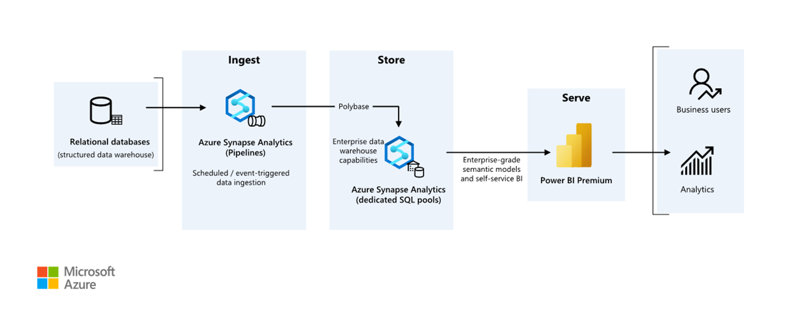

This example scenario shows how data can be ingested into a cloud environment from an on-premises data warehouse, then served using a business intelligence (BI) model. This approach could be an end goal or a first step toward full modernization with cloud-based components.

The following steps build on the [Azure Synapse Analytics end-to-end][e2e-analytics] scenario. It uses Azure Pipelines to ingest data from a SQL database into Azure Synapse SQL pools, then transforms the data for analysis.

## Architecture

*Download a [Visio file](https://arch-center.azureedge.net/enterprise-bi-scoped-architecture.vsdx) of this architecture.*

### Workflow

#### Data source

- The source data is located in an SQL Server database in Azure. To simulate the on-premises environment, deployment scripts for this scenario provision an Azure SQL database. The [AdventureWorks sample database][adventureworksdw-sample-link] is used as the source data schema and sample data. For information on how to copy data from an on-premises database, see [copy and transform data to and from SQL Server](/azure/data-factory/connector-sql-server?tabs=data-factory).

#### Ingestion and data storage

1. [Azure Data Lake Gen2](/azure/databricks/data/data-sources/azure/adls-gen2) is used as a temporary *staging* area during data ingestion. You can then use [PolyBase to copy data into an Azure Synapse dedicated SQL pool](/azure/data-factory/connector-azure-sql-data-warehouse?tabs=data-factory#use-polybase-to-load-data-into-azure-synapse-analytics).

2. [Azure Synapse Analytics](/azure/synapse-analytics) is a distributed system designed to perform analytics on large data. It supports massive parallel processing (MPP), which makes it suitable for running high-performance analytics. Azure Synapse dedicated SQL pool is a target for ongoing ingestion from on-premises. It can be used for further processing, as well as serving the data for [Power BI](/power-bi/fundamentals/power-bi-overview) through DirectQuery.

3. [Azure Pipelines](/azure/data-factory/concepts-pipelines-activities) is used to orchestrate data ingestion and transformation within your Azure Synapse workspace.

#### Analysis and reporting

- The data-modeling approach in this scenario is presented by combining the [enterprise model][enterprise-model] and [BI Semantic model][bi-model]. The enterprise model is stored in an [Azure Synapse dedicated SQL pool][synapse-dedicated-pool], and the BI Semantic model is stored in [Power BI Premium capacities][pbi-premium-capacities]. Power BI accesses the data via DirectQuery.

### Components

This scenario uses the following components:

- [Azure SQL Database](https://azure.microsoft.com/products/azure-sql/database)
- [Azure Data Lake](https://azure.microsoft.com/solutions/data-lake)
- [Azure Synapse Analytics](https://azure.microsoft.com/services/synapse-analytics)
- [Power BI Premium](https://powerbi.microsoft.com/power-bi-premium)
- [Azure Active Directory (Azure AD)](https://azure.microsoft.com/services/active-directory)

### Simplified architecture

## Scenario details

An organization has a large on-premises data warehouse stored in a SQL database. The organization wants to use Azure Synapse to perform analysis, then serve these insights using Power BI.

### Authentication

Azure AD authenticates users who connect to Power BI dashboards and apps. Single sign-on is used to connect to the data source in Azure Synapse provisioned pool. Authorization happens on the source.  

### Incremental loading

When you run an automated extract-transform-load (ETL) or extract-load-transform (ELT) process, it's most efficient to load only the data that changed since the previous run. It's called an [incremental load](/azure/data-factory/tutorial-incremental-copy-overview), as opposed to a full load that loads all the data. To perform an incremental load, you need a way to identify which data has changed. The most common approach is to use a *high water mark* value, which tracks the latest value of some column in the source table, either a datetime column or a unique integer column.

Starting with SQL Server 2016, you can use [temporal tables](/sql/relational-databases/tables/temporal-tables), which are system-versioned tables that keep a full history of data changes. The database engine automatically records the history of every change in a separate history table. You can query the historical data by adding a `FOR SYSTEM_TIME` clause to a query. Internally, the database engine queries the history table, but it's transparent to the application.

> [!NOTE]
> For earlier versions of SQL Server, you can use [change data capture](/sql/relational-databases/track-changes/about-change-data-capture-sql-server) (CDC). This approach is less convenient than temporal tables, because you have to query a separate change table, and changes are tracked by a log sequence number, rather than a timestamp.

Temporal tables are useful for dimension data, which can change over time. Fact tables usually represent an immutable transaction such as a sale, in which case keeping the system version history doesn't make sense. Instead, transactions usually have a column that represents the transaction date, which can be used as the watermark value. For example, in the AdventureWorks Data Warehouse, the `SalesLT.*` tables have a `LastModified` field.

Here's the general flow for the ELT pipeline:

1. For each table in the source database, track the cutoff time when the last ELT job ran. Store this information in the data warehouse. On initial setup, all times are set to `1-1-1900`.

2. During the data export step, the cutoff time is passed as a parameter to a set of stored procedures in the source database. These stored procedures query any records that were changed or created after the cutoff time. For all tables in the example, you can use the `ModifiedDate` column.

3. When the data migration is complete, update the table that stores the cutoff times.

## Data pipeline

This scenario uses the [AdventureWorks sample database][adventureworksdw-sample-link] as a data source. The incremental data load pattern is implemented to ensure we only load data that was modified or added after the most recent pipeline run.

### Metadata-driven copy tool

The built-in [metadata-driven copy tool](/azure/data-factory/copy-data-tool-metadata-driven) within Azure Pipelines incrementally loads all tables contained within our relational database. By navigating through the wizard-based experience, you can connect the Copy Data tool to the source database, and configure either incremental or full loading for each table. The Copy Data tool then creates both the pipelines and SQL scripts to generate the control table required to store data for the incremental loading process—for example, the high watermark value/column for each table. Once these scripts are run, the pipeline is ready to load all tables in the source data warehouse into the Synapse dedicated pool.

:::image type="content" source="./media/metadata-copy.png" alt-text="Screenshot of metadata-driven copy data tool in Synapse Analytics.":::

The tool creates three pipelines to iterate over all the tables in the database, before loading the data.

The pipelines generated by this tool:

- Count the number of objects, such as tables, to be copied in the pipeline run.
- Iterate over each object to be loaded/copied and then:
  - Check whether a delta load is required; otherwise complete a normal full load.
  - Retrieve the high watermark value from the control table.
  - Copy data from the source tables into the staging account in ADLS Gen2.
  - Load data into the dedicated SQL pool via the selected copy method—for example, Polybase, Copy command.
  - Update the high watermark value in the control table.

### Load data into Azure Synapse SQL pool

The [copy activity](/azure/data-factory/copy-activity-overview) copies data from the SQL database into the Azure Synapse SQL pool. In this example, because our SQL database is in Azure, we use the Azure integration runtime to read data from the SQL database and write the data into the specified staging environment.

The copy statement is then used to load data from the staging environment into the Synapse dedicated pool.

### Use Azure Pipelines

Pipelines in Azure Synapse are used to define the ordered set of activities to complete the incremental load pattern. Triggers are used to start the pipeline, which can be triggered manually or at a time specified.

### Transform the data

Because the sample database in our reference architecture isn't large, we created replicated tables with no partitions. For production workloads, using distributed tables is likely to improve query performance. See [Guidance for designing distributed tables in Azure Synapse](/azure/sql-data-warehouse/sql-data-warehouse-tables-distribute). The example scripts run the queries using a static [resource class](/azure/sql-data-warehouse/resource-classes-for-workload-management).

In a production environment, consider creating staging tables with round-robin distribution. Then transform and move the data into production tables with clustered columnstore indexes, which offer the best overall query performance. Columnstore indexes are optimized for queries that scan many records. Columnstore indexes don't perform as well for singleton lookups, that is, looking up a single row. If you need to perform frequent singleton lookups, you can add a non-clustered index to a table. Singleton lookups can run much faster using a non-clustered index. However, singleton lookups are typically less common in data warehouse scenarios than OLTP workloads. For more information, see [Indexing tables in Azure Synapse](/azure/sql-data-warehouse/sql-data-warehouse-tables-index).

> [!NOTE]
> Clustered columnstore tables don't support `varchar(max)`, `nvarchar(max)`, or `varbinary(max)` data types. In that case, consider a heap or clustered index. You might put those columns into a separate table.

### Use Power BI Premium to access, model, and visualize data

Power BI Premium supports several options for connecting to data sources on Azure, in particular Azure Synapse provisioned pool:

- Import: The data is imported into the Power BI model.
- [DirectQuery](/power-bi/connect-data/desktop-directquery-about): Data is pulled directly from relational storage.
- [Composite model](/power-bi/transform-model/desktop-composite-models): Combine *Import* for some tables and *DirectQuery* for others.

This scenario is delivered with DirectQuery dashboard because the amount of data used and model complexity aren't high, so we can deliver a good user experience. DirectQuery delegates the query to the powerful compute engine underneath and utilizes extensive security capabilities on the source. Also, using DirectQuery ensures that results are always consistent with the latest source data.

Import mode provides the fastest query response time, and should be considered when the model fits entirely within Power BI’s memory, the data latency between refreshes can be tolerated, and there might be some complex transformations between the source system and the final model. In this case, the end users want full access to the most recent data with no delays in Power BI refreshing, and all historical data, which is larger than what a Power BI dataset can handle—between 25-400 GB, depending on the capacity size. As the data model in the dedicated SQL pool is already in a star schema and needs no transformation, DirectQuery is an appropriate choice.

[Power BI Premium Gen2](/power-bi/enterprise/service-premium-gen2-what-is) gives you the ability to handle large models, paginated reports, deployment pipelines, and built-in Analysis Services endpoint. You can also have dedicated [capacity](/power-bi/admin/service-premium-what-is#reserved-capacities) with unique value proposition.

When the BI model grows or dashboard complexity increases, you can switch to composite models and start importing parts of look-up tables, via [hybrid tables](/power-bi/connect-data/service-dataset-modes-understand#hybrid-tables), and some pre-aggregated data. Enabling [query caching](/power-bi/connect-data/power-bi-query-caching) within Power BI for imported datasets is an option, as well as utilizing [dual tables](/power-bi/transform-model/desktop-storage-mode) for storage mode property. 

Within the composite model, datasets act as a virtual pass-through layer. When the user interacts with visualizations, Power BI generates SQL queries to Synapse SQL pools dual storage: in memory or direct query depending on which one is more efficient. The engine decides when to switch from in-memory to direct query and pushes the logic to the Synapse SQL pool. Depending on the context of the query tables, they can act as either cached (imported) or not cached composite models. Pick and choose which table to cache into memory, combine data from one or more DirectQuery sources, and/or combine data from a mix of DirectQuery sources and imported data.

**Recommendations:**
When using DirectQuery over Azure Synapse Analytics provisioned pool:

- Use Azure Synapse [result set caching](/azure/synapse-analytics/sql-data-warehouse/performance-tuning-result-set-caching) to cache query results in the user database for repetitive use, improve query performance down to milliseconds, and reduce compute resource usage. Queries using cached results sets don't use any concurrency slots in Azure Synapse Analytics and thus don't count against existing concurrency limits.
- Use Azure Synapse [materialized views](/azure/synapse-analytics/sql/develop-materialized-view-performance-tuning) to pre-compute, store, and maintain data just like a table. Queries that use all or a subset of the data in materialized views can get faster performance, and they don't need to make a direct reference to the defined materialized view to use it.

## Considerations

These considerations implement the pillars of the Azure Well-Architected Framework, which is a set of guiding tenets that can be used to improve the quality of a workload. For more information, see [Microsoft Azure Well-Architected Framework](/azure/architecture/framework).

### Security

Security provides assurances against deliberate attacks and the abuse of your valuable data and systems. For more information, see [Overview of the security pillar](/azure/architecture/framework/security/overview).

Frequent headlines of data breaches, malware infections, and malicious code injection are among an extensive list of security concerns for companies looking to cloud modernization. Enterprise customers need a cloud provider or service solution that can address their concerns as they can't afford to get it wrong.

This scenario addresses the most demanding security concerns using a combination of layered security controls: network, identity, privacy, and authorization. The bulk of the data is stored in Azure Synapse provisioned pool, with Power BI using DirectQuery through single sign-on. You can use Azure AD for authentication. There are also extensive security controls for data authorization of provisioned pools.

Some common security questions include:

- How can I control who can see what data?
  - Organizations need to protect their data to comply with federal, local, and company guidelines to mitigate risks of data breach. Azure Synapse offers multiple [data protection capabilities](/azure/synapse-analytics/guidance/security-white-paper-data-protection) to achieve compliance.
- What are the options for verifying a user's identity?
  - Azure Synapse supports a wide range of capabilities to control who can access what data via [access control](/azure/synapse-analytics/guidance/security-white-paper-access-control) and [authentication](/azure/synapse-analytics/guidance/security-white-paper-authentication).
- What network security technology can I use to protect the integrity, confidentiality, and access of my networks and data?
  - To secure Azure Synapse, there are a range of [network security](/azure/synapse-analytics/guidance/security-white-paper-network-security) options available to consider.
- What are the tools that detect and notify me of threats?
  - Azure Synapse provides many [threat detection](/azure/synapse-analytics/guidance/security-white-paper-threat-protection) capabilities like: SQL auditing, SQL threat detection, and vulnerability assessment to audit, protect, and monitor databases.
- What can I do to protect data in my storage account?
  - Azure Storage accounts are ideal for workloads that require fast and consistent response times, or that have a high number of input-output operations (IOP) per second. Storage accounts contain all your Azure Storage data objects, and have many options for [storage account security](/azure/architecture/framework/services/storage/storage-accounts/security).

### Cost optimization

Cost optimization is about looking at ways to reduce unnecessary expenses and improve operational efficiencies. For more information, see [Overview of the cost optimization pillar](/azure/architecture/framework/cost/overview).

This section provides information on pricing for different services involved in this solution, and mentions decisions made for this scenario with a sample dataset.

#### Azure Synapse

Azure Synapse Analytics serverless architecture allows you to scale your compute and storage levels independently. Compute resources are charged based on usage, and you can scale or pause these resources on demand. Storage resources are billed per terabyte, so your costs will increase as you ingest more data.

#### Azure Pipelines

Pricing details for pipelines in Azure Synapse can be found under the *Data Integration* tab on the [Azure Synapse pricing page](https://azure.microsoft.com/pricing/details/synapse-analytics). There are three main components that influence the price of a pipeline:

1. Data pipeline activities and integration runtime hours
1. Data flows cluster size and execution
1. Operation charges

The price varies depending on the components or activities, frequency, and number of integration runtime units.

For the sample dataset, the standard Azure-hosted integration runtime, *copy data activity* for the core of the pipeline, is triggered on a daily schedule for all of the entities (tables) in the source database. The scenario contains no data flows. There are no operational costs since there are fewer than 1 million operations with pipelines a month.

#### Azure Synapse dedicated pool and storage

Pricing details for Azure Synapse dedicated pool can be found under the *Data Warehousing* tab on the [Azure Synapse pricing page](https://azure.microsoft.com/pricing/details/synapse-analytics). Under the Dedicated consumption model, customers are billed per DWU units provisioned, per hour of uptime. Another contributing factor is data storage costs: size of your data at rest + snapshots + geo-redundancy, if any.

For the sample dataset, you can provision 500DWU, which guarantees a good experience for analytical load. You can keep compute up and running over business hours of reporting. If taken into production, reserved data warehouse capacity is an attractive option for cost management. Different techniques should be used to maximize cost/performance metrics, which are covered in the previous sections.

#### Blob storage

Consider using the Azure Storage reserved capacity feature to lower storage costs. With this model, you get a discount if you reserve fixed storage capacity for one or three years. For more information, see [Optimize costs for Blob storage with reserved capacity][az-storage-reserved].

There's no persistent storage in this scenario.

#### Power BI Premium

Power BI Premium pricing details can be found on the [Power BI pricing page](https://powerbi.microsoft.com/pricing).

This scenario uses [Power BI Premium workspaces](/power-bi/admin/service-premium-what-is) with a range of performance enhancements built in to accommodate demanding analytical needs.

### Operational excellence

Operational excellence covers the operations processes that deploy an application and keep it running in production. For more information, see [Overview of the operational excellence pillar](/azure/architecture/framework/devops/overview).

#### DevOps recommendations

- Create separate resource groups for production, development, and test environments. Separate resource groups make it easier to manage deployments, delete test deployments, and assign access rights.
- Put each workload in a separate deployment template and store the resources in source control systems. You can deploy the templates together or individually as part of a continuous integration (CI) and continuous delivery (CD) process, making the automation process easier. In this architecture, there are four main workloads:
  - The data warehouse server, and related resources
  - Azure Synapse pipelines
  - Power BI assets: dashboards, apps, datasets
  - An on-premises to cloud simulated scenario
  
  Aim to have a separate deployment template for each of the workloads.
- Consider staging your workloads where practical. Deploy to various stages and run validation checks at each stage before moving to the next stage. That way you can push updates to your production environments in a controlled way and minimize unanticipated deployment issues. Use [blue-green deployment][blue-green-dep] and [canary release][canary-releases] strategies for updating live production environments.
- Have a good rollback strategy for handling failed deployments. For example, you can automatically redeploy an earlier, successful deployment from your deployment history. See the `--rollback-on-error` flag in Azure CLI.
- [Azure Monitor][azure-monitor] is the recommended option for analyzing the performance of your data warehouse and the entire Azure analytics platform for an integrated monitoring experience. [Azure Synapse Analytics][synapse-analytics] provides a monitoring experience within the Azure portal to show insights about your data warehouse workload. The Azure portal is the recommended tool when monitoring your data warehouse because it provides configurable retention periods, alerts, recommendations, and customizable charts and dashboards for metrics and logs.

#### Quick start

- Portal: [Azure Synapse proof of concept](https://github.com/Azure/azure-quickstart-templates/tree/master/quickstarts/microsoft.synapse/synapse-poc)
- Azure CLI: [Create an Azure Synapse workspace with Azure CLI](/azure/synapse-analytics/quickstart-create-workspace-cli)
- Terraform: [Modern data warehousing with Terraform and Microsoft Azure](https://github.com/terraform-azurerm-examples/example-adf-synapse)

### Performance efficiency

Performance efficiency is the ability of your workload to scale to meet the demands placed on it by users in an efficient manner. For more information, see [Performance efficiency pillar overview](/azure/architecture/framework/scalability/overview).

This section provides details on sizing decisions to accommodate this dataset.

#### Azure Synapse provisioned pool

There's a range of [data warehouse configurations](/azure/synapse-analytics/sql-data-warehouse/sql-data-warehouse-manage-compute-overview) to choose from.

|Data warehouse units |# of compute nodes  |# of distributions per node|
|---------------------|:------------------:|:-------------------------:|
|DW100c               |1                   |60                         |
|                     | `-- TO --`         |                           |
|DW30000c             |60                  |1                          |  

To see the performance benefits of scaling out, especially for larger data warehouse units, use at least a 1-TB dataset. To find the best number of data warehouse units for your dedicated SQL pool, try scaling up and down. Run a few queries with different numbers of data warehouse units after loading your data. Since scaling is quick, you can try various performance levels in an hour or less.

##### Find the best number of data warehouse units

For a dedicated SQL pool in development, begin by selecting a smaller number of data warehouse units. A good starting point is *DW400c* or *DW200c*. Monitor your application performance, observing the number of data warehouse units selected compared to the performance you observe.
Assume a linear scale, and determine how much you need to increase or decrease the data warehouse units. Continue making adjustments until you reach an optimum performance level for your business requirements.

##### Scaling Synapse SQL pool

- [Scale compute for Synapse SQL pool with the Azure portal](/azure/synapse-analytics/sql-data-warehouse/quickstart-scale-compute-portal)
- [Scale compute for dedicated SQL pool with Azure PowerShell](/azure/synapse-analytics/sql-data-warehouse/quickstart-scale-compute-powershell)
- [Scale compute for dedicated SQL pool in Azure Synapse Analytics using T-SQL](/azure/synapse-analytics/sql-data-warehouse/quickstart-scale-compute-tsql)
- [Pausing, monitoring, and automation](/azure/synapse-analytics/sql-data-warehouse/sql-data-warehouse-manage-compute-overview)

#### Azure Pipelines

For scalability and performance optimization features of pipelines in Azure Synapse and the copy activity used, refer to the [Copy activity performance and scalability guide](/azure/data-factory/copy-activity-performance).

#### Power BI Premium

This article uses [Power BI Premium Gen 2](/power-bi/enterprise/service-premium-architecture) to demonstrate BI capabilities. [Capacity SKUs for Power BI Premium](/power-bi/enterprise/service-premium-gen2-what-is) range from P1 (eight v-cores) to P5 (128 v-cores) currently. The best way to select needed capacity is to undergo [capacity loading evaluation](/power-bi/enterprise/service-premium-concepts), install the Gen 2 [metrics app](/power-bi/enterprise/service-premium-install-gen2-app?tabs=1st) for ongoing monitoring, and consider using [Autoscale with Power BI Premium](/power-bi/enterprise/service-premium-auto-scale).

## Contributors

*This article is maintained by Microsoft. It was originally written by the following contributors.*

Principal authors:

- [Galina Polyakova](https://www.linkedin.com/in/galinagpolyakova/) | Senior Cloud Solution Architect
- [Noah Costar](https://www.linkedin.com/in/noah-costar-6204b8157/) | Cloud Solution Architect
- [George Stevens](https://www.linkedin.com/in/george-stevens/) | Cloud Solution Architect

Other contributors:

- [Jim McLeod](https://www.linkedin.com/in/jimmcleodaustralia/) | Cloud Solution Architect
- [Miguel Myers](https://www.linkedin.com/in/miguelmyers/) | Senior Program Manager

*To see non-public LinkedIn profiles, sign in to LinkedIn.*

## Next steps

- [What is Power BI Premium?](/power-bi/enterprise/service-premium-what-is)
- [What is Azure Active Directory?](/azure/active-directory/fundamentals/active-directory-whatis)
- [Accessing Azure Data Lake Storage Gen2 and Blob Storage with Azure Databricks](/azure/databricks/data/data-sources/azure/azure-storage)
- [What is Azure Synapse Analytics?](/azure/synapse-analytics/overview-what-is)
- [Pipelines and activities in Azure Data Factory and Azure Synapse Analytics](/azure/data-factory/concepts-pipelines-activities)
- [What is Azure SQL?](/azure/azure-sql/azure-sql-iaas-vs-paas-what-is-overview)

## Related resources

- [Automated enterprise BI](/azure/architecture/reference-architectures/data/enterprise-bi-adf)
- [Analytics end-to-end with Azure Synapse](/azure/architecture/example-scenario/dataplate2e/data-platform-end-to-end)
- [Big data analytics with enterprise-grade security using Azure Synapse](/azure/architecture/solution-ideas/articles/big-data-analytics-enterprise-grade-security)
- [Hybrid ETL with existing on-premises SSIS and Azure Data Factory](/azure/architecture/example-scenario/data/hybrid-etl-with-adf)

[AAF-devops]: /azure/architecture/framework/devops/overview
[azure-monitor]: https://azure.microsoft.com/services/monitor
[blue-green-dep]: https://martinfowler.com/bliki/BlueGreenDeployment.html
[canary-releases]: https://martinfowler.com/bliki/CanaryRelease.html
[e2e-analytics]: /azure/architecture/example-scenario/dataplate2e/data-platform-end-to-end
[synapse-analytics]: /azure/sql-data-warehouse/sql-data-warehouse-concept-resource-utilization-query-activity
[adventureworksdw-sample-link]: /sql/samples/adventureworks-install-configure?view=sql-server-ver15&tabs=ssms
[az-storage-reserved]: /azure/storage/blobs/storage-blob-reserved-capacity
[enterprise-model]: /power-bi/guidance/center-of-excellence-business-intelligence-solution-architecture#enterprise-models
[bi-model]: /power-bi/guidance/center-of-excellence-business-intelligence-solution-architecture#bi-semantic-models
[pbi-premium-capacities]: /power-bi/admin/service-premium-what-is#reserved-capacities
[synapse-dedicated-pool]: /azure/synapse-analytics/sql-data-warehouse/sql-data-warehouse-overview-what-is
[pbi-what-is-premium]: /power-bi/admin/service-premium-what-is#analysis-services-in-power-bi-premium
